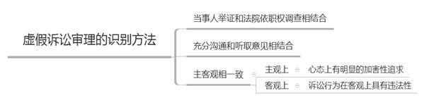
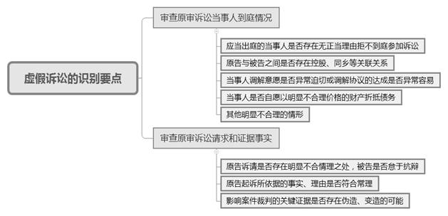
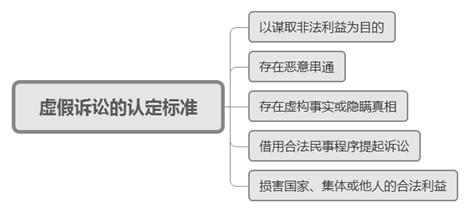

### **第三人撤销之诉中虚假诉讼认定的审理思路和裁判要点**

2012年修订的《中华人民共和国民事诉讼法》确立了第三人撤销之诉制度，赋予第三人独立提起撤销诉讼的权利，意在遏止当事人通过虚假诉讼侵犯第三人合法权利的现象。为更好地实现此项诉讼制度的立法目的和功能，我们以个案研判为基础，对此类案件的审理思路和方法进行总结与提炼。

**一、典型案例**

**案例一**

2009年3月，A公司与B公司签订租赁协议，B公司取得涉案房屋租赁权。后B公司将涉案房屋转租给C公司。2012年3月，A公司起诉B公司要求解除双方租赁合同（“前案”）。法院于2014年5月判令A公司与B公司之间的租约解除；B公司支付A公司租金、使用费等。B公司未履行，法院强制执行但该判决金钱部分未执行到位。2015年3月，B公司向法院起诉C公司要求其支付拖欠的房屋使用费（“后案”）。C公司于2015年6月从涉案房屋搬出，并将该房屋移交给A公司。法院于2015年12月作出民事调解书，确认C公司向B公司支付房屋使用费200万元，后C公司通过法院转付方式完成支付，但B公司未向A公司履行前案确定的执行义务。

2016年6月，A公司提起第三人撤销之诉（“本案”），认为B公司与C公司恶意串通诉讼，以民事调解为名将C公司拖欠B公司的数千万房屋使用费以200万元协商了结，严重损害A公司对B公司的债权实现，请求撤销后案民事调解书。

**案例二**

2014年5月，甲区法院作出判决（“前案”）：D公司向E公司支付工程款2000余万元，E公司对D公司名下包含系争厂房在内的5幢房产享有建筑工程价款优先受偿权。同月，乙区法院作出调解书（“后案”）确认：D公司返还F公司800万元及利息，F公司对D公司名下的系争厂房享有抵押优先受偿权。

F公司在申请执行过程中，因其上述抵押权与E公司的建筑工程价款优先受偿权相互冲突导致其未能受偿，故向甲区法院提起第三人撤销之诉（“本案”），请求该院撤销前案民事判决。

**二、分歧意见及审理难点**

**对于案例一**，实践中存在两种分歧意见：**一是认为后案不构成虚假诉讼。**原因在于C公司未能按时迁出所产生的使用费等应由B公司基于前案生效判决向A公司承担责任。后案中B公司与C公司之间的民事调解是基于双方之间的转租合同，与A公司并无直接法律关系，因此A公司虽未参加后案诉讼，但调解结果未损害A公司的合法利益。**二是认为后案构成虚假诉讼。**B公司明知其与A公司的租赁关系已经解除，且前案执行未到位时，通过后案与C公司达成调解协议套取钱款并转移，B公司有虚假诉讼的动机和客观事实。C公司明知其转租合同因A公司与B公司之间租赁合同被解除而无法继续履行，在与A公司续租协商不成后一方面向A公司交付房屋，另一方面就涉案房屋使用费与B公司达成调解，以低价了结其拖欠的巨额房屋使用费，达到阻碍A公司向其主张权益的目的。据此足以认定B公司与C公司之间的后案构成虚假诉讼。

**对于案例二**，实践中也存在两种分歧意见：**一是前案构成虚假诉讼。**认为F公司提出的证据足以证明前案认定E公司对涉案厂房享有建筑工程价款优先受偿权确有错误，损害了F公司的抵押优先受偿权，前案判决构成虚假诉讼。**二是前案不构成虚假诉讼。**认为F公司提供的证据尚无法证明前案系虚假诉讼，且在前案判决中，涉案工程款尚未支付，即使E公司在与D公司的诉讼中存在过错，也不足以导致F公司丧失优先权。

综上，以虚假诉讼为由提起的第三人撤销之诉案件在审理中存在以下共性的难点问题：**一是**对于存在疑点的诉讼应当采取何种审理方式；**二是**如何认定相关诉讼构成虚假诉讼；**三是**如何确定虚假诉讼相关当事人之间的法律责任。

**三、第三人撤销之诉中虚假诉讼认定的审理思路**

虚假诉讼，是指行为人为谋取不正当利益或加害他人，恶意启动一个没有合理根据的诉讼或在诉讼过程中滥用诉讼权利，给相对人造成损害的违法行为。以虚假诉讼为由提起的第三人撤销之诉是司法机关主动审查、遏止虚假诉讼的重要途径。对该类案件的审理可以坚持以下审理思路：

**（一）第三人撤销之诉中虚假诉讼审理的识别方法**

**1****、坚持当事人举证和法院依职权调查相结合**

案件审查中，原告应举证并初步证明系争诉讼为虚假诉讼且侵害其合法权益，法院需要根据案件审理视情况依职权调取当事人是否存在恶意串通的证据。

**2****、坚持充分沟通和听取意见相结合**

第三人撤销之诉中涉虚假诉讼的审查涉及对原审生效裁判的评价，审理中应注意听取相关审判业务条线的意见，尤其是审判监督部门以及原生效裁判承办法官和审判业务条线的意见，以充分了解作出生效裁判的依据。

**3****、坚持主客观相一致**

对虚假诉讼的认定需要对主观要件与客观要件进行综合评判：**从主观上来看，**虚假诉讼的当事人在心态上有明显的加害性追求，明知诉讼行为不具有正当性却利用诉讼活动谋求非法利益。**从客观上来看，**当事人的诉讼行为在客观上具有违法性，可以通过当事人是否存在伪造证据、诱导证人作伪证等情节判断其是否存在恶意串通。

**（二）第三人撤销之诉中虚假诉讼的识别要点**

对以虚假诉讼为由提起的第三人撤销之诉的审理，需重点审查被申请撤销诉讼的双方是否存在恶意串通以及是否侵害第三人权益的情形，可以从三个方面进行甄别：

**1****、审查当事人到庭情况、当事人之间关系及案件调解情况**

（1）应当出庭的当事人是否存在无正当理由拒不到庭参加诉讼，或者故意不配合司法机关调查的情况；（2）原告与被告之间是否存在控股、同乡等关联关系；（3）当事人调解意愿是否异常迫切或调解协议的达成是否异常容易；（4）当事人是否自愿以明显不合理价格的财产折抵债务；（5）其他明显不合理的情形。

**2****、审查案件的诉讼请求和证据事实是否存在异常**

（1）原告诉请是否存在明显不合情理之处，被告是否怠于抗辩；（2）原告起诉所依据的事实、理由是否符合常理；（3）影响案件裁判的关键证据是否存在伪造、变造的可能。

**3****、对存疑案件采取的审查措施**

如发现存在上述异常情形，可采取以下审查措施：（1）通知当事人提交原始证据或要求证人出庭作证；（2）严格公民代理的审查程序，对不符合法定条件的代理人一律不准予代理；（3）向案件利害关系人调查并通报相关情况，必要时通知其参与诉讼；（4）调取工商登记内档资料等，对当事人进行背景调查；（5）调查实际侵害结果是否存在等关联事实。

**（三）虚假诉讼的认定标准**

对于是否构成虚假诉讼，可以结合最高法院相关规定，从以下五个方面进行判

**1****、双方是否以规避法律、法规或者国家政策谋取非法利益为目的**

虚假诉讼行为人企图获取的非法利益通常表现为逃避合法债务、逃避法律文书确定的义务、独占或多分遗产、离婚时独占或多分夫妻共同财产、骗取保险理赔款、规避法律法规政策等。

**2****、双方在诉讼中是否存在恶意串通**

双方存在共同故意是虚假诉讼的常见情形。法院应着重审查双方是否存在虚假诉讼的通谋，是否均处于明知其行为会发生侵害国家、集体或他人的合法权益及妨害诉讼秩序、侵害司法公信力的后果，仍实施虚假诉讼行为的心理状态。双方当事人恶意串通常见于调解程序，如我院自2016年7月以来审结的15件第三人撤销之诉中，认定为虚假诉讼的案件共5件，这5件案件中撤销的法律文书均为调解书。

**3****、双方在诉讼中是否存在虚构事实或隐瞒真相**

客观上双方以虚构事实或隐瞒真相（或两者兼而有之）的方式向法院提起民事诉讼，骗取法院裁判文书，导致生效法律文书存在错误。虚构事实或隐瞒真相的虚假诉讼，应当包括无中生有型虚假诉讼和通过伪造证据企图谋取利益远超合法利益的部分篡改型虚假诉讼。

**4****、双方借用合法民事程序提起诉讼**

虚假诉讼中提起的诉讼应当限定为民事诉讼，包含提起民事诉讼程序、提起民事非诉程序、提起民事执行程序和提起民事复议程序等，但不包含提起行政诉讼、申请公证、申请仲裁等程序。需要明确的是，虽然获得生效裁判文书是虚假诉讼行为的终端和行为人的目标，但是行为人是否实际上取得生效文书并不影响虚假诉讼的成立。

**5****、虚假诉讼损害国家、集体或他人的合法利益**

虚假诉讼损害了国家利益、社会公共利益或者案外人的合法权益。通常情况下，虚假诉讼一旦被实施便产生了妨碍司法秩序、损害司法公信力的后果。

如案例一中， C公司与前案被执行人B公司通过后案调解，意图规避前案的执行；在诉讼过程中，C公司一方面将涉案房屋向A公司交付，另一方面却又与B公司达成房屋使用费调解协议，将数千万元的房屋使用费以200万达成调解，据此足以认定B公司与C公司之间存在恶意串通；后案诉讼中，B公司与C公司向法院隐瞒前案判决，存在虚构事实及隐瞒真相的行为；C公司支付B公司租金200万元后，B公司未缴付执行法院履行前案的执行义务，客观上侵害了A公司向C公司主张房屋使用费的权益。据此，法院认定后案构成虚假诉讼并予以撤销。

如案例二中，F公司提出的证据无法证明前案中双方当事人存在恶意串通的情形，且前案相关工程款尚未支付，E公司对D公司名下系争厂房的工程价款优先受偿权并未得到实现， F公司没有丧失对该栋房屋的抵押优先受偿权。据此，F公司申请将前案认定为虚假诉讼的主张，法院未予支持。

**（四）虚假诉讼中相关当事人的法律责任**

根据《民事诉讼法》第112条规定，在诉讼过程中发现当事人之间恶意串通的，人民法院应当驳回其请求。《民事诉讼法》第113条规定，被执行人与他人恶意串通的，人民法院应当根据情节轻重予以罚款、拘留等。根据上述法律规定，恶意串通是违法行为，虚假诉讼可以成为第三人撤销之诉可撤销的法定事由。在第三人撤销之诉中发现虚假诉讼的，需根据上述法律规定确定相关当事人的民事责任和应采取的强制措施。

第三人撤销之诉中，人民法院依法审查后足以认定生效法律文书涉虚假诉讼的，人民法院应当依法撤销该生效法律文书。如在案例一中，B公司与C公司之间存在恶意串通的情形，意在逃避执行义务；后案民事调解书侵害了A公司的合法权益，故应判决撤销该民事调解书。

对于情节严重，符合刑法第307条之一的规定，构成虚假诉讼罪的，还应当根据刑法及相关司法解释的规定，追究当事人的刑事责任。

（根据民事庭宋贇、董健提供材料整理）