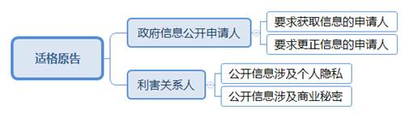
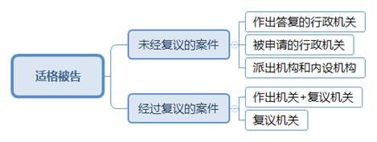

### **政府信息公开行政案件的审理思路和裁判要点**

政府信息公开行政案件是集中反映信息公开制度落实情况的窗口。申请人或第三方认为权利受到公开或者不公开信息行为侵害时，通过诉讼寻求救济而引发对行政行为的司法审查，形成政府信息公开行政案件。现立足于审判实践中的突出性、普遍性问题，总结审判经验，对审理思路、裁判要点等进行梳理、提炼和归纳。

**一、基本案情**     

**案例一：涉及信息是否存在的判断**

朱某于3月1日向A市地税局提出政府信息公开申请，要求书面获取某地铁公司税务登记信息。地税局收到申请后，在税收征管系统和档案中均未查询到登记信息，在注销档案中查到地铁公司已注销税务登记。3月17日，地税局作出答复书，告知朱某其申请信息不存在。朱某不服诉至法院，称地铁公司税务登记号可以证明登记信息存在，故请求撤销A市地税局作出的答复书。

**案例二：涉及商业秘密的认定**

6月11日，刘某向H区建交委提出政府信息公开申请，要求获取“某地块征收基地的配套商品房供应协议”。建交委认为该协议涉及商业秘密，向某镇政府发送权利人意见征询单，镇政府不同意公开。7月10日，H区建交委作出告知书，称该信息涉及商业秘密，因权利人不同意决定不予公开。刘某不服诉至法院，称其申请公开的房源为该基地用于安置的配套商品房，并非商业秘密，故请求撤销上述告知书并责令限期公开。

**案例三：涉及公开职责范围的审查**

3月11日，沈某向B区就业促进中心申请公开“办理退工申请登记手续的法律、法规或者规章和必须携带的材料名称”的政府信息。该中心收到沈某申请后于3月20日作出告知书，告知沈某的申请不属于其职责权限范围，可以自行向市人社局了解情况。沈某不服诉至法院，请求确认上述告知行为不符合其申请的形式，并责令限期公开相关政府信息。

**二、政府信息公开行政案件的主要类型和审理难点**

根据当事人诉讼请求和行政机关作出答复行为的区别，政府信息公开案件可以分为怠于履行的不作为诉讼、给付诉讼、私人信息保护诉讼、行政赔偿诉讼等类型。

**（一）案件主要类型**

**1****、怠于履行提供或者答复义务的不作为诉讼**

行政机关具有主动公开和依申请公开政府信息的义务。申请获取政府信息但被拒绝提供或者逾期不予答复的，申请人可以提起行政诉讼，诉讼请求一般为要求提供政府信息或者履行答复职责。

**2****、要求适当履行的给付诉讼**

行政机关依申请公开政府信息原则上应当按照申请人要求的形式提供，无法按照申请人要求形式提供的可以通过其他适当形式提供。申请人认为行政机关提供的政府信息不符合其申请要求或者法律、法规规定的适当形式，亦可以提起诉讼。

**3****、私人信息保护诉讼**

当事人认为行政机关提供的与其自身相关的政府信息记录不准确，要求该行政机关予以更正，行政机关拒绝更正、逾期不予答复或者不予转送有权机关处理的，当事人可以起诉要求更正信息。第三方权利人认为行政机关主动公开或者依他人申请公开的政府信息侵犯其商业秘密、个人隐私的，可以提起诉讼。

**4****、行政赔偿诉讼**

公民、法人或者其他组织认为政府信息公开工作中的具体行政行为侵害其合法权益造成损害的，可以一并或者单独提起行政赔偿诉讼，依照法定程序解决行政赔偿争议。

**（二）类案审理难点**

**1****、政府信息的范围界定相对宽泛**

《中华人民共和国政府信息公开条例》第2条规定，政府信息是指行政机关在履行行政管理职能过程中制作或者获取的，以一定形式记录、保存的信息。该规定对“政府信息”的界定依然过于宽泛，如由行政机关临时保管的材料、涉及投诉信访的材料等是否属于政府信息存在争议。

**2****、不予公开事由审查标准有待明确**

根据《政府信息公开条例》的规定，属于国家秘密、商业秘密、个人隐私的政府信息不予公开。目前行政法律规范对上述三项内容的认定标准未作明确规定，司法审查标准存在争议。

**3****、滥用申请权行为的认定存在争议**

在政府信息公开案件中，部分涉及征收补偿利益的当事人相互串联、互为代理，一人提出多项申请、多人就同一信息提出申请的现象较为普遍。司法实践中往往出现反复不间断申请公开、部分内容重复或高度类似的情形，人民法院在判断当事人是否因此丧失诉权、如何适用司法审查标准等方面存在较大分歧。

**三、政府信息公开行政案件的审理思路和方法**

政府信息公开行政案件的审理采取全面审查的方式，主要审查行政机关的职权依据、执法程序、认定事实和适用法律等。

**（一）判断是否属于政府信息公开案件受案范围**

《最高人民法院关于审理政府信息公开行政案件若干问题的规定》第1条对受案范围通过正面列举加以规定，第2条对不予受理的范围也作了排除规定。人民法院收到当事人的诉讼材料后应当对照上述两条规定，着重审查当事人申请信息公开的情况和诉讼请求内容，综合判断是否属于政府信息公开案件受案范围。

**（二）确定当事人的主体资格**

**1****、适格原告的确定**

适格原告是指认为行政机关在政府信息公开工作中的具体行政行为侵犯其合法权益的公民、法人或者其他组织。**在依申请的政府信息公开案件中**，申请人因向行政机关提出申请成为政府信息公开行为的相对人，具有原告主体资格。**在反向诉讼中**，相关权利人需举证证明行政机关所公开信息涉及商业秘密或者个人隐私，并导致其利益受损。

    原告起诉行政机关不予答复的应证明其提出申请的事实；原告起诉行政机关不予更正信息记录，需举证证明其已提出更正申请、政府信息与其相关且信息记录不准确。在行政赔偿诉讼中，原告应证明其因政府信息公开行为的侵害遭受损失。

**2****、适格被告的确定**

    在未经复议的案件中，被告包括作出答复的行政机关、被申请的行政机关以及派出机构和内设机构，其中被申请的行政机关作为被告主要针对其作出的不予答复行为，派出机构和内设机构作为被告需要基于授权履职。在经过复议的案件中，当复议决定维持或者仅确认原答复行为违法时，答复机关和复议机关作为共同被告；当复议对原答复作出撤销、确认违法、变更、履行决定时，仅以复议机关作为被告。

**（三）审查政府信息公开答复行为是否合法**

对政府信息公开答复行为的合法性需要从四个方面进行审查。

**1****、行政职权的审查**

行政机关、内设机构和派出机构以及高校、行业协会等社会组织都具有答复职权，而后两者作为答复机关的前提是基于法律、法规、规章的授权。

**2****、答复程序的审查**

政府信息公开的答复程序主要涉及补正告知程序、征询第三方意见的程序、作出答复程序以及延长答复期限程序等，其中每一项程序都有相应的时限要求，分别涉及7个工作日、15个工作日以及20个工作日等。当事人申请公开的信息可能涉及第三方商业秘密、个人隐私等权益，行政机关需要征询第三方权利人意见，上述意见征询期限不计入答复期限内。此外，如果申请人申请信息公开的数量和频次明显超过合理需求但能够说明理由，行政机关可能无法在规定的期限内作出答复，此时需要确定迟延答复的合理期限，告知申请人并作出答复。

《政府信息公开条例》规定，政府信息公开申请内容不明确的，答复期限自行政机关收到补正申请之日起计算。**关于补正的内容**，一般不宜做严格要求，尤其申请某一文件时不能以未准确表述该文件名称为由拒绝提供，应以一般人的理解程度为限。**关于补正的效力**，申请人按照要求补正且符合要求的信息公开程序继续进行，申请人以明示或者默示方式拒绝补正的视为其放弃申请。补正后行政机关仍无法处理的，应遵循“补正以一次为原则”终结补正程序。

**3****、认定事实的审查**

针对政府信息公开答复中认定事实方面的审查主要是行政机关对于申请人申请信息公开内容的记录是否准确，以及对于补正、延长答复期限等环节的记载是否全面等。行政机关需要区分申请人申请内容的不同分别作出答复。对于已经公开的，需要告知相应的途径和方式；决定可以公开的，则提供相应的信息或者告知获取方法；对于决定不予公开的，予以告知并说明理由；没有查询到相应信息的，则告知信息不存在；不属于本机关公开范围的，予以告知并说明理由或者告知相应的机关；对于重复申请的，告知不予重复处理；如果涉及到工商、不动产登记资料等信息，需要根据特别规定办理。

**4****、适用法律的审查**

该类案件适用法律主要是2019年新修订的《政府信息公开条例》以及《上海市政府信息公开规定》等地方性法规。

**四、政府信息公开行政案件的裁判要点**

在立案和诉讼阶段发现不符合起诉条件，分别应裁定不予立案和裁定驳回起诉。经实体审理后，政府信息公开行政案件主要采用判决履行、判决撤销、判决确认和判决驳回诉讼请求。

**（一）判决履行信息公开法定职责**

申请人申请政府信息公开，行政机关拒绝公开或者无正当理由逾期不予答复，经审查认定行政机关拒绝理由不成立或者不作为违法，可以判决行政机关履行政府信息公开职责，要求被告在一定期限内答复。对于判决责令履行已无实际意义的可作出确认违法判决。由于司法不能侵犯行政机关的首次判断权，在判决中除要求行政机关履行职责外一般不指明行政机关如何履行职责，仅判决其重新予以答复，而非直接判决公开特定信息。

**（二）撤销政府信息公开告知行为**

撤销判决主要适用于被诉告知行为事实认定不清、说理不适当、违反法定程序或者法律适用错误等情形。根据《最高人民法院关于审理政府信息公开行政案件若干问题的规定》第9条规定，行政机关对依法应当公开的政府信息拒绝或者部分拒绝公开的，应当撤销或者部分撤销被诉不予公开决定，并判决其在一定期限内公开。尚需调查、裁量的，可以判决行政机关在一定期限内重新答复。行政机关提供的政府信息不符合申请人要求的内容或者法律、法规规定的形式，可以判决其按照申请人要求或法律规定的适当形式提供。

如案例一中，A市地税局以朱某申请公开的信息不存在为由不予公开，但朱某提供的《注销税务登记申请表》载明的地铁公司税务登记号可以证明上述信息存在，地税局作出的不当告知行为应予撤销。

**（三）确认信息公开告知行为违法**

行政机关作出的信息公开告知内容错误、程序不当或者无正当理由逾期不予答复，可以判决确认公开或不公开政府信息的行为违法。如行政机关公开信息涉及商业秘密、个人隐私且不存在公共利益等法定事由，应确认公开行为违法并责令采取相应补救措施。

**（四）判决驳回原告诉讼请求**

根据《最高人民法院关于审理政府信息公开行政案件若干问题的规定》第12条规定，被告已经履行法定告知或者说明理由义务的，应判决驳回原告的诉讼请求。

如案例三中，B区就业促进中心收到申请后经审查不属于其职责范围，并告知沈某至户籍所在地就业促进中心获取信息，应判定该中心已履行告知义务，答复内容和行政程序符合法律规定，故应判决驳回原告诉讼请求。

**五、其他需要说明的问题**

在审理政府信息公开行政案件过程中，除审查行政机关的职权依据、执法程序、事实认定和法律适用外，还应考虑部分特殊情形。

**（一）****关于个人隐私和商业秘密信息的认定**

根据法律规定，行政机关不得公开涉及个人隐私、商业秘密的信息。关于隐私的判断标准应从主客观两方面进行把握，主观上指个人不愿意被公众知悉的事项，客观上指公开后会对个人产生明显不当影响的事项。对于政府信息涉及的内容是否属于商业秘密的判断，可以适用《反不正当竞争法》关于商业秘密的界定标准。如案例二中，H区建交委向某镇政府发出意见征询单本身不足以证明配套商品房供应协议信息涉及商业秘密的事实，无法据此认定该信息具有商业价值并采取保密措施，主要证据不足，H区建交委作出的告知行为应予撤销。

**（二）滥用政府信息公开申请权行为的判断**

法律对于可能构成滥用诉权的情形并未明确规定制裁措施，司法实践中亦尚未建立有效防范机制。在涉及可能滥用政府信息公开申请权和行政诉讼起诉权的案件中，行政机关可能并未答复，亦未告知公开机关。针对部分当事人长期不间断提出内容相似的申请，无论行政机关是否提供信息当事人均坚持诉讼的，起诉目的显然不当，已丧失诉权行使的必要性和正当性，故应予裁定驳回。

（根据行政庭周峰、刘天翔提供材料整理）