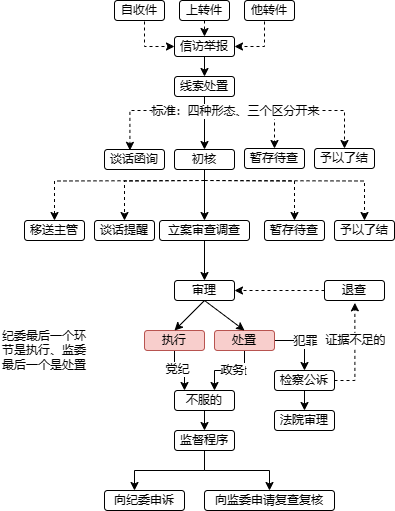

### 普通办案程序

原文题目《从举报到通报，纪委工作有多少环节》

来源：中国纪检监察杂志，2017年第4期 原晓红

**编者按**

2021年《监察法实施条例》将监察程序分解为线索处置、初步核实、立案、调查、审理、处置、（职务犯罪）移送审查起诉7个环节。本文依据2017年《监督执纪工作规则（试行）》，通过模拟案例详解线索处置、谈话函询（线索处置决定初步核实则可省略谈话函询）、初步核实、立案审查、案件审理和处置执行5个环节，从中可以窥见执纪执法程序的传承和发展。

**前言**

十八届中央纪委七次全会审议通过《中国共产党纪律检查机关监督执纪工作规则（试行）》，随即向社会公开，亮明了纪检机关的权限和工作流程。这意味着《工作规则》不仅是纪检机关开展监督执纪工作的“施工流程图”，也是加强自身建设、接受党内外监督的“廉洁承诺书”。您是否看懂了《工作规则》？纪检机关是怎么处置问题线索又如何查处腐败分子的？按照《工作规则》纪检机关哪些事可以做、哪些事不能做、哪些事必须做？纪检机关又将如何加强自我监督？围绕这些问题，让小编以一模拟案例为例，与您一起走进《工作规则》寻找答案吧。

**通 报**

“日前，经市委批准，市纪委对市城市建设管理局原党委书记、局长张立国严重违纪违法问题进行了立案纪律审查、监察调查。经查，……经市纪委常委会会议研究并报市委批准，决定给予张立国开除党籍处分，由市监察局委报请市政府批准给予其开除公职处分；收缴其违纪违法所得；将其涉嫌犯罪问题、线索及所涉款物移送司法检察机关依法处理审查起诉，所涉财物随案移送。”（编者注：本文发表于2017年，转载时按照新要求进行了文字修订。）

这是日前某市纪委发布的一则通报。同时，市纪委还给予该局副局长李某党内严重警告处分，责令该局办公室原主任赵某（已退休）作出深刻检查。据了解，这起违纪案件的查处，源于该局工作人员小王的一封举报信。

从小王举报到最后发出通报，市纪委需要做哪些工作？又分为哪些环节？让我们从信访举报这一源头开始，逐一进行梳理。

#### 第一环节 线索处置

今年年初，市纪委信访室接到一封举报信，反映市城市建设管理局（以下简称市城管局）党委书记、局长张立国等人存在严重违纪问题。信中反映问题非常具体，并附有相关证据材料，具有很强的可查性。

按照《工作规则》第十二条规定，信访室对举报信件进行分类摘要，附带原件移送给市纪委案件监督管理室处理。案管室依据《工作规则》第十四条规定，提出分办意见并报市纪委主要负责人批准后，按程序移送给联系市城管局的市纪委第二纪检监察室。

从这一节点起，对张立国等人的举报就进入了具体线索处置环节。二室在对问题线索进行编号登记、建立相关管理台账后，即召开由室领导、问题线索管理员及相关同志参加的会议，结合掌握的市城管局其他情况，对反映的问题进行分析研判。经集体研究并报市纪委主要领导批准，决定对张立国问题进行初步核实，并向上级纪委报告。对信访件中反映的市城管局副局长李某和办公室原主任赵某的情况，考虑到均属于一般性问题，在报市纪委主要领导批准后，决定对两人进行谈话函询。

看到这里，有些读者可能会有疑问——这封举报信一会儿叫信访举报，一会儿叫问题线索，两者之间有什么区别？

所谓信访举报，主要指对党员和党组织违反党纪行为的检举控告，应由纪检机关受理的申诉，以及涉及党风廉政建设和反腐败工作的意见建议。而问题线索既包括信访举报件，还包括从巡视巡察、立案审查、日常监督等渠道获取的违纪问题线索。相较而言，对信访举报件主要强调“受理”二字，由纪检机关信访部门判断是否属于管辖范围之内；问题线索则更加强调“集中管理”，从不同渠道发现反映党员干部的问题线索。王岐山同志曾多次指出，纪检机关和纪检干部要“拉长耳朵、瞪大眼睛”，讲的就是这个道理。

透过《工作规则》第十二条规定可以看出，信访举报件由纪检机关信访部门归口受理，问题线索则由案件监督管理部门集中管理。不仅信访举报件在分类摘要后要移送给案件监督管理部门，纪委执纪监督、执纪审查和干部监督部门发现的相关问题线索，也要移送案件监督管理部门备案或转办。案件监督管理部门统一受理巡视工作机构和审计机关、行政执法机关、司法机关等单位移交的相关问题线索。

 以相互制衡强化自我监督

《工作规则》对问题线索的管理处置方式进行了重大改革。党的十八大以前，来自不同渠道的问题线索分散在各个纪检监察室，从受理到处置都由各纪检监察室操作，有些问题线索甚至放在个人手里，由此带来了一些风险与问题。如电视专题片《打铁还需自身硬》中提到的袁卫华、原屹峰等，都曾泄露问题线索谋取私利。《工作规则》规定，问题线索统一由案件监督管理部门集中管理，按程序移送承办部门办理；承办部门要定期汇总线索处置情况，及时向案件监督管理部门通报，形成了既相互协调又相互制约的工作机制。同时，要求承办部门指定专人负责管理问题线索，线索管理处置各环节均须由经手人员签名，做到全程登记备查。这些具体规定直指风险点，从体制机制上有效避免了“问题线索锁在个人抽屉里”以及“办与不办部门说了算”“个人说了算”等问题的再次发生，防止对问题线索私存截留、擅自处置和通风报信等问题的出现。

#### 第二环节 谈话函询

在对李某、赵某开展谈话函询前，二室先按照《工作规则》有关规定制定了谈话函询方案和工作预案，并向市纪委领导进行了报批。决定由二室主任与李某进行谈话，市纪委驻城管局纪检组组长陪同谈话。考虑到赵某已办理退休手续且卧病在床，决定对其采取函询方式。

在函询回复中，赵某承认存在有关问题，同时报告了组织不掌握的有关情况。相反，李某在多次谈话中拒不配合，对所有问题线索包括市纪委已掌握的情况均予以否认。谈话函询结束后，二室据实起草了谈话函询情况报告，并附上李某的谈话记录和赵某的函询回复说明，建议对李某问题进行初核，责令赵某作出书面检查。

市纪委领导批复同意谈话函询情况报告和处置意见后，谈话函询工作就告一段落，相应材料分别存入了李某、赵某的个人廉政档案。按照处置建议，赵某很快向党组织递交了书面检查，对李某的处理则进入了初步核实环节。

名词解释

谈话函询

谈话函询——指通过谈话、发函的形式对问题线索进行处置的一种方式。适用谈话函询的线索，主要是反映的问题具有一般性，查清了只能给予轻处分或批评教育，或者反映问题不实而予以澄清的；反映问题笼统，多为道听途说或主观臆测，难以查证核实的线索。

监督看点

 以形式规范确保内容公正

谈话函询是严肃的组织行为，绝不能走过场。《工作规则》把谈话函询单列一章，明确了具体方式和相关程序，让谁来谈、怎么谈、谈什么等一目了然，以严格规范的形式为实现“红红脸、出出汗”效果提供了有力保障。同时，《工作规则》规定谈话函询之前和之后必须履行严格审批手续，要求谈话内容记录在案，相关材料存入个人廉政档案等，具有很强的操作性和规范性，可以有效避免纪检干部滥用自由裁量权，在谈话函询中“高拿轻放”、徇私舞弊。

#### 第三环节 初步核实

根据干部管辖权限，张立国属下一级党委主要负责人，对其涉嫌违纪问题初步核实需报市委书记批准。而对副局长李某进行初核，市纪委就可以决定。考虑到两人违纪问题存在多处交叉，市纪委决定并案处理，由同一核查组对相关问题线索进行核实。

核查组的同志首先找到了举报人小王，在严格保密的前提下，向其了解有关情况，调取相关证据。同时，根据线索掌握情况，查阅复制了市城管局和相关单位的有关文件、账目，调取了张立国的个人有关事项报告，并协调银行方面查核了张立国的个人资产情况。

根据初核掌握的信息，张立国确实存在严重违纪问题，而且涉嫌犯罪。李某则为张立国有关行为提供了方便，并且个人存在违反中央八项规定精神问题。初核工作结束后，核查组撰写了初核情况报告，列明了两人的基本情况、反映的主要问题、办理依据，以及初核结果、存在疑点、处理建议等，由核查组全体人员签名后，向二室领导进行了报告。

接到初核情况报告后，二室召开会议，对报告和相关证据、初核情况等进行综合分析，同意核查组提出的“对张立国、李某采取拟立案审查”的处置建议，将初核情况报告报市纪委分管领导批准后，向市纪委书记进行了报批。

名词解释

初步核实

初步核实——指纪检机关对受理的党员或党组织违纪行为的线索进行初步核查、证实的活动，其任务是了解问题线索是否存在，为立案与否提供依据。

监督看点

 以严格审批强化监督管理

严格请示报告制度是守纪律讲规矩的具体表现，也是加强监督管理的重要手段。监督执纪问责是严肃的政治工作，理应有严格的审批程序。在这方面，《工作规则》对初核工作作出了明确规定，如被核查人为下一级党委（党组）主要负责人的，纪检机关应当报同级党委主要负责人批准；需采取技术调查或者限制出境等措施的，纪检机关应当严格履行审批手续；初核情况报告要报纪检机关主要负责人审批，必要时向同级党委（党组）主要负责人报告，等等。把这些规定执行到位，不仅可以有效增强纪检机关工作人员的纪律规矩意识，防止出现违纪违规问题，也可以保证监督执纪工作始终遵循正确方向，把党的方针政策体现到位。

#### 第四环节 立案审查

在市纪委书记签批二室关于对张立国和李某涉嫌违纪问题立案审查的建议，经市纪委常委会会议研究同意后，市纪委立即向市委请示汇报并向上级纪委进行了报告。形成明确意见后，二室起草立案审查呈批报告，经市纪委书记审批，报市委书记批准后予以立案审查。

接下来，就进入了立案审查环节。这是纪委“打虎拍蝇”的重要一环，也是社会舆论关注相关情况的起点。特别是对严重违纪且涉嫌犯罪的党员领导干部采取组织审查措施后，纪委会对社会发布信息，往往都会引发高度关注。

在立案审查呈批报告上，市委书记批示“严肃查处，必须查清所有违纪问题”，给了审查组人员很大信心。

需要注意的是，虽然对张立国和李某都采取了立案审查，但两者违纪情节有所区别，审查措施也不相同。考虑到张立国属于严重违纪且涉嫌犯罪，市纪委将其“请”到了规定场所；而对李某则采用“走读式谈话”，要求其“随叫随到”，端正态度认真配合组织调查。

从市纪委副书记分别向张立国和李某宣布立案决定的那一刻起，两人的态度就发生了很大的变化。特别是李某，前期约谈时的“嚣张”气焰大为收敛。在检讨材料中，李某这样写道：“听到组织上给我讲党的政策和纪律，特别是讲到监督执纪‘四种形态’，以及惩前毖后、治病救人时，我既感到了绝望，也看到了希望。”

让张立国没有想到的是，审查组的工作人员仍称他“立国同志”。作为城管局的一把手，他已经很久没有听到这个称呼了。审查期间，不仅他常用的药配备齐全，审查组还为他过了一次特别的生日。面对党旗和自己的入党申请书，他想了很多，慢慢地从恐慌变得平静，开始主动向审查组人员交代问题，认真撰写自己的忏悔材料。

一边是严肃认真的审查谈话和细致入微的思想政治工作，一边是严密周全的外查取证工作，立案审查工作在很短的时间里就取得了重大突破，形成了相互印证、完整稳定的证据链。这也意味着，立案审查工作进入了尾声。审查组撰写了违纪违法事实材料，与张立国、李某本人分别见面并听取意见。两人对此表示认同，并签署了“属实，同意”的意见。

在集体讨论的基础上，审查组形成了审查报告，分别列明了两人的基本情况、问题线索来源及审查依据、审查过程、主要违纪事实、被审查人的态度和认识、处理建议及党纪依据，并由审查组组长及有关人员签名。对审查过程中发现的关于城管局的其他重要问题和意见建议，审查组还另行起草，形成了专题报告，呈报市纪委领导。

名词解释

立案审查

立案审查——指对检举控告以及发现的党员或党组织的违纪问题线索，经初步核实确实存在严重违纪且需要追究党纪责任的，采取相关措施进行深入调查核实的组织行为。凡报请批准立案的，应当已经掌握部分违纪事实和证据，具备进行审查的条件。

监督看点

 以落实落细确保盯住人看住事

管理监督不能大而化之，必须落实落细。《工作规则》坚持“宽打窄用”，在充分“授权”的同时严格“限权”，对立案审查工作作出了系列具体规定。如审查谈话、执行审查措施、调查取证等审查事项，必须由2名以上执纪人员共同进行；审查组组长应当严格执行审查方案，不得擅自更改；审查时间不得超过90日，经上一级纪检机关批准可以延长一次，延长时间不得超过90日（注：2019年《规则》取消了立案审查期限）；未经批准并办理相关手续，不得将被审查人或其他谈话调查对象带离规定的谈话场所，不得在未配置监控设备的场所进行审查谈话或者重要的调查谈话，不得在谈话期间关闭录音录像设备，等等。这些制度设计为立案审查工作立规矩、划红线，明确了纪检机关权力的负面清单，进一步扎紧了制度笼子，努力把监督执纪的风险降到最低程度。

#### 第五环节 案件审理和处置执行

这是监督执纪工作的最后环节。最早时一份薄薄的信访举报信，此时已变成了一卷卷翔实厚重的卷宗。这也是监督执纪工作的重要环节。案件审理工作的质量，决定着能否办成经得起历史检验的“铁案”；纪律处分能否执行到位，则影响着案件惩处震慑和警示教育效果的发挥。

收到二室经报批准后移送来的审查报告和已装订成卷的全部案卷材料后，审理室立即成立了由副主任挂帅的审理组，对案卷材料进行全面审理，并根据审理情况与张立国进行谈话，核对违纪事实，听取辩解意见，了解有关情况。在集体审议、民主讨论的基础上，很快形成了一致处理意见，起草了两份体现党内审查特色的审理报告，列明了张立国、李某的基本情况、线索来源、违纪事实、涉案款物、审查部门意见和审理意见，认定了两人的违纪事实性质，并分析了他们违反党章、背离党的性质宗旨的错误本质，以及本人态度、认识和思想转变过程。

审理报告经审理室室务会议集体讨论通过后，经分管审理工作的市纪委副书记签批报市纪委书记批准，需提请市纪委常委会会议审议。党纪处分经批准后，才能进入处置执行环节。需要注意的是，按照处理违纪案件批准权限规定，如立案审查的案件是由本级纪委批准的案件，可以立即起草制作处分决定；如需报同级党委或上级党委、纪委审批的案件，还需要及时办理报批手续。因此，在市纪委常委会审议通过审理报告、征求市委组织部和市城管局党委意见并向上级纪委报告后，报请市委对张立国作出开除党籍处分，由市监察局报请市政府批准给予其开除公职处分。鉴于张立国涉嫌犯罪，由市纪委案件监督管理室协调办理移送司法机关事宜。二室在通知司法机关之日起7个工作日内，完成了移送工作。（编者注：国家监察体制改革后，监委负责查处职务违法和职务犯罪，此后处置程序应为“经市纪委常委会会议研究并报市委批准，决定给予张立国开除党籍处分，由市监委给予其开除公职处分；收缴其违纪违法所得；将其涉嫌犯罪问题移送检察机关审查起诉，所涉财物随案移送。”）市纪委同时对李某作出党内严重警告处分。

进入处置执行阶段后，还有大量工作要做。除按规定处理涉案款物外，一方面要在30日内向市城管局全体党员及本人宣布处分决定；另一方面需将处分决定及时通知市城管局党委，抄送市委组织部，作为办理有关年度考核、职务晋升和工资待遇的依据。譬如，张立国被开除党籍、开除公职后，需及时办理职务、工资变更手续，且五年内不得重新入党；李某受到党内严重警告处分后，当年年度考核只写评语，不确定等次。相关处分决定执行情况，需要及时报告市纪委。

市纪委同志来市城管局宣布处分决定的那一天，小王感到格外激动。局里其他人员则备受震撼，从“身边人”的违纪事实中真实感受到了什么叫“全面从严治党”。

名词解释

案件审理、处置执行

案件审理——指对违犯党的纪律的案件的审核处理工作，其任务是审查处理党组织和党员违犯党的纪律的案件和复议复查的案件，实事求是地按规定和要求核对违犯党的纪律的案件的事实材料，审核鉴别证据，分析认定问题性质，按照党章党规党纪，经报批准后正确作出处分决定。

处置执行——指严格依规依纪落实党委或纪检机关作出的处分决定，包括党纪处分决定，以及相应的其他处理决定。

监督看点

 以集体审议确保定性准确

《工作规则》提出，审理工作要做到事实清楚、证据确凿、定性准确、处理恰当、手续完备、程序合规，并就此设计了系列规定，如要求收到审查报告后应当成立由2人以上组成的审理组；强调必须坚持集体审议，在民主讨论基础上形成处理意见；对争议较大的应当及时报告，形成一致意见后再作出决定。这些规定在有效保证案件审理准确、公正的同时，也进一步约束了执纪人员的自由裁量权，防止出现“个人说了算”，保证监督执纪权力的制衡和有效监督。

小结

从以上案例可以看出，每起纪律审查案件大致包括线索处置、谈话函询、初步核实、立案审查、案件审理和处置执行等环节。如线索处置决定直接采取初步核实，则会减少谈话函询环节；如涉嫌犯罪，还会增加移送司法机关环节。这些内容，在《工作规则》中都有明确规定。对此，我们可以结合《工作规则》，用以下图表进行说明。