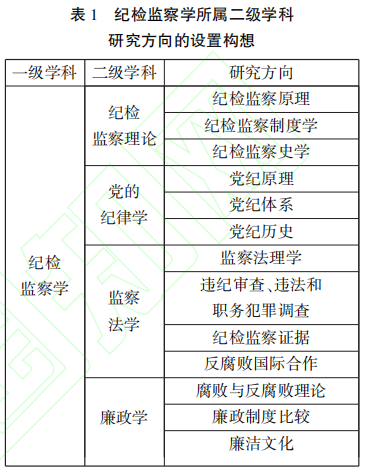

## **构建中国特色纪检监察学学科体系、学术体系、话语体系**

信息来源：https://gzlz.gzhu.edu.cn/info/1023/2530.htm

杜治洲 广州大学廉政研究中心

【摘要】纪检监察学科的诞生是时代的呼唤,也是中国反腐败斗争从实践向理论升华的必然结果。应立足中国反腐败实践,从研究对象、研究方向和基础支撑等方面构建纪检监察学学科体系，围绕命题观点、理论学说、研究方法等重要问题,构建纪检监察学学术体系；借助纪检监察工作话语、宣传话语提升学术话语影响力,重视纪检监察学知识体系独特性的同时关注其普遍性,在强化反腐倡廉自信的前提下积极借鉴域外腐败治理经验,构建中国特色的纪检监察学话语体系

【关键词】纪检监察学;学科体系;学术体系;话语体系

党的二十大报告强调,加快构建中国特色哲学社会科学学科体系、学术体系、话语体系。学科体系在学科建设中具有全局性和战略性意义,是学术体系和话语体系的依托和根基。学术体系是学科体系、话语体系的内核，决定着学科体系和话语体系的水平和属性。话语体系是学科体系的载体和学术体系的反映,体现着学科体系和学术体系的规范性、严谨性。纪检监察学是近年来诞生的一门新兴学科,构建中国特色纪检监察学学科体系、学术体系、话语体系,对于丰富和发展中国特色哲学社会科学学科体系、学术体系、话语体系,坚定不移推进全面从严治党和新时代党的建设新的伟大工程具有重大意义。

一、构建中国特色纪检监察学学科体系

学科体系，是指以知识结构、科学分工为基础的学科设置、专业划分和学术机构的组成体系。学科体系建设是一个学科发展的重中之重,包括研究对象的确定、学科框架的搭建、研究队伍和教材建设等内容。国务院学位委员会和教育部印发的《学位授予和人才培养学科目录》(2022年10月),设置了哲学、经济学、法学等14个学科门类,纪检监察学从属于法学门类。

(一)理解纪检监察学的形成背景

国家治理中监督的协同整合是纪检监察学形成的重要背景。

第一,整合监督机构是整体性治理的必然要求。20世纪90年代,随着公共组织碎片化、政策目标相互冲突、政策手段相互对立的状况日益凸显,强调竞争、分权和专业化的新公共管理理论逐步偏离公共部门的实践需要,此时注重协同性、系统性、一致性的整体性治理理论应运而生。尽管不同国家监督机构的名称有所不同,但政策目标基本一致,即提升权力运行的有序性、公平性和公正性。从这个意义上讲,监督机构有必要且有可能实现协同整合。具体到中国,在国家监察体制改革以前,履行反腐败职能的监督机关主要包括纪律检查机关、监察机关和检察机关,它们力量分散,且职责交叉重复。国家监察体制改革后,执纪和执法逐步贯通起来,反腐败资源也趋于集中,形成了监督合力。

纪律监督机构、行政监督机构与法律监督机构对公权力的整合监督,是纪检监察学诞生的直接原因。中国是共产党领导的社会主义国家,这是纪检监察工作一体化的重要保障,也是纪检监察学诞生于中国的深层次体制原因。

第二,整合监督对象是反腐败实践的必然要求。当前我国反腐败的对象主要是掌握公权力的公职人员。国家监察体制改革以前,纪律监督机关、行政监督机关和法律监督机关等各类监督机关之间存在着重复监督的现象。比如,作为纪律检查机关监督对象的党员与作为行政监督机关和法律监督机关监督对象的国家工作人员之间就存在着明显的重合。纪检监察学科的诞生契合了监督对象整合的趋势和要求,既注重党的纪律检查和国家监察分别研究,更注重推动二者的有机融合,从而达到一种“纪监融合”的境界,对于完善党和国家监督体系具有重要意义。

第三,党纪、行政规范与法律的目标指向高度一致,且三者关系密切,是纪检与监察融合发展的前提。党纪、行政规范与法律的目标指向基本一致,三者都是对人行为的约束,只是约束的对象、手段和严厉程度存在差异。不仅如此,违反三种规范的行为之间存在重叠和转化关系。违反党纪的行为可能也是违反行政纪律的行为,如果严重的话,还可能是违法行为。而且,违纪行为得不到及时纠偏,就有可能发展为违法行为。

(二)明确纪检监察学的研究对象

专门而稳定的研究对象,是一个一级学科必备的条件。关于纪检监察学的研究对象,当前学术界主要存在以下五类不同的观点。

一是“监督对象说”。有学者认为,中共党员、公职人员违纪原因的复杂性决定了纪检监察学广泛的学科范畴,进而提出纪检监察学的研究对象是中共党员和公职人员。这种观点的问题在于将纪检监察对象(或称监督对象)视作纪检监察学的研究对象,忽略了两个概念的本质差别。

二是“从严治党说”。杨永庚认为,纪检监察学指向违反纪律行为及对其的惩治和防范,它综合地研究从严治党问题。因此,纪检监察学的研究对象是从严治党。然而,从严治党与纪检监察两个概念的内涵和外延均存在一定的差别,而且从严治党是政党治理中的一项具体工作,用以作为一个学科的研究对象,缺乏概括性和原则性,延展空间非常有限。

三是“制度+活动说”。这类观点比较多见,认为纪检监察学的研究对象是纪检监察制度与纪检监察活动。事实上,纪检监察活动与纪检监察制度是有交集的两个概念,前者必定涉及纪检监察制度的制定、执行和变革等内容,而后者的执行本身就是主要的、日常纪检监察活动。因此,也不宜将二者确定为纪检监察学的研究对象。

四是“现象说”。有学者指出,纪检监察学的研究对象是纪检监察现象,包括纪检监察工作、纪检监察制度和纪检监察文化(廉洁文化)。但若仅仅将纪检监察现象作为研究对象,而忽略了对纪检监察规律的探索和认识,势必降低纪检监察学的学科价值和社会功能。因此,“现象说”也不尽合理。

五是“现象+规律说”。任何一个学科研究对象的界定都应遵循概括性原则,不可将十分具象的事物作为研究对象。因此有学者提出,纪检监察学的研究对象可以界定为纪检监察现象及其规律,并以党和国家监督体系、党风廉政建设和反腐败为内核要素。与“现象说”不同的是,“现象+规律说”主张纪检监察学不仅研究纪检监察过程中的现象,还探究这些现象背后的规律,笔者也赞同这种观点。

进一步,我们可以将纪检监察学定义为“研究纪检监察现象及其规律的科学”。纪检监察学的研究范畴包括:中国共产党纪律检查机关对党员和党组织的纪律监督、国家监察机关对公职人员的国家监察,以及纪律监督与国家监察之间的相互关系。

(三)把握纪检监察学科的研究方向

当前,学术界已就纪检监察学的二级学科设置达成初步共识:在“纪检监察学”一级学科下设置纪检监察理论、党的纪律学、监察法学、廉政学等四个二级学科。这样的设置体现了尊重规律、系统整合、预留空间和联系实际的原则,具有较强的科学性、前瞻性和可操作性。

一级学科的发展壮大,离不开二级学科的科学设置和有效建设,而二级学科能否为一级学科提供强有力的支撑,则在很大程度上取决于研究方向的科学选择。紧紧围绕纪检监察学四个二级学科的研究主题,分别确定若干相关研究方向,并深入开展研究,对纪检监察学学科体系的健康发展大有裨益。因此,建议在纪检监察理论、党的纪律学、监察法学、廉政学等四个二级学科下分别设置3-4个既紧密联系又相互独立的研究方向(见表1)。

(四)强化纪检监察学科的基础支撑

第一,合理规划课程体系。高校应瞄准培养高素质纪检监察人才的目标,围绕纪检监察学的学科架构,构建合理的课程体系。总体来看,纪检监察学专业的课程应包括三大类:一是所有二级学科均应开设的共有课程。如行政法学、纪检监察原理等课程。二是二级学科的主体课程。例如,“廉政学”二级学科下应开设的腐败与反腐败理论、廉政制度比较、廉洁文化等。三是高校的特色课程。高校应基于学科传统和优势资源开设具有鲜明特色的相关课程,以凸显人才培养的主要特色和比较优势。

第二,建设高质量的教材。国家监察体制改革前出版的相关教材主要有《纪检监察概论》(2008年傅奎著)和《纪检监察原理与方法精要》(2010年刘国栋著),可以说它们是纪检监察学的开山教材,但出版时间较早,没有涉及新时代国家监察体制改革的重要内容。进入新时代后的纪检监察学建设重启,出现了《新编纪检监察学教程》和《纪检监察学基础》。这两部著作对纪检监察学教材建设发挥了重要的推动作用,然而前者重视理论阐释且将“纪检”与“监察”分离,而后者更多关注纪检监察工作的流程和方法。因此,纪检监察学教材建设亟待提上议事日程。

第三,提高研究队伍的专业化水平。高校在纪检监察研究队伍建设中发挥着不可替代的重要作用。党的十八大以来尤其是国家监察体制改革以来,全国范围内纪检监察研究队伍建设快速推进,已有百余所高校成立了专门的廉政研究机构,一些高校成立了纪检监察学院或纪检监察研究院。然而,许多高校的纪检监察教学研究机构研究力量薄弱,或者研究成员同时兼任法学、马克思主义理论、公共管理等学科的教师,这不利于纪检监察学科的长远发展。因此,各高校应当加强纪检监察人才的培养和招聘力度,提升研究队伍的规模和质量。

第四,建设高水平学术期刊。当前与纪检监察学紧密相关的公开发行刊物不多,主要包括《中国纪检监察》《廉政文化研究》《廉政学研究》《党内法规学》等,它们在推动学科研究水平和提升学科影响力方面发挥了重要作用。然而,除了《中国纪检监察》外,其他期刊的刊名均未鲜明地体现纪检监察学科的特点。因此严格来说,当前需要能引领中国纪检监察学科发展的权威学术期刊。为此,未来应开辟新的研究阵地,创立高水平的学科刊物,可命名为《纪检监察学》或《纪检监察学研究》。

二、构建中国特色纪检监察学学术体系

学术体系是以成体系的学科理论为核心的学科知识综合体。学术体系主要包括思想、理论、原理、观点、学说、研究方法、工具等内容,其中,命题观点、理论学说、研究方法是学术体系的核心。作为一门刚刚诞生的新兴学科,纪检监察学与法学、政治学、马克思主义理论等法学门类下的其他一级学科相比,学术体系不够完善、学术概念的规范性不足、学术框架不明确、跨学科融合发展不够等问题较为突出。未来应围绕命题观点、理论学说、研究方法等重要问题,展开纪检监察学学术体系研究。

(一)凝练主体性的命题观点

一个独立的学科必须有属于自己的研究领域和研究范畴,有属于自己的命题观点。构建中国特色纪检监察学术体系,必须提出具有纪检监察学学科属性的主体性命题观点。这些重要命题,必须真正属于纪检监察学科而不应是其他学科的的研究范畴。国家监察体制改革以来,诸如明确监察对象、强化对纪检监察权的制约与监督、纪法衔接等纪检监察学科的重大理论和实践命题已经被提出来了。然而,已有研究似乎呈现出“冷热不均”的局面,对“监察”的关注远多于“纪检”,这对纪检监察学科体系的全面发展极为不利。纪检监察学术体系建设不仅要细分方向深入探索,更要将纪检监察现象和规律作为一个完整的研究对象展开综合性研究。因此,这就需要我们主动从更宽泛的视野提出由纪检监察学科主导的命题,推动纪检监察理论与实践问题的解决。

要提出纪检监察学的主体性命题,就必须对纪检监察活动和纪检监察现象展开调查研究。纪检监察学是一门政治性很强的学科,同时也是一门实践性很强的学科。没有调查就没有发言权。只有对纪律监督和国家监察的具体实践、各方面的感受和评价展开深入的调查研究,获取第一手数据,才能发现纪检监察实践中有待解决的真问题,才能提出纪检监察学科的真命题。为此,高校、科研机构必须加强与各级纪委监委的密切联系,联合展开调查研究,及时总结党的纪律监督和深化国家监察体制改革过程中积累的经验,分析出现的新情况新问题,从而提出纪检监察学科自身的重大命题。

(二)确立原创性的理论学说

理论学说是一个学科学术体系的灵魂。是否提出了经得起实践和历史检验的理论学说,是衡量一个学科的学术体系是否成熟的重要标准。纪检监察学学术体系建设离不开原创性的纪检监察理论学说。从纪检监察学的学术渊源来看,许多学科都直接或间接地为纪检监察学的产生与发展提供了丰富的养分。例如,长期以来政治学、党史党建学、法学、公共管理学、心理学、经济学等众多学科的专家学者,一直对腐败与反腐败、从严治党、作风建设、行政监察、权力寻租等问题保持着高度的研究热情,提出了许多创新思想和理论。制度预防腐败理论、腐败潜伏期理论、廉能政府理论、廉政领导力理论等,均是对纪检监察学科建设的重要贡献,是纪检监察理论体系的重要渊源。然而,这些形成于国家监察体制改革之前的理论学说,均不同程度地带有政治学、管理学等非纪检监察学科的色彩。提出属于自身学科的创新性理论,已是当下纪检监察学学术体系建设面临的重大课题。学术界应当对我们党正风肃纪反腐的宝贵经验,特别是新时代全面从严治党取得的历史性成就、发生的历史性变革进行系统性的归纳总结和学理阐释,将实践成果、制度成果提炼为原创性的理论成果。

要确立纪检监察学科原创性的理论学说,最重要、最紧迫的是跨越纪检理论研究与监察理论研究之间的学术沟壑。加强党对反腐败工作的统一领导、整合反腐败资源,是国家监察体制改革的重要目标,也是催生纪检监察学科的强大动力。纪检监察学学术体系的构建,自然应当体现纪检与监察的共性特征、关联关系、整合发展,应当打破当下纪检研究与监察研究分割的局面。当前,具有政治学、公共管理、党建等学科背景的学者倾向于专注纪检方面的研究,而具有法学学科背景的学者则多从事监察特别是监察法方面的研究。这非常不利于形成纪检监察学科的整体性、原创性理论学说,不利于形成纪检监察学科自身的学科特色。为此,需要从以下三个方面做出努力:第一,教育主管部门应鼓励高校成立实体的纪检监察学院。高校应加大成立纪检监察学院的步伐,建设从事纪检监察研究的专职队伍,从体制上保障纪检监察研究的整体性。第二,学会、研究会等学术平台应努力凸显纪检监察学科特色。建议现有的各级监察学会更名为“纪检监察学会”,并积极举办纪检监察学相关的学术研讨会。第三,不同学科背景的专家学者应加强学术交流与合作。学界应增强科研合作,更加关注纪法衔接、纪律监督与监察监督协同发展等纪检监察学科的全局性、关键性问题。

(三)采用综合性的研究方法

研究方法的独特性,是一门学科学术体系成熟的重要标志。纪检监察学应采用综合性的研究方法展开研究。纪检监察学涉及马克思主义理论、政治学、法学、中共党史党建、公共管理等多学科的理论知识,单一的研究工具和方法难以回答和解决纪检监察权力运行中面临的难题,必须坚持马克思主义立场、观点、方法在学术体系中的指导地位,采取多种研究方法展开探索研究,促进纪检监察学学术体系建设的高质量发展。

特别值得一提的是,构建中国特色哲学社会科学学术体系是中国学者的历史使命,但这并非指应该摒弃西方社会科学的一切成果,相反,借鉴西方的研究方法可以有效提升我国的学术研究水平。例如在政治学恢复之初,随着对外交流的不断深入,西方战后所兴起的行为主义和经验研究方法逐步被引进到国内学界,社会调查、统计分析、数理模型、模拟实验等分析方法被普遍使用,这在一定程度上改变了传统政治学研究仅注重抽象、静态、宏大的演绎推论和价值判断的弊端,提升了政治学的科学性与规范性。同样,西方权力监督和反腐败研究中通常使用的社会测量法、实验法、预测法等都可以为我们批判性地学习借鉴,从而提升中国纪检监察学的研究水平,对纪检监察活动中出现的新问题、新情况做出科学合理的解释,为全面从严治党和反腐败斗争提供理论依据和政策参考。而且,研究方法的多样化也有利于提升中国纪检监察学的国际学术影响力。

综上,与其他诸多学科不同,纪检监察学是一个开放的系统,没有一个单一的普适性的方法论工具,也不可能用方法论工具界定学科的标准,不可能也没有必要通过森严的技术壁垒来保证自己学科的纯粹。纪检监察学不仅有多学科渊源,而且具有浓厚的中国特色,应在兼容并包、博采众长的基础上采用多元的、综合的研究方法提升学术研究水平。

三、构建中国特色纪检监察学话语体系

发挥我国哲学社会科学的作用,必须加强话语体系建设。话语是理论知识和概念范畴的体系化的规范性表达。话语体系是一门学科或者知识领域在长期发展过程中形成的相对稳定的言说体系与表达形式,是一个学科发展成熟的标志。纪检监察话语,就是研究阐发纪检监察理论和实践的标准用语、规范用语。新时代中国反腐败斗争取得了显著的成效,但是理论界和实践部门使用的纪检监察用语表达或“特色”过于鲜明,或规范性不足,以至于有些反腐败理念和理论不能及时被国际社会广泛理解和认可。纪检监察学科应当建立科学的话语体系,通过规范的语言表达,强化大众沟通传播,提升中国治理腐败的能力和形象,提升中国纪检监察学界在国际学术界的话语权。

(一)借助纪检监察工作话语、宣传话语

加大纪检监察学话语体系的基础研究,提升学术话语影响力加大纪检监察学话语体系的基础研究,促进纪检监察学话语的规范表达与有效传播,构建科学合理的纪检监察学话语生成机制,推动纪检监察工作话语、宣传话语、学术话语相融相通,互动互促,是构建中国特色纪检监察学话语体系的必然要求。

一方面,从工作话语和宣传话语中发现和提炼学术话语。纪检监察学者要对纪检监察工作话语和宣传话语进行深入分析,不断提炼出人民群众喜闻乐见、活灵活现的话语表达,推动纪检监察话语中国化、时代化、大众化。在学科语言的塑造方面,应吸纳那些反映党和国家反腐败动因、战略和体制机制等理论内核的重要概念,使之成为纪检监察学科的核心术语。进入新时代以来我国纪检监察工作出现了一些明显的特点,据此可以凝练出不少专业术语。例如:从工作用语中可以提出“审查调查”“留置”“四种形态”“纪法衔接”“巡视巡察”“一体推进‘三不腐’”等概念;从宣传用语中可以提出“全面从严治党”“微腐败”“腐败零容忍”“监察全覆盖”等概念。

另一方面,利用宣传话语扩大工作话语和学术话语的影响力。打造中国特色纪检监察学话语体系,不能关起门来“自说自话”,还必须认真考虑这些具有中国特色的概念和术语是否容易为国际社会所理解和接受,能否得到国际同行的尊重和认同,从而引导国际学术界展开讨论和研究。为此,要通过多种渠道、多种方式在国际上宣传中国纪检监察工作和纪检监察研究取得的成果,讲好中国纪检监察学的故事,贡献中国纪检监察学的智慧,提升中国纪检监察学的国际影响力。要紧扣时代特征,贴近受众需求,合理借鉴人类政治文明的有益成果,不断提炼能为国际社会理解和接受的新概念、新范畴和新表述,提升纪检监察学话语传播的温度和效度,使纪检监察学科在更好地与世界对话的过程中,拥有更多更大的国际话语权。

(二)重视纪检监察学知识体系独特性的同时关注其普遍性

一方面,要重视纪检监察学知识体系的独特性。纪检监察学知识体系的独特性主要体现在研究目标和研究对象的本土性上。从研究目标来看,纪检监察学主要回答如何通过自我革命解决大党独有难题。大党独有难题是一个极具原创性的新命题,我国创建纪检监察学科的目标就是破解这一命题。以何种方式的自我革命解决世界上最大的马克思主义执政党面临的六个独有难题,从而始终赢得人民拥护、巩固长期执政地位,是中国特色纪检监察学科肩负的重大使命。从研究对象来看,纪检监察学主要研究中国的纪检监察现象及其规律。中国特色反腐倡廉道路不是凭空而降的,也不是照搬别国的反腐败模式,这条道路在中国的土地上诞生、发展和成熟,它始终反映着中国人民的意志、解决着党和国家治理中的权力监督问题。因此,纪检监察学研究的是世界上独一无二的中国特色反腐败问题。

另一方面,还要关注纪检监察学知识体系的普遍性。实际上,纪检监察的本质是监督,纪检监察学知识体系是监督理论的知识体系,而监督理论的知识体系是具有一定普遍性的。从本质上讲,纪检监察学与监督学是个别与一般的关系。因此,在建设纪检监察学科、构建纪检监察学话语体系的过程中,不能只关注纪检监察学及其知识体系的个性,而忽略其反映的监督活动的共性规律。中国的反腐败是世界反腐败的重要组成部分,应当且能够为世界各国反腐败提供中国方案和参考借鉴。将中国特色纪检监察学的学科价值拓展到对世界监督学的贡献,是中国特色反腐倡廉自信的重要来源,也是纪检监察话语体系的构建和传播中必须反映的核心价值。

(三)在强化反腐倡廉自信的前提下积极借鉴域外腐败治理经验

纪检监察学话语体系的形成必须以充分的自信为前提。第一,强化中国特色反腐倡廉道路自信。中国共产党自成立以来就高度重视党风廉政建设和反腐败工作,保持了党的先进性和纯洁性,增强了党的创造力、凝聚力和战斗力,为完成党和国家各项任务提供了坚强可靠的政治保证,逐步走出了一条符合中国国情的反腐倡廉之路。纪检监察学话语范式的构建,必须体现和强化中国纪检监察学术界和实务界对中国特色反腐倡廉道路的绝对认同和深层自信。第二,强化中国特色反腐倡廉理论自信。中国特色反腐倡廉理论,实现了反腐败价值、战略、战术、体制、机制等方面的重大创新和突破。唯有抱着充分的自信,大范围、高频率地使用和推广极具中国元素的专业术语,让世界各国更多的学者、政府官员和普通民众了解并认同我国纪检监察工作、纪检监察学的特色和优势,才能不断提升我国纪检监察学的话语权。第三,强化中国特色反腐倡廉制度自信。我国在反腐败实践中逐步沉淀下来了内容科学、程序严密、配套完备、有效管用的具有中国特色的反腐倡廉制度体系,包括教育制度、惩治制度、预防制度和监督制度等内容。这些制度规范着党和国家权力,是党的纪检监察制度的重要来源。在构建纪检监察学话语体系的过程中,必须具备高度的制度自信。第四,强化中国特色反腐倡廉文化自信。中国古代的哲学文化中包含了丰富的廉政思想,笔者称之为中国特色廉政哲学,它主要包括善恶论、有无论、公私论、转化论、诚信论、欲望论、情感论、生死论等八个方面的内容。纪检监察学话语体系应当充分反映这些传统哲学思想的反腐价值,强化文化自信。

然而,自信不是自大,不是唯为独尊或自我封闭,而必须以平等的姿态与域外文明进行互鉴。只有交流才能产生影响力,只有交流才能产生话语权。因此,提升纪检监察话语的开放性、兼容性,借鉴国外反腐败研究的话语构建方式、规则和经验,是当前构建中国特色纪检监察学话语体系不可回避的又一重要议题。一方面,要通过各种方式及时地、广泛地向世界传播中国纪检监察工作的实践进展和中国纪检监察学的理论创新,增强中国纪检监察学的知晓度和影响力。另一方面,要激励纪检监察学者积极参加相关的国际学术研讨会或向国外科研机构公派访问学者,学习国外的反腐败经验和反腐败研究方法,以提升纪检监察学研究的水平。

值得一提的是,我国反腐败斗争的实际成效将对我国纪检监察学国际话语权产生极为重要甚至是决定性的影响。只有向国际社会展示一份漂亮的反腐成绩单,只有反腐败工作得到了世界的广泛认可和尊重,中国特色纪检监察学才会真正形成建立在实力基础上的牢固的话语权。因此,全国上下应在党的统一领导下齐心协力,加快推进廉洁政治、廉洁政府和廉洁社会建设,为争取纪检监察学话语权奠定坚实的基础。

总之,构建中国特色纪检监察学学科体系、学术体系、话语体系,是一项影响深远且责任重大的崇高使命,并非一日之功,不可一蹴而就。但是,只要党和政府、高校和科研机构、纪检监察学者等从多方面锚定目标,接续努力,就一定能建设好具有鲜明中国特色、中国风格、中国气派的纪检监察学学科体系、学术体系、话语体系。

为方便编辑，文中图表、注释与参考文献省略

文献来源:杜治洲.构建中国特色纪检监察学学科体系、学术体系、话语体系\[J/OL\].中南民族大学学报(人文社会科学版):1-8\[2024-02-01\].https://doi.org/10.19898/j.cnki.42-1704/C.20231218.03.