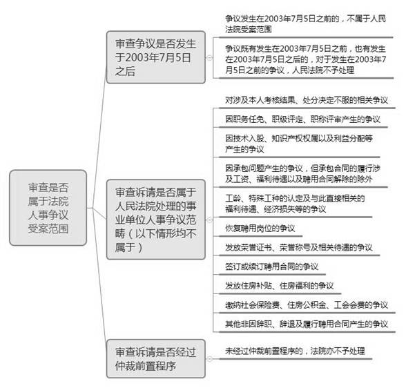
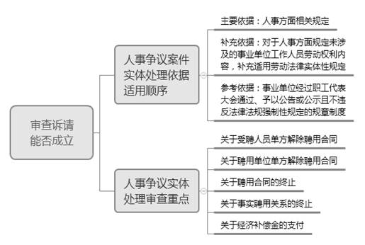

### **事业单位人事争议案件的审理思路和裁判要点**

事业单位人事争议是指事业单位与其工作人员之间因辞职、辞退及履行聘用合同所发生的争议。事业单位具有社会服务的功能属性，在人事管理上有其特殊性和复杂性。**在处理事业单位人事争议时，法院应以查明事实、分清责任为立足点，合理把握司法干预边界，平衡保护双方当事人的合法权益**。审判实践中，事业单位人事争议案件虽然占比不高，但具有相对独立的体系，与劳动争议案件在法律适用、审理思路等方面既有联系又有区别，存在易混淆之处，故对此进行相应的梳理总结。

**一、典型案例**

**案例一：涉及争议受案范围的界定**

倪某与A学院签订聘用合同，约定倪某从事教学、科研工作。A学院对倪某所在岗位制定有岗位年度考核办法。A学院根据倪某上一年的考核结果，对倪某已预领取的全年校内岗位津贴及新增岗位津贴逐月倒扣，并对其年终一次性奖金扣减30%；因倪某课时不足，对其作相应扣款。倪某为此提起仲裁、诉讼，要求A学院支付其扣减的工资差额及超课时奖金。

**案例二：涉及人事方面特有规定的适用**

陈某与B医院签订有期限的聘用合同。合同期满后，B医院以此为由通知陈某终止聘用关系。后双方就B医院是否应支付聘用合同终止经济补偿金发生争议。陈某为此提起仲裁、诉讼，要求B医院按劳动合同法规定支付聘用合同终止的经济补偿金。

**案例三：涉及劳动合同法相关规定的适用**

张某经公开招聘与C社区服务中心签订事业单位聘用合同。试用期满后，C社区服务中心解除与张某的聘用合同。张某为此申请仲裁，要求恢复双方聘用关系，并获仲裁支持。C社区服务中心不服提起诉讼，主张张某工作经历严重失实、社会保险缴费年限亦不足三年，不符合招聘公告和招考条件要求，认为解聘张某行为合法。张某则认为其在报考时经过严格审查，符合工作岗位的招聘条件，不存在故意隐瞒工作经历等情形。

 **二、人事争议案件的审理难点**

**（一）人事争议受案范围边界欠清晰**

《最高人民法院关于人民法院审理事业单位人事争议案件若干问题的规定》将相关人事争议案件的范围限定为事业单位与其工作人员之间因辞职、辞退及履行聘用合同所发生的争议。对于因“履行聘用合同”发生的争议是仅限定于聘用合同约定内容的履行，还是可扩展到与聘用合同的订立以及聘用合同约定内容之外的工资、奖金、福利、培训等相关争议？如可作扩张理解，扩张的范围又如何界定？对此审判实践中存在颇多争议。

**（二）人事方面特有规定与劳动法相关规定适用范围难区分**

人事争议在审理程序上适用劳动法相关规定。在实体处理上，根据《最高人民法院关于事业单位人事争议案件适用法律等问题的答复》，应当适用人事方面的法律规定；涉及事业单位工作人员劳动权利的内容在人事法律中没有规定的，适用劳动法有关规定。然而，目前尚未制定人事争议方面专门的法律层级规范，相关依据分散在不同层次的法律文件中。对于当事人诉争的权利内容，哪些属于人事法律法规等已作规定的，哪些可以适用劳动法相关规定的，审判实践中存在诸多争议。

**（三）人事争议裁判规则与劳动争议裁判规则易混淆**

事业单位人事聘用合同与劳动合同虽然表现形式有所区别，但其本质上均是当事人在劳动用工过程中对劳动力交换内容的约定。因聘用合同的履行、辞职、辞退所引发的人事争议，与因劳动合同的履行及解除而引发的劳动争议，在纠纷性质、诉请内容上具有相似性。同时，人事争议与劳动争议均需经过劳动人事争议仲裁委员会仲裁的前置程序，且均由法院同一审判业务庭进行审理。因此，上述诸多因素易导致人事争议裁判规则与劳动争议裁判规则混淆而引发误判。

**三、人事争议案件审理的一般思路与裁判规则**

人事争议可细分为聘用合同争议、辞职争议、辞退争议。审判实践中，因人事争议与劳动争议中的劳动合同纠纷具有相似性，在审查要件、举证责任分配等方面可参照适用审理劳动合同纠纷案件的基本方法。同时，因人事争议与劳动争议的受案范围、适用规则具有明显区别，法院应特别注意对相关争议的可诉性、规则适用的正确性进行审查。具体审查步骤如下：

**（一）审查是否属于人事争议**

事业单位既是人事聘用关系的适格主体，也是劳动法律关系的适格主体，并非发生于事业单位与其成员之间的争议均属于人事争议。对于事业单位和与之建立劳动关系的劳动者之间发生的相关争议，应纳入劳动争议处理范畴。如审判实践中遇到此类情形，应直接转入劳动争议处理程序，无需进行人事争议的相关审查。

对于事业单位的界定，《事业单位登记管理暂行条例》将事业单位定义为“国家为了社会公益目的，由国家机关举办或者其他组织利用国有资产举办的，从事教育科技、文化卫生等活动的社会服务组织”。《关于执行最高人民法院<关于人民法院审理事业单位人事争议案件若干问题的规定\>的解答》则将之明确为“经过各级编制部门批准使用事业单位编制的单位”。登记管理机关会对准予登记的事业单位发放《事业单位法人证书》，故可将此作为事业单位的主要认定依据。

审判实践中，区分人事争议和劳动争议的主要依据在于劳动者是否为事业单位编制内人员，具体审查有无填写过聘用制干部审批表、有无办理过聘用制干部审批手续等。需要注意的是，退休返聘人员与相关单位形成劳务关系，相关争议按劳务关系处理。

**（二）审查是否属于法院人事争议受案范围**

**1****、审查双方争议是否发生在****2003****年****7****月****5****日****之后**

因作为法院受理人事争议案件依据的《人事争议司法解释》自2003年9月5日起施行，当时的仲裁时效为60日，上海高院《关于受理人事争议案件若干问题的意见》由此明确：对于符合法院审理人事争议案件受理范围的争议发生在《人事争议司法解释》实施日期之前60日即2003年7月5日之前的，不属于法院的受案范围；争议既有发生在2003年7月5日之前，也有发生在2003年7月5日之后的，对于发生在2003年7月5日之前的争议法院不予处理。

**2****、审查当事人的诉请是否属于法院受案范围**

根据《人事争议司法解释》，法院受理事业单位与其工作人员之间因辞职、辞退及履行聘用合同所发生的争议。审判实践中，对于因辞职、辞退所发生争议的理解并无分歧，但对因履行聘用合同发生的争议如何界定存在较大争议。结合审判实践，不属于法院受案范围的人事争议诉请一般包括：

（1）对涉及本人考核结果、处分决定不服的相关争议。事业单位工作人员对涉及本人的考核结果、处分决定等不服的，可以按照国家有关规定申请复核、提出申诉。同时，因考核结果、处分决定不属于法院受案范围，法院对与考核结果、处分决定直接相关的工资、奖金等诉请亦不予受理，但如处分决定内容为解聘、辞退的，应属于法院受案范围。

（2）因职务任免、职级评定、职称评审产生的争议。此类争议既包括对职务任免、职级评定、职称评审结果不服要求变更或纠正的诉请，还包括与此直接相关的工资、奖金等诉请。

（3）因技术入股、知识产权权属以及利益分配等产生的争议。

（4）因承包问题产生的争议，但承包合同的履行涉及工资、福利待遇以及聘用合同解除的除外。

（5）工龄、特殊工种的认定以及与此直接相关的福利待遇、经济损失等的争议。

（6）恢复聘用岗位的争议。

（7）发放荣誉证书、荣誉称号及相关待遇的争议。

（8）签订或续订聘用合同的争议。

（9）发放住房补贴、住房福利的争议。

（10）缴纳社会保险费、住房公积金、工会会费的争议。

（11）其他非因辞职、辞退及履行聘用合同产生的争议。

如案例一中，倪某主张的工资差额及超课时奖金，均系A学院依据岗位年度考核办法，对教职员工进行考核后兑现的岗位津贴等待遇。考核结果涉及教师所在岗位性质以及不同岗位对应工作量的实际完成情况。倪某的诉请实际是对A学院考核结论所参照的考核方式持有异议，故上述争议不属于法院受理的人事争议范围。

**3****、审查双方争议是否经过仲裁前置程序。**

当事人双方的争议即便属于法院受理的人事争议范围，也必须经过仲裁前置程序；未经过仲裁前置程序的，法院不予处理。

**（三）审查当事人的诉请能否成立**

**1****、人事争议案件实体审理依据的适用顺序**

结合相关规定及审判实践，对本市人事争议案件进行实体审理的依据包括：

**（****1****）主要依据**。具体包括：《事业单位人事管理条例》《国务院办公厅转发人事部<关于在事业单位试行人员聘用制度意见的通知\>》《上海市事业单位聘用合同办法》《上海市人事局关于实施<上海市事业单位聘用合同办法\>有关问题的解释》等，另在涉及教师、医生等特定争议主体时，教师法、执业医师法中的相关内容亦可成为裁判依据。

**（****2****）补充依据**。人事方面的规范依据未作规定的，补充适用劳动法律实体性规定。

**（****3****）参考依据**。事业单位经过职工代表大会通过、予以公告或公示且不违反法律法规强制性规定的规章制度。

**2****、人事争议实体审理审查要点**

**（****1****）关于受聘人员单方解除聘用合同**

自2014年7月1日《事业单位人事管理条例》实施后，事业单位工作人员提前30日书面通知事业单位的，可以解除聘用合同，但双方对解除聘用合同另有约定的除外。在此之前，除规定情形外，受聘人员提出解除聘用合同未能与聘用单位协商一致的，受聘人员应当坚持正常工作，继续履行聘用合同；6个月后再次提出解除聘用合同仍未能与聘用单位协商一致的，方可单方解除聘用合同。

**（****2****）关于聘用单位单方解除聘用合同**

《事业单位人事管理条例》第四章规定了聘用单位可以解除聘用合同的情形，《事业单位人员聘用制度意见》《上海市事业单位聘用合同办法》与《事业单位人事管理条例》不冲突的规定，亦可成为判断聘用单位解除行为合法性的依据。需要注意的是：

**第一**，聘用单位试用期内解除聘用合同的，需满足受聘人员不符合本岗位要求又不同意调整工作岗位的条件；而在劳动关系中，用人单位只需证明劳动者试用期间不符合录用条件即可。

**第二**，受聘人员连续旷工超过15个工作日或者一年内累计旷工超过30个工作日的，聘用单位可以单方解除聘用合同；而在劳动关系中，用人单位可以单方解除劳动合同的旷工天数属于用人单位用工自主权的决定范畴，只要经过法定程序、无明显不合理之处即可。

**第三**，未经聘用单位同意，擅自出国或者出国逾期不归的，聘用单位可以单方解除聘用合同；而劳动法、劳动合同法并未将其作为法定解除理由。

**第四**，受聘人员患有现有医疗条件下难以治愈的严重疾病或者精神病的，不适用医疗期相关规定。此种情况下，聘用单位不能以受聘人员医疗期满后不能从事原工作也不能从事单位安排的其他工作为由解除聘用合同。同时，受聘人员正在接受纪律审查尚未作出结论的，聘用单位亦不得据此解除聘用合同。在劳动法、劳动合同法中并无相关限制性规定。

**第五**，受聘人员年度考核不合格且不同意调整工作岗位或者连续两年年度考核不合格的，聘用单位可以解除聘用合同；而在劳动关系中，对于劳动者不能胜任工作的，在经过培训或者调整工作岗位后仍不能胜任工作的，用人单位方可解除劳动合同。

**第六**，法院对于聘用单位对受聘人员的考核结果不作审查；而在劳动关系中，法院对于用人单位的考核是否遵守相关程序、是否存在明显错误等应进行适当审查。

如案例三中，C社区服务中心的解除理由并不属于法定解除情形，故该中心解除张某的聘用合同依据不足而构成违法解除。同时，人事方面规定并未涉及违法解除情形下聘用单位的具体担责方式，因此法院依照《劳动合同法》第48条规定，认定C社区服务中心应当恢复与张某之间的聘用关系。

**（****3****）关于聘用合同的终止**

**第一**，在人事关系中，允许当事人约定聘用合同终止条件；而在劳动关系中，用人单位与劳动者不得在法定情形之外约定劳动合同的其他终止条件。

**第二**，聘用合同当事人实际不履行聘用合同满三个月，也不属于聘用合同中止情形的，聘用合同可以终止；而在劳动法、劳动合同法中并无对应规定。

**第三**，在聘用合同期满或约定终止条件出现时，受聘人员正在接受纪律审查尚未作出结论的，属于聘用合同法定顺延情形；而在劳动法、劳动合同法中并无对应规定。

**第四**，聘用合同终止情形出现时，如受聘人员患有现有医疗条件下难以治愈的严重疾病或者精神病的，聘用单位不得终止聘用合同；而在劳动法、劳动合同法中并无对应规定。

**（****4****）关于事实聘用关系的终止**

对于应当订立聘用合同而未订立，形成事实聘用关系的终止条件，可区分为以下情形：**一是**由于用人单位的原因，双方自始未订立聘用合同的，受聘人员可以随时终止聘用关系，用人单位不享有提前30日通知受聘人员终止聘用关系的权利；**二是**由于受聘人员的原因，双方自始未订立聘用合同的，用人单位可以提前30日通知受聘人员终止聘用关系，国家另有规定的除外；**三是**聘用合同期满后，双方未续订合同、受聘人员仍在继续工作的，视为双方以原条件继续履行聘用合同，受聘人员可以随时终止聘用关系，聘用单位可以提前30日通知受聘人员终止聘用关系。

**（****5****）关于经济补偿金的支付**

**第一**，在人事关系中，聘用单位根据《事业单位人员聘用制度意见》《上海市事业单位聘用合同办法》的规定支付经济补偿金，无须支付聘用合同到期终止的经济补偿金；而在劳动关系中，除用人单位维持或者提高劳动合同约定条件续订劳动合同、劳动者不同意续订的情形之外，用人单位均需支付固定期限劳动合同到期终止的经济补偿金。

如案例二中，陈某系与B医院建立聘用合同关系的事业单位在编人员，案件应适用人事方面有关经济补偿金支付的规定，故法院对陈某要求B医院按劳动合同法规定支付经济补偿金的诉讼请求不予支持。

**第二**，人事争议案件经济补偿金的计算方式与劳动争议案件存在差异：**一是**计算受聘人员的工作年限，即受聘人员在同一单位连续工作的时间，双方另有约定或军队转业干部、复员退伍军人等国家和本市另有规定的政策性安置人员除外。需要注意的是，工作年限不满6个月部分不享受经济补偿，聘用合同中止期间不计入实际工作年限；**二是**经济补偿金标准不得高于本市统计行政部门公布的事业单位上年月平均工资的三倍；**三是**计发经济补偿金的月工资计算基数应为国家统计部门工资总额统计口径确定的项目，不包括按国家或本市规定个人应缴纳的各类税费。

（根据民事庭陈福才、孙少君提供材料整理）