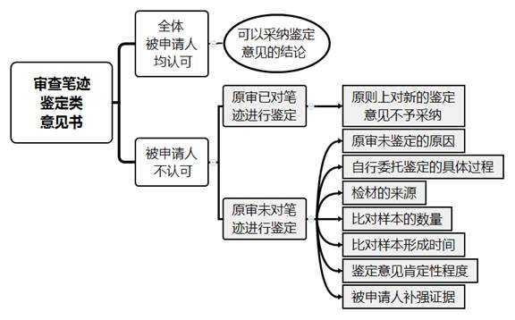

### **以鉴定意见为由申请再审案件的审理思路和裁判要点**

在民商事申请再审案件中，再审申请人应当承担证明再审事由成立的责任。当事人以鉴定意见为由申请再审主要包括以下情况：一是原审未进行鉴定或鉴定结论未能令当事人信服，当事人在判决生效后要求重新鉴定或自行委托鉴定并申请再审；二是当事人缺席原审审理却在原审判决生效后方才得知，遂自行委托鉴定后申请再审。在再审审查阶段如何妥善处理此类案件，实践中尚存分歧。现结合常见的鉴定意见审查案例，包括笔迹鉴定、印章鉴定和自然人民事行为能力类鉴定意见等，对该类案件的审查思路和裁判要点予以梳理、提炼和总结。

**一、典型案例**

**案例一：涉及以笔迹鉴定意见申请再审案件的审查**

A公司与B公司签订买卖合同，王某以其持有的B公司股权作为质押担保并委托张某办理质押登记手续。A公司支付全部货款后，B公司仅供应部分货物，A公司遂诉至法院。原审诉讼中王某缺席审理，原审判决B公司返还A公司未供货部分货款，并判决王某承担担保责任。后王某提交笔迹鉴定意见书申请再审，鉴定意见认为王某在《股权质押合同》落款处的签名与样本字迹上签名并非同一人所写。经审查，本案《股权质押合同》《委托代理人证明》等四份股权质押文件上均有王某签名，《委托代理人证明》中王某委托张某办理股权质押手续，《股权质押合同》中质押股权数有修改且张某在修改处签名并注明日期。

**案例二：涉及以民事行为能力鉴定意见申请再审案件的审查**

马某向徐某借款50万元，马某到期未还款，徐某遂诉至法院。原审诉讼中马某缺席审理，原审判决马某归还徐某借款50万元及利息。马某的法定代理人陈某申请再审，提交了另案中经法院委托的马某民事行为能力鉴定意见书及马某被认定为限制民事行为能力人的民事判决书等。鉴定意见认为马某的智能有轻度缺损，长期以来其学习、生活等社会功能存在相应缺陷，故诊断为轻度精神发育迟滞，系限制民事行为能力人。

**案例三：涉及原审已鉴定申请人再提交新鉴定意见的审查**

经原审法院委托鉴定，系争《借款协议》上担保人处C公司的公章与样本公章不一致，故原审判决C公司不承担担保责任。两年后在另案诉讼中，经法院委托鉴定证实C公司有两枚不同的公章且均在使用。原审债权人吴某知晓后，自行委托鉴定机构再次鉴定，认定《借款协议》上C公司公章系另一枚公章。现吴某依据新的鉴定意见书申请再审。

**案例四：涉及申请人自行委托的鉴定意见与被申请人的反驳证据均有一定证明力情况下的审查**

李某与D公司签订买卖合同，D公司供货后李某向D公司出具一份《欠条》，后因李某未支付货款D公司诉至法院。原审诉讼中李某缺席审理，原审判决李某归还货款及利息。后李某自行委托鉴定机构对《欠条》进行鉴定，结论为“倾向认为《欠条》上李某的签名并非李某本人所签”。D公司不认可鉴定结论，提供李某曾到过公司的视频及证人证言，以证明李某当场在《欠条》上签章。

**二、以鉴定意见为由申请再审案件的审查难点**

**（一）鉴定意见的法律适用把握难**

《民事诉讼法司法解释》第399条规定，审查再审申请期间，再审申请人申请法院委托鉴定、勘验的，法院不予准许。该条文引发两个法律适用难点：一是法院委托鉴定的证明力要高于再审申请人自行委托鉴定，既然不允许由法院委托鉴定，是否意味着法院亦不得采纳申请人自行委托的鉴定意见；二是如申请人提交的鉴定意见与被申请人提供的反驳证据都具有一定证明力，导致案件事实查明陷入僵局，法院对此应当如何妥善处理存在一定困难。

**（二）鉴定意见的证明效力确定难**

申请人提交的鉴定意见通常由其单方委托的鉴定机构出具，且鉴定材料未经双方当事人质证，被申请人往往拒绝质证或不认可鉴定意见的真实性，但该类鉴定意见可能对案件基本事实的认定起到决定性作用。在被申请人不予认可的情况下，法院如何进行质证、确定此类鉴定意见与案件的关联性及证明效力是该类案件的审查难点。

**（三）鉴定所需的原件检材获取难**

鉴定机构通常要求当事人提供原件作为鉴定检材，主要原因在于复印件更容易被伪造或篡改，且原件能更好地反映检材的客观特性，如笔迹鉴定中原有笔迹固有的层次感等。实践中，被申请人在原审中出示过原件后通常不再配合出具原件供申请人另行鉴定，而此类原件往往是原审据以裁决当事人责任的重要依据，如借条、金融借款或担保合同等。再审审查阶段，证明再审事由成立的责任归于申请人，而申请人在无法获取原件的情况下只能用原审卷宗中的复印件作为检材。此类复印件检材是否可用于鉴定、所作鉴定意见是否可被采纳存在争议。

**（四）依法裁定再审与维护生效裁判的既判力权衡难**

虽然申请人提交的鉴定意见并非由法院委托作出，但该鉴定意见仍系鉴定机构通过一定的鉴定方法，根据现有的证据和材料对相关专门性问题所作的结论性意见，具有较高的专业性。法院需从鉴定人的法律资质、申请人委托鉴定的材料、鉴定程序和方法以及被申请人质证意见等方面，对申请人提交的鉴定意见进行审查，进而判断该鉴定意见能否证明原审的认定事实或裁判结果错误。然而当事人对生效裁判申请再审时，该生效裁判可能已进入执行阶段，考虑到生效裁判的既判力，不宜将其轻易推翻。因此在审查过程中，法院需结合多种因素决定是否裁定再审，同时还需兼顾维护生效裁判的既判力，两者之间较难权衡。

**三、以鉴定意见为由申请再审案件的审查思路和裁判要点**

**以鉴定意见为由申请再审案件中，再审审查的对象系生效裁判，法院应当考虑裁判的既判力和司法成本，对证据的审查认定应当采取较一、二审更为严格的标准。经审查后，对于权利义务确实严重失衡、严重背离社会公平正义的错误裁判，应当依法纠错，及时保障当事人的合法权益。**审查此类案件，应当明确再审审查阶段法院是否可以采纳申请人自行委托的鉴定意见及此类鉴定意见的性质，并根据申请人是否参加过原审诉讼，确定不同情形下常见鉴定意见的审查要点。相关审查要点提示如下：

**（一）申请人自行委托鉴定意见的证据性质**

根据《民诉证据规定》第41条规定，对于一方当事人就专门性问题自行委托有关机构或人员出具的意见，另一方当事人有证据或理由足以反驳并申请鉴定的，法院应予准许。由此可以看出，法院在程序上并不禁止申请人自行委托鉴定，然申请人自行委托所得的鉴定意见与法院委托所得的鉴定意见存在三方面区别：一是鉴定材料未经双方当事人质证以确定材料的真实性；二是选定的鉴定机构未经过法院委托，鉴定机构的中立性未经过程序约束；三是委托鉴定的项目未经法院核定。因此，此类鉴定所得材料在客观性、关联性上较法院委托鉴定存在一定差距。申请人提交的鉴定意见是否应当作为新的证据采纳，对于案件是否进入再审意义重大，应当审慎对待。

**（二）申请人是否在法定申请再审期限内申请再审**

根据《民事诉讼法》第212条规定，申请再审的期限为原裁判发生法律效力后6个月；如果原裁判有《民事诉讼法》第207条第1、3、12、13项情形的，申请再审的期限为申请人知道或者应当知道之日起6个月。需要注意的是，该6个月为除斥期间，不适用诉讼时效中止、中断、延长的规定。

申请人以鉴定意见为由申请再审，通常主张《民事诉讼法》第207条第1、3或8项三种事由。如果申请人主张第1项或第3项事由的，即“有新的证据，足以推翻原判决、裁定的”或“原判决、裁定认定事实的主要证据是伪造的”，法院应当审查其是否在知道或应当知道该事由之日起6个月内申请再审，超过6个月则不再审查该项事由。

此外，根据《民事诉讼法司法解释》第401条规定，当申请人撤回再审申请后，如发现足以推翻原判决、裁定的新证据可再次申请再审，体现了再审审查程序维护公平正义的价值取向。因此，如果申请人自行委托的鉴定意见足以推翻原裁判认定的基本事实，则该鉴定意见可视为新的证据，申请人知道或应当知道的时间应当是鉴定意见作出之时。

如果申请人主张其申请再审符合《民事诉讼法》第207条第8项的情形，则需要区分具体情形：如果申请人主张原审存在无诉讼行为能力人未经法定代理人代为诉讼，法院应当审查申请人是否在原裁判生效后6个月内申请再审，超过6个月则不再审查该项事由；如果申请人系被遗漏的必要共同诉讼人，根据《民事诉讼法司法解释》第422条规定，法院应当审查其是否自知道或者应当知道之日起6个月内申请再审。

**（三）申请人缺席原审审理情况下常见鉴定意见的审查要点**

**1****、笔迹鉴定意见的审查要点**

笔迹鉴定意见在民间借贷纠纷和金融借款合同纠纷中最为常见。在原审被告缺席审理的情况下，部分法官仅审查借条或金融借款合同上有被告签名，未要求原告补强该签名系被告本人所签的证据，而直接判决被告承担相应的还款或担保责任。判决生效后，原审被告自行委托鉴定且意见结论为系争签名非其本人所签，并以此作为新证据申请再审。此类鉴定意见的审查步骤如下：

（1）询问被申请人是否认可鉴定意见，如果被申请人对鉴定意见的真实性、合法性和关联性均予以认可，则可直接采纳鉴定意见的结论。

（2）如果被申请人不认可鉴定意见，法院需审查原审审理中是否有对笔迹进行鉴定，如已鉴定则原则上对申请人自行委托的鉴定意见不予采纳；如原审未鉴定，则法院需审查原审中未能进行鉴定是否因客观原因所致，自行委托鉴定的具体过程，所用检材来源是否为原审卷宗，比对样本的来源、数量及样本形成的时间，鉴定意见的肯定性程度，且可要求被申请人另提交证据补强证明签名系申请人所签。

（3）综合上述情况判断鉴定意见能否达到高度盖然性的程度，是否可以证明原裁判认定事实的主要证据中相关签名并非申请人本人所签。

如果案件存在以下特殊情况，还需结合其他因素进行审查：

（1）如果原审证据中既有签名又有指纹，需审查申请人是否对签名和指纹均进行鉴定；

（2）如果原审证据中有多处签名，申请人是否认可其中部分签名的真实性，或者其提交的鉴定意见是否对所有签名的同一性进行鉴定；

（3）如果原审认定借款系夫妻共同债务，还需考虑《民法典》及相关司法解释的具体规定。

如案例一中，虽然王某提交的鉴定意见证明涉案《股权质押合同》落款处王某的签名并非其本人所签，但是该案办理股权质押登记的其他文件中均有王某签名而王某未进行鉴定，且《股权质押合同》上质押股权数有修改并有委托代理人张某的签名，故不能排除是由张某签名的可能性。因此，该鉴定意见书不足以推翻原判决，遂裁定驳回王某的再审申请。

**2****、自然人民事行为能力类鉴定意见的审查要点**

申请人以原裁判关于当事人民事诉讼行为能力的认定错误，或者原审应当通知其法定代理人参加诉讼而未通知为由申请再审，并且提交鉴定意见证明其系限制民事行为能力人或无民事行为能力人的，此类鉴定意见的审查要点如下：

（1）审查鉴定意见对鉴定检验过程的描述，包括被鉴定人的病史情况、检查过程中的表现、精神疾病类型及民事行为能力评定等内容。

（2）审查鉴定意见能否反映原裁判认定的民事行为发生期间被鉴定人的民事行为能力。如果只能反映作出鉴定时的民事行为能力，则无法据此判断被鉴定人原审认定的行为能力受限，该鉴定意见一般不足以推翻原裁判。需要注意的是，如果被鉴定人患有精神发育迟滞，且被鉴定人的法定代理人可以提供证据证明被鉴定人自幼就患有此种精神疾病，整体智力水平低于常人。根据经验法则，我们认为可认定被鉴定人在原裁判认定的民事行为发生期间为限制民事行为能力人或无民事行为能力人。

（3）审查被申请人能否提交申请人具有相应民事行为能力的证据。

（4）审查其他关于被鉴定人民事行为能力的证据。

如案例二中，根据鉴定意见对马某智力及精神状况的描述，可以推定马某自幼即为精神发育迟滞，为限制民事行为能力人。因此，马某无民事诉讼行为能力，不能独立参加民事诉讼活动，应当由其法定代理人陈某共同参加诉讼，但原审未通知陈某参加诉讼，故在诉讼程序上确有错误。因马某在原判决生效6个月后才申请再审，根据《民事诉讼法》第212条规定，本案不能依据《民事诉讼法》第207条第8项规定提起再审。然而，马某提交的鉴定意见能够证明原判决对其民事诉讼行为能力的事实认定确有不当，再审申请符合《民事诉讼法》第207条第1项规定的情形，故法院裁定再审。

需要注意的是，部分申请人提交残疾证或医疗机构的诊断意见书以证明其民事行为能力受限，但这两种证据均不足以认定民事行为能力，法院应当告知申请人需对其民事行为能力进行鉴定后申请再审。

**（四）申请人参加原审诉讼情况下鉴定意见的审查要点**

实践中，原审未进行鉴定或原审鉴定意见未能令当事人信服，原审裁判生效后，当事人申请鉴定或要求重新鉴定的情况较为突出。因《民事诉讼法司法解释》第399条明确禁止再审申请人在再审审查阶段申请法院委托鉴定，故对于当事人要求重新鉴定的申请通常不予准许。如果申请人对原审鉴定意见提出异议，法院应审查原审在申请鉴定、鉴定程序、释明鉴定等问题上有无瑕疵，如无瑕疵则法院对申请人的异议一般不予采信。如原审在鉴定问题上存在瑕疵，则法院应当审查申请人提交的证据能否证明原审委托的鉴定机构或鉴定人员不具备鉴定资格、鉴定程序违法或鉴定结论依据不足。未能证明存在前述情形的，法院对申请人异议不予采信。

申请人不服原审法院委托鉴定的结论，在原审裁判生效后自行委托鉴定并以新的鉴定意见申请再审的，因自行委托鉴定的机构既非双方当事人协商确定亦非法院指定，如果被申请人不认可鉴定意见的真实性、合法性与关联性，该鉴定意见尚不足以推翻原审的司法鉴定结论。然而存在两种例外情况：一是申请人自行委托的鉴定机构系原审法院委托的鉴定机构，且该机构重新鉴定出具的鉴定意见与原鉴定意见不同；二是原审中当事人隐瞒相关情况导致原审鉴定意见不准确。在上述情况下，法院可根据新的鉴定意见及再审审查阶段的质证情况，考虑是否采纳新的鉴定意见结论。

如案例三中，C公司在原审中隐瞒了存在两枚不同公章且均在使用的情况，导致原审的鉴定结论不准确。吴某在获悉该情况后自行委托鉴定机构将两枚公章均作为比对样本进行鉴定，经鉴定《借款协议》上C公司的公章与另案中两枚公章中的一枚相一致。新的鉴定意见等证据材料显示本案原审确有错误，故法院裁定再审。

需要指出的是，当事人在原审中依法申请鉴定、勘验，原审法院应当准许而未予准许，且未经鉴定、勘验可能影响案件基本事实认定的，说明原裁判认定的基本事实缺乏证据证明，故法院可依据《民事诉讼法》第207条第2项规定裁定再审后，再根据需求启动司法鉴定程序。

**（五）被申请人反驳鉴定意见的证据有一定证明力的审查思路**

部分案件中，在收到申请人提交的自行委托鉴定意见及其他证据后，被申请人提供与案件有关联性且具有一定证明力的证据以反驳申请人鉴定意见的，因双方提交的证据相互矛盾，案件关键事实的查明陷入僵局。如果申请人申请法院再次委托鉴定，基于《民事诉讼法司法解释》第399条规定，法院通常不予准许，如此将陷入“若裁定再审依据不清晰，若裁定驳回理由不充分”的两难境地。此时，可参考如下审查思路：

**第一**，法院在听证时引导双方当事人共同在案外委托一家机构再次进行鉴定，并且确定鉴定样本及如何分摊鉴定费用，以提高双方当事人对鉴定意见的接受程度。

**第二**，虽然《民事诉讼法司法解释》第399条禁止法院在再审审查阶段依当事人申请启动司法鉴定，但对法院在确有必要的情况下依职权启动司法鉴定并未予以禁止，故我们认为法院依职权启动司法鉴定不受该条规定的限制。鉴于再审审查程序的特殊性，法院在此程序中依职权启动司法鉴定应该受到严格的限制，需同时满足以下条件：（1）再审申请人缺席一审的审理；（2）再审申请人非因主观原因缺席；（3）待鉴定的事项必须足以影响案件基本事实的认定，且很有可能影响裁判结果；（4）被申请人拒绝配合申请人委托鉴定，或者仅同意配合法院委托鉴定；（5）经法院释明后，双方当事人均同意由法院依职权启动司法鉴定。

如案例四中，李某缺席原审审理，其向法院申请再审时提交的鉴定意见结论为“倾向认为《欠条》上李某的签名并非李某本人所签”，该倾向性意见尚不能完全排除《欠条》上的签字系李某本人所签。同时，被申请人D公司提交的视频显示李某曾到过公司，但视频内容并不能证明系《欠条》签署当天所摄，而证人证言又系D公司员工所出具，与D公司存在利害关系。在此种双方证据的证明力相当的情况下确有必要由法院依职权启动司法鉴定程序以查明案件事实。法院在向当事人释明并征得双方同意之后，依职权启动司法鉴定程序，经鉴定《欠条》上的签名确系李某本人所签，李某最终撤回再审申请。

**四、其他需要说明的问题**

实践中，如申请人提交的鉴定意见能够证明原裁判认定的基本事实或裁判结果错误，法院通常依据《民事诉讼法》第207条第1项“有新的证据，足以推翻原判决、裁定的”规定裁定再审。因《民事诉讼法》及相关司法解释并未对该项的适用标准进行具体规定，本文对以鉴定意见为由申请再审案件的审查仅列举相关审查要点。在具体案件审查过程中，法院除考虑鉴定意见的结论外，还需结合个案情况审慎作出决定。

（根据申诉审监庭任德康、詹志雄提供材料整理）