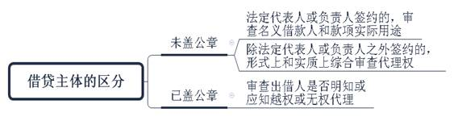
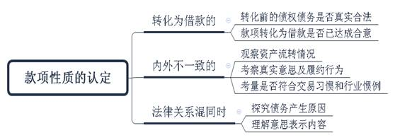
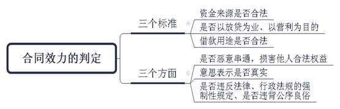
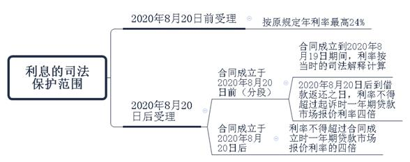
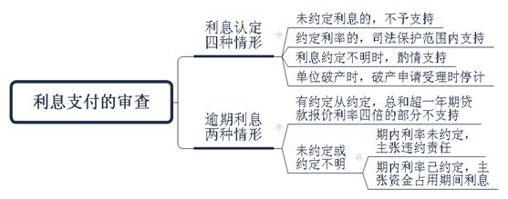

### **企业借贷纠纷案件的审理思路和裁判要点**

企业借贷纠纷，是指法人、非法人组织（以下简称单位）之间融通资金产生的纠纷，但不包括经金融监管部门批准设立的从事贷款业务的金融机构及其分支机构因发放贷款等相关金融业务引发的纠纷。与自然人间多基于人情往来以借贷方式互帮互助不同，作为商事主体的单位一般有偿出借款项，收取资金占用费以补偿收益损失，又因不具备放贷资质而有别于金融机构，不以贷款业务为业，相互间的资金拆借行为仅为满足生产经营的需要。结合企业借贷的临时性、期限短、次数少等特征，本文围绕企业借贷主体的特殊性，以典型案例为基础，对企业借贷纠纷案件的审理思路和裁判要点进行梳理、提炼和总结。

**一、典型案例**

**案例一：涉及借款主体的认定**

A公司和B公司签订《借款协议》，载明B公司向A公司借款80万元用于某项目。协议指定B公司名下账号收款，程某在落款B公司处签名。A公司按约汇款并载明款项用途为“借款”。另有A公司和B公司某项目部签订的《补充协议》，程某亦在B公司某项目部落款处签名。后A公司未收到还款，起诉主张B公司还本付息，并列程某为第三人。B公司否认程某的代理人身份，亦否认与A公司存在借贷关系。

**案例二：涉及款项性质的认定**

C公司从D公司、E公司、F公司处购买货物，支付货款后再与三公司签订多份《购销合同》，约定以高价向三公司出售型号、规格、数量相同的货物。经各方对账，三公司对尚欠C公司的具体款项金额予以确认。后C公司以三公司逾期未付货款为由提起诉讼。三公司辩称涉案合同系名为买卖实为借贷的融资性合同，故不应支付货款，仅需还本付息。

**案例三：涉及合同效力的认定**

G公司的经营范围不包括金融放贷业务。G公司与H公司签订《贷款合同》约定：H公司为流动资金周转向G公司贷款3000万元，期限2天，年利率为15%；其余条款格式和内容与金融机构格式化贷款合同类似。后H公司逾期未还贷款，G公司提起诉讼。H公司辩称G公司无权从事金融业务，贷款合同应属无效。

**二、企业借贷纠纷案件的审理难点**

**（一）借款主体认定难**

审判实践中，由于一些单位管理不规范，借款合同上加盖非备案公章、项目部章、假章，未盖章仅个人签名，载明的借款人、款项用途与实际收款人、款项用途不一致等情形屡见不鲜。当出借人主张还款时，相关单位往往以此为由辩称其并非借款主体。法院一般结合签名人担任的职务或其与单位的关系等具体案情综合认定借款主体。因考量因素和判断标准尚未明确统一，借款主体的认定是审理此类案件的一大难点。

**（二）款项性质认定难**

企业借贷纠纷案件中，借贷双方往往就收付款项的性质意见不一，继而就是否达成借贷合意产生争议。2020年12月修订的最高法院《关于审理民间借贷案件适用法律若干问题的规定》第14至16条对款项性质认定和举证责任分配作了规定，但未细化借贷合意的具体认定标准。在单位的财务和管理制度不完善、实际操作不规范、书面借款合同缺失的情况下，如何准确认定借贷合意，将借款与货款、工程款、合作款等其他性质款项相区分较为困难。

**（三）合同效力认定难**

单位间让渡使用闲置资金并获取合理收益，是一种良性的资金互助形式，也是解决短期资金紧缺的有效途径，但若无有效规制，则易出现职业放贷和高利放贷的现象，从而扰乱金融市场秩序。审判实践中，借款人经常以出借人超出经营范围、经常性放贷、高利转贷违法为由主张借款合同无效。虽然《民法典》第146、153、154条，《民间借贷若干问题的规定》第13条，《九民会纪要》第52、53条对认定借款合同无效的具体情形予以规定和说明，但如何根据具体案情准确理解与适用，实践中较难把握。

**三、企业借贷纠纷案件的审理思路和裁判要点**

面对单位融资难、融资贵等问题，法院应当鼓励合法合规的企业借贷，支持降低交易成本的交易模式，促进民间资本为实体经济服务。审理企业借贷纠纷案件时，**法院既要在司法保护限度内支持出借人的主张，以保障单位多渠道使用资金的权利，又要否定高利转贷和职业放贷的效力，防范化解金融风险，维护金融市场秩序**。

**（一）借款主体的考量因素**

单位借款需由自然人代为洽谈并实际操作，发生争议时可结合合同内容、经办人员身份和盖章签名等情况认定借款主体。

**1****、未加盖单位公章，签约人为单位法定代表人或负责人的，应重点审查款项用途**

法定代表人或负责人既可代表单位又可代表个人作出借款行为。审理中，法院可结合款项用途认定借款主体是单位还是个人。根据《民间借贷若干问题的规定》第22条规定，法定代表人或负责人以单位名义借款的，原则上由单位还款，但若款项用于个人生活或消费，出借人可将法定代表人或负责人列为共同被告或第三人。法定代表人或负责人以个人名义借款，所借款项用于单位生产经营的，出借人可请求单位与个人共同承担责任。

**2****、加盖单位公章但单位否认公章效力，或未加盖单位公章但单位否认签约人代理权的，应重点审查代理权限**

法定代表人或有代理权限的人在借款合同上加盖单位公章，表明其是以单位名义借款，除出借人明知或应当知道签约人越权或无权代理等情形外，应由单位承担法律后果。借款合同上未加盖单位公章的，应重点审查签约人与单位的关系及代理权限。若单位否认签约人的代理权限或签约人代理权限不明的，法院可从形式和实质两个方面进行审查。

**形式上**，法院可审查名义借款人身份、约定款项用途、签约人披露的身份、签约人与单位的关系、盖章情况。若名义借款人是单位或其下属部门，合同上载明借款用于单位经营或生产，签约人明示借款行为系职务行为或曾出现在涉案项目工地，合同上加盖项目部章或由项目负责人签字确认，出借人也曾核实签约人身份和代理权限等，一般可认定单位为借款主体。反之，应从实质上进一步审查，不能仅因此否定单位为借款主体。

**实质上**，法院可审查借款所涉单位或项目是否实际存在，签约人是否曾对外代表单位签订类似合同或办理款项结算事宜，款项是否实际转入单位账户或虽未转入单位账户却最终用于单位生产经营。如经审查符合上述条件，法院宜认定单位为借款主体。

如案例一中，根据A公司提供的证据，程某曾对外代表B公司列席相关会议并签字、在B公司函件中代公司签字，可认定其为B公司某项目负责人并构成表见代理。此外，本案合同约定和实际收款人均为B公司，所涉项目实际施工方也是B公司。因此，法院认定B公司为借款人，判决支持A公司的全部诉请。

**（二）款项性质的审查要点**

实践中，单位间可能存在买卖、建设工程、运输、合伙投资等多种法律关系，即便双方签订书面合同或收款方出具收款凭证，亦可能因往来较多而难以区分款项性质。此类案件中的借款可能由货款、工程款、运费、合作款等其他性质款项转化而成，也可能借用其他性质款项的名义或与其他性质款项混杂，并因此引发纠纷。

审判实践中，法院应着重审查单位间是否达成借款合意。借款合意体现在内心意思和外部表示两个方面，内心意思一般通过外部表示显现出来。现就审判实践中经常出现的三种情况，从不同角度综合判断借款合意是否成立：

**1****、付款方主张借款合意是在双方就货款、工程款等其他性质款项协商时达成，借款由其他性质款项转化而成的**

**（****1****）审查转化前的法律关系**

款项性质转化前提是转化前的金钱债务对应的基础法律关系真实合法。对此，法院可要求当事人提供合同、履行情况等证明材料，以判断转化债务性质的动机是善意的固定债权债务金额还是逃避责任或掩盖非法目的。

**（****2****）审查借款合意的形成**

当事人以“借据”等形式对其他基础法律关系形成的债务进行更新、产生新债务时，应就新债务为借款达成合意并予以明确，否则无法完成款项性质的转化，法院对此应着重审查。

**2****、付款方主张内心意思和外部表示不一致，即付款方主张款项性质名为其他性质款项实为借款的**

部分单位为融资签订虚假的买卖、投资等合同，约定一方仅提供资金，不实际收货、不承担投资风险、不参与单位管理，另一方保证在一定时间内返还款项且按一定利率支付收益，并将货物、房产等实体资产作为融资的担保资产。此时，法院应结合合同约定、双方陈述及实际履行情况，参考市场上常见的交易模式，探寻双方的真实意思表示。具体可从以下三个方面审查：

**（****1****）审查交易模式下资产流转状态**

若货币转移一定期限后再次回转至原权利人名下且款项金额有所增加，实物资产权利暂时转移最终又返还原权利人，一般应认定双方合意为通过出借款项获取利息收入或将实物资产作为融资担保，增值部分实为利息，双方的意思表示实为建立借贷关系。

**（****2****）审查缔约的真实意思及履约行为反映的合同目的**

每个单位均有经营范围和运营资本，其对外的交易行为和目的一般应与经营范围和能力相符。若购买货物的类型、标的、数量与单位日常生产经营严重不符，合同约定货物无需实际交付购买方而是层层转售给下家，且价格略有提高等，则应重点审查合同的真实目的是否为借贷。

**（****3****）审查合作模式是否符合交易习惯和行业惯例**

买卖货物、房产通常是为了生产消耗和生活居住，而投资、合伙项目是为了获取机会利益。相关交易内容一般会在合同中载明，且客观存在相应生产生活的需要或项目运营的实体。部分单位将上述合同所涉标的打包转售、转移债权债务，则明显不符合交易习惯和行业惯例，应考虑该类合同实为借贷合同。

如案例二中，C公司以低价从D、E、F公司处购买货物，经多层转售，最终又将同一批货物加价出售给这三家公司。虽然C公司与之签订的均为《购销合同》，合同中约定了货物名称、价格、交货时间和违约条件等，形式上符合买卖法律关系的基础要件和特征，但从多份合同的交易对象、交易模式及实际履行情况来看，各公司就相同型号、数量的货物形成连环买卖关系，仅有C公司的付款行为，各公司间却无实物交付，实质上不符合买卖合同特征。C公司的真实意思是借买卖合同之名出借资金，通过销售差价收取利息，即名为买卖实为借贷。

**3****、借贷关系与其他法律关系发生混同的**

**（****1****）债务产生原因**

借款债务基于借款事实产生，出借方应已实际出借款项。其他债务基于买卖、建设工程等基础法律关系，应重点审查是否签订相应合同，一方是否已履行实际交货、提供服务等合同义务，另一方是否已实际支付对价，即债务产生的基础事实是否真实存在。一方主张已实际支付对价的，应审查款项交付细节；若查明情况属实，另一方应作出合理解释，否则其借贷的意思表示缺乏行为载体，不应得到支持。此外，当双方之前从未有过业务往来，又无书面借款合同，一方主张借款而另一方否认时，法院应重点审查款项支付背景和借款合意过程。

**（****2****）意思表示内容**

对当事人真实意思表示的发现有赖于法院对在案证据的全面审查。借款的形式主要体现为借条、借据，真实的借款合意内容一般应包括本金、利息计算方式、还款期限等。若借条、借据等证据所载内容仅包括还款日期和金额，款项性质、利息计算方式和出借日期等均未约定或约定不明，则法院应结合争议双方之间的关系及收付款项的用途、流转情况等进行综合判断。

例如，母子公司、关联公司之间多为控股、投资关系，为逃避税收或实现资金在集团内部流转，付款方的账户往往被控制或受指示向收款方划转大量资金。此时，付款方主张该款为借款的，法院应着重审查双方实际控制情况、款项流转时间和方向、转账凭证注明的用途和催讨情况，若有异常应加重付款方的举证责任，若付款方无法合理解释和说明，则应承担举证不能的法律后果。

**（三）合同效力的审查要点**

二十世纪九十年代，相关法规和政策通过对非法金融活动的取缔，间接认定企业借贷无效。随着司法理念的转变和一系列法律法规的颁布实施，法院对企业借贷的效力认定转变为原则上有效、特殊情形无效。实践中，法官需深入理解相关法律法规，准确适用合同无效的相关条款，审慎判断合同效力，重点把握三个标准并审查三个方面：

**1****、三个标准**

**（****1****）资金来源是否合法**

企业借贷中，出借人的资金必须是自有资金。出借人通过套取金融机构信贷资金、向其他营利法人借贷、向本单位职工集资或者向公众非法吸收存款等方式取得资金进行转贷的，不仅增加了真正需要资金的企业融资成本，也扰乱了金融监管秩序。根据《民间借贷若干问题的规定》第13条第1、2项规定，应认定此类民间借贷行为无效。

针对上述情况，法院在审查合同效力时应注意把握以下几点：**第一**，借款人能够举证证明在签订借款合同时出借人尚欠银行贷款未还的，一般可推定出借人套取信贷资金，但出借人能够反证予以推翻的除外。此时，法院还应综合考虑出借人的贷款用途、出借人的金融贷款与用于出借的款项是否可以区分等因素。**第二**，判断案涉款项是否为出借人向其他营利法人借取，可结合出借人内部财务报表、资金流动情况和对外涉诉情况综合认定，出借人能够作出合理解释并有相关证据予以佐证的除外。**第三**，向本单位职工集资所获取的款项应专款专用，虽然此类款项来源合法，但若为单位挪用并转贷，则会导致借贷合同无效。**第四**，判断是否构成向公众非法吸收存款，可从吸收存款数额、资金来源主体数量和造成存款人直接经济损失金额三个方面综合审查。

**（****2****）出借人是否以放贷为业、以营利为目的**

向社会不特定对象提供借款是金融机构的业务范围，属于金融监管体系范畴。单位作为生产经营主体不具备放贷资格，相互间的资金拆借具有临时性和偶然性。若单位以此为业，向社会不特定对象提供借款，并将放贷收入作为主要收入来源，则可能导致单位的主营业务由生产经营转变为专门从事放贷，变相逃避金融监管从而扰乱金融秩序。此种情况下，出借人可被认定为职业放贷人，借贷行为和合同应依法认定无效。实践中，同一出借人在一定期间内多次反复从事有偿民间借贷行为的，一般可认定为职业放贷人。对此，法院可结合本地区的经济发展情况、单位的注册资本、经营能力、资金流转情况、放贷金额和频率、利息约定、借贷收益占企业收入比例、借贷主体关系等综合认定。

正常企业间借贷一般是在一方自有资金宽裕、另一方资金困难或生产经营急需的情况下发生，既可缓解单位资金压力，又可提高资金利用效率实现单位间互利互助，而并非以营利为目的。部分单位由于怠于发展实业，利用自己的资金优势，以营利为目的向社会不特定对象提供借款并借此获取高额利息，不仅违背企业借贷的初衷，也因脱离市场监管而扰乱正常的金融秩序。根据《民间借贷若干问题的规定》第13条第3项规定，应认定此类借贷合同无效。法院认定出借人是否以营利为目的，应结合出借人资金成本、借款利率和计算方式等综合审查。

**（****3****）借款用途是否合法**

企业借贷中，若借款人借款目的是为了从事黄赌毒等违法活动，出借人对此事先明知或应当知道仍提供借款并与之签订借贷合同的，根据《民间借贷若干问题的规定》第13条第4项规定，应认定为无效。

**2****、三个方面**

除了上述三个标准外，法院还应着重审查以下三个方面：

**第一**，审查借贷双方是否恶意串通，损害他人合法权益。恶意串通损害他人合法权益的，该借贷行为无效。**第二**，审查借贷双方实施借贷行为的意思表示是否真实。意思表示虚假的，借贷合同无效，应依照相关法律规定认定隐藏的民事法律行为效力。**第三**，审查借贷合同是否违反法律、行政法规的强制性规定、是否违背公序良俗。对于“强制性规定”的性质，法院应在考量保护的法益类型、违法行为的法律后果及交易安全保护等因素的基础上审慎认定。若违反规章一般情况下不影响合同效力，但该规章的内容涉及金融安全、市场秩序、国家宏观政策等公序良俗的，应当认定借贷合同无效。法院在认定规章是否涉及公序良俗时，要在考察规范对象基础上，兼顾监管强度、交易安全保护以及社会影响等方面进行慎重考量。

如案例三中，根据《民法典》第153条规定，综合借款合同内容类似金融机构格式化贷款合同、出借人在一定时期的资金出借行为经常反复、借款目的具有营利性、出借人经营范围等因素，G公司与H公司签订的《贷款合同》因违背涉及金融安全、市场秩序等公序良俗而无效。H公司仅需归还收到的款项及合理的资金占用费，无需支付高额的利息。

**（四）利息支付的审查要点**

利率问题是民间借贷纠纷的核心问题。因借贷主体为企业，企业借贷纠纷中利率标准的审查标准和依据与自然人借贷纠纷略有不同，应注意区分、准确把握。根据《民间借贷若干问题的规定》第31条规定，该规定施行后法院新受理的一审民间借贷纠纷案件应遵循以下审查标准：

**1****、未约定利息的，不予支持**

根据《民法典》第680条第2款、《民间借贷若干问题的规定》第24条第1款规定，借款合同对支付利息没有约定的，视为没有利息；出借人主张支付利息的，法院不予支持。

**2****、利息约定不明的，可酌情支持**

根据《民法典》第680条第3款、《民间借贷若干问题的规定》第24条第2款规定，借款合同对支付利息约定不明确，出借人主张支付利息的，法院应结合民间借贷合同内容，并根据当地或当事人的交易方式、交易习惯、市场利率等因素确定利息；自然人间借贷的，视为没有利息。审判实践中，由于融资成本的客观存在，法院一般会支持单位主张的资金占用损失。

**3****、明确约定利率的，在司法保护范围内予以支持**

根据《民间借贷若干问题的规定》第25、31条等相关规定，借贷合同中明确约定利率的，应结合案件受理和借贷合同成立时间综合认定：

**第一**，2020年8月20日前受理的一审案件，利率标准按原规定执行，年利率最高可为24%。

**第二**，2020年8月20日后受理的一审案件，若借贷合同成立于2020年8月20日之前，可分段计息。当事人请求适用当时的司法解释规定计算自合同成立至2020年8月19日的利息部分，法院应予支持；对于自2020年8月20日至借款返还之日的利息部分，应适用起诉时规定的利率保护标准计算，即不得超过起诉时一年期贷款市场报价利率四倍。若借贷合同成立于2020年8月20日之后，利率不得超过合同成立时一年期贷款市场报价利率四倍。

**第三**，上述“一年期贷款市场报价利率”是指中国人民银行授权全国银行间同业拆借中心自2019年8月20日起每月发布的一年期贷款市场报价利率。

**4****、关于逾期利息，区分不同情况处理**

根据《民间借贷若干问题的规定》第28、29条规定，逾期利息的审查应区分以下两种情况：

**第一种情况**，逾期利率有约定的从约定，但以不超过合同成立时一年期贷款市场报价利率四倍为限，超过部分不予支持。既约定逾期利率，又约定违约金或服务费、咨询费、管理费、会员费等其他费用的，出借人可以选择主张，亦可一并主张，但总计以合同成立时一年期贷款市场报价利率四倍为限，超过部分不予支持。

**第二种情况**，逾期利率未约定或约定不明的，若借期内利率亦未约定，出借人主张借款人自逾期还款之日起参照当时一年期贷款市场报价利率标准计算的利息承担逾期还款违约责任的，法院应予支持；若已约定借期内利率，出借人主张借款人自逾期还款之日起按照期内利率支付资金占用期间利息的，法院应予支持。

**5****、单位破产时，借款利息自破产申请受理时停止计算，担保债务亦应停止计息**

法院受理破产申请后，根据《企业破产法》第46条规定，未到期的债权在破产申请受理时视为到期，附利息的债权自破产申请受理时起停止计息。鉴于担保合同属于从合同，担保人承担的责任应以主债务为限，故担保债务亦应停止计息，保障担保人的合法权益。

**（五）举证责任的审查要点**

企业借贷中，部分单位管理不规范或出于信任未签订书面合同，部分单位虽签订书面合同但约定内容不明确或未按约履行的，诉讼中双方易就借款主体、款项性质和合同履行情况等发生争议，对此法院应合理分配举证责任。

**1****、初步举证责任分配**

根据“谁主张谁举证”的诉讼规则，出借人向法院提起借贷诉讼时，应就借贷关系的成立承担初步举证责任。根据《民间借贷若干问题的规定》第2条规定，出借人应提供借据、收据、欠条等债权凭证以及其他能够证明借贷法律关系存在的证据。

为保护当事人的诉权，现行法律法规对出借人的举证责任程度要求不高，债权凭证内容达到可反映债权债务关系存在即可，表现形式除了借据、收据、欠条，还包括转账单、债权债务结算单、债权债务汇总凭证、委托理财合同、名为买卖实为借贷的合同等。除债权凭证等书证外，证据形式还包括当事人陈述、视听资料和电子数据等，亦仅需初步证明借贷法律关系存在即可。需要注意的是，即使债权凭证未载明债权人，持有人也可据此提起诉讼。在被告对持有人的债权人资格提出抗辩并提供事实依据的情况下，法院经审查认为原告不具有债权人资格的，应裁定驳回起诉。

**2****、举证责任的转移**

原告依据债权凭证等提起借贷诉讼后，被告的抗辩理由主要有两种：一是否认存在借贷关系，认为债权纠纷并非借贷行为引起，双方之间另有其他基础法律关系，并提供相关合同、对账凭证、承诺函等证据。二是未否认存在借贷关系，但辩称借贷行为未实际发生或已偿还借款并提供还款凭证等证据。

**对于第一种情况**，法院应依法审查被告提供的证据是否达到法定证明标准，是否足以动摇法院对原告举证所形成的内心确信，以至于原告达不到证明借贷关系成立的最低要求。因此，被告只需提供证据证明原告主张的债权债务纠纷由借贷行为引起这一事实不确定即可。至于双方之间系何种法律关系，由法院综合双方提供的证据加以认定，并按照基础法律关系进行审理。

**对于第二种情况**，法院应重点审查原告的款项交付情况。若原告可提供转账凭证或其他交付凭证并作合理说明，足够证明款项已实际交付，被告的该项抗辩不成立；若原告主张现金交付，法院可结合债权凭证的行文内容、借贷金额、当事人的经济能力、当地或当事人间的交易方式、交易习惯、财产变动情况等因素综合认定。被告主张已偿还借款的，在被告提供相应证据证明其主张后，原告仍应就借贷关系的存续承担举证责任；若提供的证据不足以证明其主张，法院不予采纳。

在没有债权凭证等其他证据、原告仅依据金融机构转账凭证提起诉讼的情况下，鉴于出借人对于借贷关系的证明存在困难，法院可认定此时出借人对借贷关系完成初步举证。被告应对收到款项的性质作出合理说明，若其主张原告的转账系偿还双方之前借款或其他债务，应提供相应证据证明。当该证据足以证明其主张时，举证责任转移至原告，原告需就借贷关系的成立进一步举证，否则应承担举证不利的法律后果。

**（六）特殊的借贷形式——委托贷款**

委托贷款是企业借贷的一种特殊形式，是指出借人（委托人）提供资金并确定贷款对象、用途、金额、期限、利率等，委托银行等金融机构（受托人）代为发放、监督使用并协助收回贷款的借贷形式。一方面，委托贷款由金融机构代为放贷，属于国家金融监管范畴；另一方面，出借人作为委托人实际享有贷款利息收益，且承担借款人不还款或逾期还款等风险。委托贷款兼具金融借款与民间借贷的部分特点，审查时应注意以下几个方面：

**1****、诉讼主体资格**

根据《民法典》第925条规定，受托人以自己的名义，在委托人的授权范围内与第三人订立的合同，第三人在订立合同时知道受托人与委托人之间的代理关系的，该合同直接约束委托人和第三人；但是，有确切证据证明该合同只约束受托人和第三人的除外。由此可见，除了受托人可根据委托贷款合同向法院起诉借款人之外，在借款人签订合同时知道委托代理关系的，委托人也可作为诉讼主体参加诉讼。 

**2****、权利义务责任**

**（****1****）对外责任**

委托人、受托人和借款人签订的委托贷款合同为主合同，受托人和担保人为主合同项下的债务履行签订从合同即担保合同。担保人在订立担保合同时知道委托人和受托人间代理关系的，在没有确切证据证明担保合同只约束受托人的情况下，担保合同效力及于委托人。委托人和受托人均有权就登记在对方名下的抵押物主张优先受偿或要求担保人向其承担担保责任。

**（****2****）对内责任**

委托人实际承担借款人不还款或逾期还款的风险。受托人同意委托人的请求，就借款人履行委托贷款合同约定义务向委托人作出连带责任保证承诺并出具保函的，该保函依法有效，受托人应承担保证责任。此外，有偿的委托贷款合同中受托人应尽到注意义务，若未按正常程序规范办理手续、存在过错，并给委托人造成损失，其应承担赔偿责任。

**3****、利息标准**

鉴于委托贷款根据委托人意志确定合同主要条款，委托人享有贷款利息收益等合同主要权利，且委托贷款与民间借贷在资金来源相同的基础上亦可推定其资金成本大致等同，法院在确定委托贷款合同的利率上限时可参照民间借贷的相关规则，对不高于法律保护利率水平的应予认可。若合同约定受托人就委托贷款向借款人提供财务顾问服务并收取相应费用，只要该服务真实有效，借款人主张已支付的服务费作为贷款利息予以抵扣的，法院不应予以支持。

**4****、委托贷款关系的转化**

合同约定还本付息期限届满的情况下，当事人约定将委托贷款关系转为一般借贷关系，此时金融机构不再担任受托人。此种转化并未实质改变借贷关系的当事人，也未改变借款合同的权利义务关系，不会导致主债权或从权利的消灭。

**四、其他需要说明的问题**

本院已发布的《自然人之间民间借贷案件的审理思路和裁判要点》所涉自然人借贷与企业借贷相同之处，如款项交付的认定、“砍头息”的处理、虚假诉讼和套路贷的识别等问题，本文不再赘述。企业借贷合同纠纷原系借款合同纠纷案由下的子案由，2021年1月修订后施行的《民事案件案由规定》已删除该案由，但该类案件客观存在，对其进行梳理总结有助于提升该类案件的审判质量。

（根据商事庭郑军欢、刘洁提供材料整理）