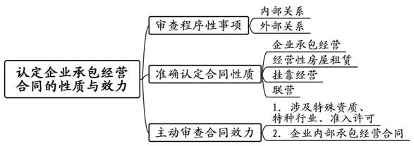
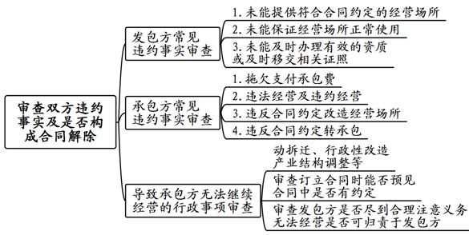
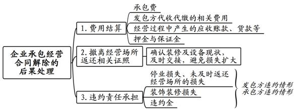

### **企业承包经营合同纠纷案件的审理思路和裁判要点**

企业承包经营合同纠纷，是指法人之间、法人与自然人之间在不改变企业所有权权属的情况下，按照所有权与经营权相分离原则由承包方对企业进行经营管理过程中产生的合同纠纷。企业承包经营起源于国有企业改革，随着经济发展与经营需要，广泛运用于交通运输、快递物流以及酒店餐饮服务等各个行业。企业承包经营合同在《民法典》合同编中没有明确规定，属于无名合同。实践中，该类案件主要涉及第三产业，在合同性质及效力认定、违约事实认定和合同解除后果处理等方面存在较大争议。现以典型案例为基础，对企业承包经营合同纠纷案件的审理思路和裁判要点进行梳理、归纳和总结。

**一、典型案例**

**案例一：涉及合同性质及效力的认定**

A公司与B公司签订联合生产经营合同，约定A公司给B公司提供厂房，双方联合经营；B公司使用A公司的危险品生产许可证、营业执照等资质进行采购、生产、经营、运输，B公司不再另行申请；B公司实际承包经营合作生产项目，向A公司支付承包经营费。A公司取得安全生产许可证等相关证件后多次通知B公司安排生产，但B公司未予回复，故A公司请求解除合同。

**案例二：涉及合同履行过程中违约事实及解除情形的认定**

周某与C公司签订承包经营合同，由周某承包经营C公司的网吧，网吧所在经营场所系C公司从D公司处租赁。后D公司以物业中心名义向C公司发出腾房通知，并强行断水断电导致周某无法继续经营网吧。周某认为C公司以欺诈手段骗取其签订承包经营合同，隐瞒涉案经营场所的真实租赁情况且未能保证其正常经营，构成根本违约，故诉请解除合同、返还承包费、赔偿损失。C公司认为周某签订合同时已明知涉案经营场所系租赁，周某未尽到相关注意义务，C公司并未构成违约。

**案例三：涉及合同解除的时间确定及后果处理**

E公司与F公司签订酒店承包经营合同，约定E公司将有经营使用权的酒店承包给F公司独立经营，同时提供酒店正常经营所需的营业执照、餐饮服务许可证等。后E公司向F公司发出通知称因F公司长期拖欠支付承包费、未经许可增加经营项目等违约行为要求解除合同。F公司以E公司未按约办理消防证照致其无法正常经营为由要求解除合同。

**二、企业承包经营合同纠纷案件的审理难点**

**（一）合同性质及效力认定难**

企业承包经营的模式较为多样，发包方与承包方之间通常签订承包经营合同以明确合作方式、承包费金额及支付方式、经营场所、违约条款及赔偿责任等。实践中，企业承包经营与租赁、挂靠、联营、合伙等模式存在一定的交叉和模糊之处，法律也没有进行明确界定，因此对企业承包经营合同的性质认定存在一定难度。其中，如果承包经营涉及某些特殊行业、准入许可等情形，则企业承包经营合同可能因违反法律法规强制性规定而无效，因此对企业承包经营合同的效力认定亦存在一定难度。

**（二）合同履行过程中违约事实及解除情形认定难**

企业承包经营合同纠纷案件中，发包方与承包方通常就拖欠承包费、未提供经营所需证照等违约事实争议较大。法院对双方合作期间实际履约情况及违约事实的审查存在较大困难。在审理中，双方的争议焦点主要集中在哪一方构成违约并导致承包经营合同解除。当事人的违约行为是否属于足以导致合同解除的根本违约行为，真正导致合同解除的事由如何认定，在此类案件的审理中较难把握。

**（三）合同解除的时间确定及后果处理难**

企业承包经营合同系继续性合同。实践中，对于当事人是否具有合同解除权、合同是否已经解除、合同解除的时间点如何确定等往往存在较大争议。承包经营合同解除后，发包方通常会诉请要求承包方支付承包费、返还经营场所、恢复原状并承担违约责任，而承包方通常抗辩合同解除系因发包方违约导致，其应承担违约责任并赔偿损失。实践中，如何确定合同解除时间并对解除后果作出恰当处理，往往成为此类案件的难点。

**三、企业承包经营合同纠纷案件的审理思路和裁判要点**

审理此类案件时，**法院应当注重处理好发包方与承包方之间的关系，平衡保护企业承包经营合同双方当事人利益，发挥承包经营在促进经营方式灵活化、多样化方面的功能**。具体而言，法院应依据《民法典》合同编以及相关有名合同的规定，重点审查企业承包经营合同当事人之间的约定，厘清合同双方约定的权利与义务，确定合同的性质与效力。在查明合同实际履行情况后，认定合同双方在履行过程中是否存在违约及过错程度，并对承包经营合同是否应予解除或继续履行、何时解除，以及合同解除后承包经营场所及财产返还、相关费用结算、违约责任承担及损失赔偿等事项进行处理，实现双方当事人之间利益的平衡与救济。

**（一）认定企业承包经营合同的性质与效力**

**1****、****区分内部与外部关系**

审理此类案件时，首先应注意区分内部关系与外部关系。“内部关系”，是指企业承包经营合同双方即发包方与承包方之间的权利义务关系。对于当事人提出追加公司法定代表人为诉讼当事人并要求其承担连带责任的，法院应审查法定代表人在企业承包经营合同实际履行中的行为是否属于职务行为。若属于职务行为，则无需追加公司法定代表人作为承包经营合同关系的主体。

所谓“外部关系”，是指承包经营期间，承包方以发包方名义对外签订合同产生的债权债务关系。原则上应由发包方对外承担责任，发包方承担责任后可以根据企业承包经营合同的约定向承包方追偿。需要注意的是，外部主体起诉发包方要求清偿债务的案件不属于企业承包经营合同纠纷，应当另案处理。

**2****、准确认定合同性质**

企业承包经营、经营性房屋租赁、挂靠经营、联营等经营模式一般均以发包方（出租方、被挂靠方、联营体）的名义对外经营，上述模式之间存在一定的交叉与模糊之处，实践中应准确认定合同性质。一般而言，合同当事人签订名为“企业承包经营合同”或其他类似合同，约定当事人将企业营业执照及经营场所交给相对方，同时将企业经营权、资产或从业人员交给相对方管理，并收取相应承包费用的，此类合同性质应认定为企业承包经营合同。

需要注意的是，在经营性房屋租赁中，当事人签订的合同一般为租赁合同，合同的核心内容应为场地使用权的移转，因其中亦涉及营业执照等相关证照的办理，故该类合同同时包含证照使用或借用、房屋租赁两部分内容。对此，法院应根据合同当事人的陈述，审查在合同订立及履行过程中，双方的真实意思表示以及对合同性质的理解，并结合合同实际履行情况审查是否符合企业承包经营法律关系的特征。

**3****、主动审查合同效力**

在认定涉案合同属于企业承包经营法律关系后，法院需主动审查合同效力。审查时，法院应特别注意企业承包经营合同所涉行业有无涉及国家限制经营、特许经营、特殊资质、特殊准入许可等情况。在部分实施从业准入的行业中，只有具备特殊资质的企业或个人方能开展经营业务，没有资质的主体往往采用承包经营的方式进行经营。如果法律对于特殊资质及特殊准入许可行业有相关强制性规定，则此类企业承包经营合同因违反法律强制性规定而无效。

如案例一中，A公司与B公司签订联合生产经营合同，约定B公司使用A公司的危险品生产许可证及营业执照进行生产经营，因违反《安全生产法》的强制性规定，该合同应认定为无效。

值得注意的是，在企业承包经营合同中，营业执照及其他相关证照如餐饮服务许可证的移交属于履行承包经营合同的正常行为，应与借用特殊资质的挂靠经营区分开来。一般而言，承包方以发包方名义、使用发包方证照经营且不涉及借用特殊资质的，企业承包经营合同应为有效。

企业承包经营合同还包括企业内部承包经营合同，是指企业与员工之间就企业经营目标和责任达成的承包协议，一般是企业所有者（总公司）将企业中的一个项目、部门或分支机构（分公司）发包给企业员工，类似于岗位责任制。实践中，此类合同订立的名称通常为“经营目标责任考核协议”，约定承包方遵守公司相关目标考核制度并负责承包项目或分支机构的经营与管理。该类合同的实质是企业内部管理合同，只要不违反劳动法及其他法律法规，一般宜认定合法有效。

**（二）审查双方违约事实及是否构成合同解除情形**

企业承包经营合同纠纷案件中，双方当事人往往认为对方存在违约行为导致合同解除。因此，对于违约事实及是否构成合同解除情形的审查，是查清此类案件事实的关键所在。

实践中，企业承包经营合同的必要条款主要包括：双方主体及承包经营期限、发包方及承包方的权利和义务、承包经营的方式和内容、承包所得收益的分配方式、承包经营期间对于原有人员的安排、劳动管理、违约责任、损失赔偿、相关资产设备的清点及移交程序等。法院应首先审查涉案企业承包经营合同的具体约定，再以此为基础审查合同履行过程中双方是否遵守合同约定。

**1****、****发包方常见违约事实审查**

**（****1****）未能提供或未及时移交符合约定的经营场所**

发包方应提供符合承包经营合同约定的经营场所并及时移交给承包人，以实现承包经营的合同目的。实践中，发包方常见违约情形包括未及时移交提供经营场所，或虽提供经营场所但质量上存在瑕疵，导致承包方实际经营存在困难。

**其一**，发包方未按合同约定及时移交经营场所，属于迟延履行合同义务。若无证据证明双方就迟延移交达成一致意见，则发包方构成违约。若发包方经催告后在合理期限内提供了符合合同约定的经营场所，那么对于合同的实际履行不会产生根本性影响，不足以导致合同目的不能实现。对于迟延交付造成承包方损失的，承包方可以主张发包方赔偿损失。

**其二**，在经营场所存在质量问题时，法院应审查是否因质量问题导致承包方实际无法经营。如果仅涉及行政罚款、整改等情形，对承包经营不构成根本影响，则属于瑕疵履行，对于合同目的实现不构成根本性影响。因此，对于承包方以此为由认为发包方构成违约并要求解除合同的，法院应不予支持。

**（****2****）未能保证经营场所正常使用**

发包方作为经营场所的提供者，理应对其实际情况明确知晓，并应保证经营场所正常使用不受第三方干涉。实践中多发生房屋租赁合同到期、动拆迁、行政性改造项目或产业结构调整等情形，导致经营场所无法继续使用。如果发包方提供的经营场所系从第三方租赁，合同双方对租赁期间与承包经营期间均应负有合理的注意义务，双方应了解经营场地的租赁期限能否保证经营场所在承包期内正常经营。若租赁期限早于承包期届满导致承包方未能正常经营，承包方应采取有效措施减少损失。由此造成承包经营合同未能正常履行的，双方均存在过错，不能单纯认定发包方违约。

如案例二中，承包经营合同签订时周某已了解涉案经营网吧的租赁期限早于承包期届满，且在收到业主发送的告知书要求将房屋腾空并返还时，周某应当知道无法继续经营。然而周某未采取任何措施减少损失，仍然继续经营，故周某与C公司均存在过错。在结算承包费时，法院应考虑双方的过错程度及实际承包情况酌情予以认定。

**（****3****）未能及时办理有效资质或及时移交相关证照**

承包经营涉及的行业非常广泛，较为常见的包括服务业、建筑业等，在实际经营中需要相关证照，包括餐饮服务许可证、食品生产经营许可证、消防安全检查合格证、公共场所卫生许可证等。承包经营合同中已约定相关证照办理义务的，应按照约定进行审查。

如果合同已明确发包方办理、移交相关证照的具体期限，法院应审查发包方是否在约定期限前办理或移交证照。承包方举证证明因发包方怠于办理、移交相关证照对其实际经营造成严重不利影响。例如被行政执法机关作出责令罚款和停业等行政处罚的，发包方构成违约。需要注意的是，承包方明知自承包时起就没有相关证照，在经营期间亦未提出异议，在合作无法继续进行时以合同目的无法实现为由要求解除合同的，法院不应予以支持。

**2****、承包方常见违约事实审查**

**（****1****）拖欠支付承包费**

按约定支付承包费是承包方最基本的合同义务之一。承包费作为承包方获得承包经营权的对价，除发包方责任导致无法经营外，不论实际经营与否、实际盈利与否，承包方均应按时支付。未按约定及时支付承包费即构成违约。实践中，法院应审查承包方是否具有正当抗辩理由，包括发包方未办理相关证照、未保证经营场所正常使用等，但上述事由应由承包方举证证明。如承包方未能充分举证，则其拖欠支付承包费的行为仍构成根本违约。

**（****2****）违法经营及违约经营**

承包方应按照企业承包经营合同约定的经营方式及法律规定开展承包经营。若承包方在经营场所进行违法犯罪活动或超出营业执照规定的经营范围，导致经营场所受到吊销营业执照或停业整顿等行政处罚的，则承包方构成根本违约，发包方有权要求解除合同。

**（****3****）违反合同约定改造经营场所**

承包方对于经营场所的使用应符合合同约定。承包方在经营过程中，未经许可对经营场所进行装修改动、扩建等，在发包方要求的合理期限内仍不恢复原状的，发包方可要求解除合同。

**（****4****）违反合同约定转承包**

合同约定不得转承包，承包方未经发包方同意转包给案外人以赚取承包费差价的，承包方构成违约。发包方以承包方未经同意转承包为由要求解除承包经营合同的，法院应予支持。

**3****、导致承包方无法继续经营的行政事项审查**

实践中，导致企业承包经营合同解除的事实还包括一些常见的行政事项，例如涉案经营场所动拆迁、被列入产业结构调整或行政性改造项目、系违章建筑或临时建筑被强制性关闭等。此时，承包方正常经营涉案经营场所的合同目的已不能实现，承包经营因缺乏继续履行的基础而无法继续，合同一般面临解除。

对此，法院应审查上述行政事项是新发生的事实还是合同订立前双方就能预见到的事实。如果合同订立时，双方已能预见到此类行政事项的发生，则应审查合同中有无对此类事项发生时双方责任义务的约定：有约定的从约定，无约定的需审查发包方是否已尽到保证经营场所正常经营的义务及合理的注意义务。发包方未能提供证据证明其已经尽到合理注意义务的，构成违约。如果造成实际无法经营的原因不可归责于发包方，系因合同双方均明知无法继续经营或其他不可预见、不可避免且无法克服的情况，发包方也没有隐瞒重大事项的，则不宜认定发包方违约，合同解除的后果及风险应由双方共同承担。

**（三）企业承包经营合同解除的时间确定及后果处理**

企业承包经营合同解除的时间关系到承包费、代收代缴费用等费用的计算期间，以及违约金、逾期利息的起算点认定，是此类案件审理中的关键事实。承包经营合同一方行使合同解除权的，法院审查后认为行使合同解除权符合合同约定或法律规定，应确认解除通知送达之日作为合同解除日。

经审查主张解除方并无解除权的，合同应继续履行，但双方诉讼中均同意解除合同的，以双方合意解除之日作为合同解除日。需要注意的是，承包方实际撤离、返还经营证照的行为只是合同解除后的处理事项，属于附随义务的履行，与合同解除时间的确认并无关联，不应以此作为解除企业承包经营合同的时间节点。

根据《民法典》第566条规定，合同解除后尚未履行的，终止履行；已经履行的，根据履行情况和合同性质，当事人可以请求恢复原状或采取其他补救措施，并有权请求赔偿损失。企业承包经营合同纠纷中，在确定合同效力、审查双方违约事实及是否构成解除情形、确定合同解除时间后，法院应根据双方当事人诉请对合同解除的后果进行处理，同时注意平衡双方的权利义务。

**1****、费用结算**

**（****1****）承包费**

法院应根据确定的合同解除日及合同实际履行期限，结合双方提供的证据查明实际已经支付的承包费，并按照合同约定的计算标准计算承包方剩余未付的承包费。当事人就欠付承包费主张逾期利息或逾期付款滞纳金的，法院应审查是否具有合理性并在判决中予以认定。

**（****2****）发包方代收代缴的相关费用**

承包经营过程中，经营场所的水电费、物业费、网费等相关费用是由发包方代收代缴的，在合同解除时应对发包方代收代缴的费用予以结算。法院应审查合同中对于水电费、物业费等相关费用是否已约定支付方式，是否包含在其他种类的费用中，避免重复计算。在计算水电费、物业费等费用时，应结合承包方实际撤离经营场所的时间而非合同解除的时间来认定。

**（****3****）经营过程中产生的应收账款、货款等**

承包经营过程中，承包方以发包方的名义对外经营。如双方约定由承包方设立独立核算的账户收取承包经营收入，则不存在应收账款的返还问题；如承包方直接以发包方的银行账户对外经营，在承包经营期限到期后易发生应收账款的结算问题。在认定应收账款时，法院应注意将账户承包经营期限内的经营收益与其他资金进行区分，避免多算或错算。如承包方提供相关证据可以证明承包经营期限内的应收账款属于其与外部客户之间的应收货款，法院应予以支持。

**（****4****）押金与保证金**

合同解除后，法院应对承包方在缔约时交纳的押金与保证金一并进行处理。企业承包经营合同对押金与保证金的返还有约定的，法院应审查相关约定。因发包方违约导致合同解除的，发包方应全额退还承包方交纳的押金与保证金。承包方违约导致合同解除的，发包方在实践中通常直接没收押金或保证金。法院应审查承包方的违约行为是否符合合同约定没收押金或保证金的条件，如果符合可予以支持。

如案例三中，因承包方F公司欠付承包费的数额不足以构成根本违约，且发包方E公司明知F公司实际经营时私自增加项目，故不构成合同解除。然而，审理中双方对合同解除达成一致意见，故法院据此确定合同的解除时间，并对双方的实际支出进行必要清算，包括剩余承包费、保证金、垫付费用、税金、占用费等，符合公平原则。

**2****、撤离经营场所并返还相关证照**

企业承包经营合同解除后，承包方应及时撤离经营场所，并返还发包方提供的相关证照。需要注意的是，在合同双方对合同解除达成一致意见时，法院应当召集双方对经营场所的装修现状及设备情况进行确认，并促成双方及时进行经营场所的交接，避免损失进一步扩大。

**3****、违约责任承担**

**（****1****）停业损失、因未及时返还经营场地造成的损失**

因发包方未能保证经营场所正常使用、未提供相关证照等违约行为导致承包方无法继续经营的，承包方另行寻找经营场所并重新开始经营需要一定期限。因此，对承包方诉请要求发包方赔偿因其违约造成无法实际经营的损失，法院可酌情予以支持。

因承包方拖欠承包费、违约转承包等违约行为导致承包经营合同解除的，在承包方实际撤离经营场所前，承包方仍实际占有经营场所。发包方因无法使用经营场所，往往要求承包方支付合同解除至实际撤离期间的场地占用费损失、经营损失等。法院应结合发包方的举证情况，审查发包方所受损失的范围及大小。在发包方就损失进行合理举证的情况下，法院可适当参考承包费标准予以支持。然而在发包方可以采取适当措施减少损失扩大的情况下，发包方没有采取措施减少损失扩大的，对损失扩大部分应不予支持。如果涉案经营场所系从第三方租赁的，还可参照租赁合同中的租金标准计算发包方的损失。

**（****2****）装饰装修损失**

企业承包经营合同中，对装饰装修、设施设备的费用有约定的，应按照合同约定进行处理；没有约定的，法院可参考租赁合同案件中对装饰装修残值损失的分担方式进行处理：

**首先**，承包方经发包方同意对经营场所进行装饰装修，合同解除时，除当事人另有约定外，未形成附合装饰装修物的，可由承包方拆除。因拆除造成经营场所毁损的，承包方应恢复原状。

**其次**，因发包方违约导致企业承包经营合同解除，承包方请求发包方赔偿其剩余承包期内装饰装修残值损失的，法院应予支持。相反，因承包方违约导致企业承包经营合同解除，承包方的上述请求，法院不应予以支持。发包方同意利用的，应在利用价值范围内予以适当补偿。双方对装饰装修物价值有争议的，可对装饰装修进行鉴定，评估现值损失。

**（****3****）违约金**

法院应结合合同履行过程中双方的主要违约事实进行审查，确定违约方应承担的违约责任。合同中对违约金有相关条款约定的，法院应严格审查违约情形：如果当事人的违约行为并非合同所约定支付违约金的违约情形，或该违约行为并非导致合同解除的原因，对于相对方要求支付违约金的诉请，法院应不予支持。

此外，在承包经营期限到期之前，合同双方可能因经营不善协商提前解除合同。此种情况属于合意解除，若协商解除过程中双方未对违约金作出特别约定，对于当事人要求赔偿违约金的，法院一般不予支持。

实践中，双方的履行行为可能均存在瑕疵，或存在一定程度的违约行为，因此当事人多要求对方支付违约金。法院在审查时应认定双方当事人的行为是否应适用过失相抵规则，以及是否构成与违约金金额相当的根本性违约：如果双方当事人的违约行为均未达到足以导致合同解除的根本性违约程度，且过错程度大致相当，则可以适用过失相抵规则。鉴于一般性的轻微违约行为所应承担的违约责任应当明显轻于根本性违约时的违约责任，因此法院应当结合违约行为的严重程度酌情确定违约金数额。

**四、其他需要说明的问题**

第一，“名为内部承包实为挂靠”的认定。对于以企业内部承包为名签订承包经营合同，成立分公司承接建设工程的，合同实质属于挂靠，相关的建设工程分包合同因借用资质而无效。“名为内部承包实为挂靠”的合同因涉及借用资质违反相关法律法规强制性规定，合同也属无效。具体处理应适用建设工程领域相关法律法规，故在本文中未予列明。

第二，企业承包经营合同被认定无效后，法院应对合同无效的后果进行处理。合同无效的后果处理以及装饰装修设备残值损失的认定等内容，因篇幅所限在本文中未予列明，可参考我院已经刊发的《无效房屋租赁合同案件的审理思路和裁判要点》。

（根据商事庭周清、肖洋提供材料整理）