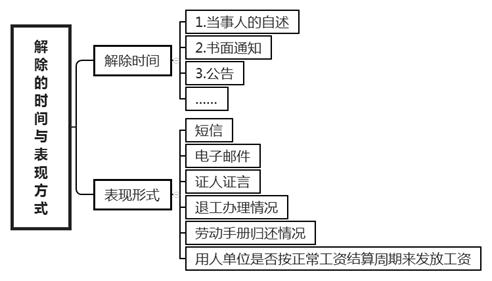
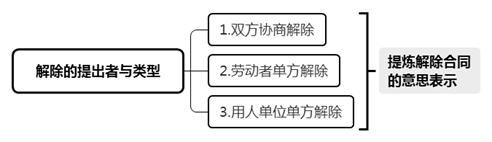
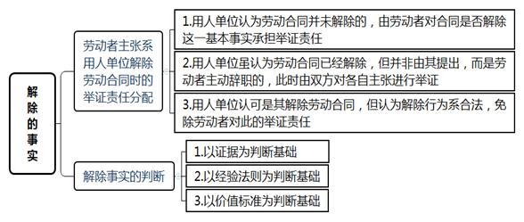
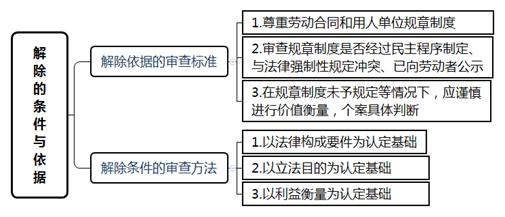

### **劳动合同解除纠纷案件的审理思路和裁判要点**

劳动合同解除是指在劳动合同有效成立后，因一方或双方当事人的意思表示致使劳动关系归于消灭的制度，主要包括《劳动合同法》规定的协商解除、单方解除、无过失解除、经济性裁员等情形。实践中，劳动合同纠纷案件大多由劳动合同解除引起，双方对解除的原因、时间、性质等往往存在较大争议，直接影响到劳动合同解除的法律后果。对劳动合同解除效力的认定、解除事实的判断、解除条件的把握是此类案件审理的重点和难点，故有必要以典型案件为基础，对该类案件的审理思路与裁判要点进行梳理、提炼和总结。

**一、典型案例**

**案例一：涉及劳动合同解除效力的认定**

蔡某与A公司签订期限自2008年5月1日至2010年6月30日止的劳动合同。2010年6月14日，A公司给蔡某劳动合同终止书一份，告知蔡某合同到期后，不再与其续签劳动合同，届时将支付其经济补偿金。后蔡某于2010年6月21日主动提出辞职申请，并于同月30日办理了相关移交手续。蔡某认为劳动合同系基于期满而终止，遂起诉要求A公司支付经济补偿金。

**案例二：涉及劳动合同解除事实的判断**

杨某向B公司提出事假申请，请假事由为“家里老人生病，请事假15天”，B公司于当日批准。后杨某在休假期间赴欧洲出国旅游，并通过微信朋友圈晒出游玩照片。B公司发现后向杨某出具严重违纪辞退通知书，以杨某编造请假事由欺骗公司为由解除双方劳动合同。杨某起诉要求B公司支付违法解除劳动合同赔偿金。

**案例三：涉及劳动合同解除条件的把握**

C公司通知薛某，公司因组织机构调整需转到北京，希望薛某工作地点转至北京，岗位不变并提供房贴，但薛某未予同意。调整后，C公司在上海已无工作人员。后薛某收到C公司的劳动合同解除通知书，称：因双方订立劳动合同时所依据的客观情况发生重大变化，致使劳动合同无法履行。经协商未能就变更劳动合同达成一致，故公司决定解除劳动合同。后薛某收到C公司支付的经济补偿金等。薛某起诉要求C公司支付违法解除劳动合同赔偿金。

**二、劳动合同解除纠纷案件的审理难点**

虽然法律对劳动合同解除做了较为详尽的规定，但均较为原则。实践中对涉及劳动合同解除条件、效力等法条的理解和适用存在分歧，审查的标准也不统一。

**（一）劳动合同解除效力认定难**

部分劳动合同解除纠纷案件可能存在解除行为与终止事由共存、双方行使解除行为或单方多次行使解除行为等情形。如案例一中，劳动者的合同期限将近届满、用人单位给出合同终止书、劳动者主动提出辞职申请等情形共存。由于解除、终止的行为或事实会对合同效力产生影响，故真正产生效力的事实或行为应当仅有一项。如何确定劳动合同是否解除、何时解除、由谁解除、以何种理由解除，是审理此类案件的重要前提。

**（二）劳动合同解除事实判断难**

在实务中，劳动合同解除的理由往往五花八门，法院对于解除事实的判断难度也较大。如案例二中，劳动者因需照顾生病亲人而请事假，也提供了亲人生病的证据，但在请假期间却出国游玩。B公司认为杨某存在骗假行为属于严重违纪故辞退杨某，但能否认定劳动者该行为属于严重违纪，在司法实践中尚无明确判断标准。

**（三）劳动合同解除条件把握难**

法律对于劳动合同解除条件作了严格限制，但在具体案件中，要做到准确适用这些解除条件进行审查存在一定难度。如案例三中，法院需要审查C公司整体迁移是否属于合同订立时所依据的客观情况发生重大变化、劳动合同约定的工作场所迁移是否导致合同无法履行、双方是否存在协商且未达成一致等诸多解除条件，但实务中对上述解除条件的理解和审查标准并不统一。

**三、劳动合同解除纠纷案件的审理思路与裁判要点**

劳动合同解除是劳动合同制度的核心内容之一。劳动合同的解除直接涉及劳动合同的效力、当事人的权利保护和利益得失。**法院需充分审查解除的时间与表现形式、解除的提出者与类型、解除的理由、解除的事实、解除的条件与依据、解除的法律后果等六个方面，应当坚持尊重劳动合同规定、限制违法解除、衡平劳资双方合法权益的价值理念。**

**（一）解除的时间与表现形式**

劳动合同的解除时间涉及具体权利义务履行的期间，其应通过当事人的自述、书面通知、公告等证据予以审查确定。解除的表现形式可以通过短信、电子邮件等方式予以呈现，还可以结合证人证言、退工办理情况、劳动手册归还情况、用人单位是否按正常工资结算周期来发放工资等因素，综合判断劳动合同的解除时间。

在审查解除的时间与形式时，应注意以下几点：1、劳动合同解除的时间是指解除意思表示到达对方的时间，而非解除行为作出的时间。2、解除的意思表示应向劳动关系的相对方作出。3、解除的意思表示必须以明示的方式呈现。如实践中用人单位以劳动者长期不来上班为由推定劳动者自动离职，一般不予支持。

**（二）解除的提出者与类型**

劳动合同解除主要分为双方协商解除、劳动者单方解除、用人单位单方解除三种类型，不同的提出主体会导致完全不同的法律后果。一般情况下，用人单位提出解除会发出解除通知书，而劳动者主动解除会递交辞职信，这是事实比较明确的情形。

解除权系形成权，一经到达对方即生效，劳动合同即告解除。无论解除的外在形式是书面通知书、电子邮件或是手机短信，**法院对解除通知的内容需严格审查，从中提炼出明确、清晰的解除合同的意思表示。**实践中，会出现双方均行使解除权或解除行为与合同终止同时出现的情形，此时应适用时间优先原则。前者需审查哪一方的解除意思表示先到达对方，而后者需比较解除行为生效的时间与终止情形出现的时间哪个更早。如案例一中，双方劳动合同期满的时间为2010年6月30日，蔡某于同月21日递交了辞职信，此时应认定劳动者主动提出解除合同在先，系劳动者单方解除合同的情形，解除时间为2010年6月21日。

此外，实践中还存在一方多次为解除行为的情形，如合同一方考虑到之前的解除通知内容不够完整、通知内容有错误等因素，可能会出现再次或多次发出解除通知的情况，此时需要对解除行为的效力进行审查，以首次发生法律效力的解除行为为准。

 

**（三）解除的理由**

劳动合同解除的理由是法院审查的重要内容。如用人单位的解除理由主要有劳动者不符合录用条件、严重违反规章制度、严重失职给用人单位造成重大损害、不能胜任工作、客观情况发生重大变化等。用人单位在作出解除决定时，需事先将解除理由通知工会并告知劳动者。

在审查用人单位提出的解除理由时，应注意以下几点：1、用人单位行使解除权时已说明理由，在裁诉阶段变更解除理由的，应以行使解除权时的理由为准。2、用人单位行使解除权时并未说明理由或理由笼统，在裁诉阶段补强说明解除理由的，应以其在首次仲裁庭审中关于解除理由的表述为准。3、用人单位行使解除权时有多个解除理由的，需对多个理由逐一审查，只要其中有一个理由符合解除条件，即可认定用人单位的解除行为合法有据。

**（四）解除的事实**

解除所依据的客观事实往往亦是劳动合同解除纠纷案件中的审查重点。该部分的审查主要涉及事实认定、证据采纳，在双方各执一词、事实难以查清的情况下，应充分运用证据规则来认定事实存在与否。

**1****、解除事实的举证责任分配**

**其一**，如果劳动者主张系用人单位解除劳动合同, 用人单位认为劳动合同并未解除的，由劳动者对合同是否解除这一基本事实承担举证责任；**其二**，如果劳动者主张系用人单位解除劳动合同, 用人单位虽认为劳动合同已经解除，但并非由用人单位提出，而是劳动者主动辞职的，此时由双方对各自主张进行举证；**其三**，用人单位认可是自己解除劳动合同，但认为解除行为合法，此时由于关于解除行为本身双方已经确认，免除劳动者对此的举证责任。

**2****、解除事实的判断方法**

劳动合同解除纠纷案件中，对于劳动合同解除事实的认定更是审查难点，具体可以通过以下三个方法进行判断：

**（****1****）以证据为判断基础。**通过劳动合同、规章制度、退工单、工资条、通知等证据来判定劳动合同解除的案件事实。

**（****2****）以经验法则为判断基础。**根据法律规定或者已知事实和日常生活的经验对解除事实进行判断。

**（****3****）以价值标准为判断基础。**在缺乏明确裁判规范的情况下，运用法律的整体秩序和基本价值原则对解除事实进行判断。

例如劳动合同解除事实中涉及到劳动者严重违纪事实的认定，可以具体运用以下的方法判断：

**第一**，运用证据进行合规性审查。如果劳动者的行为属于规章制度、劳动合同等证据中有直接明确规定的严重违纪行为，双方对证据本身的理解不存在分歧，可以直接对照该证据判断劳动者行为是否构成严重违纪。

**第二**，运用经验法则判断行为的后果。如果劳动者的违纪行为已产生严重后果，造成公司财产较大损失、公司安全受到威胁等，可以通过社会经验判断违纪已达到严重程度，此处的严重后果不仅局限于用人单位，还可能包括对第三人、社会造成严重危害的情形。此外，法院可以结合某些行业或岗位的特殊性进行经验判断，如用人单位对于迟到早退的后果虽在规章制度中未作明确规定，某劳动者在两个月内无故累计迟到20多天，且经用人单位多次提醒仍未改正，运用经验法则可以认定该员工已违反劳动者的基本义务，即可认定已达到严重违纪的程度。

**第三**，运用价值标准进行事实评价。如案例二中，杨某认为以照顾生病亲人为由请事假是基于请假时亲人确实生病，所以无法就此得出骗假的结论。如果杨某出现在离家较近的地方且表示系照顾亲人之余的散心，则不能直接认定其骗假。本案中杨某出现的地点为欧洲，需做较多的前期准备工作，且其请假与出国日期间隔较短，足以说明旅行属于事先计划。事后杨某也承认并未照顾生病亲人，充分证明其请假时就存在骗假的主观故意。劳动者的行为虽未造成严重后果，但显然违背了诚实信用原则，可以认定已达到严重违纪程度。

   

**（五）解除的依据与条件**

**1****、解除依据的审查标准**

对于劳动合同的解除依据应采用如下审查标准：（1）尊重劳动合同和用人单位依法制定的规章制度。（2）用人单位以规章制度作为处理依据时，法院应当审查该规章制度是否经过民主程序制定，是否与法律强制性规定冲突，是否已向劳动者公示。（3）在规章制度对某些劳动纪律事项未予规定、规定不明或者规章制度无效等情况下，法院应审慎地对劳动者的行为进行价值衡量，在个案中根据具体情况作出符合法律精神的判断。

**2****、解除条件的审查方法**

对于劳动合同的解除条件可以运用以下三个方法进行审查：

**（****1****）以法律构成要件为认定基础。**劳动合同的解除条件基于法律规定，因此审查解除条件必须以法律构成要件为依据。

**（****2****）以立法目的为认定基础。**依照法律所要实现的目的来确定法律的意思，以此来解释劳动合同解除条件的法律规范。

**（****3****）以利益衡量为认定基础。**从法律规范来探究立法时对用人单位与劳动者利益的衡量，以此来解释法律所规定的解除条件。

例如劳动合同解除条件中涉及到客观情况发生重大变化的情形，具体可以运用法律构成要件、立法目的、利益衡量三种方法进行审查。

《劳动合同法》第40条第3款规定了客观情况发生重大变化的情形，用人单位以此为由行使解除权的，法院应审查：（1）劳动合同订立时所依据的客观情况是否发生重大变化；（2）此重大变化是否使劳动合同无法履行；（3）在此情况下，双方是否经协商而无法就变更合同内容达成协议。

“客观情况”是指履行原劳动合同所依赖的客观条件，因不可抗力或出现致使劳动合同全部或部分条款无法履行的其他情况，如自然条件、企业迁移、被兼并、企业资产转移等原劳动合同不能履行或不必要履行的情况。法院在审查此类案件时应当考虑企业的生存发展、平衡合同双方的利益等因素，根据实际情况作出符合立法目的的判断。如案例三中，C公司的大客户群、品牌资源均集中到了北京，为迎合变化中的培训市场，C公司撤销了上海部门，否则企业将蒙受巨大损失。虽然调整部门是公司自主经营权的行使，但本案的主要原因是外在市场的重大变动，符合“客观情况发生重大变化”这一法律构成要件。

审查该重大变化是否已导致原劳动合同无法履行，重点应落脚在“致使原合同无法履行”上。在认定该构成要件之后，法院需继续审查用人单位在解除时是否履行了协商变更的程序，未履行该法定程序仍有可能导致违法解除情况的发生，如此可以避免用人单位以“客观情况发生重大变化”为由随意解除合同。如案例三中，薛某所在部门整体搬迁至北京，直接导致薛某无法继续在上海工作，可认定原合同已无法继续履行。在协商变更合同的环节，公司先后两次给出转岗提议、多次给原上海员工提供面试机会，协商形式已较为充分。另外，公司为外地来京员工提供房贴，已尽较大努力安置员工居住问题，表现了协商诚意。法院在衡量用人单位的解雇权和劳动者的就业权过程中，最终认定双方已经过协商，但未能就变更合同内容达成一致，符合法律规定的解除条件。

**（六）解除的法律后果**

实践中，法院需根据当事人的解除行为是否与其主张的解除条件和依据相匹配，是否符合法律规定的程序性要求，来判断解除行为的合法性。若构成合法解除且符合《劳动合同法》第46条所规定的情形，则用人单位应当支付经济补偿；符合该法第39条规定的情形，则用人单位无需支付经济补偿。如构成违法解除的，则劳动者可选择继续履行劳动合同或者由用人单位支付赔偿金。

**1****、合法解除中关于经济补偿的计算方法**

经济补偿按劳动者在本单位的工作年限和月工资基数计算，工作每满1年按1个月的工资标准支付。6个月以上不满1年的，按一年计算；不满6个月的，支付半个月的工资作为经济补偿。月工资是指劳动者在劳动合同解除前12个月的平均工资，按照劳动者应得的工资计算，包括计时工资或计件工资以及奖金、津贴和补贴等货币性收入。劳动者工作不满12个月的，按照实际工作的月数计算平均工资。劳动者在劳动合同解除前12个月的平均工资低于当地最低工资标准的，按照当地最低工资标准计算；劳动者的月工资高于用人单位所在直辖市、设区的市级人民政府公布的本地区上年度职工月平均工资三倍的，经济补偿按职工月平均工资三倍的数额支付，支付年限不超过12年。

**2****、违法解除的法律后果**

用人单位违法解除劳动合同，劳动者要求继续履行劳动合同的，用人单位应当继续履行；劳动者不要求继续履行劳动合同或者劳动合同已经不能继续履行的，用人单位应当依照法律规定支付赔偿金。用人单位支付赔偿金的数额应依照前述经济补偿标准的二倍支付。劳动者不可同时主张赔偿金和经济补偿金。

（根据王剑平、徐凌提供材料整理）