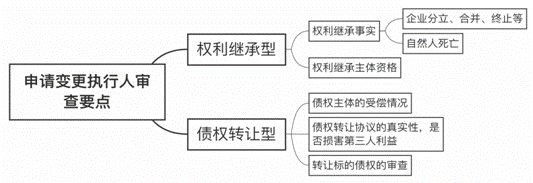
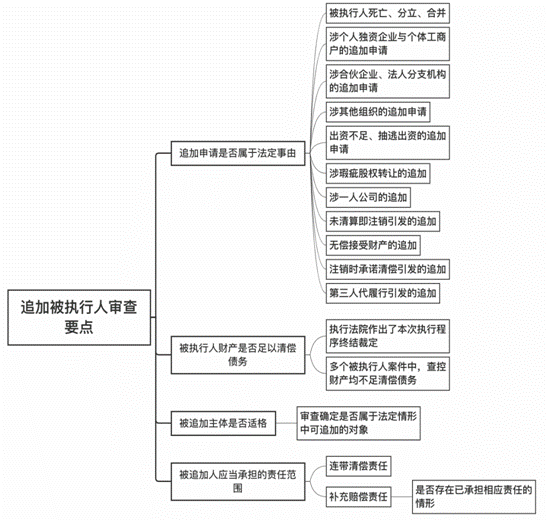
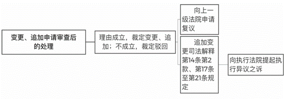

### **变更、追加执行当事人案件的审理思路和裁判要点**

变更、追加执行当事人案件是指根据当事人或第三人的申请，法院依法审查是否对生效法律文书确定的申请执行人、被执行人予以变更、追加的案件。该类案件往往涉及执行当事人和第三人的重大利益，案件审查过程中程序法与实体法交错，法律关系复杂，司法实践中时有争议。为保障执行当事人和第三人的合法权益，确保执行的公正和效率，本文结合司法实践中的典型案例，对常见的几类变更申请执行人、追加被执行人案件的审理思路和裁判要点进行梳理、归纳和总结。

**一、典型案例**

**案例一：涉及生效法律文书确定的债权转让而变更申请执行人**

执行程序中，申请执行人A公司将生效民事判决确定的债权转让给B公司。后B公司向法院申请变更为申请执行人。经查，B公司是A公司的股东之一；A公司已成立清算组，目前处于清算程序；B公司未支付债权转让的对价。

**案例二：涉及被执行人的股东抽逃出资而追加被执行人**

C公司股东张某、王某均已缴足出资。后生效判决判令C公司向D公司支付货款，D公司在执行程序中发现C公司的注册资金已由验资账户全部转至E公司。张某、王某对此辩称系因C公司与Ｅ公司之间存在业务关系，但未提供有效证据。D公司向法院申请追加张某、王某为被执行人。

**案例三：涉及被执行人公司未经依法清算而追加被执行人**

执行程序中，被执行人F公司成立清算组进行清算，并在报纸上刊登清算公告，要求债权人申报债权。清算组对公司的债权债务全部清理完毕后注销F公司。在F公司的注销登记申请书中，股东承诺“公司债务已清偿完毕，若有未了事宜，股东愿意承担责任”。后债权人向法院申请追加作为保结责任人的股东为被执行人。

**案例四：涉及依行政命令无偿接受被执行人财产而追加被执行人**

因公司改制需要，被执行人G公司的部分财产被国资委划拨至H公司，作为J公司对H公司的出资。执行程序中，G公司的债权人以无偿接受财产为由申请追加H公司为被执行人。

**二、变更、追加执行当事人案件的审理难点**

执行程序中变更、追加第三人为执行当事人，属于生效裁判文书执行力的扩张。《最高人民法院关于民事执行中变更、追加当事人若干问题的规定》中的相关规定较为原则，如何确保变更、追加执行当事人的程序公正和实体公正，在实践中存在较大困难。

**（一）债权转让是否损害第三人利益认定难**

因债权转让而变更申请执行人有利于提升不良资产转化为流动资产的处置效率，但部分申请执行人因其尚处于清算程序或存在未结诉讼，债权转让存在转移资产、损害第三人合法权益的可能。实践中，对债权转让行为是否损害第三人利益难以认定。

**（二）股东是否承担补足出资义务及责任范围认定难**

在公司财产不足以清偿债务时，债权人通常在执行程序中以公司股东违反出资义务为由，申请追加瑕疵出资的股东为被执行人。对公司股东是否存在出资瑕疵的认定，不仅要结合证据审查股东是否履行出资义务，还要综合考虑认缴制下股东出资期限利益保护与债权人利益的平衡。

**（三）作为被执行人的公司是否依法清算认定难**

作为被执行人的公司被注销意味着公司法人主体资格的灭失，公司将无需再对其债务承担责任，但前提是公司已进行依法清算。在执行程序中，如何认定被执行人公司是否依法清算，以及登记文件中关于“未了事宜”的认定与理解存在分歧。

**（四）追加依行政命令无偿接受被执行人财产的主体认定难**

被执行人的财产依行政命令无偿划拨给第三人，第三人以此作为出资设立新的公司并登记为股东。由于对接受被执行人财产的主体是该第三人还是新设立的公司存在分歧，实践中对被追加主体的认定易发生混淆。

**三、变更、追加执行当事人案件的审理思路和裁判要点**

**（一）变更、追加执行当事人案件审查的基本原则**

变更、追加执行当事人案件中，法院既要保障债权人利益的实现又要保护第三人的合法权益，确保执行的公正和效率。法院在审查时应遵循以下三项基本原则：

**1****、变更、追加事由法定原则**。法院对变更、追加执行当事人的程序应当是依当事人或第三人的申请而启动。申请变更、追加执行当事人的事由须符合《民事执行中变更、追加当事人若干问题的规定》中的法定事由。当事人不得突破该司法解释而直接援引实体法的相关规定向法院提出申请。如当事人不得直接以夫妻共同债务为由向法院申请追加配偶为被执行人，或者在非一人有限责任公司案件中直接以股东与公司财产混同为由申请追加股东为被执行人。

**2****、公开听证为主、书面审查为辅原则**。该类案件涉及执行当事人重大的权利义务变动，法院一般应当公开听证以保障当事人、第三人陈述事实、举证质证以及辩论的程序权利。对于事实清楚、权利义务关系明确、争议不大的案件，法院可以采用书面审查的方式，以提升执行效率、节约诉讼成本。

**3****、形式审查与实质审查兼顾原则**。在执行实施权和执行裁判权深化内分改革的基础上，法院对法律关系清晰、有法定证据、争议不大的案件进行形式审查；对法律关系复杂、事实认定和法律适用争议较大以及当事人提供充分相反证据的案件进行实质审查，以减少后续进入执行异议之诉的案件数量，防止相关当事人利用周期较长的诉讼程序拖延和规避执行。

**（二）变更申请执行人案件的审查思路及要点**

司法实践中，变更申请执行人案件主要包括以下两种情形：**一是**作为申请执行人的公民死亡，继受其权利的继承人申请变更为申请执行人；或是作为申请执行人的法人或其他组织终止、合并、分立，继受其权利的法人或者其他组织申请变更为申请执行人。**二是**申请执行人通过债权转让的方式将生效法律文书确定的债权转让给第三人，且书面认可第三人取得该债权，该第三人可依法向法院申请变更为申请执行人。

**1****、因权利继受而变更申请执行人案件的审查要点**

根据《民事执行中变更、追加当事人若干问题的规定》第2条至第8条规定，审查要点主要包括：

**（****1****）审查权利继受方的主体资格**。法院应审查申请人是否系生效法律文书确定的权利继受主体、是否存在其他权利继受主体。如果存在其他权利继受主体，法院应审查该主体是否放弃继受权利；如果该主体未放弃继受权利，则变更申请应由所有继受主体共同提出。

**（****2****）审查发生权利继受的事实**。法院应审查原申请执行人死亡或依法终止、合并、分立等法律事实。

**2****、因债权转让而变更申请执行人案件的审查要点**

生效法律文书确定的债权转让后，债权受让人能否在执行程序中直接申请变更为申请执行人是长期困扰司法实践的难点。《民事执行中变更、追加当事人若干问题的规定》第9条首次将因生效法律文书确定的债权转让作为变更申请执行人的法定情形，审查要点主要包括：

**（****1****）审查生效法律文书确定的债权在执行程序中的受偿情况**。法院应审查申请执行人对外转让的债权是否已受偿。如该债权已完全受偿，则不存在继续变更申请执行人的必要。

**（****2****）审查转让的标的债权**。法院应审查债权转让协议中转让的标的债权与生效法律文书确定的债权是否一致。同时，为了维持正常的执行秩序，防止引发新的纠纷，法院还应审查申请执行人与被执行人之间是否存在互负义务的情形，以确保所转让债权属于无其他负担的单纯债权。如申请执行人在对被执行人享有金钱债权的同时，还负有协助被执行人办理股权过户等义务，申请执行人与被执行人之间实际互负给付义务，申请执行人转让的债权亦不属于无权利负担的债权，一般不予变更申请执行人。

**（****3****）审查债权转让协议的真实合法性、是否存在损害第三人利益的情形**。法院首先应审查债权转让的真实性，申请执行人需向法院书面确认债权转让且对债权转让无异议；其次应审查申请执行人转让的债权是否存在法律禁止的情形，是否存在损害第三人利益的情形，包括申请执行人通过转让债权减少自身责任财产、逃避债务、规避执行等。法院应结合债权转让的方式（协议转让、公开市场挂牌转让等）、受让方是否支付合理对价、申请执行人是否处于破产清算程序、申请执行人是否存在其他未决诉讼等情形进行综合判断。申请执行人在对外负有尚未清偿的债务且已进入执行程序的情形下，将生效法律文书确定的债权转让给第三人会损害其他债权人的利益，法院对债权受让人的变更申请不予支持。

如案例一中，申请执行人A公司在已进入清算程序的情形下，违反清算程序且未经清算组织确认，将其享有的生效民事判决确定的债权转让给股东B公司，以抵销其对B公司的其他债务，损害A公司其他股东的利益，故法院对B公司的变更申请不予支持。

**（三）追加被执行人案件的审查思路及要点**

执行程序中追加被执行人的法定情形集中在《民事执行中变更、追加当事人若干问题的规定》第10条至第25条，追加的对象主要包括被执行人的遗产继承人、个人独资企业的投资人、合伙企业的合伙人、法人或其他组织分立合并后存续或新设的法人、其他组织等；承担责任的范围主要包括补充赔偿责任、连带清偿责任、承诺范围内的清偿责任等。该类案件的审查思路主要包括：**一是**确定追加申请是否属于法定情形；**二是**审查被执行人名下财产是否足以清偿债务；**三是**审查被追加人主体是否适格、是否存在承担被执行人债务的义务；**四是**审查被追加主体承担责任的范围是否存在减轻或者免除责任的事由。

**1****、被执行人的财产不足以清偿债务的审查要点**

申请追加被执行人的前提是“被执行人的财产不足以清偿生效法律文书确定的债务”。实践中，被执行人的财产是否足以清偿债务主要审查：（1）法院是否已因被执行人无可供执行财产作出执行程序终结的裁定；（2）在存在多个被执行人的案件中，被执行人财产是否均不足以清偿债务。

**2****、追加未出资或未足额出资股东为被执行人的审查要点**

**（****1****）审查股东的出资期限是否届满**。股东的出资期限是否届满，主要依据公司章程中对股东出资期限的约定。如股东的出资期限已届满，法院则需审查股东是否存在未缴纳出资或未足额缴纳出资的情形。在公司注册资本认缴制的背景下，一般不宜将出资期限未届满的股东追加为被执行人。然而，作为被执行人的公司经法院穷尽执行措施后，确无可供执行的财产，且申请执行人能够提供证据证明公司已具备破产法规定的破产情形的，如当事人经法院释明后不申请破产，则法院可对该股东是否需要承担补充赔偿责任作进一步审查。在审查过程中，如发现被执行人存在多个债权人，债权金额大于出资金额，且被执行人的财产不足清偿债务的，则法院应对申请执行人的追加申请予以驳回，并向其释明可通过“执转破”程序另行主张权利，以保障各债权人地位平等和公平受偿。

**（****2****）审查股东是否在出资期限届满后恶意延长出资期限**。在公司不能清偿债务的情形下，如股东未履行已到期的出资义务，而通过股东大会决议或其他方式延长出资期限，致使债权人利益受损，属于恶意延长出资期限，有悖于诚实信用原则。该情形下，法院对申请执行人的追加申请应当予以支持。

**（****3****）审查未出资或未足额出资股东承担责任的范围**。此类案件中，股东承担责任的范围应当是在未足额出资范围内承担补充赔偿责任。如股东在应承担责任的范围内已承担相应责任，法院不得责令其重复承担责任。

**3****、追加抽逃出资股东为被执行人的审查要点**

根据《公司法司法解释三》第12条规定，法院对于抽逃出资的认定需在结合证据规则、日常经验法则和价值标准的基础上，审查公司在完成验资后，股东能否证明公司注册资金全部或部分转出的正当性。审查要点主要包括：

**（****1****）审查申请执行人的初步举证责任**。申请执行人应当提供股东在完成出资义务后将注册资本抽回的初步证据，如公司账户资金转出的金额、时间、资金转入方的信息等。

**（****2****）审查公司注册资金转出的正当性**。法院应结合公司注册资金的转出时间和金额、接受资金一方的身份、是否存在与资金转出相关联的合法有效并实际履行的合同等，对公司注册资金转出的正当性进行审查。此外，股东对该资金转出还应承担合理性说明的义务。如在公司完成注册后的较短时间内，公司将注册资本从公司账户全部转入股东账户或第三人账户，且无法合理说明资金转出事由的，可初步认定属于抽逃出资。

如案例二中，申请执行人D公司提供了C公司的注册资金已由验资账户全部转至第三人E公司的证据。法院通过合理的举证责任分配，查明被划转的资金未用于公司实际经营，属于通过虚构债权债务关系将出资转出，从而认定C公司股东构成抽逃出资。

**（****3****）审查抽逃出资股东应承担财产责任的范围**。抽逃出资的股东应当在抽逃出资范围内对公司债务承担补充赔偿责任。如股东在其他案件中已承担补足出资责任并实际履行的，则法院不得要求该股东重复承担责任。

**4****、追加公司注销后保结责任人为被执行人的审查要点**

作为被执行人的公司未经依法清算即办理注销登记的，申请执行人可以申请追加在登记机关办理注销登记时，书面承诺对被执行人债务承担清偿责任的保结责任人为被执行人。对于公司是否已进行依法清算，审查要点主要包括：**一是**公司是否成立符合法律规定的清算组；**二是**是否有效通知作为债权人的申请执行人；**三是**清算报告中是否列入债权人的债权；**四是**如果债权人在公司清算程序中已申报债权但公司未破产时，清算组是否作出相应的债务清偿处理，债权人对清算组的债务清偿处理方案是否认同等。

如案例三中，F公司虽然形式上履行了清算手续，但并未通知已知的债权人即申请执行人，也未对申请执行人的债权进行清偿，属于未经依法清算。法院最终认定保结责任人应按照办理注销登记的书面承诺对F公司债务承担清偿责任，故依法追加其为被执行人。

**5****、追加一人有限责任公司股东为被执行人的审查要点**

根据《民事执行中变更、追加当事人若干问题的规定》第20条规定，当一人有限责任公司的财产不足以清偿生效法律文书确定的债务时，股东不能证明公司财产独立于自己财产的，应对公司债务承担连带责任。审查要点主要包括：

**（****1****）举证责任分配**。申请执行人需提供被执行人公司财产不足以清偿债务、被执行人公司与股东财产混同的初步证据；相关股东应举证证明个人财产与公司财产相互独立。

**（****2****）审查公司财产与个人财产是否混同**。法院应从公司是否建立独立规范的财务制度、财务支付是否明晰等方面进行审查。根据《公司法》第62条规定，一人有限责任公司应在每一会计年度终了时编制财务会计报告，并经会计师事务所审计。在执行程序中，如股东不能提供符合上述法律规定的相关年度财务报告等初步证据，法院即可作出股东与公司财产混同的初步判断。如股东能够举证证明个人财产与公司财产独立，则法院对追加申请不予支持。

**6****、无偿接受被执行人财产的第三人为被执行人的审查要点**

执行程序中，对于申请执行人以因行政命令无偿取得被执行人财产为由申请追加第三人为被执行人的，法院应主要审查第三人是否因行政命令实际无偿取得被执行人财产。审查要点主要包括：

**（****1****）明确追加主体**。申请执行人应查明无偿取得被执行人财产的主体身份。如依行政命令发生多次流转的，应当确定最终无偿接受财产的主体。如案例四中，被执行人G公司的财产作为股东J公司的出资划入H公司，最终接受财产的主体应为J公司。

**（****2****）审查因无偿接受财产而承担的责任范围**。如被无偿划拨的财产为货币的，则受让方应在接受货币的范围内承担责任；如为非货币财产，则应以非货币财产的价值确定承担责任的范围。

**（四）变更、追加申请审查后的处理**

变更、追加执行当事人申请理由成立的，法院应裁定变更、追加执行当事人；理由不成立的，法院应裁定驳回申请。需要注意的是，依照《民事执行中变更、追加当事人若干问题的规定》第14条、第17条至第21条规定，在追加有限合伙企业的有限合伙人、出资不实或者抽逃出资的企业法人的股东、瑕疵股权转让的出让人、与一人有限责任公司财产混同的股东、不履行清算义务即注销公司导致无法清算的责任人为被执行人的案件中，当事人对法院作出的裁定不服的，可自裁定书送达之日起十五日内向法院提起执行异议之诉；在其他变更、追加执行当事人的案件中，当事人对法院作出的裁定不服的，可自裁定书送达之日起十日内向上一级法院申请复议。

当事人提起执行异议之诉时，法院应以承担财产责任的范围确定诉讼费用。通过诉讼费经济杠杆的调节作用，防止当事人通过周期较长的诉讼程序拖延执行、转移财产。

**四、其他需要说明的问题**

在变更、追加执行当事人案件的审查过程中，法院可以借助审判执行管理系统、最高法院执行信息公开网、全国企业信用信息公示系统等对当事人的涉诉涉执行等情况进行查询，便于全面了解当事人情况、提高审查效率。

（根据民事庭吉顺祥、徐林祥宇提供材料整理）