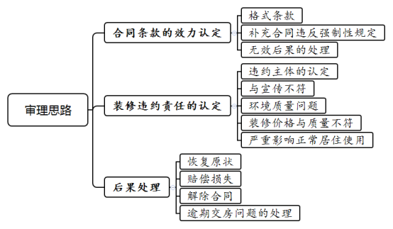
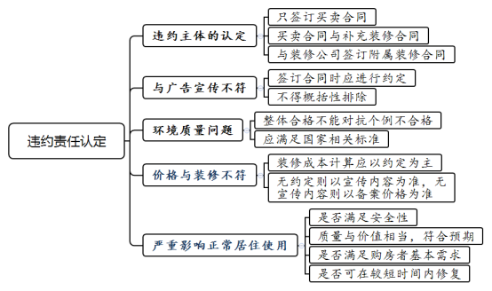
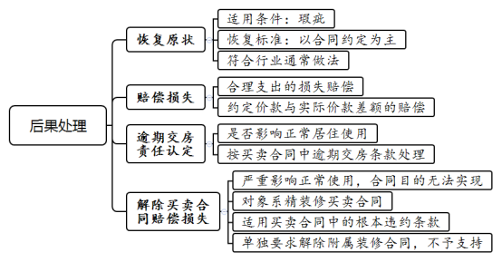

### **商品房买卖合同装修质量纠纷案件的审理思路和裁判要点**

近年来，商品房交易市场中精装修商品房买卖越来越普遍，在促进房地产行业发展的同时也引发诸多问题。精装修商品房，是指在房屋交房之前功能空间的固定面铺装或者粉刷完毕，厨卫基本设施安装完成的新建一手商品住宅。此类商品房在交付时即附有合同约定的装修，若装修出现质量问题，将影响购房者接收与实际使用房屋。本文结合司法实践中的典型案例，对精装修商品房买卖合同装修质量纠纷案件的审理思路与裁判要点进行梳理、提炼和总结。

一、典型案例

**案例一：涉及违反法律法规导致合同条款无效的情形**

孙某与A公司签订精装修商品房买卖合同，合同中并未约定装修事宜。后孙某与A公司另行签订补充合同，约定装修的具体条款，并约定装修款独立于房款。A公司交付房屋后，孙某以A公司额外签署合同涉嫌逃税漏税为由，主张补充合同整体无效，要求返还约定的装修款。A公司对此不予认可，故双方涉诉。

**案例二：涉及因实际装修不符合装修条款诉请违约赔偿**

赵某购买B公司开发的精装修公寓，合同约定由B公司对房屋进行后续装修，双方在《房屋买卖合同》中对装修条款进行了相关约定。后双方办理交房手续时，赵某发现房屋存在大量装修与合同约定不符、以次充好的问题，且未按照合同要求完成房屋厨卫基础设施安装及调试，无法达到如B公司广告宣传所称的“拎包入住”要求。赵某遂向B公司提出交涉，认为房屋无法满足赵某的使用要求并主张退房退款，B公司对此不予认可，故双方涉诉。

**案例三：涉及装修质量不合格拒绝收房并要求赔偿**

钱某与C公司签订《商品房预售合同》购买精装修商品房，约定在取得交付使用许可证后进行交房。后C公司向钱某发出交房通知书，钱某称其在收到交房通知书后对房屋进行实地勘察检测，发现房屋内甲醛及其他室内环境检测项目严重超标，不符合房屋空气质量标准的相关规定，房屋验收不合格，故拒绝办理交房手续，要求C公司交付符合空气质量标准的房屋，并承担装修不符合约定的违约责任。

**案例四：涉及精装修商品房因质量问题逾期交房的认定**

李某与D公司签订商品房买卖合同，约定D公司于2021年6月1日前向李某交付符合交付条件的房屋。若D公司未按约交付房屋，则应承担日万分之二已付购房款的逾期交房违约金。后因房屋漏水问题，李某拒绝于约定之日接收房屋，要求D公司进行整改。后D公司耗时一个月对房屋进行修复，双方进行房屋交接。李某以D公司迟延一个月交付房屋为由，主张D公司支付逾期交房违约金。

二、精装修商品房买卖合同装修质量纠纷案件的审理难点

**（一）合同中装修条款的效力认定难**

在绝大多数情况下，装修条款均采用开发商事先拟定的格式条款内容。实践中，对于该格式条款的效力认定存在一定的难度，需要结合案件实际情况及合同的约定判定是否存在免除一方主要责任、加重另一方责任的情况，以具体分析哪些条款可能存在无效的情形。此外，对于独立于购房合同的装修合同，认定该装修合同条款效力的难点主要在于是否违反法律法规的强制性规定、装修费用的性质如何认定等。

**（二）装修质量纠纷违约责任的判断难**

精装修商品房的质量，除应达到正常商品房“毛坯房”的质量要求外，还需满足国家、行业对于精装修标准的强制性要求及合同约定的装修要求等，否则应认定存在违约。然而，因精装修商品房装修质量标准往往约定并不明确，故违约责任的认定存在较大分歧。如最高法院《关于审理商品房买卖合同纠纷案件适用法律若干问题的解释》第10条规定，“房屋质量问题严重影响正常居住使用”的，买受人有权请求解除合同与赔偿损失。然而司法实践中对于“严重影响正常居住使用”的判断标准较为模糊，未能形成统一明确的规定。

**（三）装修质量纠纷违约后果的处理难**

精装修商品房买卖合同中涉及装修争议的违约责任的产生，主要源于精装修商品房买卖合同的出卖方存在违反装修条款的情形。一般而言，对于违约责任后果的处理方式，以继续履行、修复、赔偿损失、解除合同等为主。司法实践中，对于精装修商品房违约责任后果的判断，尤其是责任承担主体的认定、责任方式的认定等，均是该类案件审理的难点。因此，从有利于双方当事人利益及维系社会公平正义角度出发，违约责任的后果处理往往需要结合案情中各方违约责任大小、过错程度等进行综合认定。

三、精装修商品房买卖合同装修质量纠纷案件的审理思路和裁判要点

法院审理精装修商品房买卖合同装修质量纠纷案件，首先，判断案件审理适用的约定条款；其次，分析产生装修质量纠纷的原因、类型与程度；再次，确定承担责任的主体；最后，选择妥当合适的后果处理方式。概括而言，应当审慎审查各方之间签订合同的具体条款，明确装修条款是属于商品房买卖合同内容还是另行签订的装修合同；分析房屋交付或使用过程中出现的问题，确定违约责任的分配承担，并根据不同程度的违约责任认定相应的处理后果。

 

**（一）合同中装修条款的效力认定**

精装修商品房买卖合同中的装修条款在自治范围内需要遵守强制性的规范，而强制性规范则要求合同约定不能违背法律法规的强制性规定。

**1、格式条款的效力认定**

针对精装修商品房买卖合同中的装修条款或另行签订的补充装修合同等，应充分考虑签订合同时出售方对涉及装修条款的解释说明是否符合常规做法，条款理解的难易程度是否符合一般消费者的认知水平，条款的约定是否免除或者减轻了合同提供者的责任、涉及相对方重大利害关系。因格式条款引发纠纷的情形多由装修条款中的兜底条款产生，如“样板房不作为交付标准”“以实际交付为准”等，在审理该类案件时应充分考虑开发商处于的优势市场地位以认定是否对消费者的重大利益产生影响，并审查开发商在签约时是否已向购房者充分解释条款的内容与含义。如在签订合同时约定“装修属于‘赠送’，若之后发生问题开发商不再负责”。一般而言，此种情形中，“赠送”装修部分的费用实际已经包含在总房价之中，而开发商订立该格式条款，明显免除或减轻了己方的责任，加重购房者的责任，此类条款应认定为无效。

**2、装修条款作为补充合同的效力认定**

实践中，除在购房合同中直接约定装修条款外，还存在买卖双方另行签订补充的装修合同等情形。此种情形下，还应审查补充合同是否符合法律法规的强制性规定。在精装修商品房买卖关系中，装修款一般作为房款的一部分，若开发商利用另行签订的装修合同将装修款独立于购房款之外，以“阴阳合同”区分装修款与购房款，从而实现规避原本纳税义务，经审查确实存在偷税漏税等违反国家强制性法律规定的，则应认定补充订立的装修合同中有关“装修款”约定无效，而具体的装修质量及装修内容条款的效力则应根据案件具体情况进行处理。

**3、无效后果的处理**

因违反《民法典》相关规定导致格式条款无效的，应按照有利于相对方的原则进行处理。因违反强制性效力性法律法规导致补充合同部分无效的，无效部分自始无效，不影响有效部分继续履行。

**（1）房屋买卖合同中涉及精装修部分无效的情形**

该种情形多由格式条款无效所致。房屋买卖合同包含装修条款的，装修条款实际属于房屋买卖合同的一部分。此时，格式条款无效不影响其他部分条款的履行。在对“不影响其他部分效力的”格式条款予以排除后，还需要对涉及装修部分的合同漏洞进行填补以明确双方当事人之间的权利义务。根据《民法典》第510条规定，填补漏洞的一般规则为：首先，当事人进行协议补充，由双方当事人对无效部分的条款另行约定；其次，借助合同的相关条款进行填补；再次，依据装修市场的一般规则与交易习惯等进行弥补。上述方式应当依次进行，尊重双方当事人的合意。

**（2）补充签订的装修合同因违反强制性效力性规定导致条款无效**

该情形一般产生于开发商利用装修款规避购房款的纳税义务，损害国家利益，导致装修合同中涉及价款部分的条款无效。此种情形下，开发商所约定的“装修款”实际系购房款，因此在条款无效后，该部分装修款应当认定为购房款。同时，对于补充订立的装修合同的其余部分，如装修质量约定、装修流程约定等，若均为双方当事人的真实意思表示且不违反法律法规的，应认定为有效，可以继续履行。

如案例一中，孙某与A公司另行签署的补充合同约定装修款独立于房款，存在偷逃该部分税款的行为，故该约定应为无效，装修款应当认定为购房款。在不存在装修质量问题的情形下，孙某要求返还购房款的主张不应支持。

**（二）商品房买卖合同装修质量违约责任的认定**

精装修商品房买卖合同中涉及装修质量的，应当符合有关法律法规和相应的建设工程质量、安全标准、技术规范以及当事人约定。对装修质量要求，若购房者与开发商有约定的，从其约定；没有约定的，则应根据《民法典》第510条规定按照合同条款或交易习惯确定。若仍不能确定的，则按照《民法典》第511条第1项规定，以强制性国家标准履行；没有强制性国家标准的，按照推荐性国家标准履行；强制性国家标准和推荐性国家标准都没有的，按照行业标准履行。法院应确定承担责任的主体，根据实际装修的效果与标准或约定之间的偏差，进行质量纠纷违约责任的认定。

**1、责任主体的认定**

精装修商品房买卖合同中涉及装修条款责任主体的，一般存在如下几种情形。

**（1）将装修条款直接约定于房屋买卖合同中的情形**

此类型案件开发商与购房者直接将装修条款作为房屋买卖合同的一部分，约定于合同之中。因合同签订方仅为买卖双方，故一旦产生涉及装修部分的责任，无论开发商以何种形式对房屋进行后续装修，根据合同相对性原则，应由签订合同的开发商承担相应责任，开发商承担责任后，有权向装修施工方进行追责。

**（2）以补充合同形式签订装修条款的情形**

此类型案件中存在两种不同的形式，一种为补充合同的签订双方仍是房屋买卖合同中的签订双方，此种情形的处理方式与上述第（1）种情形相同。另一种形式为经开发商委托特定的装修公司与购房者签订补充装饰装修合同。这样会形成房屋买卖合同及单独的装饰装修合同，若各方明确约定了装修质量违约责任的承担方，则应从其约定。如果各方当事人均没有特别约定装修质量违约责任主体或约定不明确，而开发商与装修公司又形成了委托关系，则购房者可以根据《民法典》第925条的规定，向开发商进行主张。

**2、销售广告、宣传资料或样板房与实际不符的责任认定**

《商品房销售管理办法》第31条规定，房地产开发企业销售商品房时设置样板房的，应当说明实际交付的商品房质量、设备及装修与样板房是否一致；未作说明的，实际交付的商品房应当与样板房一致。根据最高法院《关于审理商品房买卖合同纠纷案件适用法律若干问题的解释》第3条规定，商品房的销售广告和宣传资料对装修质量要求所作说明和允诺具体确定，对商品房买卖合同的订立和价格确定有重大影响的，应当视为合同内容。开发商设置样板房的，交付商品房的装修质量应当与样板房的装修质量相当。样板房装修的物品材料、施工质量和品质档次，应当作为认定装修质量要求的依据。

商品房买卖合同概括性排除广告宣传、样板房对装修质量要求而未作特别约定的，应视为未排除，开发商以此进行抗辩，不予支持，开发商仍应对广告宣传、样板房所应达到的装修质量承担责任。商品房买卖合同对所交付商品房的装修与销售广告、宣传资料、样板房等不一致之处有明确特别约定的，从其约定，但未对购房者进行提示或者说明的除外。如案例二中，开发商B公司未能按照合同约定提供符合合同要求或者广告宣传效果的房屋，在双方没有对装修要求有特别约定的情形下，B公司应当承担相应的违约责任。

**3、涉环境质量问题产生装修瑕疵的责任认定**

**（1）楼盘整体验收合格能否对抗个别房屋验收不合格**

精装修商品房交付时除附有额外装修外，因额外装修产生的室内环境质量问题往往也会成为买卖双方的争议焦点。若开发商对整体环境质量验收合格，但购房者主张其所购房屋存在空气质量问题的，不得以楼栋整体通过环境质量检测来对抗单独房屋存在的空气质量问题，开发商应承担相应的违约责任。

**（2）环境质量问题能否当然构成违约**

虽然我国新建房屋交付标准未详细规定如何认定装修商品房室内环境质量，但应当符合最基本的居住要求。购房者以按照国家相关标准检测环境质量存在问题为由，主张开发商承担相应的违约责任的，应予支持。如案例三中，钱某若通过具有相关资质的检测单位检测其房屋中的空气质量不符合国家标准，则可认定C公司存在违约，应当承担相应的修复责任。

**4、装修价格与装修质量不相符合的责任认定**

开发商与购房者就装修设计、装修施工、装修材料等用以确定装修质量要求有约定的，对于装修的质量要求应当以双方约定为准。此时购房者若以宣传的装修价格或开发商备案的装修价格作为装修质量要求依据的，一般不予支持。若双方对装修质量没有明确约定又无法达成补充协议的，购房者以约定的装修价款按照市场价格所应达到的效果作为装修质量依据的，应当予以支持。若双方对装修内容、装修价款均无约定，则以开发商宣传的装修价格为准，无宣传装修价格的，则以开发商备案的装修价格为依据。

**5、装修质量问题导致“严重影响正常居住使用”的责任认定**

在精装修商品房买卖合同中，购房者购买房屋的目的一般是为了居住使用。若因装修问题导致房屋的居住、使用受阻，购房目的无法实现，则构成“严重影响正常居住使用”的情形。

审判实践中，因“严重影响正常居住使用”所承担的责任往往比较重大，因此对该情形的认定需要特别谨慎。一般而言，房屋的装修部分，除满足使用安全性要求外，其质量应当与房屋价值具有相当的匹配程度，应当符合买受人的预期。若严重偏离满足买受人基本生活的通常标准且无法在短期内进行修复的，应当认定为严重影响正常居住使用。该项标准的认定，需从购房者购房的根本目的、安全性、可恢复程度、价值预期等进行综合考虑。若购房者的预期与实际情况产生较大偏差，则可以认定为构成“严重影响正常居住使用”，由开发商承担不能满足合同目的的违约责任。

 

**（三）精装修商品房买卖合同装修质量纠纷的后果处理**

审理精装修商品房买卖合同装修质量纠纷案件中，在因质量问题产生的违约责任确定后，需要根据违约责任的大小、后果的严重程度，并根据当事人的约定及法律法规规定，确定后果的处理方式。下文将循序渐进，根据不解除合同的后果及解除合同的后果分别进行讨论分析。

**1、恢复原状的违约责任后果处理**

恢复原状的诉请一般适用于房屋存在工程质量、功能质量、品质档次等方面的质量瑕疵，但是该质量瑕疵对正常居住不产生实质性影响的情形。该种违约责任应按照通过修复达到恢复原状的方式进行处理。

关于恢复原状的处理要点，主要集中在修复的标准。对当事人约定装修质量要求的认定，一般应当依据商品房买卖合同、装修合同、装饰装修标准确认书、补充协议等书面合同予以确定。仍不能确定的，还需结合商品房销售资料（如广告宣传情况、样板房样貌）和房屋装修施工资料（如装修材料清单、装修材料价格）等载明的内容综合认定。样板房装修实际用材不能确定的，样板房装修合同、施工图纸、材料采购合同等装修施工资料，可以作为认定装修质量要求的依据。

**2、赔偿损失的违约责任后果处理**

**（1）合理支出的损失赔偿**

在质保期内，开发商应当承担修复责任，若开发商拒绝保修或者在合理期限内拖延，购房者自行维修或者委托他人进行维修，因修复产生的费用及修复期间造成的其他合理损失要求开发商承担责任的，应予支持。

**（2）约定装修价款与实际价款存在差额的赔偿**

装修质量不符合约定或者法定的要求，或者装修的实际价值显著低于约定的价值，如果双方当事人未对此约定违约责任或者约定不明，则购房者要求减少房屋装修部分价款作为赔偿损失的，法院应当予以支持。若购房者只对部分的装修项目要求减少价款，对其余部分的装修项目要求修复，则两种方式可以同时适用。在该种情形下，主张修复的部分不可重复主张减少价款损失。

约定装修价格的具体构成不能确定，同时也无法进行评估，则应依据约定装修价格与实际装修价值的差额，按照公平原则予以酌定。需要注意的是，目前精装修商品房装修部分的实际价值，应当考虑开发商将装修工程整体承包进行批量装修所带来的优惠、装修公司给予开发商的让利等进行综合衡量，实践中若无明确的标准，亦可考虑开发商从中获得的成本、利润等酌定每套房屋的装修价格。

**3、逾期交房责任的后果处理**

精装修商品房装修部分质量问题往往会产生逾期交房的责任认定。对于逾期交房应遵从“有约定从约定、无约定从法定”的原则进行处理。

一般而言，交房时间是指购房者实际掌控房屋、可以开始正常使用房屋的时间点。实践中一般以交付房屋钥匙作为双方交房的时间节点。逾期交房的责任认定，主要应从装修质量问题对消费者使用房屋所造成的影响角度进行考量。因房屋装修质量问题导致购房者拒绝接收房屋的，应根据案件实际情况判断现有的质量问题是否影响购房者的实际居住使用。若对正常居住使用没有实质影响，可以使用房屋的绝大部分功能，此时应将装修质量问题认定为瑕疵。除当事人对房屋装修质量瑕疵另有明确约定，购房者以此为由拒绝受领房屋并要求开发商承担逾期交房违约责任的，不予支持。若购房者拒绝收房，开发商亦可根据合同约定主张购房者承担逾期收房的违约责任。

若装修质量问题确实影响正常居住使用，不能满足合理的房屋使用需求，使用房屋可能会产生人身、健康威胁或财产损失，但尚未达到可以解除房屋买卖合同的程度，或者已经达到可以解除的标准但购房者不主张解除合同，则由开发商对装修质量问题进行修复。此时消费者若拒绝受领房屋，要求开发商承担逾期交房违约责任和装修质量修复责任的，应予以支持。如案例四中，若漏水的部分为生活起居的主要空间，如客厅、卧室等，李某无法正常入住的，则由D公司承担逾期交房的违约责任。

**4、解除买卖合同的违约责任后果处理**

解除合同并承担违约责任，是该类案件中相对较重的责任处理方式，因此需要从装饰装修的质量问题是否属于根本性违约、是否导致合同目的无法实现等方面进行审查。因装修质量问题要求解除合同主要存在两种情形，一种系装修合同实际附属于房屋买卖合同，要求解除装修合同；另一种系装修条款约定在房屋买卖合同中，要求解除商品房买卖合同。本文主要探讨因装修质量问题要求解除房屋买卖合同的情形。

因装修质量问题严重影响正常使用，或者存在因装修问题产生法定的不得交付的情形，导致购房者的购房目的无法实现，购房者请求解除与开发商签订的房屋买卖合同并主张赔偿损失的，应当予以支持。此情形可视为根本违约导致合同的解除，具体的违约责任应根据双方房屋买卖合同中的违约条款进行确定。

该种情形下，消费者所购买标的系精装修商品房，装修款项实际系包含在购房款内，精装修商品房作为开发商交付给购房者的最终标的，应当满足符合价值的使用需求。此时，若开发商以装修部分与买卖合同不属于同一个法律关系，应另行处理为由进行抗辩，要求继续履行买卖合同的，不予支持。

若在商品房装修中，开发商故意使用假冒伪劣产品，或者以不合格产品冒充合格产品，以次充好且无法修复，精装修商品房的质量严重不符合约定导致合同目的无法实现，购房者以欺诈为由请求撤销商品房买卖合同并赔偿损失的，应予以支持。需要注意的是，在该种情况下，因购房者主张的是房屋装修的质量问题，而并非建材质量问题，故购房者以《消费者权益保护法》主张惩罚性赔偿的，不予支持。

另外，在买卖双方另行签订附属装修合同的情形下，因双方约定的交付标的物应为精装修商品房，装修合同系附属于买卖合同，若因严重质量问题，购房者请求单独解除附属装修合同的，不予支持；请求解除整个商品房买卖合同与附属装修合同的，应予支持。

 

四、其他需要说明的问题

本文仅讨论由开发商开发的、带有精装修的、一手商品房买卖合同中涉及装修质量问题案件的审理思路，着重分析此情形下买卖合同约定了装修条款或者装修合同附属于买卖合同的装修质量纠纷与普通装饰装修合同中装修质量纠纷审理思路的差异点，对于常规装饰装修合同纠纷的处理方式不作赘述。

（根据民事庭凌捷、林佳豪提供材料整理）**