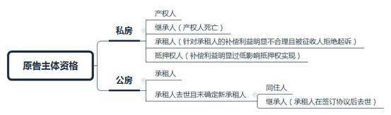
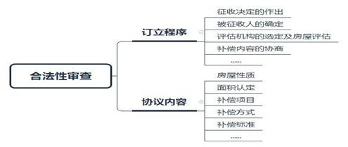
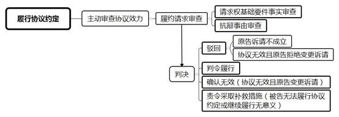

### **国有土地上房屋征收补偿协议纠纷案件的审理思路和裁判要点**

国有土地上房屋征收补偿协议是征收实施单位与公民、法人或其他组织针对国有土地上房屋征收与补偿事宜，协商订立的具有行政法上权利义务内容的协议。本文结合典型案例，对因此类协议引发的行政争议案件的审理思路和裁判要点进行梳理、提炼和总结。

一、典型案例

**案例一：原告主体资格的判断**

梁某系涉案公有房屋承租人，无同住人，房屋无其他户籍。1992年梁某死亡后，梁某之子严某将房屋租给何某。2020年，严某与区住房局签订国有土地上房屋征收补偿协议。何某认为其系房屋实际承租人，向法院起诉要求确认系争协议无效。

**案例二：协议合法性的判断**

2018年，房屋权利人孙某与区房管局签订《国有土地上房屋征收补偿协议》。同日，又签订《补充协议》，约定一笔额外补偿款。2019年，区房管局以损害公共利益为由，出具《解除通知书》，单方解除《补充协议》。孙某不服，起诉请求撤销区房管局作出的《解除通知书》。

**案例三：协议的履行与违约责任的认定**

2019年，房屋权利人周某与区住房局签订《国有土地上房屋征收补偿协议》。周某死亡后，因其子女就补偿款的分配产生争议，区住房局未在协议约定期限内支付补偿款。待周某的继承人达成财产分割调解协议后，区住房局即按调解书确定的份额发放补偿款。继承人徐某认为区住房局未按约定期限履行付款义务，构成违约，起诉住房局要求支付违约金。

二、国有土地上房屋征收补偿协议纠纷案件的审理难点

**（一）原告主体资格判定难**

实践中，被征收房屋的所有权和使用权状态较为复杂，当事人可能以房屋产权人、公有房屋承租人（执行政府规定租金标准、与公有房屋产权人或者管理人建立租赁关系的个人和单位）、继承人、同住人、私有房屋（以下简称私房）承租人，甚至抵押权人的身份，针对房屋征收补偿协议提起行政诉讼。如何准确判定原告主体是否适格，存在一定难度。

**（二）民行交叉法律适用难**

国有土地上房屋征收补偿协议属于行政协议范畴，兼具行政性和协议性，不同于一般行政行为。同时，相较于一般民事协议，国有土地上房屋征收补偿协议在协议订立、履行乃至解除等方面具有特殊性。上述特点决定了在审理此类协议纠纷案件时，可能会出现同时适用行政法律规范与民事法律规范的情形。如何准确适用行政法律规范及民事法律规范，是司法实务中的难点问题。

**（三）审查内容多、判决方式复杂**

房屋征收补偿前置环节较多，协议内容也较为复杂，涉诉争议点密集，诉讼类型多样，给付诉讼、确认诉讼、形成诉讼都会出现，在单方行政行为诉讼或履职诉讼中不会出现的违约金请求，也会在国有土地上房屋征收补偿协议案件中出现，这意味着人民法院在审理此类案件时需适用不同的审理思路及判决方式，考虑的因素也更加复杂，这无形中增加了案件审理的难度。

三、国有土地上房屋征收补偿协议纠纷案件审理思路和裁判要点

国有土地上房屋征收补偿协议类案件的审理，总体上应秉持依法行政、诚实信用、正当程序等原则，平衡好依法行政与意思自治、公共利益和个体利益之间的关系。在法律适用方面，除适用行政法律规范外，在抗辩权行使、协议效力、诉讼时效及诉讼程序等方面也可参照适用民事法律规范相关规定。鉴于此类案件涉及利益往往较大，需格外注重争议的实质性化解。案件审理时，应首先审查是否符合行政诉讼的起诉条件，包括原、被告是否适格，第三人的加入、诉讼请求的内容是否明确具体等。在符合起诉条件的情况下，再对被诉协议的合法性进行审查，判断当事人诉讼请求是否成立。具体思路如下：

**（一）起诉条件的审查**

**1****、原告资格**

征收补偿协议中载明的被征收人作为协议当事人，具备针对协议提起行政诉讼的原告主体资格。一般情况下，被征收人是私房的产权人或公有房屋的承租人。特定情况下，私房产权人或公有房屋承租人的继承人、同住人等也可能与房屋征收部门签订征收补偿协议，成为协议当事人，进而具备提起行政诉讼的原告主体资格。

签订协议之外的当事人是否具备原告主体资格，可根据房屋属性作如下区分处理：

**（****1****）被征收房屋为私房的**

①继承人。私房产权人签订协议后死亡的，其继承人虽不是协议载明的被征收人，但因其继承了产权人基于协议产生的权利义务，故可以作为原告提起行政诉讼。

②承租人。私房承租人原则上不具有针对协议提起行政诉讼的原告主体资格，但在审判实践中，以下情形的承租人可作为原告提起行政诉讼：一是协议约定的停产停业补偿、装修添附补偿、机器设备迁移费用等明显不合理，且被征收人明确拒绝起诉的；二是执行政府租金标准的私有居住出租房屋的。私有居住出租房屋是计划经济时代特殊住房政策的产物，承租人是福利分房制度的受益者。按照《上海市国有土地上房屋征收与补偿实施细则》（以下简称：《实施细则》）第30条，征收执行政府规定租金标准的私有出租居住房屋，对房屋承租人的补偿有关公有房屋承租人的补偿规定执行。此类房屋的承租人类似公有房屋承租人，有权签订补偿协议，并可针对协议提起诉讼。

③部分抵押权人。被征收房屋设有抵押权的，根据《实施细则》第39条的规定，协议应体现对抵押权人利益的安排。故在协议未体现相关内容，或征收补偿利益明显过低，影响抵押权实现等情况下，抵押权人可以就此提起诉讼。

**（****2****）被征收房屋为公有房屋的**

①同住人。公有房屋承租人在世，同住人一般不具备原告主体资格，不能独立提起行政诉讼。公有房屋承租人去世后，如未确定新承租人的，同住人可以对协议提起诉讼。

②继承人。公有房屋承租人在房屋征收补偿协议签订之后去世的，其继承人可以针对房屋征收补偿协议提起诉讼。

需要说明的是，当事人仅事实上居住于被征收房屋，不具备公有房屋承租人、同住人或继承人身份的，一般不认为具有针对协议提起行政诉讼的主体资格。案例一中，涉案房屋承租人梁某死亡后，承租人并未变更，何某也非涉案房屋的同住人或梁某的继承人，在此情况下，何某与被诉协议间不存在利害关系，其不符合法律规定的起诉条件，故法院裁定驳回了何某的起诉。

**2****、适格被告**

房屋征收补偿协议案件的被告为签订协议的区房屋征收部门。上海市各区行使房屋征收职责的部门并不完全相同，一般为区住房保障和房屋管理局，浦东新区则为区建设和交通委员会。

需要说明的是，实践中，区房屋征收部门及征收事务中心会委托属地房屋征收事务所负责具体工作，但房屋征收部门对房屋征收事务所在委托范围内实施的房屋征收与补偿行为负有监督责任，并对其行为后果承担法律责任。因此，虽然征收事务所在协议中也会签名盖章，但在此类案件中不作为共同被告。

**3****、第三人的加入**

根据《行政诉讼法》第29条第1款规定，房屋征收补偿协议案件中追加第三人的情形主要有：

**（****1****）**多人签订征收补偿协议的情况下，部分签订协议的当事人就协议提起诉讼的，人民法院应当询问其他协议签订人的意见，是否愿意作为案件原告参与诉讼。不愿意作为原告又不放弃诉讼权利的，应追加为案件第三人参与案件审理。

**（****2****）**被征收人签订协议后死亡，部分继承人就协议提起诉讼的，人民法院应询问其他继承人是否愿意作为案件原告参与诉讼。其他继承人不愿意作为原告又不放弃诉讼权利的，应追加为案件第三人参与案件审理。

**（****3****）**征收基地的安置房屋权属登记在开发商名下的，由房屋征收部门与房屋开发商签订协议，在交房及办理过户时，开发商凭房屋征收部门出具的调配单等材料与被征收人办理交房及过户等手续，再由房屋征收部门与开发商实际结算。在被征收人起诉房屋征收部门要求履行协议约定的交房义务时，出于查明案件事实及有利于执行等考虑，人民法院可以将开发商追加为第三人。

**（二）实体审理**

**1****、房屋征收补偿协议的合法性审查**

人民法院审理行政协议案件，应当依职权主动对被告订立、履行、变更、解除行政协议的行为是否具有法定职权、是否滥用职权、适用法律法规是否正确、是否遵守法定程序、是否明显不当、是否履行相应法定职责等进行合法性审查。被告在行政协议案件中，对于自己的法定职权、履行法定程序、履行相应法定职责以及订立协议的合法性承担证明责任。人民法院在审理房屋征收补偿协议时，应重点审查以下两个方面：

**（****1****）协议订立程序的合法性审查**

房屋征收补偿协议在签订前需经房屋征收决定的作出，被征收人的确定，评估机构的选定及被征收房屋评估（复核、鉴定），补偿内容的协商等程序。房屋征收部门在与被征收人签订协议前，应当确认前述程序环节已经进行完毕，并做好必要的公示、送达工作，以规范的程序保障被征收人的合法权益。某些环节的缺失，例如无房屋征收决定、未依法选定房屋评估机构，或房屋评估机构无相应资质等，属于重大程序违法；其他环节的缺失，如选择的签约主体错误、未经事先协商、未保障被征收人对分户评估报告申请复核评估或鉴定的权利等，则可通过权利人追认、补充复核评估或鉴定等方式予以补正。

对于协议订立程序存在重大明显违法的，应判决确认被诉协议无效。协议订立程序存在环节缺失的，经权利人追认、补充复核评估或鉴定等方式予以补正的，或者协议订立程序存在轻微瑕疵，不影响当事人合法权益的，在保留协议效力的同时，判决驳回当事人要求确认无效的诉请，并确认签订协议的行为违法。

**（****2****）协议内容的合法性审查**

房屋征收补偿协议在被征收房屋的性质、面积认定、补偿项目、补偿方式、补偿标准等方面具有较强的法定性。在审理房屋征收补偿协议案件时，人民法院需对协议内容的合法性进行全面审查。审查时，应注意协议内容与《国有土地上房屋征收与补偿条例》《实施细则》等法规、规章及相关规范性文件对被征收房屋的性质、面积认定、补偿项目、方式、标准等的规定是否相符。同时，还需比照协议内容是否符合被征收房屋所在地块房屋征收补偿方案、操作口径的要求。如采用房屋安置方式的，还应注意约定的安置房源是否为依法公示的安置房源、房源权属是否清晰等事项。

房屋征收补偿协议如存在《行政诉讼法》第75条规定的重大且明显违法情形的，人民法院应当确认行政协议无效。同时，《民法典》等相关民事法律规范关于合同无效情形的规定也可参照适用。总体上，对确认协议无效标准的把握应持慎重态度。房屋征收补偿协议无效的原因在一审法庭辩论终结前消除的，人民法院可以确认协议有效。

**2****、对原告诉请的分类处理**

房屋征收补偿协议案件中，当事人提出的诉讼请求通常有：请求确认协议无效，请求履行协议约定（包括要求支付临时安置补助费、支付安置补偿款、交付安置房等），请求判令房屋征收部门承担违约责任，请求变更或撤销协议，请求解除协议等几类。其中，前三种请求较为常见。

**（****1****）请求确认房屋征收补偿协议无效**

除前述人民法院应当依职权判断房屋征收补偿协议的效力外，原告也会基于特定事由诉请要求确认协议无效。这些事由通常包括：仅有部分房屋权利人签订协议（例如私房的部分共有人、公有房屋无承租人时部分同住人签订）；未给予居住困难保障；房屋面积认定错误；评估价值过低；约定补偿款项金额错误等。对上述事由的审查，总体上遵循前述依职权审查协议效力的思路。

房屋征收补偿协议经审查不存在法律规定无效情形的，人民法院应判决驳回起诉。经审查确认协议部分无效不影响协议整体效力的，判决确认协议部分无效。当事人因协议取得的财产，人民法院应当判决予以返还；不能返还的，判决折价补偿。房屋已被拆除的，补偿标准应当参照征收补偿标准确定。因被告的原因导致协议被确认无效的，可以同时判决责令被告采取补救措施；给原告造成损失的，人民法院应当判决被告予以赔偿。

需要指出的是，对于被征收户因家庭矛盾较大，房屋共有人或同住人之间无法就补偿安置达成一致，导致最终只有部分共有人或同住人与房屋征收部门签订协议的，不宜轻易以签约主体不全认定协议无效。原因在于，房屋征收补偿协议的内容具有较强的法定性，且系对被征收房屋的户内人员进行补偿，故签约主体不全并不必然影响协议内容的合法性。在协议内容符合法律规定，一旦认定协议无效反而可能导致无法再行签约，进而使全体户内人员利益受损的情况下，从最大化保障该户补偿安置利益的角度出发，应当保留协议的效力。同时，可引导当事人通过民事途径解决补偿利益分割问题。

**（****2****）要求被告履行房屋征收补偿协议的约定**

原告诉请被告履行协议的，人民法院应当在确认协议有效的基础上，基于请求权基础对原告的履行请求进行审理。原告的请求权基础主要为双方签订的房屋征收补偿协议中的具体条款。协议条款如涵义不清的，人民法院应当根据房屋征收补偿相关法律规范、所在地块补偿安置方案及口径的规定，结合案件事实，基于诚实信用原则进行解释。原告应对其诉请符合请求权基础要件事实承担证明责任，包括已签订协议、已履行协议约定的腾房义务等。被告如提出抗辩，则应就抗辩事实承担证明责任，例如对其已履行补偿安置义务承担证明责任；主张存在不可抗力的，对发生不可抗力且影响义务履行承担证明责任；提出诉讼时效抗辩的，就原告行使请求权已超过诉讼时效承担证明责任。

根据《最高人民法院关于审理行政协议案件若干问题的规定》第19条的规定，在被告无正当理由未履行或不完全履行协议的情况下，人民法院应当结合原告的诉讼请求，判令被告履行协议，并明确具体的履行内容及期限。在被告无法履行协议约定或继续履行无实际意义的情况下，人民法院应当判令被告采取相应的补救措施。原告诉请不成立的，人民法院应当判决驳回原告的诉讼请求。原告虽诉请履行协议，但人民法院经审理认为协议应为无效的，应当向原告释明。原告经释明后变更诉请为确认协议无效的，人民法院依前述审理思路进行审理；原告经释明后拒绝变更诉讼请求的，人民法院可以判决驳回其诉讼请求。

原告提起履行协议的诉讼前，房屋征收部门如已单方面变更、解除房屋征收补偿协议的，原告可以选择：一是起诉要求继续履行协议，此时适用前述履行协议案件的思路进行审理。房屋征收部门解除或变更协议的理由可作为抗辩事由。二是起诉要求撤销该变更、解除协议的行为，被告对其单方变更、解除行为的合法性承担证明责任。审理时，总体上应遵循行政诉讼撤销之诉的审理思路，根据法律规定，并结合协议变更对公共利益及个人利益的影响等因素，对被告行为的合法性进行审查。

如案例二中，人民法院经审查后认为，《补充协议》的内容缺乏法律法规及政策依据，存在对孙某过度补偿的情况，对于此前按照补偿方案签约搬离的被征收人明显有失公平，构成对社会公共利益的损害，属于违法补偿，区住房局单方解除《补充协议》符合法律规定，且并不违背诚实信用原则，遂判决驳回了孙某的诉请。

**（****3****）要求被告承担违约责任**

对于原告要求被告承担违约责任的，人民法院在审理时，应当首先审查被告是否存在未履行义务的情形，例如是否未支付补偿款、交付安置房等，以及未支付过渡安置费等。被告无正当理由未履行协议，原则上应当认定违约。违约责任的承担首先应根据协议约定内容确定，如协议未约定的，可以参照适用民事法律规范关于违约责任的相关规定。

需要指出的是，实践中有部分案件，被征收人已与房屋征收部门签订房屋征收补偿协议，但在具体分割补偿安置利益时，家庭内部发生矛盾，导致补偿款或安置房屋的交付自始存在困难。房屋征收部门为免激化矛盾，避免因部分交付导致其他成员利益受损，未按照协议约定时间履行义务，而是告知相关人员先行就补偿利益分割达成一致，或通过诉讼获得分割判决后再予以支付。这种情况，一般不应认定违约。

如案例三中，因系争房屋户内人员对补偿利益分配存在争议，部分人员撤销了对徐某领取款项的授权，并提起分割诉讼。此时，区住房局暂停发放补偿款项，并在系争房屋户内人员通过民事诉讼达成分割协议后，按照民事调解书确定的份额及时启动款项支付。其支付客观上虽迟于约定时间，但有利于保障和平衡系争房屋户内人员的利益，最大限度减少发生后续纠纷的可能，故不应认定违约。

**（****4****）要求撤销、变更或解除协议**

当事人认为房屋征收补偿协议存在胁迫、欺诈、重大误解、显失公平、或出现新的事实导致协议内容可能发生变化等情形的，可以诉请变更或撤销协议。原告应当对协议条款存在可变更、撤销情形承担证明责任。人民法院经审理，认为补偿协议条款存在可变更情形的，在变更能更好实现协议目的的情况下，可结合原告的变更请求，作出相应判决；认为协议条款符合法律规定可撤销情形的，可依法判决撤销该协议。协议被撤销后，当事人因协议取得的财产，人民法院应当判决予以返还；不能返还的，判决折价补偿。因被告的原因导致协议被撤销的，可以同时判决责令被告采取补救措施。需要注意的是，当协议变更或撤销可能会对公共利益造成更大损害时，人民法院应判决驳回原告诉请，同时判令被告采取补救措施。

根据《最高人民法院关于审理行政协议案件若干问题的规定》第27条规定，人民法院审理行政协议案件，可以参照适用民事法律规范关于民事合同的相关规定。故参照民事法律规范相关规定，原告主张解除协议的，应当以存在协议无法履行、发生情势变更导致继续履行显失公平、被告违约导致协议目的无法实现，或存在约定解除权行使条件成就等情形为前提，原告应当对存在解除事由承担证明责任，且解除权应当在约定或合理期限内行使。又根据前述规定第17条，人民法院认为房屋征收补偿协议符合约定或者法定解除情形，且不损害国家利益、社会公共利益和他人合法权益的，可以判决解除协议。协议解除后，尚未履行的，终止履行；已经履行的，应当根据案件具体情况判令恢复原状、采取相应补救措施，或赔偿损失等。

此外，原告主张变更、撤销、解除房屋征收补偿协议，应当以协议有效成立为前提。人民法院经审理认为协议无效的，应当向原告释明，并根据原告变更后的诉讼请求判决确认协议无效。原告经释明后拒绝变更诉讼请求的，人民法院可以判决驳回诉讼请求。

**（三）协调化解**

房屋征收补偿协议案件不仅牵涉被征收人的重大切身利益，而且事关征收项目的推进，在依法审理此类案件的同时，应当着力争取争议的实质性化解，尤其是调解可能性较大的场景，如家庭内部矛盾导致补偿利益无法及时发放，协议约定的补偿内容可能未对被征收人予以充分补偿等。

协调化解时，可以组织征收双方及其他争议方在法律规定及补偿方案、口径规定的范围内对相关争议问题进行协商，例如变更补偿方式、安置房源、调整过渡安置费的支付方式和期限、变更履行期间、违约金的承担等。户内人员对补偿利益存在争议，但在协商过程中愿意就利益分割进行协商的，也可以组织户内人员开展协调。协调化解过程中，应同步开展法律释明，打消当事人对补偿内容的不合理期待，在法律及政策的框架下确定补偿方案。除了由案件主审法官为双方搭建沟通平台，还可以借助多元调解平台等机制，或向相关单位发送协助化解矛盾建议函等方式，充分发挥基层组织、其他行政机关等单位的力量，共同助力争议的实质性解决。

对于经协调化解达成一致的，可以通过制作笔录、留存协议等方式进一步确认，由原告撤诉结案；也可以根据双方要求，出具调解书。调解书内容应当具体明确、具有可执行性。

四、其他需要说明的情况

在被征收人不履行房屋征收补偿协议约定义务的情况下，房屋征收部门有权作出要求被征收人履行协议约定义务的决定，被征收人不服的，可以提起撤销诉讼。对此类案件的审理，总体上遵循行政撤销之诉的审理思路，不作展开。

（根据行政庭宁博、张昊提供材料整理）