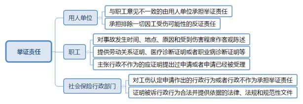
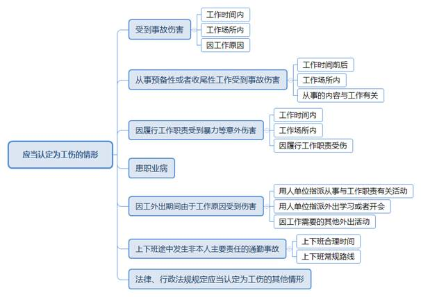
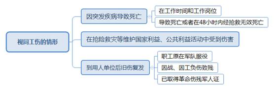

### **工伤认定行政案件的审理思路和裁判要点**

工伤认定是社会保险行政部门根据职工及用人单位的申请，按照《工伤保险条例》规定的条件，在法定期间内作出是否赔付工伤保险待遇的行政确认行为。工伤认定行政案件围绕认定或者不予认定工伤行为的合法性进行审查，以监督社会保险行政部门依法行政，维护职工和用人单位的合法权益。现立足于审判实践，对工伤认定行政案件的审理思路和裁判要点进行梳理、提炼和总结。

一、典型案例

**案例一：涉及与履行工作职责相关合理场所的判断**

孙某受公司指派去机场接人。孙某从公司办公大楼下楼，欲至院内停车场开车，行至一楼门口台阶处脚滑摔倒，经医院诊断为颈髓过伸位损伤合并颈部神经根牵拉伤、上唇挫裂伤、左手臂擦伤、左腿皮擦伤。孙某申请工伤认定，区人社局认为没有证据表明摔伤事故系工作原因造成，决定不予认定工伤。孙某不服，诉至法院请求撤销上述不予认定工伤决定。

**案例二：涉及上下班途中交通事故诱发疾病的认定**

胡某在上班途中发生交通事故致右大腿外伤。当日，胡某因急性下壁心肌梗死就医诊治。经司法鉴定，胡某原有冠状动脉粥样硬化心脏病，本次交通事故诱发冠心病急性发作，存在间接因果关系，关联度为15%。区人社局据此作出决定，认定胡某因交通事故致使右大腿外伤属于工伤，但未将冠心病认定为工伤。胡某不服，认为区人社局对此事故诱发冠心病未认定为工伤明显不当，诉至法院请求撤销被诉工伤认定决定。

**案例三：涉及外地出差期间因突发疾病死亡的审查**

毕某按公司要求赴外地出差，在出差期间突发疾病后送医抢救后48小时内死亡。医院诊断为心源性猝死导致死亡。毕某家属向区人社局提出工伤认定申请，区人社局经调查后认定毕某外地出差期间突发疾病导致死亡视同工伤。该公司不服，以毕某突发疾病死亡并非在工作岗位和工作时间为由诉至法院，请求撤销工伤认定决定。

二、工伤认定行政案件的审理难点

工伤保险是社会保险体系的重要组成部分，既注重对受伤职工的医治关怀，又考虑督促用人单位改善劳动保护条件，实现社会整体利益的最大化。实践中，职工所从事的行业类型相对多样，不同工种面临的职业环境风险亦存在差异，对工伤认定行为的司法审查存在若干难点。

**（一）“三工”因素判断难**

“三工”因素（工作时间、工作地点、工作原因）构成工伤认定的基本要件，也是审判实务中最难把握的问题。职工主动加班、因工外出以及“八小时”工作制外的时间能否认定为工作时间，往往存在不同理解。固定工作岗位外的相关区域以及单位控制范围外的地点是否属于工作场所，在司法实践中亦有争议。工伤认定还要考虑“因工受伤”的因素，因特定职务或者特殊工作性质，在外出途中、就餐期间、工作间隙等受伤是否系工作原因所致，无法径行作出判断，认定结果往往存在分歧。

**（二）工伤认定特殊情形把握难**

《工伤保险条例》通过列举的方式，明确应当认定为工伤和视同工伤的不同情形，并且将故意犯罪、醉酒或者吸毒、自残或者自杀等情形排除在工伤范围之外。实践中的劳动用工形态非常多样，不同领域工作内容亦差异明显，案件涉及的工伤认定事实远比法律列举的情形更加复杂。尤其针对可能视同工伤的特殊情形，职工、用人单位以及社会保险行政部门往往出现分歧意见，司法审查标准亦难以把握。

**（三）事实劳动关系证明难**

职工能否享受工伤保险待遇与劳动关系的存在具有密切联系，但对于事实劳动关系的证明存在困难。部分职工受无用工主体资格的单位或个人指派进行工作，只能提供证明效力较低的关联材料，用人单位往往以劳务、承包、租赁、代理等关系否认事实劳动关系存在，甚至以职工在岗前培训期、试用期或招工时提供虚假个人信息等作为否认事实劳动关系的依据，需要对这些抗辩理由逐项甄别。

**（四）职工和用人单位之间权益平衡难**

工伤认定行政案件的审理需要考虑相应的社会效果，坚持预防为主、康复优先、救助及时的原则，有效防范和减少工伤事故。同时，也要在保障职工合法权益和降低用人单位负担之间实现平衡。在工伤认定领域，职工和用人单位之间往往存在利益冲突且不易调和，案件裁判难以综合平衡两者权益，涉案行政争议的实质性化解阻力较大。

三、工伤认定行政案件的审理思路和裁判要点

公民、法人或者其他组织对于工伤认定行政行为不服，可以提起行政诉讼。法院受理的该类案件范围，主要涉及社会保险行政部门作出的不予受理工伤认定申请的决定、工伤认定结论以及其他具体行政行为。**针对工伤认定行为的司法审查，法院应当从职权依据、执法程序、事实认定和法律适用等方面进行综合判断，既体现人文关怀和示范导向，又综合考虑社会承受能力，保障受伤职工的医疗和生活救助有效实现。**

**（一）确定诉讼参加人和分配举证责任**

工伤认定行政案件诉讼参加人主要包括职工及其近亲属、用人单位以及社会保险行政部门等。根据案件具体情况，上述主体的诉讼地位对应原告、被告或者第三人。法院要在考虑职工、用人单位和社会保险行政部门举证能力差异的基础上合理分配举证责任。

**1****、确定案件诉讼参加人**

**一是**适格原告。用人单位、受到事故伤害或者患有职业病的职工及其近亲属，可以提起工伤认定申请，对社会保险行政部门作出的行政行为或者行政不作为不服，亦可以提起行政诉讼。

**二是**适格被告。因不服社会保险行政部门对工伤认定申请作出的行政行为提起诉讼，由作出工伤认定的行政机关作为被告。经过复议程序后，复议机关决定维持原行政行为的，原行政行为作出机关和复议机关作为共同被告；复议机关改变原行政行为的，复议机关作为被告。针对行政不作为提起诉讼的，由具有工伤认定职责的社会保险行政部门作为被告。

**三是**适格第三人。职工或其近亲属提起工伤认定行政诉讼，法院受理后通知用人单位作为第三人参加诉讼。用人单位对工伤认定决定不服提起诉讼，法院受理后通知受伤害职工作为第三人。如果职工死亡则由其法定代理人、近亲属或者其他利害关系人参加诉讼。

**2****、举证责任分配**

**一是**用人单位的举证责任。根据《工伤保险条例》第19条规定，职工或者其近亲属认为是工伤，用人单位不认为是工伤的，由用人单位承担举证责任。这是由于职工和用人单位在证据持有、举证能力、生产经营地位和安全保障义务等方面存在明显区别，举证责任倒置更有利于查明案件事实。在对“三工”因素以及与“工作时间和工作岗位突发疾病”等事实的认定中，用人单位承担排除一切因工受伤可能性的反证责任。职工若在试用期、培训期与用人单位形成管理与被管理、监督与被监督关系，用人单位亦不能否认劳动关系的存在。

**二是**职工的举证责任。职工在劳动关系中处于被管理的从属地位，在工伤认定申请过程中承担对工伤事实的初步证明责任，对工伤事故发生的时间、地点、原因和受伤害程度进行客观陈述，并提供劳动关系证明、医疗诊断证明或者职业病诊断证明等材料。职工主张社会保险行政部门对其工伤认定申请行政不作为的，应提供其曾向该部门提出过申请或者该部门已经受理申请的证据。

**三是**社会保险行政部门的举证责任。社会保险行政部门就工伤认定申请作出的行政行为或者行政不作为承担举证责任，应当提供证据证明被诉行政行为合法以及所依据的法律、法规和规范性文件。在认定工伤过程中，社会保险行政部门可以根据审核需要对事故伤害进行调查核实，进而作出认定结论。

**（二）工伤认定行政案件的审理要素**

在工伤认定行政案件中，职权依据一般不存在争议，当事人争议焦点往往集中在事实认定和法律适用两方面。工作时间、工作场所和工作原因构成工伤认定的重要标准，工伤保险义务主体的确定对于职工权益的实现也至关重要。

**1****、劳动关系存续期间的审查**

劳动关系是职工与用人单位依据劳动法律规范，在劳动过程中形成的权利义务关系。用人单位自用工之日起即与劳动者建立劳动关系，实践中一般以签订劳动合同作为认定职工地位的依据。通过签订书面劳动合同形成的劳动关系是规范的劳动关系，在该情形下劳动关系存续期间的认定并不困难。劳动者与用人单位依法应当签订而未签订书面劳动合同，但同时具备下列情形的，可以认定双方形成了事实劳动关系：**一是**用人单位和劳动者符合法律、法规规定的主体资格；**二是**用人单位依法制定的各项劳动规章制度适用于劳动者，劳动者受用人单位的劳动管理，从事用人单位安排的有报酬的劳动；**三是**劳动者提供的劳动是用人单位业务的组成部分。一般可以根据工资支付凭证或者记录、社会保险证明、工作证、服务证、招工登记表、报名表、考勤记录等证据，综合认定双方之间是否存在事实劳动关系。然而，在特殊情况下，如职工因工作时间很短尚未领取工资、尚未办理相关证件、尚未缴纳相关费用，很难提供前述证据材料的，只能以持有的工作服、劳动工具、办公用具、文件资料、职工宿舍证明、其他职工证言等证明劳动关系。

**2****、“三工”因素的审查**

“三工”因素中，工作原因是核心因素，工作时间和工作场所是用以判断工作原因的辅助因素。

**工作时间**一般是指劳动合同约定的工作时间、用人单位规定的工作时间、加班加点工作时间以及完成用人单位临时指派工作的时间。职工和用人单位之间通常会对从事工作事务的时间节点加以约定，如果职工在正常工作时间之外未经单位强制安排主动加班，只要从事本职工作则一般可以认定为工作时间，用人单位有充分证据证明职工该时间处理私人事务的除外。

**工作场所**是指用人单位能够对其日常生产经营活动进行有效管理的区域、职工为完成特定工作涉及的相关区域以及自然延伸的合理区域。一般而言，工作岗位可以确定为工作场所。职工为完成某项特定工作应当经过或者可能经过的相关区域亦属于工作场所。

如案例一中，孙某在公司办公大楼中的工作岗位属于工作场所，而其为完成赴机场接人任务需驾驶车辆所在的停车场是另一工作场所。从办公大楼到停车场，属于孙某往返于两个工作场所之间的合理区域，也应当认定为工作场所。区人社局认为孙某摔伤地点不属于工作场所，将完成工作任务的合理路线排除在工作场所之外，既不符合立法本意，也有悖于常理。因此，法院判决撤销区人社局作出的不予认定工伤的决定。

**工作原因**是指职工所受事故伤害系因从事本职工作、用人单位临时指派工作或因从事工作的相关行为所致。职工受伤与从事本职工作之间存在因果关系。判断职工受伤的原因，应当考虑是否履行工作职责、是否受用人单位指派、是否与工作职责有关、是否基于用人单位的正当利益等因素，职工在从事工作的过程中存在过失并不影响因果关系的成立。职工在工作时间和工作场所内受到事故伤害，用人单位或者社会保险行政部门没有证据证明是由于非工作原因导致的，一般应当认定属于工伤范围。

**3****、工伤保险责任承担主体的审查**

由于劳动用工形态复杂多样，在特殊情况下确定工伤保险责任的承担主体相对复杂。鉴于实践中存在双重或者多重用工的情形，职工在实际用人单位发生伤亡事故，如果符合认定工伤条件应当认定为工伤。根据劳动和社会保障部的规定，部分职工在两个或两个以上用人单位同时就业，各用人单位应分别为职工缴纳工伤保险费，发生工伤后由职工受到伤害时的工作单位承担工伤保险责任。

在涉及劳务派遣、挂靠、指派、转包等关系时，确定承担工伤保险责任主体的规则如下：**一是**劳务派遣单位派遣的职工在用工单位工作期间因工伤亡的，派遣单位为承担工伤保险责任的主体。**二是**个人挂靠其他单位对外经营，其聘用的人员因工伤亡的，被挂靠单位为承担工伤保险责任的主体。**三是**单位指派到其他单位工作的职工因工伤亡的，指派单位为承担工伤保险责任的主体。**四是**用工单位违反法律、法规规定将承包业务转包给不具备用工主体资格的组织或者自然人，该组织或者自然人聘用的职工从事承包业务时因工伤亡的，用工单位为承担工伤保险责任的主体。

在挂靠关系和转包关系中，承担工伤保险责任的单位赔偿或者社会保险经办机构从工伤保险基金支付工伤保险待遇后，有权向相关组织、单位和个人追偿。

**4****、工伤认定行政程序的审查**

用人单位应当自职工发生事故伤害之日或者被诊断、鉴定为职业病之日起30日内，向社会保险行政部门提出工伤认定申请。经报社会保险行政部门同意，可以适当延长申请时限。用人单位未按规定提出工伤认定申请，职工或其近亲属、工会组织在事故伤害发生或者被诊断、鉴定为职业病1年内，可以直接向社会保险行政部门提出申请。由于不属于职工或其近亲属自身原因超过工伤认定申请期限的，被耽误时间不计算在工伤认定申请期限内。上述原因包括不可抗力、人身自由受到限制、用人单位原因、社会保险行政部门登记制度不完善、当事人对是否存在劳动关系申请仲裁、提起民事诉讼等。

社会保险行政部门应当自受理之日起60日内作出工伤认定决定，并书面通知职工或其近亲属和用人单位。社会保险行政部门对事实清楚、权利义务明确的申请，应当于15日内作出工伤认定决定。作出工伤认定决定需要以司法机关或者有关行政主管部门的结论作为依据的，在尚未作出结论期间，作出工伤认定决定的时限中止。

**（三）应当认定为工伤情形的审查要点**

符合工伤认定的情形相对复杂，需要充分考量工作时间、工作场所和工作原因等因素，综合判断是否符合工伤认定条件。

**1****、上下班途中发生非本人主要责任通勤事故的审查**

将通勤事故纳入工伤保险范围，是社会保障制度发展的必然结果，但该通勤事故仅限于上下班途中。“上下班途中”一般是指职工在合理时间和合理路线范围内往返于单位和住处的过程。

对于**上下班时间**，除考虑距离因素外，还应结合路况条件、交通工具、季节气候、偶然事件等作出客观合理的判断。

对于**上下班路线**，上下班的合理途径并非必经或者唯一的路线，职工居住地和工作场所之间的路线并不限于最短的路线，也不应由用人单位进行指定。在涉及是否绕行的问题上，可以综合考虑绕行的必要性和距离长短，并结合交通拥堵、车辆故障等因素作出判断。

下列情形可以认定为“上下班途中”：**一是**在合理时间内往返于工作地与住所地、经常居住地、单位宿舍等合理路线的上下班途中；**二是**在合理时间内往返于工作地与配偶、父母、子女居住地等合理路线的上下班途中；**三是**从事日常工作生活所需要的活动，且在合理时间和合理路线的上下班途中；**四是**在合理时间内其他合理路线的上下班途中。在工伤认定的过程中，需要从法律内在逻辑出发正确理解通勤事故的范围，在涉及诱发原有疾病等情况下，不宜过宽或者过窄适用。

如案例二中，胡某在上班途中发生己方无责的交通事故，由此导致的外伤应认定为工伤。然而，胡某在交通事故后诱发的冠心病急性发作，并非由交通事故直接导致，经鉴定与交通事故之间并不存在较大关联。上下班途中发生交通事故直接产生的伤害应认定为工伤，间接诱发的疾病则不属于工伤认定的疾病范畴。区人社局将胡某因交通事故直接造成右大腿外伤认定为工伤，而未将胡某在交通事故后诱发的冠心病、急性心肌梗死认定为工伤，并无不当。因此，法院判决驳回胡某提出的撤销工伤认定决定的请求。

**2****、因工外出期间由于工作原因受到伤害的审查**

根据《工伤保险条例》第14条规定，因工外出期间，由于工作原因受到伤害或者发生事故下落不明的，应当认定为工伤。“因工外出期间”限于职工受单位指派或者因工作需要离开本职岗位到本地其他地方、外地或者境外等，从事与工作职责有关的活动。下列情形一般属于“因工外出期间”：**一是**职工受用人单位指派或者因工作需要在工作场所以外从事与工作职责有关活动期间；**二是**职工受用人单位指派外出学习或者开会期间；**三是**职工因工作需要的其他外出活动期间。

因工外出期间具有特殊性，工作时间中包含休息、旅途等时间，工作场所具有流动性，工作内容和工作状态也存在很多不可预测性。一般认为，职工受单位指派外出学习期间在安排的休息场所受到伤害的，应当认定为工伤；但从事与工作或者受用人单位指派外出学习、开会无关的个人活动受到伤害，一般不认定为工伤。对于造成事故伤害的原因，应从是否属于本岗工作、是否属于单位临时指派的工作、是否属于单位重大紧急情况等方面综合考量。

**3****、工作时间和工作场所内因履行职责受到意外伤害的审查**

职工在工作时间和工作场所内，因履行工作职责受到暴力等意外伤害的，应当认定为工伤。暴力伤害与履行工作职责是否具有必然的、直接的因果关系判断，核心标准在于伤害是否属于履行工作职责所引发。在工作期间因工作产生纠纷受到他人伤害，可以认定为工伤；如果并非工作原因引起，则属于普通人身伤害，不应认定为工伤。如果基于工作原因、工作需要或者就餐、如厕等正常生理需要受到不可预见的意外伤害，可以认定为属于工作原因；如果因个人恩怨引发，则不能认定为工作原因。

履行工作职责受到暴力伤害可能存在滞后性。可能当场没有出现暴力侵害，但在一段时间后出现暴力侵害，甚至由第三人加害。此种情况下，即使不在工作时间或不在工作场所，如果伤害确因履行工作职责引起，也能认定为工作原因，则认定为工伤更符合保护职工合法权益的立法目的和立法原则。

**4****、其他应当认定为工伤情形的审查**

工作时间前后在工作场所内从事与工作有关的预备性或者收尾性工作受到事故伤害的，应当认定为工伤。这里的“预备性或者收尾性工作”是指工作所必需的准备或收尾工作，以及为保障人体正常生理、生活需要所必需的活动。

患职业病的应当认定为工伤。关于“患职业病”的认定，一般以职业病诊断证明书或者职业病诊断鉴定书的结论为准。鉴定结论不符合国家规定的要求和格式，社会保险行政部门可以要求重新提供。职业病诊断鉴定结论所列明的单位对其承担工伤保险责任有异议的，社会保险行政部门可以依据鉴定结论先行认定职工的职业病为工伤。

**（四）视同工伤情形的审查要点**

在司法审查中，应当准确查明案件涉及的有关事实，并依据有关立法精神和裁量基准，对是否符合视同工伤的条件作出判断。

**1****、在工作岗位因突发疾病导致死亡的审查**

突发疾病认定为工伤需满足相应条件：**一是**在工作时间和工作岗位；**二是**导致死亡或者在48小时内经抢救无效死亡。满足上述条件，即使疾病发生是由于个人身体原因而不是工作原因，也可以认定为工伤。根据《劳动和社会保障部关于实施〈工伤保险条例〉若干问题的意见》第3条规定，上述“48小时”应以医疗机构的初次诊断时间作为突发疾病的起算时间。在工作时间和工作岗位因突发疾病当场死亡，认定符合视同工伤的情形通常争议不大。如果不是当场死亡，则需要提供医疗机构的诊疗记录等作为证明，进而作出工伤认定决定。出差途中以及从事准备性、收尾性工作突发疾病并在48小时内死亡的，应当根据实际情况判断是否符合工伤认定的要件。

如案例三中，毕某受公司委派出差，出差期间居住在公司为其安排的酒店客房内，出差期间的工作时间有一定连续性，工作地点有一定延展性。毕某在出差期间死亡，应视为在工作时间和工作场所内，区人社局认定毕某死亡视同为工伤符合法律规定。因此，法院判决驳回公司提出的撤销工伤认定决定的请求。

**2****、其他视同工伤情形的审查**

视同工伤的情形还包括在抢险救灾等维护国家利益、公共利益活动中受到伤害，以及职工原在军队服役，因战、因公负伤致残，已取得革命伤残军人证，到用人单位后旧伤复发。在司法实践中，主要审查伤害与抢险救灾等活动的关联度，以及旧伤复发是否系因战、因公负伤致残引起。需要注意的是，退役军人到用人单位旧伤复发，如果符合认定工伤的情形，可以享受除一次性伤残补助金以外的工伤保险待遇。

**（五）工伤认定排除情形的审查要点**

职工符合应当认定工伤的要件，但是故意犯罪、醉酒或者吸毒、自残或者自杀的，不得认定为工伤或者视同工伤。审查是否符合工伤认定的排除情形，一般以有权机构出具的事故责任认定书、结论性意见和人民法院生效裁判等法律文书为依据，但有相反证据足以推翻事故责任认定书和结论性意见的除外。前述法律文书不存在或者内容不明确，社会保险行政部门就相关事实作出认定的，应当结合相关证据进行审查。

四、其他需要说明的问题

本文主要涉及针对社会保险行政部门作出认定或者不予认定工伤行为的司法审查，不涉及工伤保险待遇问题，当事人对此有异议可以通过民事诉讼途径解决。

（根据行政庭周峰、刘天翔提供材料整理）