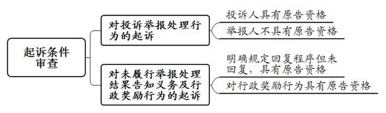
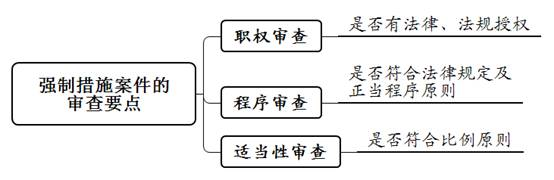
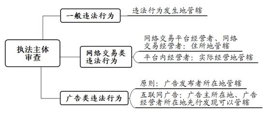
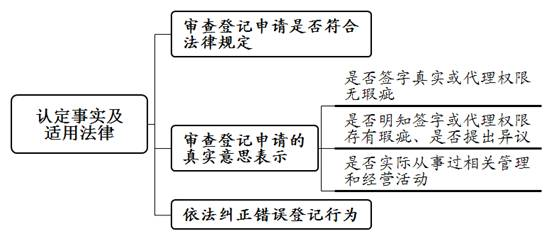

### **市场监督管理行政案件的审理思路和裁判要点**

市场监督管理行政案件，是指当事人因不服市场监督管理部门的执法行政行为而提起的行政诉讼案件。市场监管涉及执法领域广、专业性强，与经营主体、消费者及营商环境优化密切相关。为提高办案质量和效率，促进统一法律适用，本文根据市场监督管理部门的执法共性特点，选取该类案件中较为常见的四种类型，即投诉举报履职案件、行政强制措施案件、行政处罚案件以及工商登记案件，结合司法实践中的典型案例，对相关审理思路、裁判要点等进行梳理、提炼和总结。

一、典型案例

**案例一：涉及投诉举报起诉条件的判定**

姚某向某市场监督管理局举报称，A公司存在超范围经营的违法行为。该局立案调查后认定A公司存在被举报的违法行为，遂对A公司作出罚款的行政处罚。姚某不服，以该局对A公司处罚过轻等为由诉至法院，请求撤销处罚决定。

**案例二：涉及行政强制措施程序的审查**

某市场监督管理局认定B公司涉嫌销售侵犯注册商标专用权的白酒，于2019年4月17日作出强制措施决定，对案涉白酒予以扣押。同年7月11日该局作出延长期限决定，将扣押期限延长至同年8月8日。到期后该局未解除扣押，亦未作出处理决定。B公司不服，以强制措施超期为由诉至法院，请求确认强制措施违法并解除扣押。诉讼中，该局对B公司作出没收案涉白酒的行政处罚。

**案例三：涉及行政处罚自由裁量的认定**

某市场监督管理局查获C商店销售过期瓜子1袋，货值为12.8元。该局认定C商店实施了销售过期食品的违法行为，遂对其作出罚款5万元的行政处罚。C商店不服，以其销售货值低、未造成任何实际危害后果，且未销售其他同类过期食品，该局处罚决定裁量不当为由诉至法院，请求撤销行政处罚决定。

**案例四：涉及工商登记审查标准的判断**

D公司委托工作人员向某市场监督管理局申请将公司法定代表人由崔某变更为张某，并向该局提供了申请书、委托书、股东会决议等材料。该局经审查，认为D公司提供的申请资料齐全，签字、盖章等内容完备，符合法定形式，遂准予变更登记。后崔某以D公司提交的材料虚假、该局未尽合理审查义务为由诉至法院，请求撤销变更登记。

二、市场监督管理行政案件的审理难点

**（一）职权范围审查难**

市场监督管理行政执法体制建立在原工商、质监、食药部门的执法基础上，执法种类较多，所涉执法主体的职权依据和范围散见在多类法律规范中，增加了职权范围的审查难度。例如，行政处罚案件中针对电子商务类、广告类等违法行为，执法主体有所不同，法律规定较为复杂。

**（二）执法程序审查难**

市场监督管理涉及的执法程序规定繁杂，层级多、类型多，不同执法领域所涉行政行为对应的程序有所不同，投诉举报履职、行政强制措施、行政处罚、工商登记均存在相应程序规定，且部分条文也存在重复、交叉，具体审查过程中易发生错误和遗漏。此外，对于市场监督管理部门在执法办案过程中存在的程序遗漏、超期等程序问题，需要结合具体事实情节、影响程度等综合判断是否构成程序瑕疵或违法，如何平衡好执法效率与执法公正的关系是程序审查的重点和难点。

**（三）事实认定审查难**

市场监督管理执法涉及食品、药品、广告、商标等多个领域，监管范围覆盖市场准入、产品质量、公平交易、网络交易、企业信用等，范围广且专业性强，判断市场监督管理部门认定的违法事实是否清楚、证据是否充分，经常需要专业技术鉴定，增加了事实认定难度。此外，实践中如何判定市场监督管理部门对工商登记材料的审查已尽到“审慎审查义务”，在司法审查中较难把握。

**（四）处罚裁量把握难**

市场监督管理领域处罚金额幅度和自由裁量权限均较大，各执法领域中违法行为的发生原因又情况各异，法院应区分不同的行为方式、事实情节、违法后果，综合判定处罚裁量是否适当。如在食品监管领域，如何平衡好维护食品药品安全、保护消费者合法权益与依法惩处违法行为人之间的关系，做到“过罚相当”“罚教结合”，是司法实践中较难把握的问题。

三、市场监督管理行政案件的审理思路与裁判方法

市场监督管理行政案件司法实践中，投诉举报履职案件、行政强制措施案件、行政处罚案件以及工商登记案件是最为常见的类型，本文针对这些案件中的常见问题总结裁判要点。审理此类案件应当立足于服务保障营商环境大局，正确平衡执法公正与执法效率的关系，监督行政机关依法行政，切实维护消费者和市场主体的合法权益。

**（一）市场监管投诉举报履职案件的审查要点**

投诉举报履职案件是投诉举报人针对市场监督管理部门未履行或未充分履行监管职责而提起的诉讼。审理中应重点对起诉条件以及投诉举报程序、回复内容等的合法性进行审查。

**1****、起诉条件审查**

**（****1****）对投诉举报处理行为的起诉**

根据《最高人民法院行政审判庭行政法官专业会议纪要（六）（投诉领域）》，投诉和举报的区分标准为：公民、法人或者其他组织认为第三人实施的违法行为侵犯自身合法权益，请求行政机关依法查处的，属于“投诉”。投诉人与行政机关对其投诉作出或者未作出处理的行为有法律上的利害关系。公民、法人或者其他组织认为第三人实施的违法行为侵犯他人合法权益或者国家利益、社会公共利益，请求行政机关依法查处的，属于“举报”。举报人与行政机关对其举报作出或者未作出处理的行为无法律上的利害关系。

根据前述意见，第一，如原告作为投诉人，其与市场监督管理部门投诉处理行为之间具有利害关系，符合行政诉讼起诉条件，应当予以受理。第二，如原告作为举报人，非基于维护自身合法权益而进行举报，其与市场监督管理部门对被举报人处罚或不予处罚等相关处理结果之间并无利害关系，故原告对相关处罚决定或具体处理结果不服提起诉讼，应当裁定驳回起诉。如案例一中，姚某并非消费者，其向市场监督管理部门举报后，又针对该局对被举报公司作出的处罚决定提起行政诉讼。因其与该处罚决定并无直接利害关系，不具有提起本案行政诉讼的原告资格，故法院裁定驳回姚某的起诉。

**（****2****）对未履行举报处理结果告知义务及行政奖励行为的起诉**

根据《市场监督管理投诉举报处理暂行办法》相关规定，对于法律、法规、规章规定市场监督管理部门应当将举报处理结果告知举报人或者对举报人实行奖励的，市场监督管理部门应当予以告知或者奖励。因此，如相关规定对于举报处理结果告知程序有明确规定，而市场监督管理部门未依法进行告知，举报人起诉要求行政机关予以答复的，应赋予举报人原告资格。举报人针对行政奖励行为起诉的，因其与相关奖励行为具有行政诉讼上的利害关系，亦具有原告资格。

**2****、合法性审查**

**（****1****）执法权限**

审查市场监督管理部门对投诉举报事项作出相应处理是否具有相应执法权限，应注意区分投诉、举报两种类型，判断行政机关是否存在超越职权、滥用职权的情形。

第一，投诉行为的管辖。投诉由被投诉人实际经营地或者住所地县级市场监督管理部门处理。电子商务平台经营者以及通过自建网站、其他网络服务销售商品或者提供服务的电子商务经营者的投诉，由其住所地县级市场监督管理部门处理。对平台内经营者的投诉，由其实际经营地或者平台经营者住所地县级市场监督管理部门处理。

第二，举报行为的管辖。原则上，举报由被举报行为发生地的县级以上市场监督管理部门处理。此外，还需要注意针对四类主体举报的特殊管辖规定：一是对电子商务平台经营者和通过自建网站、其他网络服务销售商品或者提供服务的电子商务经营者的举报，由其住所地县级以上市场监督管理部门处理；二是对平台内经营者的举报，由其实际经营地县级以上市场监督管理部门处理。电子商务平台经营者住所地县级以上市场监督管理部门先行收到举报的，也可以予以处理；三是对利用广播、电影、电视、报纸、期刊、互联网等大众传播媒介发布违法广告的举报，由广告发布者所在地市场监督管理部门处理。广告发布者所在地市场监督管理部门处理对异地广告主、广告经营者的举报有困难的，可以将对广告主、广告经营者的举报移送广告主、广告经营者所在地市场监督管理部门处理；四是对广告主自行发布违法互联网广告的举报，由广告主所在地市场监督管理部门处理。

**（****2****）执法程序**

第一，关于投诉受理程序。根据《投诉举报办法》相关规定，市场监督管理部门应当自收到投诉之日起七个工作日内作出受理或者不予受理的决定，并告知投诉人。第二，关于投诉调解程序。经投诉人和被投诉人同意，采用调解的方式处理投诉。终止调解的，市场监督管理部门应当自作出终止调解决定之日起七个工作日内告知投诉人和被投诉人。第三，关于举报程序。举报人实名举报的，有处理权限的市场监督管理部门应当自作出是否立案决定之日起五个工作日内告知举报人。

**（****3****）认定事实及适用法律**

实践中，市场监督管理部门常以告知、答复的形式向投诉举报人回复处理情况，应区分投诉或举报两种不同情况进行审查。一是对于投诉行为。主要结合《投诉举报办法》规定的不予受理情形，审查相关决定是否正确以及告知或答复中涉及的内容是否适当。二是对于举报行为。相关规定对回复程序有明确规定的，原告如起诉市场监督管理部门未履行告知义务，应审查行政机关是否按照法定程序履行告知义务。

**（二）市场监管强制措施案件的审查要点**

依据《行政诉讼法》规定，公民、法人或者其他组织对限制人身自由或者对财产的查封、扣押、冻结等行政强制措施不服的，可以提起行政诉讼。市场监督管理部门为进一步查清事实，在对违法行为作出最终处理前常需要采取强制措施以固定证据并防止损害进一步扩大。法院应重点审查实施强制措施相应职权及程序是否合法，以及采取的措施是否适当。

**1****、职权审查**

法院需审查市场监督管理部门采取行政强制措施是否具有法律、法规的授权。审理中应结合对应执法领域所涉及的法律、法规进行审查。例如查封、扣押措施在《广告法》《产品质量法》《食品安全法》中均有相应法律依据。市场监督管理部门如在实施行政强制措施过程中缺少法定职权依据或超越职权，法院应视情况作出撤销或确认违法判决。

**2****、程序审查**

法院审查市场监督管理部门实施强制措施的程序，应当依照《行政强制法》及《市场监督管理行政处罚程序暂行规定》进行；法律、法规未规定的，根据正当程序原则审查。法院应重点审查强制措施实施前的审批程序、实施主体、事先告知、现场笔录制作、文书送达等情况。例如，强制措施实施前应经审批程序，情况紧急的应当在二十四小时内补办批准手续；实施时应由两名以上执法人员实施，需通知当事人到场，当事人不到场的，邀请见证人到场，由见证人和行政执法人员在现场笔录上签名或者盖章；行政机关应当当场告知实施行政强制措施的理由、依据等内容，听取当事人的陈述和申辩，应当制作现场笔录并送达相关强制措施文书等。

市场监督管理部门实施查封、扣押等强制措施如违反法定程序，则需要进一步查明是否已作出后续相关处罚行为：（1）诉讼中行政机关未作出后续处罚行为的，可以裁判撤销行政强制措施，解除查封、扣押等强制措施。（2）诉讼中行政机关已作出处罚行为，应区分处罚类型进行裁判。对于没收案涉物品的行政处罚，因物品已被没收，无法解除查封、扣押，但应确认程序违法。

如案例二中，原告B公司起诉时，被告市场监督管理部门对案涉白酒作出的扣押强制措施已超过法定期限，未解除扣押或作出相应后续处理，已构成程序违法。法院认为，由于被告行政机关在本案诉讼中已作出没收案涉白酒的行政处罚决定，对案涉白酒解除扣押已无实际意义，故法院确认扣押行政强制措施程序违法，同时驳回原告B公司关于解除扣押的诉讼请求。

**3****、适当性审查**

行政强制措施是一种负担性行政行为，对行政相对人权利义务影响较大，同时该措施亦是行政机关为制止违法行为、防止证据损毁、避免危害发生、控制危险扩大所采取的必要性手段。法院审理此类案件应在查明事实的基础上准确适用《行政强制法》相关规定，结合违法行为的情节及社会危害性，从采取的手段是否合目的性、是否超过必要限度以及措施是否具有可替代性等，综合判断是否符合比例原则，并审查该措施采取的手段是否必要、适当，以实现对公益和私益的衡平保护。例如，查封、扣押限于案涉场所、设施或者财物，不得查封、扣押与违法行为无关的场所、设施或者财物；不得查封、扣押公民个人及其所扶养家属的生活必需品；冻结存款、汇款的数额应当与违法行为涉及的金额相当等。

**（三）市场监管行政处罚案件的审查要点**

行政处罚案件的审理既要结合《行政处罚法》《市场监督管理行政处罚程序暂行规定》以及市场监管所涉不同领域的特别法律、法规审查处罚行为的合法性，亦要坚持罚教结合的原则审查处罚裁量幅度的合理性。

**1****、执法主体审查**

市场监督管理部门作出的行政处罚是否具有相应执法权限，法院需区分不同违法行为进行审查：

（1）一般违法行为。由违法行为发生地的县级以上市场监督管理部门管辖。县级以上市场监督管理部门可以在法定权限内书面委托符合《行政处罚法》规定条件的组织实施行政处罚。受委托组织在委托范围内，以委托行政机关名义实施行政处罚；不得再委托其他任何组织或者个人实施行政处罚。

（2）网络交易类违法行为。网络交易平台经营者和通过自建网站、其他网络服务销售商品或者提供服务的网络交易经营者的违法行为，由其住所地县级以上市场监督管理部门管辖。平台内经营者的违法行为由其实际经营地县级以上市场监督管理部门管辖。网络交易平台经营者住所地县级以上市场监督管理部门先行发现违法线索或者收到投诉、举报的，也可以进行管辖。

（3）广告类违法行为。对利用广播、电影、电视、报纸、期刊、互联网等大众传播媒介发布违法广告的行为实施行政处罚，由广告发布者所在地市场监督管理部门管辖。广告发布者所在地市场监督管理部门管辖异地广告主、广告经营者有困难的，可以将广告主、广告经营者的违法情况移送广告主、广告经营者所在地市场监督管理部门处理。对于互联网广告违法行为，广告主所在地、广告经营者所在地市场监督管理部门先行发现违法线索或者收到投诉、举报的，也可以进行管辖。对广告主自行发布违法互联网广告的行为实施行政处罚，由广告主所在地市场监督管理部门管辖。

**2****、执法程序审查**

对执法程序的审查以《市场监督管理行政处罚程序暂行规定》为主要依据，区分简易程序、一般程序进行对应审查。

**（****1****）简易程序**

法院对简易程序的审查应重点审查适用范围、送达程序。对违法事实确凿并有法定依据，对自然人处以二百元以下、对法人或者其他组织处以三千元以下罚款或者警告的行政处罚的，可以当场作出行政处罚决定。适用简易程序当场查处违法行为，办案人员应当向当事人出示执法证件，当场调查违法事实，收集必要的证据，填写预定格式、编有号码的行政处罚决定书。行政处罚决定书应当由办案人员签名或者盖章，并当场交付当事人。当事人拒绝签收的，应当在行政处罚决定书上注明。

**（****2****）一般程序**

法院对一般程序的审查应重点审查处罚前的审核、事先告知、听证、送达程序及办理期限。对情节复杂或者重大违法行为给予行政处罚的案件，在市场监督管理部门负责人作出行政处罚的决定之前，应当由从事行政处罚决定法制审核的人员进行法制审核；未经法制审核或者审核未通过的，不得作出决定。办案人员在行政处罚决定作出前，应当告知当事人作出行政处罚决定的事实、理由和依据，并告知当事人有权进行陈述和申辩。拟作出的行政处罚属于听证范围的，还应当告知当事人有要求举行听证的权利。适用一般程序办理的案件应当自立案之日起九十日内作出处理决定。因案情复杂或者其他原因，不能在规定期限内作出处理决定的，经市场监督管理部门负责人批准，可以延长三十日。

**3****、事实认定审查**

关于事实认定问题，需依据《行政诉讼法》《市场监督管理行政处罚程序暂行规定》及《最高人民法院关于行政诉讼证据若干问题的规定》等法律规定，结合举证责任、证据效力及证明标准进行审查。

**（****1****）违法事实审查标准**

市场监督管理部门作出的处罚对行政相对人权益影响较大，故在违法事实认定的审查标准方面，需要做到事实清楚、证据充分。执法部门需提供充分证据证明其认定的事实，如现场执法记录、执法人员陈述、询问笔录、抽样取证笔录、视听资料等。涉及食品、药品等专业领域需要进行检验检疫、鉴定的，还需要提供具有资质的机构出具的检验检疫、鉴定报告，法院需结合不同证据的证明力以及证据之间能否形成证据链条综合判定违法事实。

**（****2****）违法行为构成要件**

判断市场行为是否具有违法性，需要结合相关法律法规规定的具体情形予以认定。如判断广告的内容、形式是否符合规定，应参照《广告法》相关规定；判断经营者提供的服务、商品是否符合规定、经营行为是否合法等，应参照《产品质量法》《消费者权益保护法》《侵犯消费者权益行为处罚办法》《反不正当竞争法》等。

**（****3****）量罚事实认定**

需要查明是否具有《行政处罚法》及特别法规定的加重、减轻、从轻、免于处罚等影响量罚的事实情节。例如，当事人主动消除或者减轻违法行为危害后果的，应当依法从轻或者减轻行政处罚；根据《食品安全法》的规定，食品经营者履行进货查验等义务，有充分证据证明其不知道所采购的食品不符合食品安全标准，并能如实说明其进货来源的，可以免予处罚。

**4****、法律适用审查**

**（****1****）规范适用是否正确**

在查明违法事实及量罚情节基础上，法院需判定市场监督管理部门作出的行政处罚适用法律是否正确。因市场监管行政处罚领域所涉法律、法规及规范性文件较多，审查中应注意区分是否存在法条冲突情形，并运用法律冲突规则正确适用法律、法规。例如在处罚程序方面，要遵循上位法《行政处罚法》关于程序的一般规定，上位法未规定或规定不明确的，在不违背上位法相关条文精神的基础上，适用《市场监督管理行政处罚程序暂行规定》的具体程序规范。

**（****2****）自由裁量是否适当**

审查需结合已查明的案件事实、性质、当事人主观过错、行为后果以及社会危害程度等，综合判定行政处罚是否符合比例原则的要求。例如在食品安全领域既要做到加强监管，切实维护食品安全及消费者合法权益，又要做到过罚相当、轻重有度。

如案例三中，C商店销售过期瓜子销售金额仅为12.8元，远少于1万元，被告市场监督管理局作出5万元罚款虽不违反《食品安全法》相关规定，但行政机关应当坚持处罚与教育相结合的原则，所作处罚应与违法行为的事实、性质、情节以及社会危害程度相当。C商店销售过期瓜子的数量及货值较低，亦未造成任何实际危害后果，且在被立案查处后立刻停止违法行为，综合案涉产品金额、性质、后果、情节等因素，应予以减轻处罚。法院认定被诉处罚决定明显违反过罚相当原则，判决变更罚款金额为1万元。

**（四）市场监管工商登记案件的审查要点**

工商登记是市场监督管理部门实施市场主体准入监管过程中的主要行政行为。法院审理此类案件应结合《市场主体登记管理条例》相关登记程序、条件、审查标准等判定登记行为的合法性。

**1****、登记程序**

登记机关应当对申请材料进行形式审查。对申请材料齐全、符合法定形式的予以确认并当场登记。不能当场登记的，应当在三个工作日内予以登记；情形复杂的，经登记机关负责人批准，可以再延长三个工作日。申请材料不齐全或者不符合法定形式的，登记机关应当一次性告知申请人需要补正的材料。申请人申请市场主体设立登记，登记机关依法予以登记的，签发营业执照。登记机关受理申请后，应当及时开展调查。

**2****、认定事实及适用法律**

法院应审查市场监督管理部门作出或不予作出设立、变更、撤销登记认定事实是否清楚，适用法律是否正确。

**（****1****）审查登记申请是否符合法律规定**

首先，应结合法律规定对申请材料进行审查，如材料缺乏形式要件，则可认定市场监督管理部门未尽到审查义务，判令撤销或确认违法。其次，申请人应当对其申请材料实质内容的真实性负责，市场监督管理部门在实施相关登记行为时应尽到审慎审查义务。对于登记申请不符合法律、行政法规规定，或者可能危害国家安全、社会公共利益的，登记机关应不予登记并说明理由。

**（****2****）审查登记申请的真实意思表示**

实践中，当事人常以申请材料中签字存在瑕疵、材料虚假，登记申请并非本人真实意思表示等为由起诉要求撤销登记行为。诉讼中，经常需要通过鉴定等专业技术手段，结合举证责任等查明签字是否系相关权利人所签以及代签是否具有相应有效授权。

第一，如查明签字真实或代理权限无瑕疵，且在无证据对原告真实意思表示予以推翻的情形下，应当认可登记申请的真实性，继而结合其他要件判定登记行为是否合法。

第二，如查明签字并非相关权利人所签或代理权限有瑕疵等情况，仍需结合原告是否明知该情况、是否提出过异议以及是否在此基础上从事过相关管理和经营活动等情形，综合判断登记行为是否系原告真实意思表示。

如案例四中，D公司提供的材料虽然符合法定形式要件，但经鉴定相关材料中原法定代表人崔某的签字并非其本人所写，且崔某对变更登记事宜并不知情，亦未在此基础上从事过相关经营和管理活动，故法院认定被告市场监督管理局作出的变更登记主要证据不足，认定事实不清，根据有错必纠原则，撤销被诉变更登记。

**（****3****）依法纠正错误登记行为**

根据行政诉讼全面审查原则，诉讼中如有确实、充分证据证明因申请人隐瞒有关情况或者提供虚假材料导致登记行为错误的，根据有错必纠原则，错误登记行为应当予以纠正。根据《关于审理公司登记行政案件若干问题的座谈会纪要》相关精神，对于前述情况，市场监督管理部门可以在诉讼中对错误登记行为依法予以更正。登记机关依法予以更正且在登记时已尽到审慎审查义务，原告不申请撤诉的，法院应当驳回其诉讼请求。登记机关拒不更正的，法院可以根据具体情况判决撤销登记行为、确认登记行为违法或者判决登记机关履行更正职责。

****

四、其他需要说明的问题

根据《行政处罚法》相关规定，行政机关在收集证据时，可以在证据可能灭失或者以后难以取得的情况下先行登记保存。对于先行登记保存的性质属于过程性的行政行为还是行政强制措施，立法尚未明确，实践中就是否可对该行为单独提起诉讼存在争议，各地法院处理有所不同，故本文对该行为不作论述。

（根据行政庭岳婷婷、刘月提供材料整理）