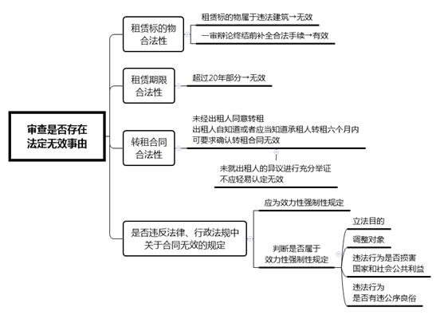
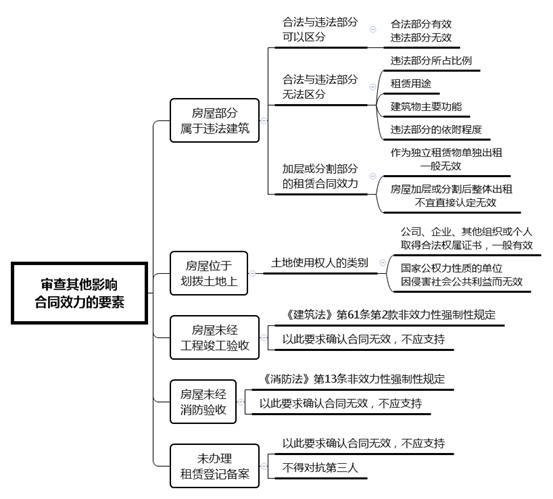

### **房屋租赁合同效力认定的审理思路和裁判要点**

房屋租赁合同纠纷案件是当前房地产类案件中占比最大的案件类型。该类纠纷中合同效力的认定是法院审判过程中面临的首要问题。实践中，房屋租赁合同效力的认定存在诸多争议，有必要对此类案件的审理思路和裁判要点予以梳理和总结。

**一、典型案例**

**案例一：涉及划拨土地上房屋租赁合同的效力**

2016年3月，A公司与B公司签订租赁合同，约定A公司将200亩土地及地上房屋租赁给B公司，土地用途为工业用地，使用权类型为划拨土地。后A公司以B公司改变土地用途为由，诉至法院请求解除合同。B公司辩称，本案所涉土地为划拨土地，双方签订合同时未按规定办理批准登记手续，因此双方签订的合同违反法律、行政法规的强制性规定而无效。

**案例二：涉及未经工程竣工验收房屋租赁合同的效力**

2009年6月，C酒店承租D公司房屋，签约后C酒店对租赁房屋进行装修改造后经营至今。后C酒店以D公司出租的房屋缺少合法产权证明，未按建设工程规划许可证的规定进行建设、未通过竣工验收为由，诉至法院请求确认合同无效。

**案例三：涉及未经消防验收房屋租赁合同的效力**

2017年3月，陆某与杨某签订商铺租赁合同，约定杨某承租陆某商铺。2018年1月，该处消防支队要求系争商铺进行火灾隐患整改。后陆某向法院起诉，请求判令杨某支付其拖欠的租金、违约金、消防整改费等，并主张涉案商铺违反《消防法》规定未经消防验收，双方租赁合同应属无效。

**二、房屋租赁合同效力认定的难点**

**（一）导致合同无效的事实在认定中存在困难**

房屋租赁合同的效力认定需要审查租赁标的物的合法性，但实践中对房屋合法性的认定存在诸多疑难问题。如私自扩建改建的房屋中违法面积如何确定、因建造年代过早无法提供合法建造手续的房屋如何认定是否合法、当事人提供证明材料前后不一或存在缺失时房屋的合法性如何认定等。

**（二）涉及房屋租赁的法规及政策变化多**

与房屋租赁有关的地方性法规和政策性文件是房屋租赁合同效力认定的重要参考，但地方性法规和政策易受房地产市场环境的影响出现变动，进而影响长期租赁合同效力的认定，也会影响合同约定内容及履行情况等事项的认定。此类变动会导致房屋租赁案件出现法律或政策适用难题。

**（三）涉及法律、法规强制性规定的认定观点不一**

实践中，对某些涉及房屋租赁的法律条文是否属于影响合同效力认定的效力性强制规定等存在不少争议。例如，对《建筑法》第61条第2款、《消防法》第13条性质的理解，会直接影响未经工程竣工验收房屋和未经消防验收房屋的租赁合同效力。

**三、房屋租赁合同效力认定的一般审理思路**

对合同效力的审查属于法院主动审查的范围，即使当事人未提起合同无效的诉请，法院也应依职权对合同效力进行审查。在处理房屋租赁合同纠纷案件时，应根据《民法典》及《最高人民法院关于审理城镇房屋租赁合同纠纷案件具体应用法律若干问题的解释》（以下简称《房屋租赁司法解释》）等规定，对房屋租赁合同的效力进行审查，具体可根据以下步骤进行。

**（一）审查是否存在法定无效事由**

合同存在法定无效事由时应认定合同无效。在审查房屋租赁合同效力时，应重点审查租赁标的物的合法性、租赁期限的合法性、转租合同的合法性及是否违反法律、行政法规等。

**1****、审查租赁标的物的合法性**

违法建筑包含未取得建设工程规划许可证或者未按照建设工程规划许可证规定建设的房屋、未经批准或者未按照批准内容建设的房屋和虽经批准但超过使用期限的临时建筑等。当租赁标的物确属违法建筑时，出租人与承租人订立的租赁合同无效，但此时并非绝对无效，在一审辩论终结前当事人补全房屋合法手续消除合同无效事由的，应当认为合同有效。

**2****、审查租赁期限的合法性**

租赁期限合法性的审查在于审查合同约定的租赁期限是否超过法定期限。根据《民法典》第705条规定，房屋租赁合同的期限不得超过20年，超过该期限的租赁合同部分为无效。

**3****、审查转租合同的合法性**

房屋转租应当经过出租人同意，未经出租人同意转租的，出租人可以自知道或者应当知道承租人转租之日起六个月内提出异议，有权向法院申请确认转租合同无效。如果出租人知道或者应当知道承租人转租但在六个月内未提出异议的，再以承租人未经其同意为由请求解除合同或者认定转租合同无效的，法院不予支持。

实践中出租人对于转租行为的态度可能发生变化，故在出租人未参加诉讼的转租合同纠纷中，如双方当事人均未主动将出租人是否同意作为合同效力认定依据，或者一方当事人仅提出未经出租人同意，但未就出租人的异议进行充分举证的，法院不应轻易认定转租合同无效。

**4****、审查是否违反法律、行政法规中关于合同无效的规定**

《民法典》第153条规定，违反法律、行政法规的强制性规定的民事法律行为无效，但该强制性规定不导致该民事法律行为无效的除外。此处的强制性规定是指效力性强制规定，若相关条款未直接规定合同无效且难以直接判断是否属于效力性强制规定时，可从相关条文的立法目的、调整对象、违法行为是否损害国家和社会公共利益、是否有违公序良俗等方面来综合判断相关条文的性质。

****

**（二）审查其他影响合同效力的要素**

除法定无效事由外，房屋租赁合同纠纷还存在其他影响合同效力的情形，如房屋部分违法、房屋建设在划拨土地、房屋未经工程竣工验收、房屋未经消防验收及房屋未办理租赁登记备案等。

**1****、房屋部分违法时租赁合同效力的认定**

房屋中有部分属于违法建筑时应分两种情形分别处理。**一是**可以明确区分合法部分与违法部分。如产证面积和加盖、扩建面积可以清晰界定，或合法部分与违法部分位于不同楼层，此时应认定合法部分租赁合同有效，违法部分租赁合同无效，在裁判时应区分租金、使用费及各方责任等。**二是**无法明确区分合法部分与违法部分。此时可以考虑违法部分所占比例、租赁用途、建筑物主要功能及违法部分对合法部分的依附程度等，确定租赁合同的整体效力。

所有权人未经规划许可对合法房屋自行改建的加层和分割部分均属于违法部分。加层或分割部分的租赁合同效力，应根据房屋是否单独租赁分别认定。**一是**加层或分割部分作为独立租赁物单独出租。如房屋顶部加层单独出租，或室内的隔间分别单独出租的，因房屋的使用与批准情形完全相悖，一般应认定加层或隔间的租赁合同无效。**二是**房屋加层或分割后整体出租。此时就房屋整体而言仅改变使用空间，双方基于加层或隔间的使用订立租赁合同，不宜直接认定合同无效，因行政执法部门对房屋整改导致合同履行不能时，承租人可以请求解除合同。

**2****、划拨土地上房屋租赁合同效力的认定**

划拨土地上房屋租赁合同的效力可根据土地使用权人的类别分情况处理：**一是**划拨土地使用权属于一般的公司、企业、其他组织和个人。且取得合法权属证书的，该房屋的租赁合同有效，未办理审批手续不影响租赁合同的效力，但出租人应当将租金所含的土地收益上缴国家。**二是**划拨土地使用权属于国家行政机关、司法机关等具有国家公权力性质的单位。该类主体出租划拨土地上房屋的，租赁合同因侵害社会公共利益而无效。如案例一中，划拨土地所有权人A公司并非具有国家公权力性质的单位，故A公司与B公司租赁合同有效，是否办理审批手续不影响租赁合同效力。

此外，实践中存在当事人在合作开发房地产合同中约定，出资人以租赁或者其他形式使用房屋但不承担经营风险的情形，对该约定应认定双方构成房屋租赁关系，当事人仅以该合同涉及土地为划拨用地主张合同无效的，不应予以支持。

**3****、未经工程竣工验收房屋租赁合同效力的认定**

《建筑法》第61条第2款规定：“建筑工程竣工经验收合格后，方可交付使用；未经验收或者验收不合格的，不得交付使用。”我们认为该条规定属于管理性强制规定，而非效力性强制规定，即房屋租赁合同并不因租赁房屋未经竣工验收而无效。主要原因在于，该条文的立法目的在于加强对工程竣工验收环节的规范和管理，并非对房屋交易或租赁市场等私领域的规制；且租赁房屋未经竣工验收的，既有法律规定并无使合同归于无效之意，而是在维护合同效力的基础上，赋予承租人在一定条件下享有合同解除权。

因此，当事人一方以租赁房屋未办理工程竣工验收为由，要求确认房屋租赁合同无效的，法院不应支持。如果因房屋未经竣工验收导致承租人无法使用，即无法按照租赁合同约定的用途使用，或者无法按照租赁房屋的性质使用时，承租人有权请求解除合同。如案例二中，房屋未办理竣工验收手续并未妨碍C公司按租赁合同约定用途使用房屋，因此法院对C酒店以租赁房屋未办理工程竣工验收为由主张租赁合同无效的诉请不予支持。

**4****、未经消防验收房屋租赁合同的效力认定**

《消防法》第13条属于管理性强制规定，当事人一方以租赁房屋未办理消防验收或者经验收不合格为由，要求确认房屋租赁合同无效的，一般不予支持。但如果因未经消防验收致使房屋不符合使用条件的，承租人可以依法请求解除合同。如案例三中，法院驳回了陆某仅以商铺未经消防验收为由主张租赁合同无效的诉请。

**5****、未办理租赁登记备案房屋租赁合同效力的认定**

房屋租赁合同登记备案的制度目的在于规范房屋租赁市场，其性质属于行政机关的事后审查行为，与当事人民事行为的效力无关，对租赁合同的成立及生效并无影响。根据《房屋租赁司法解释》第4条规定，当事人以房屋租赁合同未按照法律、行政法规规定办理登记备案手续为由，请求确认合同无效的，法院不予支持。但当事人约定以办理登记备案手续为房屋租赁合同生效条件的，应当从其约定。如当事人一方已经履行主要义务，对方已经接受的则不受约定生效条件的限制。同时，根据《上海市房屋租赁条例》第15条第2款的规定，未经登记备案的房屋租赁合同，不得对抗第三人。

**（三）正确区分合同无效事由与合同解除事由**

房屋租赁合同纠纷案件会出现改变租赁物用途、群租、无房屋所有权出租和在建房屋出租等情形，实践中对上述情形属合同无效事由还是合同解除事由存在争议，审理中应正确界定相关事由的性质及其法律后果。

**1****、改变租赁物用途**

《民法典》第350条规定，建设用地使用权人应当合理利用土地，不得改变土地用途；需要改变土地用途的，应当依法经有关行政主管部门批准。《土地管理法》《城市房地产管理法》中亦规定了土地使用者、建设单位等均不能随意改变土地用途。但这些关于土地用途规制的规定为管理性强制规定。通常情况下，住宅用房改商业经营、工业厂房改商业租赁等改变房屋用途的行为并没有违反法律、行政法规的效力性强制规定，一般应认定房屋租赁合同有效，如因受到行政管理处罚、整改等事实上无法继续履行合同的，当事人可以请求解除合同。

**2****、群租问题**

《上海市居住房屋租赁管理办法》第9条、第10条对房屋最小出租单位、最低人均承租面积和居住人数限制进行了规定，并明确禁止租赁市场群租行为。该规定属于地方政府规章，不属于法律、行政法规的范畴，因此当事人一方以租赁房屋属于“群租”性质为由，要求确认房屋租赁合同无效的，不予支持。在审理中可以在裁判文书中明确，法院对租赁合同效力的认定不影响行政主管机关对违反行政管理规定的违法行为作出处理。

如租赁合同履行中存在违反政府行政管理的“群租”情形，出租人已就此提出异议并要求整改未果的，可依据承租人未按照租赁合同约定的用途使用租赁房屋、构成根本违约为由，主张解除双方之间的租赁合同。

**3****、无房屋所有权出租**

当事人是否具有租赁物的所有权并不影响租赁合同的效力。如果因当事人无房屋所有权致使租赁合同无法履行的，承租人可以向出租人主张违约责任；如不影响承租人对房屋正常使用的，承租人不能以出租人无所有权为由拒付租金、拒绝返还房屋或不履行其他承租人义务等。

**4****、在建房屋出租**

当事人出租在建房屋的，法院应依职权审查租赁合同是否违法。如果合同内容未违反法律、行政法规的强制性规定，不具备法定的无效事由，法院应当尊重当事人意思自治原则认定合同有效。

**四、其他需要说明的问题**

**（一）关于合同无效的释明**

实践中，当合同认定无效时，法院应注意对当事人进行充分释明。根据《最高人民法院关于民事诉讼证据的若干规定》第35条规定，当事人就租赁合同的履行或解除发生争议，经审查认定合同无效时，法院应当向当事人释明变更诉请，引导当事人就合同无效的法律后果一并处理，并向当事人告知如不及时处理合同无效后果将可能造成的不利后果。对经释明当事人坚持不变更的，应当判决确认租赁合同无效，对当事人的诉请依法驳回，并告知当事人可就合同无效的其他争议另行主张。

**（二）关于报告逻辑结构的说明**

在审理房屋租赁合同纠纷案中，合同认定无效后的后果处理亦是法院裁判中的难点及要点。本文因篇幅所限，后果处理部分相关的审理思路和裁判要点将在梳理总结后另行刊出。

（根据庞闻淙、熊洋提供材料整理）