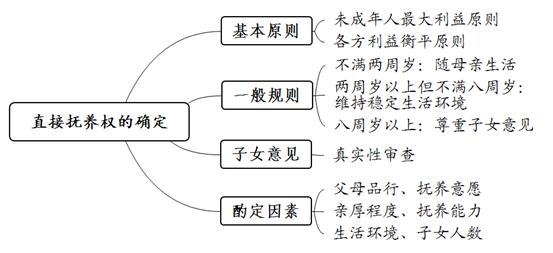
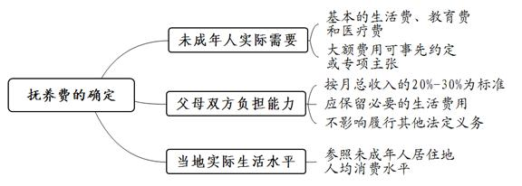

### **抚养纠纷类案件的审理思路和裁判要点**

抚养纠纷是指父母双方因子女抚养问题产生矛盾而引发的案件，一般包括抚养关系纠纷和抚养费纠纷两种类型。该类案件涉及人身关系、财产关系等多重关系交织，因此不仅要审查涉案家庭过去或现时的事实因素，还要在审查法定因素后综合考量诸多酌定因素，以确保在充分保障未成年人健康成长的前提下，平衡父母与子女的利益。现结合典型案例，对此类案件的审理思路和裁判要点进行梳理、提炼和总结。

**一、典型案例**

**案例一：涉及子女意见的采纳**

李某、姚某系法籍华人，两人婚后生育李甲、李乙。李某、姚某离婚时约定两子由双方共同抚养。后姚某在我国法院起诉，要求单独直接抚养李甲、李乙。李甲、李乙均年满10周岁。一审法院征询李甲、李乙的意见，两人均表示不愿随李某生活，要求随姚某共同生活。一审法院遂判决支持姚某的诉讼请求。李某以李甲、李乙的上述意见并非真实意思为由上诉。二审庭审中，李甲、李乙用中文再次向法庭表达要求随姚某共同生活的意愿，且当场书写中、法双文的书面意见。

**案例二：涉及未成年人利益的保护**

顾某与朱某婚后生育朱甲、朱乙。离婚诉讼中，朱某主张朱甲、朱乙均随其共同生活，顾某则主张朱乙随朱某共同生活、朱甲随顾某共同生活。一审法院认为，朱乙尚不满一周岁，随母亲朱某共同生活更为妥当；双方已确定朱乙随朱某共同生活，则朱甲随顾某共同生活也合乎法律和情理。一审法院判决朱甲随顾某共同生活，朱乙随朱某共同生活。朱某不服一审判决，提起上诉。

**案例三：涉及直接抚养人的确定**

王某、姜某婚后生育王甲。双方离婚时协议约定王甲随王某共同生活。姜某再婚后育有一子；王某再婚后未生育子女。后经法院调解，王某与姜某达成协议，约定王甲改随姜某共同生活，王某每月支付抚养费1500元至王甲成年。现姜某起诉要求王甲由王某直接抚养，称其与现任丈夫依靠低保金度日且患有多种疾病，无力抚养王甲。

**案例四：涉及子女抚养费的确定**

陈某、姬某婚后生育陈甲。双方离婚时法院判决陈甲（时年3周岁）随姬某共同生活，陈某自2004年起按月支付陈甲抚养费300元。陈某当时月收入1200元。2013年至2017年，陈某的年收入分别为39万元、47万元、54万元、64万元、54万元。2004年9月至2014年8月间，陈甲支出义务教育费用若干，另于2013年支出补习费用1.6万元。现陈甲起诉要求陈某每月支付抚养费1500元且需补付每月1000元的抚养费及补课费。

**二、抚养纠纷类案件的审理难点**

父母离异无疑是对子女稳定生活与健康成长环境的破坏。处理此类纠纷不仅应考虑如何将父母离异对子女的伤害降到最低，充分保障子女健康成长。实践中，由于父母双方抚养条件有别、子女需求迥异等因素，如何在情理法之间仔细拿捏、精准权衡，最终作出最优化的裁决，存在诸多难点。

**（一）子女最大利益界定难**

根据法律规定，对于子女直接抚养权的归属，法院应当从有利于子女身心健康发展、保障子女合法权益出发，结合父母双方个人条件、对子女的责任感、子女与父母的感情、子女自身情况以及子女意愿等因素综合考量。在对父母双方的抚养条件进行对比时，由于没有统一的裁判标准，也难以进行量化对照，加上抚养条件优劣的个人化感受、子女的个性化需求也有差异，因此很难直接判断优劣。特别是当父母双方的精神抚养条件和物质抚养条件存在互补或者对等时，则更难直接确定哪一方更有利于子女成长。其中精神抚养条件只能主观性判断，对法官的社会调查水平、社会经验丰富程度、分析判断能力等提出很高要求。尤其是需要在有限的条件下，对子女未来最大利益作出理性裁酌，可谓责任重大、难度颇高。

**（二）子女意见审查认定难**

最高法院《关于人民法院审理离婚案件处理子女抚养问题的若干具体意见》第5条规定，父母双方对十周岁以上的未成年子女随父或者随母生活发生争执的，应考虑该子女的意见。《民法典》第1084条第3款规定，子女已满八周岁的，应当尊重其真实意愿。因此，《民法典》实施后听取子女意见的年龄应调整为八周岁以上。在审判实践中，听取子女意见虽然可以在一定程度上便于法院确定直接抚养人，但也容易导致家庭矛盾激化，给子女造成较大的心理压力。基于此，子女可能不敢或者不能表达真实意思，由此导致子女意见的真实性难以认定。尤其《民法典》对子女意见从“考虑”调整为“尊重”的前提下，当子女意见与其他抚养条件发生冲突时，在实践如何妥当处理成为审理此类案件的难点之一。

**（三）抚养费数额确定难**

子女抚养费一般可根据子女的实际需要、父母的负担能力和当地生活水平确定。父母的负担能力一般体现为固定收入，通常做法是将社保缴费的基数作为固定收入的主要参考依据。然而，随着收入构成的多元化，知识产权的收益、投资收益等非固定收入都可能成为主要收入，且存在隐性收入统计困难的问题，导致较难核查和认定收入的高低。不同年龄未成年人的需求也无统一标准，不同的家庭条件、成长经历、培养方式等都将影响子女的实际需求。同时，子女经常居住地的生活水平也处在动态的发展过程中。对于抚养费的数额和支付方式，法院需要综合多重因素进行考量。通常而言，子女抚养费由直接抚养人代管，因此在确定抚养费时还要考虑父母双方的利益平衡问题。

**三、抚养类纠纷案件的审理思路和裁判要点**

**抚养纠纷类案件的审理应查明案件的基本事实，并以未成年人最大利益与衡平各方利益为主要原则**。判定未成年人抚养权的归属与变更时，以年龄为区分，分别厘定不满两周岁、两周岁以上但不满八周岁、八周岁以上的法定因素，进而作出初步框定，并在认真权衡酌定因素后进行校准。当子女抚养的法定规则与酌定因素存在冲突时，应当以法定规则为先，同时兼顾未成年人利益。确定与变更抚养费数额时，需要因应客观情况变化，在子女需要、父母双方负担能力与当地实际生活水平等考量因素之间进行均衡调整。审理此类案件时，法院应当**确保子女健康成长有支撑、父母履行抚养义务有限度、家庭伦理伸张有力度，争取多维裁判效果的实现。**

**（一）裁判的基本原则**

**1****、未成年人最大利益原则**。审理时应重点考虑子女发展的需要，以子女利益为首要判断因素，而非父母的愿望、社会的习惯做法或者其他因素。即使父母双方达成协议，但是确实对子女不利的，法院也不应准许。审查包含两方面要点：**一是**在充分考虑子女年龄和智力因素的情况下，子女在何处居住、与谁居住，应以能为子女提供符合其意愿、能被接纳的生活环境（家庭、居住社区等）为首要审查因素。**二是**关注谁能为子女提供一个充满关爱、鼓励，提供良好教育环境以及具备必要经济收入的家庭，以便能够满足其生理、安全、归属与爱、尊重、自我实现的需要，并有助于促进其智识正常增长、健康道德塑成和社会适应能力增进。

**2****、各方利益衡平原则**。在对各种利益冲突进行衡量时，需作出合理的价值判断。在遵循未成年人最大利益原则的同时，注意平衡父母的负担能力以及子女成长需要的权益。裁判尺度一般在规定给付比例中调整，但对于特殊情况也不应拘泥此限，应按实际情况酌情处理，使父母之间、父母与子女之间的利益得以平衡。

**（二）基本案情的查明**

审理抚养类案件，应通过听取双方当事人的陈述、证人证言，核查相关资料等方式查明以下基本事实：

**1****、有关子女的情况**。包括子女的性别、年龄、就学、随谁生活等基本情况。对于日常生活费用，可以要求双方提供相应的单据予以证明，必要时也可通过询问子女对其生活状态进行核实。当子女年满八周岁时，对于随谁生活应当询问子女的意见。

**2****、有关父母的情况**。通过了解离婚父母有无再婚以及现家庭成员、住房情况、工作情况等，可以衡量其是否能够提供适宜子女成长的外部生活环境。此外还需要了解父母的抚养愿意、自身是否存在不良习惯或不宜抚养子女的疾病，确保父母自身对子女成长没有不利影响。

**（三）直接抚养权的确定或变更**

**1****、认定直接抚养人的一般规则**

在确定子女直接抚养人时，法律规定不同年龄段子女随哪一方生活的基本规则。

**（****1****）不满两周岁的子女**

《民法典》第1084条第3款明确规定，离婚后，不满两周岁的子女，以由母亲直接抚养为原则。如此规定是考虑到女性在抚养婴幼儿方面与生俱来的耐心、细心、温柔等性格优势，以及婴幼儿子女对母亲生理和心理上的依赖。但不满两周岁的子女直接抚养权归于母方也并非绝对，根据《抚养问题若干意见》第1条，母方存在以下三种情形的，子女可以随父方生活：**一是**患有久治不愈的传染性疾病或者其他严重疾病，子女不宜与其共同生活的；**二是**有抚养条件不尽抚养义务，而父方要求子女随其生活的；**三是**因其他原因，子女确无法随母方生活的，如母方因工作、学习等原因，或者有吸毒、赌博、卖淫等恶习确实无法妥善照顾子女。

**（****2****）两周岁以上但不满八周岁的子女**

已满两周岁的子女，父母双方对抚养问题协议不成的，由法院根据双方的具体情况，按照最有利于未成年人子女的原则判决。如子女在父母离婚后一直随一方生活，一般不宜变更，应维持子女稳定的生活环境。根据《抚养问题若干意见》第3条规定，对于两周岁以上的子女，父方或者母方均要求随其生活的，有四种情形可以优先考虑。实践中需要关注的是，在父方或者母方直接抚养子女条件基本相同的情形下，双方均要求子女与其共同生活的，如果子女单独随祖父母或者外祖父母共同生活多年，且祖父母或者外祖父母要求并且有能力帮助照顾孙子女或外孙子女的，可作为确定子女直接抚养权归属的优先条件予以考虑。

**（****3****）八周岁以上的未成年子女**

子女已满八周岁的，应当尊重其真实意愿。在子女真实表达自己意愿时，这种意愿作为有利于子女身心健康的重要考量因素予以采纳。八周岁以上的子女能够感知父母与自己情感上的亲疏远近，对于父母的脾气性格、道德品质、经济状况已经有一定的感受；对于父母离婚后自己与谁生活能够得到更多的关爱、获得相对稳定的生活与教育环境，有一定的判断能力，并能表达出自己的想法。因此，八周岁以上的未成年子女对自己由谁抚养具有发言权，在确定抚养权归属时，应当征求并尊重子女的意见。然而，若有确切证据证明子女的选择明显不利于其成长的，法院可以从保障未成年子女的合法权益的目的出发，作出有利于子女健康成长的裁判。

**关于子女意见的审查方式**。子女意见往往因受生活环境的影响，或受到父母双方的压力，难以体现真实意思。因此在听取子女意见时，法院应通过单独做笔录的方式进行询问。**首先，**要创造条件、营造环境消除子女的顾虑，避免其因为担忧、恐惧而表意不真实。有条件的可由执业心理咨询师配合，一同或者单独进行心理干预并形成报告，作为裁判的参考性依据。**其次**，在听取子女意见后，应二次询问其最终意见。允许子女意见反复，但需保证意见的确定性和真实性。**最后**，可以要求有书写能力的子女通过自行书写的方式将其意见固定化。若子女意见前后矛盾、存在反复或有难言之隐时，可视为子女的意见表达受到干扰，应当结合其他证据确定其真实意思。

如案例一中，李甲、李乙均对其父亲李某怀有恐惧心理，不愿意单独与李某交谈。为确保李甲、李乙表达出真实意思，二审法院单独与李甲、李乙谈话。由于李甲、李乙为外籍人士，二审法官还要求二人用中法双文当场书写意见，由此确定李甲、李乙愿意随姚某共同生活系真实意思表示。

**关于****子女意见与优先抚养条件冲突的处理方式**。当子女意见与其他优先抚养条件产生冲突时，需要查明父方、母方列明的优先条件是属于父母本位（如一方无生育能力、无其他子女等），还是属于子女本位（如生活环境改变、生活水平降低、父母品行不良等）。如系父母本位的优先抚养条件，则不能高于子女本位的抚养条件；如属子女本位抚养条件，则需要对子女选择是否合理，是否有利于其身心健康发展等方面进行考虑并加以分析判断。

**2****、综合考量的酌定因素**

在具体个案中，还应当根据案件的具体情况，结合酌定因素予以判定。当子女抚养的法定规则与酌定因素存在冲突时，应当以法定规则为先，同时兼顾未成年人利益作出最终决定。

**（****1****）父母品行**。抚养子女不仅限于提供应有的物质生活保障，父母自身的言传身教、以身垂范对于子女的心理健康发展及性格养成起着极为重要的作用。因此，应对父母的品行特征进行考察，对存在不良品行、不良嗜好的一方（如实施家庭暴力、吸食毒品、赌博成性），进行考察时应更为慎重。

**（****2****）抚养意愿以及与子女亲厚程度**。需要考察父母一方有无抚养子女的意愿以及恳切程度，是否与子女长期共同生活并照料子女，是否与子女关系融洽，在情感上子女更为信赖哪一方等。上述因素需要通过询问双方当事人及其子女予以核实，必要时法院可以通过相关社会机构进行家事调查后确定。实践中，还存在父母为财产利益而争夺子女的情况，对此更需结合关联案件进行仔细甄别、一体审视，尽量做到统盘协调处理。

**（****3****）抚养能力**。抚养子女需要投入大量的精力和心血，既包括物质方面的抚养，如有稳定的收入、固定的居所等子女成长所需的物质保障；还包括精神抚养的能力，如有无教育子女的能力、陪伴子女的时间等。在判断父母抚养能力时，要结合双方的经济收入、居住条件以及各自受教育程度，是否具有教育子女、督促子女学习的能力和时间等因素综合考察，并具有一定的前瞻性，从动态的、合理预期的、谋长远的角度去考察父母的抚养能力。

**（****4****）稳定的生活成长环境**。未成年人的心理相对脆弱，熟悉、稳定的生活环境可以给予未成年人更多安全感，对其健康成长十分必要。因此，在确定直接抚养人时，还要考察各自家庭背景情况，并尽量维持子女原有已经适应的生活环境，以防因生活以及教育环境的突然变化给子女带来不利影响。

**（****5****）子女的人数**。随着计划生育政策的逐步放开，二孩家庭越来越多。从子女的角度来看，多个子女相伴成长更有利于其身心健康发展。因此，对于二孩抚养权的归属，不能机械适用独生子女政策出台前男女双方一人抚养一孩的惯例，应当根据案件的实际情况，尊重未成年人相伴成长的预期和意愿，保障未成年人利益，综合确定子女抚养权的归属。

如案例二中，朱乙在案件审理时未满一岁，一般应随母亲共同生活；朱甲为四岁女童，就读于幼儿园中班，贸然改变其长期随母亲、弟弟共同生活的现状和稳定的学习与成长环境，极易造成其心理上的强烈冲击。法院在充分调查两子女的学习、生活情况，考量朱甲的年龄、性别、成长经历及当事人双方的家庭状况、居住条件、工作收入及工作自由度等情况后，认为由朱某抚养朱甲、朱乙更为适宜，符合未成年人最大利益原则。因此，二审法院突破“一方抚养一个”的惯例，依法改判朱甲、朱乙均随朱某共同生活。

**3****、子女抚养权变更的认定要点**

如父母一方要求变更抚养关系，且有下列情形的，应当予以支持：（1）与子女共同生活一方因患严重疾病或因伤残无力继续抚养子女；（2）与子女共同生活一方不尽抚养义务或者有虐待子女行为，或其与子女共同生活对子女身心健康确有不利影响的；（3）八周岁以上未成年子女，愿意随另一方生活，该方又有抚养能力的；（4）有其他正当理由需要变更的。

如案例三中，姜某患有多种疾病，身体状况不佳，家庭收入微薄，且再婚后又育有子女，难以抚养多名子女。同时，王甲愿意随王某共同生活。王某再婚后未育有子女，且身体状况良好，其抚养条件优于姜某，王甲随王某生活能拥有更好的生活质量。因此，法院在综合考量后支持了姜某的诉请。

**（四）抚养费的确定**

在处理涉及子女抚养费问题时，应以满足子女生活和教育需要为着眼点，以离婚父母自愿协商为首选，贯彻合理分担的原则。对于父母有固定收入的，一般可按其月总收入的20%-30%的比例给付。当然，实践中不能“一刀切”，应当根据子女的实际需要、父母双方的负担能力和当地的实际生活水平，再结合个案情况，在遵照基本法律规定前提下予以处理。

**1****、抚养费数额的考量因素**

**（****1****）子女的实际需要**

子女的实际需要，是指子女在日常生活等各方面的需求，包括基本的生活需求、适当的教育需求以及必须的医疗需求等。对于子女来说，这种实际需要是其成长必不可少的基本生活需求。上述“三费”具体是指基本性的生活支出、公立教育机构按规定收取的费用、一般疾病的医疗费支出。对于额外的教育费等支出，例如私立学校的教育费、校外补课费、兴趣爱好培训费等，除特殊成长阶段的必要性支出原则上予以支持外，其他部分仅可部分支持，但抚养义务人协商一致、同意共同承担的除外。在按期支付的固定抚养费之外产生大额子女抚养费如大病医疗费用等，可事先约定或专项主张。

**（****2****）父母双方的负担能力**

父母的负担能力，是指父母收入范围内支付子女抚养费的承受能力。对于父母有固定收入的，可按其月总收入的比例给付；无固定收入的，抚养费的数额可依据当年总收入或同行业平均收入参照上述比例确定；有特殊情况的，可适当提高或降低上述比例。实践中，对于“月总收入”应作宽泛解释，不单包括工资总额、加班费、奖金等，还涵盖房屋租金、股票分红、理财产品收益等。另外，在确定抚养费时，要能保证父母在支付子女抚养费后剩余的收入能够维持自己的基本生活需求，且不至于影响其承担其他的法定义务，如对老人的赡养、对他人的抚养或扶养等义务。

**（****3****）当地的实际生活水平**

当地实际生活水平，应理解为子女长期生活居住地普通居民的平均生活水平，可参照居民人均消费支出等指标予以认定。如果子女长期生活居住地发生变化，或者子女生活的环境虽未变化，但是随着社会发展，长期生活居住地的平均生活水平不断提高，则该标准亦需根据子女实际生活环境的变化而作出相应调整。

以上三要素的关系为：抚养费的数额以满足子女实际需要为大前提，在父母负担能力较高的情况下，抚养费数额可以高于维持当地实际生活水平所需的费用，子女的实际需要可以不限于仅满足基本生活需求。具体数额还可以根据子女不同年龄、不同学习阶段的需求来确认。从父母的支付能力、子女的实际需求加以平衡考量，支付抚养费的一方收入较高的，抚养费比例可以适当降低；收入较低的，抚养费比例可以适当提高；若双方支付能力均较弱，则以保证子女获得必要的抚养费以满足基本生活和教育支出所需为准。

如案例四中，法院认为陈某自2004年至起诉时每月仍支付300元的抚养费显然不能满足陈甲的生活实际需要，也低于当地最低生活水平，而陈某的收入较高有负担能力。陈甲诉请要求对抚养费数额进行调整有事实和法律依据，应予支持。然而简单套用收入的20%-30%比例又远超实际需求，故对支付比例适当调整。此外，补习费不属于法定抚养费的范围且未与陈某协商，因此只对补习费酌情予以部分支持。

**2****、情势变更对抚养费变更的影响**

通过协议或者判决确定抚养费后，并不妨碍子女在必要时向父母任何一方提出超过协议或者判决原定数额抚养费的合理要求。原定抚养费数额不足以维持当地实际生活水平，法院原先判决或者协议约定的抚养费基础已不存在或者发生很大改变的，子女可以根据新的标准要求增加抚养费。子女要求父母增加抚养费的，应当查明如下事实：（1）原定数额不足以维持当地实际生活水平，或者子女需求超过原定数额，或者有其他正当理由的；（2）父或母有负担能力。

实践中，当父母一方能证明本人生活境遇发生重大变化而严重影响给付能力或无实际给付能力时，法院对于减免抚养费的请求可以支持。存在以下情形的可以适当减免：（1）给付方收入明显减少，虽经过努力仍然维持在较低水平；（2）给付方长期患病或丧失劳动能力又无经济来源，确实无力按原定数额给付，而直接抚养一方又有能力；（3）一方处于服刑期间失去经济来源无力给付的。需要注意的是，当父方或母方请求减少抚养费后，一旦恢复抚养能力，子女仍有权要求恢复至原定抚养份额，甚至要求增加抚养费。

**3****、抚养费的支付方式**

抚养费的给付方式以定期给付为原则，一次性给付为例外，且应计算至子女十八周岁止。成年子女不能独立生活的，父母仍应支付成年子女必要的抚养费，如成年子女尚在校就读、丧失劳动能力或虽未完全丧失劳动能力，但其收入不足以维持生活的。父母自愿延长给付期限的应予支持。对于一次性给付适用的情形，实践中一般需综合考量非直接抚养方的经济负担能力、子女的成长需要和物价变动等因素。若父母长期在异地生活的，有条件的以一次性给付为宜，避免子女难以定期获得抚养费而出现向法院申请强制执行的情况发生。

**四、其他需要说明的问题**

本文主要探讨的是审判实践中常见的婚生子女间抚养纠纷类案件。对于诸如试管婴儿、代孕等特殊情况引发的抚养纠纷，由于案件数量少、意见分歧大，暂不做讨论。至于与抚养纠纷具有较强关联性的探望权纠纷，因该诉具有相对独立性，亦不纳入讨论范围。

（根据少年家事庭王列宾、俞俊俊提供材料整理）