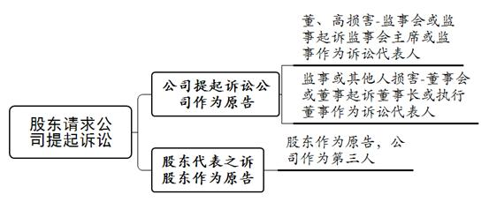
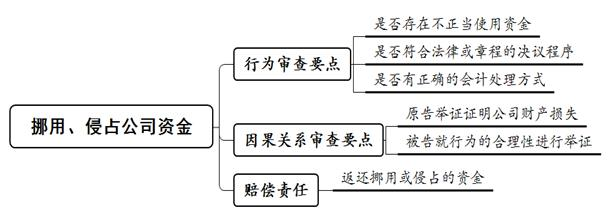
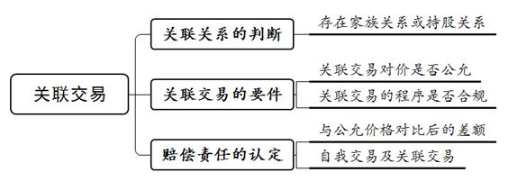

### **损害公司利益责任纠纷案件的审理思路和裁判要点**

损害公司利益责任纠纷，是指公司股东滥用股东权利或者董事、监事、高级管理人员（以下合称董监高）违反法定义务，损害公司利益而引发的纠纷。根据《公司法》相关规定，股东滥用股东权利给公司造成损失，以及董监高执行公司职务时违反法律法规或公司章程给公司造成损失的，均应承担赔偿责任。常见的损害公司利益行为包括关联交易、挪用公司资金、违反竞业禁止义务等。该类案件与商业行为密切关联，导致个案审查中对公司利益衡量缺乏统一标准。现结合典型案例，对损害公司利益责任纠纷案件的审理思路和裁判要点进行梳理、提炼和总结。

**一、典型案例**

**案例一：涉及责任主体身份的认定**

马某原系A公司股东会任命的海外代表处总代表，其职责为负责海外合作项目，但并非A公司章程规定的董监高。马某从A公司离职后成立B公司，并促成B公司与A公司的前磋商对象达成买卖合同。A公司起诉认为，马某的行为导致A公司与案外公司合作失败，违反公司高级管理人员的忠实义务，故要求马某赔偿A公司损失。

**案例二：涉及因果关系的认定**

张某系C公司股东兼总经理，同时担任D公司股东及法定代表人。王某系C公司法定代表人。C公司与D公司签署《物业管理委托协议》，C公司的合同签字人为王某而非张某。C公司起诉认为，张某的行为构成关联交易，违反忠实义务，故要求张某赔偿C公司损失。

**案例三：涉及损害行为的认定**

李某系E公司股东兼总经理，其另成立F公司。F公司与E公司营业执照登记的经营范围相同，且部分客户存在重合。F公司在开展业务过程中使用E公司办公地址和电话，在宣传册中使用E公司项目作为其业绩进行宣传。E公司起诉认为，李某及F公司存在违反竞业禁止义务的行为，故要求李某赔偿E公司损失。

**案例四：涉及损害范围的认定**

何某在担任G公司总经理及董事期间，同时担任H公司董事及监事。根据工商登记，G公司与H公司在经营范围上存在一定重合。G公司认为H公司的营业收入系何某在G公司任职期间利用或谋取G公司商业机会所得，故请求确认何某损害公司利益并赔偿损失，赔偿额为G公司与上一年度相比减少的营业收入。

**二、损害公司利益责任纠纷案件的审理难点**

**（一）责任主体认定难**

在损害公司利益责任纠纷案件中，被告主要包括公司股东以及董监高。实践中往往存在公司章程约定不明、公司运营不规范、公司人员职权与职务不相符合等情形。如公司分支机构负责人的职权范围包含多项公司管理职责，但在公司章程未将其列为高级管理人员的情况下，该类人员能否作为损害公司利益的责任主体，实践中对此尚存分歧。

**（二）损害公司利益行为界定难**

实践中损害公司利益的行为多种多样，且因损害行为人多为公司股东以及董监高等实际控制人，损害行为可能具有合法形式导致难以识别。如损害行为已由公司决议加以确认，董监高存在放弃公司对外到期债权或担保权利等造成公司财产减损。因此，对于如何分配双方当事人的举证责任、准确界定具有合法形式的损害公司利益行为等，仍需法院在个案中进行实质性审查。

**（三）因果关系认定难**

在此类案件中，法院除需准确判断被告是否构成损害行为并确定损害后果外，还需厘清损害行为与损害后果之间的因果关系。因果关系与具体损害行为的审查要点往往紧密关联。法院需充分掌握各类损害行为的审查要点，并运用法律逻辑将各审查要点梳理串联，进而就因果关系进行论证。因此，因果关系的认定缺乏相对独立的审查标准，个案中存在较大差异。

**（四）公司利益受损范围确定难**

公司利益可分为金钱利益与非金钱利益、既得利益与可得利益等。如何判断公司利益是否受损以及受损范围，是确定损害赔偿责任的关键。实践中，对于公司主张因侵权行为受到金钱损失的，如何根据当事人的举证判断市场公允价值，因存在较大的裁量空间而缺乏统一裁判尺度；对于公司主张因侵权行为受到非金钱损失或可得利益损失的，如损失潜在客户或商机等，在损失的界定和量化上仍存在一定难度。

**三、损害公司利益责任纠纷案件的审理思路和裁判要点**

法院在审理损害公司利益责任纠纷案件时，**应秉持实质审查与程序审查相结合的原则，注意公司股东与公司债权人之间以及股东之间的利益平衡，注重保护中小股东的合法权利，根据《公司法》及司法解释的规定准确适用法律**。具体审查要点如下：

**（一）原告主体资格的审查要点**

损害公司利益责任纠纷案件中，利益受损方为公司，但在董监高等公司内部人员损害公司利益时，显然无法由董监高自己决定是否以公司名义对损害行为提起诉讼。为此，《公司法》规定公司未就其所受损害起诉的，股东可代表公司以公司获得赔偿为目的而提起诉讼，即股东代表诉讼。因此，损害公司利益责任纠纷案件的原告包括公司和股东。

**1****、公司作为原告提起诉讼**

通常情况下，当发生损害公司利益行为时，应由公司作为原告直接向侵权行为人行使请求权，要求其对公司承担赔偿责任。需要注意的是，符合持股条件的股东可以书面请求公司相关机构以公司名义就损害行为提起诉讼，此时原告仍为公司。具体而言：**第一**，当董事、高级管理人员损害公司利益时，股东可以书面请求监事会或不设监事会公司的监事起诉；此时应当列公司为原告，由监事会主席或监事代表公司进行诉讼，监事会主席或监事列为公司的诉讼代表人。**第二**，当监事或他人损害公司利益时，股东可以书面请求董事会或董事起诉；此时应当列公司为原告，由董事长或执行董事代表公司进行诉讼，董事长或执行董事列为公司的诉讼代表人。

**2****、股东代表诉讼**

在特定情况下，股东可以作为原告提起股东代表诉讼。前述股东请求监事会或董事会等提起诉讼的行为，是提起股东代表诉讼的前置程序。对于该前置程序，有限责任公司的股东具有股东身份即可提出上述请求；股份有限公司的股东应符合法定的持股条件，即连续180日以上单独或者合计持有公司1%以上股份。上述持股条件亦是股东代表诉讼中股东作为原告的主体资格要求。

上述股东如果已书面请求公司监事会或董事会等就侵权行为提起诉讼，但后者拒绝提起诉讼，或者自收到请求之日起30日内未提起诉讼，或者情况紧急、不立即提起诉讼将会使公司利益受到难以弥补的损害的，该股东有权为公司利益以自己的名义直接提起股东代表诉讼。此时原告为股东，且应当列公司为第三人参加诉讼。

需要注意的是：第一，一审法庭辩论终结前，符合条件的其他股东以相同的诉讼请求申请参加诉讼的，应当列为共同原告。第二，侵权行为发生时原告尚未成为公司股东，被告以此为由抗辩该股东并非适格原告的，法院不予支持。第三，隐名股东在未获生效判决确认其股东资格前，不得以股东身份提起诉讼。

****

**（二）被告主体资格的审查要点**

根据《公司法》第20、21、149条规定，因损害公司利益而承担赔偿责任的主体包括公司股东和董监高，以及关联交易中的实际控制人等。其中，股东、董事和监事身份的审查主要以工商登记信息为依据，主要争议在于对高级管理人员、实际控制人和共同侵权人的认定。

**1****、高级管理人员作为责任主体的审查要点**

依据《公司法》第216条规定，高级管理人员是指公司的经理、副经理、财务负责人，以及上市公司董事会秘书和公司章程规定的其他人员。如工作人员身处管理岗位并享有管理职权，但并不具有法律或章程规定的高级管理人员身份，则该人员一般不应被认定为高级管理人员。

如案例一中，马某虽是经股东会任命的公司驻海外代表处总代表，也享有对海外项目的全权决定权，但马某所在职位并非法律或章程规定的高级管理人员，公司也未将其作为高级管理人员进行登记备案。同时，马某作为公司海外项目的负责人，并不能实际影响公司的整体经营运作，与高级管理人员享有的职责和权限仍有一定差距。因此，马某并非高级管理人员。

**2****、实际控制人作为责任主体的审查要点**

实际控制人，是指非公司股东，但通过投资关系、协议或其他安排，能够实际支配公司行为的人。实际控制人既可以是自然人，也可以是法人。尽管《公司法》第20、149条并未明确将实际控制人纳入因损害公司利益而承担赔偿责任的主体范围，但《公司法》第21条关于非正当关联交易的规定中已明确，利用关联关系损害公司利益而承担赔偿责任的主体包括公司的实际控制人。

法院在认定公司实际控制人时，应当结合企业信用信息公示系统中的公司登记信息、股权结构、主要人员等信息，公司章程、决议、合同等书面证据以及证人证言等进行综合判断。如涉及上市公司实际控制人的认定，上市公司的信息披露文件亦可作为认定实际控制人的主要证据。

**3****、共同侵权人的审查要点**

在关联交易案件中，部分损害行为是由股东等人员同与其具有关联关系的第三人共同实施的。因此，该类案件的被告并不限于具有特定身份的主体，与股东等人员有关联的第三人也可作为被告而被要求承担相应的法律责任。需要注意的是，第三人的身份并不限于法人或者自然人，而包括与股东等人员直接构成共同侵权行为的所有主体。第三人与股东等人员一并作为被告且被认定存在损害公司利益行为的，根据《民法典》第1168条规定应承担连带赔偿责任。

**（三）损害公司利益行为及赔偿责任的审查要点**

虽然《公司法》第148条对董事、高级管理人员的禁止行为已作列举，但基于公司利益的广泛性，立法难以对损害公司利益的行为穷尽列举。本文选取实践中较为常见的损害公司利益的三类情形梳理审查要点：一是挪用或侵占公司资金，二是关联交易，三是谋取公司商业机会及竞业禁止。

**1****、挪用或侵占公司资金的审查要点**

**（****1****）挪用或侵占公司资金的行为**

挪用或侵占公司资金的行为通常直接造成公司的财产损失。对该类行为应从以下几方面进行审查：

**第一，审查行为人是否存在不正当使用公司资金的情形**。挪用或侵占公司资金的行为种类多样，表现形式包括严重超标进行费用报销、替公司代收款项、利用公司资金进行高档消费等。具体可审查行为人将公司资金转出是否具有相应的合同、业务依据或其他符合商业常理的用途，以及收款人与行为人是否存在关联关系等。

**第二，审查行为是否已履行法律法规或章程规定的程序**。审查从公司支取款项，或将公司资金借贷给他人，或以公司财产为他人提供担保等行为，是否符合法律法规或章程的规定，是否经股东会、股东大会或董事会同意。因行为人往往是掌握公司经营控制权的股东或高级管理人员，可能存在行为人有权决定或影响公司决议或控制公司公章使用的情形。因此，即使某一行为已按照规定经过公司内部决议通过，该行为同样可能会损害公司利益。需要注意的是，挪用或侵占公司资金的行为多发生于内部管理缺乏规范性的公司。此时，法院不应局限于审查公司内部决议是否合法合规，还应结合行为人的举证认定其行为是否具有合理性。

**第三，审查行为是否有正确的会计处理方式**。审查财务会计报告中对相关款项性质的记载。以借款为例，法院可审查公司账册中是否记载股东债权的事实，以及该借款行为是否向其他股东公开。如账册中对此没有合理记载，则应由行为人对其行为合理性承担举证责任。

**（****2****）损害事实和因果关系的审查**

对于挪用或侵占公司资金的行为导致损害后果，法院应结合举证责任的分配以及证据的认定，从以下几方面进行审查：

**第一，审查原告能否证明挪用或侵占公司资金的行为导致公司财产损失**。例如，公司提供银行转账凭证、审计报告或财务账册等证明行为人实施了将公司资金转出的行为，且资金系直接或间接汇入行为人或其关联方的账户。其中，间接转账的资金在金额、时间上应具有前后对应性。

**第二，审查被告能否对其行为作出合理解释并提交相应反驳证据**。例如，行为人提交证据证明款项转出系为支付合同账款、员工奖金等公司经营所用。行为人能够举证证明资金用途系为公司利益的，公司应对损害行为继续举证。公司未能进一步举证证明损害存在的，应认定该行为未对公司利益造成损失。

**（****3****）赔偿责任的认定**

行为人无法举证证明其将公司款项转出等行为系为公司经营所需的，应在公司所受损失的范围内承担赔偿责任。公司所受损失通常是财产损失，行为人应承担的赔偿责任为返还挪用或侵占的资金并支付资金占用损失。如行为人在为公司代收款项的同时还存在为公司代垫款项的情形，则应将其代垫款项从应向公司支付的款项中予以扣除。

**2****、关联交易的审查要点**

与其他损害公司利益的行为不同，关联交易并不必然导致损害后果。正常的关联交易可以起到降低交易成本和风险、加强企业之间合作等作用，因此《公司法》并未完全禁止关联交易，而是防止利用关联关系损害公司利益。《公司法》第21条规定，公司的控股股东、实际控制人、董监高利用其关联关系损害公司利益，给公司造成损失的，应当承担赔偿责任。

需要注意的是，自我交易是一种特殊的关联交易形式。《公司法》第148条规定，禁止董事、高级管理人员进行自我交易损害公司利益。董事、高级管理人员违反公司章程的规定或未经股东会、股东大会同意，与本公司订立合同或进行交易，给公司造成损失的，应当承担赔偿责任。

**（****1****）关联关系的判断**

审查是否存在关联关系是认定关联交易的前提。所谓关联关系，是指控股股东、实际控制人、董监高与其直接或间接控制的企业之间的关系，以及可能导致公司利益转移的其他关系。实践中，关联关系通常体现为家族关系或持股关系。如交易相对方是行为人实际控制的其他企业，或与行为人关系密切的家庭成员所实际控制的企业时，应认定为具有关联关系。

需要注意的是，在确定关联关系时应以是否存在直接或间接控制作为限定条件，不宜过于宽泛地划定关联关系。同时，根据《上市公司信息披露管理办法》规定，上市公司的关联交易是指上市公司或其控股子公司与上市公司关联人之间发生的转移资源或义务的事项。在审查涉及上市公司的关联交易时，可依据《上市公司信息披露管理办法》中对关联法人和关联自然人的规定加以判断。

**（****2****）关联交易的实体和程序审查**

对于关联交易行为是否损害公司利益，法院应着重从实体和程序两个方面进行审查。

**第一，审查关联交易对价是否公允**。交易价格是否公允是判断关联交易是否给公司造成损失的核心要件。关于公允价格的判断可参照《上市公司治理准则》第76条规定。关联交易应当具有商业实质，价格应当公允，原则上不偏离市场独立第三方的价格或收费标准等交易条件。法院应结合原被告双方的举证，综合判定交易价格是否偏离正常市场价格，并认定是否对公司造成损失。

如案例二中，张某控制的C公司与D公司签署合同，虽然是C公司与张某的关联公司进行交易，但该交易并非《公司法》所禁止的关联交易。一是通过对比合同约定的内容与市场该类服务的交易价格，发现该合同并无任何不利于C公司之处，相反该合同正是市场公允价格的体现。二是C公司无法提供证据证明合同是张某控制C公司签订的。因此，该合同的签署并不因交易相对人为股东张某的关联公司而损害C公司利益。

**第二，审查关联交易的程序是否合规**。在程序审查方面，法院应审查关联交易是否已向公司披露，是否符合法律法规或公司章程的规定。如审查是否符合《公司法》规定，上市公司董事与董事会决议事项所涉及的企业有关联关系的，不得对该项决议行使表决权，也不得代理其他董事行使表决权；是否符合公司章程对关联交易的程序性规定，如需经股东会、股东大会或董事会的同意等。需要注意的是，虽然公司内部决策程序能够为关联交易的正当性提供一定支撑，但仍应对关联交易是否具有公允性进行实质性审查。如关联交易损害公司利益，被告仅以该交易已经履行信息披露、经股东会或股东大会同意等法律法规或公司章程规定的程序为由抗辩的，法院不予支持。

除审查交易价格的公允性、审批程序的合法性之外，法院还可针对具体个案案情，结合交易内容是否具有商业必要性、是否属于公司经营需要、是否具有真实的交易动机等其他因素综合判定关联交易。

**（****3****）赔偿责任的认定**

关于非正当关联交易的赔偿范围，通常是非正当关联交易价格与已查明公允交易价格之间的差额。该部分差额即为非正当关联交易对公司造成的损失，应由侵权人向公司进行赔偿。

关于自我交易的赔偿范围。《公司法》第148条第1款第4项规定的自我交易归入权诉讼与第21条规定的关联交易损害赔偿诉讼，均为涉及损害公司利益的责任纠纷，均具备侵权责任的一般构成要件。两者区别在于，在行为主体上，自我交易的行为主体是负有忠实义务的董事、高级管理人员本人，而关联交易的行为主体可涵盖与公司具有关联关系的所有主体；在行为和结果要件上，自我交易强调董事、高级管理人员违反章程规定或未经股东会同意与本公司进行交易，且其因自我交易而获得的收入应当归公司所有；关联交易则强调关联人利用关联关系使公司利益受损，关联人应当对公司所受损失承担赔偿责任。

**3****、谋取公司商业机会及竞业禁止的审查要点**

**（****1****）谋取公司商业机会及竞业禁止行为的认定**

根据《公司法》第148条第1款第5项规定，谋取公司商业机会及竞业禁止行为是指未经股东会或股东大会同意，利用职务便利为自己或他人谋取属于公司的商业机会，以及自营或为他人经营与所任职公司同类的业务。需要说明的是，对于劳动法领域的竞业禁止行为，本文不予涉及。

所谓商业机会，是指公司能够开展业务并由此获取收益的可能性。法院在判定某一商业机会是否属于公司时，可结合公司的经营范围，审查该商业机会是否为公司所需，公司是否就此进行过谈判、投入过人力、物力和财力等因素进行综合判断。此外，法院还应审查公司是否存在放弃商业机会的情形。如被告能举证证明公司已经明确拒绝该商业机会，并非是被告利用职务便利谋取，则法院应认定被告取得该商业机会符合公平原则。

所谓同类业务，是指完全相同的商品或者服务，也可以是同种或者类似的商品或者服务。在审查时，法院不应机械地局限于登记的经营范围。如公司实际从事的业务确未包含在工商登记的经营范围内，法院仍应根据其实际从事的业务与董事、高级管理人员所任职的公司是否具有实质性竞争关系进行审查。此外，法院还可结合开展业务的地域和时间加以考量，审查两家公司是否在相近地区、相近时间段开展业务。竞争时间段应当是指行为人能够利用其职务便利的期间。

**（****2****）审查被告有无利用职务便利谋取商业机会**

在此类案件中，只有特定身份者利用职务便利实施损害行为方才构成《公司法》禁止的行为，因此法院应注意审查被告是否存在利用职务便利的行为。如被告是否基于所处职位明知该商业机会属于公司，是否将该商业机会向公司进行过披露；被告是否通过欺骗、隐瞒或威胁等不正当手段诱使公司放弃机会，或存在利用其业务经办人、联系人等有利身份实施篡夺行为。

如案例三中，李某设立的F公司在经营时，不但在宣传中使用E公司的业绩，而且还使用E公司的电话、地址，与E公司存在客户上的重合。同时，E公司的上述信息均为李某在E公司任职期间所知悉获取，故应认定李某利用职务便利谋取E公司的商业机会。

**（****3****）赔偿责任的认定**

对于谋取公司商业机会及竞业禁止行为对公司造成的损失，赔偿范围可认定为被告与案外人交易所获取的收益。被告行为构成谋取公司商业机会的，其所侵害的即为本属于公司的预期利益。该利益通常可直接体现为被告与案外人签订业务合同的所获利润。需要注意的是，公司应就其享有该预期利益承担举证责任，如应证明公司与案外人在被告损害行为实施前存在长期良好的商业往来、已就合作进行有效磋商等。

如案例四中，G公司主张其本年度营业额损失是由于何某谋取公司商业机会经营同类业务所致，但无法提供该商业机会本属于公司的证据。相反，何某及H公司能够证明G公司本年度与上一年度之间存在营业差额，系因G公司上一年度存在与其他案外人之间的临时业务，故法院对G公司的诉请不予支持。

**4****、损害赔偿请求权和归入权的区分**

《公司法》第148条规定，董事、高级管理人员违反禁止行为所得的收入应当归公司所有，即公司有权对上述收入行使归入权。因此，在涉及公司董事、高级管理人员违反该条规定的禁止行为时，公司既可根据该条行使归入权，也可根据《公司法》第21、149条主张损害赔偿责任。

鉴于归入权和损害赔偿请求权二者在构成要件上存在差异，在个案诉请中原告应择一进行主张。如原告主张行使归入权，则应举证证明行为主体是董事、高级管理人员；行为人实施了第148条规定的禁止行为并从中获得收入；公司可得收益即为行为人因禁止行为所获利益。如原告主张行使损害赔偿请求权，则行为主体除董事、高级管理人员外还包括股东、监事；行为人所实施的侵权行为亦不限于第148条规定的情形，应涵盖所有损害公司利益的行为；赔偿范围亦不限于行为人所得利益，应是公司所受损失。

**四、其他需要说明的问题**

损害公司利益责任纠纷与公司关联交易损害责任纠纷密切相关，实践中应注意两者区别。该两类案由所涉案件有所重合，共同之处在于原告均主张被告损害公司利益。主要区别在于，未利用关联交易形式损害公司利益的，不属于公司关联交易损害责任纠纷。实践中，以公司关联交易损害责任纠纷立案的案件数量极少。原因是原告在起诉时往往无法准确界定被告损害利益的形式是否仅局限于关联交易，且损害公司利益责任纠纷已涵摄董事、高级管理人员与公司进行自我交易的行为。因此，即便涉及关联交易的情形，原告也多以损害公司利益责任纠纷的案由起诉。有鉴于此，本文将关联交易行为一并纳入总结。

（根据商事庭成阳、俞泊泓提供材料整理）