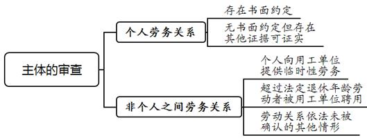
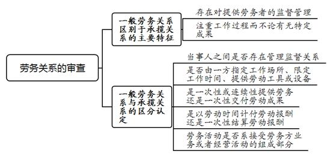
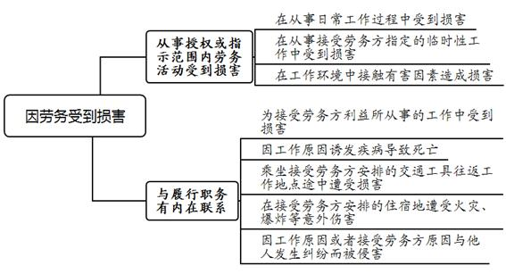
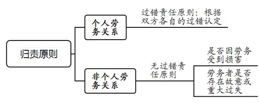
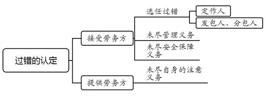

### **提供劳务者受害责任纠纷案件的审理思路和裁判要点**

提供劳务者受害责任纠纷，是指在劳务关系存在的前提下提供劳务一方因劳务受到损害，就损害赔偿责任的承担所引发的争议，具体包含个人之间的劳务关系以及个人与非个人之间的劳务关系两种类型。此类案件的审理不仅关涉提供劳务者生命健康权的救济与保护，亦涉及接受劳务方的用工风险化解与生存发展之间的平衡。妥善审理此类案件需要正确厘清各方主体之间的法律关系，准确认定损害赔偿责任主体与赔偿范围，依法保护各方当事人的合法权益。现结合典型案例对此类案件的审理思路和裁判要点进行梳理、提炼和总结。

一、典型案例

**案例一：涉及劳务关系类型的认定**

A公司需对攀岩岩壁进行拆除，提供安全帽、安全带、止坠器等安全防护工具，由王某等三人共同施工。王某佩戴安全带进行登高切割作业时，脚踩处方钢发生脱焊致其坠落受伤。王某具有从事金属焊接切割的特种作业操作证，但无高处作业类别资质。王某主张A公司与其之间系劳务雇佣关系，诉请要求A公司对其各项损失承担赔偿责任。A公司辩称与王某之间系承揽合同关系。

**案例二：涉及非个人之间劳务关系下归责原则的适用**

徐某与B公司签订《个人承包服务协议》，约定B公司将服务项目（或承接的第三方服务项目）承包或分包给徐某，双方根据项目的交付结果结算服务费。实际操作中，B公司根据配送订单向徐某结算报酬。后徐某于订单配送服务过程中摔伤，诉请要求B公司按照无过错责任原则对其各项损失承担赔偿责任。B公司辩称应当适用过错责任原则认定责任比例。

**案例三：涉及接受劳务方主体的认定**

C公司因某项目缺少搬运工人要求D公司提供劳务人员。周某等人经职业介绍所介绍，由D公司员工陈某安排至C公司从事搬运工作。陈某以D公司的名义向C公司收取劳务费等，并负责人员考勤管理、劳务报酬发放，但由C公司工作人员负责现场工作任务统筹。周某搬运货物时不慎从货车上摔下受伤，诉请要求C公司对其各项损失承担赔偿责任。C公司辩称D公司系接受劳务方，其与D公司之间系劳务分包关系。

**案例四：涉及损害是否因劳务所致的认定**

林某受雇于E环卫公司从事道路路面清扫工作。事发当日林某清理沿街二楼商户过道内的垃圾后，下楼过程中倒地受伤，诉请要求E公司对其各项损失承担赔偿责任。E公司辩称林某工作内容为固定路段的马路清扫，并不包括到路边商户内收取垃圾，且公司禁止保洁员收集可回收废品进行变卖，故林某并非因劳务受到损害。

二、提供劳务者受害责任纠纷案件的审理难点

**（一）劳务关系类型复杂认定难**

在提供劳务者受害责任纠纷案件中，当事人之间劳务关系类型不同，接受劳务方所需承担责任的认定规则亦有不同。司法实践中，由于劳务关系多具有临时用工性质，双方未订立书面合同、未明确约定权利义务的情况较为普遍，加之不同类型的劳务关系间存在相似性，准确把握认定提供劳务者与接受劳务方之间的劳务关系类型存在难度。在装饰装修等行业中，多重承包发包关系、承揽关系与一般劳务关系共存的情况尤为突出，需要综合各类因素加以区分甄别。

**（二）接受劳务方主体认定争议大**

实践中由于经济生产的复杂及社会分工的细化，相当数量的劳务活动涉及发包人、分包人、雇主等诸多主体。2004年施行的最高法院《关于审理人身损害赔偿案件适用法律若干问题的解释》第11条明确，雇员在从事雇佣活动中因安全生产事故遭受人身损害，发包人、分包人知道或者应当知道接受发包或者分包业务的雇主没有相应资质或者安全生产条件的，应当与雇主承担连带赔偿责任。除此情形，雇主责任显著区别于发包人、分包人。需要注意的是，最高法院2020年修订的《人身损害赔偿若干问题的解释》已将上述第11条规定删除，提供劳务者受害责任纠纷中发包人、分包人对提供劳务者受害的责任如何认定，需要等待新的司法解释出台后再行判断。用工实践中，由于未签订书面劳务合同的情况普遍存在，认定与提供劳务者建立劳务关系的主体存在较大争议。

**（三）因劳务受到损害的审查标准把握难**

工伤保险待遇纠纷中，劳动者受到的人身损害是否属于工伤由工伤认定作为前置程序加以判定。提供劳务者受害责任纠纷中，对于提供劳务者是否因劳务受到损害，需由法院依据人身损害发生的时间、地点、原因、与劳务活动的关联性等因素加以审查认定。实践中由于接受劳务方对于劳务活动的监督管理较为松散，纠纷双方往往对损害发生的过程及原因存在争议，证据固定方面亦多有欠缺，因此对于提供劳务者是否因劳务受到损害以及各自过错的认定存在较大难度。

**（四）非个人之间劳务关系中归责原则的适用存争议**

审理提供劳务者受害责任纠纷案件的主要法律依据是《民法典》第1192条规定，原依据还包括《侵权责任法》第35条及2020年修订前的《人身损害赔偿若干问题的解释》第11条。《民法典》第1192条明确个人之间形成劳务关系、提供劳务一方因劳务受到损害产生纠纷的，归责原则为过错责任原则。然而对于提供劳务者系个人、接受劳务方系劳务用工单位，提供劳务一方因劳务受到损害是否应当适用无过错责任原则，在实践中存在较大争议。

三、提供劳务者受害责任纠纷案件的审理思路和裁判要点

在提供劳务者受害责任纠纷案件中，法院**应当坚持注重保障提供劳务者合法权益，同时兼顾接受劳务方利益平衡和生存发展需求的原则，注重劳务关系与侵权关系裁判之间的协调性。通过此类案件审理，充分发挥引导接受劳务方规范用工形式、提高安全保障意识、完善劳动保护措施的作用，强化防范劳务受害事故发生的导向作用**。审理此类案件时，法院应当首先审查权利主体是否适格，再甄别劳务关系的类型并认定接受劳务主体，进而审查提供劳务者是否因劳务受到损害，最后对责任承担作出判定并确定赔偿范围。

**（一）诉讼主体的审查要点**

提供劳务者受害责任纠纷是最高法院2011年《关于修改<民事案件案由规定\>的决定》中新增设的一类案由，删去了《民事案件案由规定（试行）》中的“雇员受害赔偿纠纷”。该案由不仅包含个人劳务关系中提供劳务者受害的情形，也包含个人与非个人劳务关系中提供劳务者受害的情形。在诉讼主体的审查上，权利主体即提供劳务的自然人，包括提供劳务者本人以及因劳务受害而死亡的劳务者近亲属；责任主体即接受劳务一方，除自然人外还应当包括接受劳务的法人、非法人组织。

**1****、个人劳务关系主体的审查要点**

个人之间形成劳务关系的，接受劳务方通常以处理自身或家庭事务为主要目的，缔约形式不尽完备。司法实践中，首先应当初步审查被告是否系劳务关系的相对方即接受劳务方，对此应由提供劳务者承担举证责任：（1）对于存在书面约定的，依据劳务合同的缔约主体，结合实际履约情况审查主体是否适格；（2）对于双方未签订书面劳务合同的，应当审查是否有其他证据可证实劳务关系的相对方，如电话录音、短信微信聊天记录、报酬支付凭证、报警记录、询问笔录等；（3）对于无其他证据可证明存在劳务关系的，应当以一般侵权责任纠纷案件的审理思路进行审查。

**2****、个人与非个人之间劳务关系主体的审查要点**

提供劳务者主张与法人、非法人组织之间存在劳务关系的，应承担举证责任。法院应当根据双方的书面约定等相关证据，以及实际提供劳务的情况审查主体是否适格。个人与非个人之间形成劳务关系的主要情形包括：

（1）个人向劳务用工单位提供临时性劳务。劳务双方没有建立劳动关系的合意，劳务内容具有临时性且并非用工单位的主营业务组成部分，故不构成劳动关系。

（2）达到、超过法定退休年龄的劳动者被用工单位聘用。劳动者退休后依法享受养老保险待遇或领取退休金，不再属于劳动法意义上的劳动者。用工单位招用已经达到、超过法定退休年龄或已经享受养老保险待遇或领取退休金的人员，则与之形成劳务关系。

（3）劳动关系依法未被确认的其他情形。提供劳务者主张与用工单位间存在劳动关系而申请工伤认定，但经法定程序未确认为劳动关系的，可主张与用工单位建立劳务关系要求单位承担损害赔偿责任。

需要注意的是，在存在多轮承包、发包转手关系的案件中，依据当事人申请或依职权追加相关当事人一并审理为妥，以便查清各方当事人之间的法律关系，避免遗漏必要共同被告。

**（二）提供劳务者受害责任要件的审查要点**

**1****、劳务关系的审查要点**

劳务关系是指平等主体之间形成的一方提供劳务、另一方支付报酬的权利义务关系。从民事案件案由设置来看，提供劳务者受害责任纠纷案件中不仅涵盖一般劳务关系中提供劳务者受害所引发的责任纠纷，亦涉及加工承揽关系以及发包、分包关系中提供劳务者受害所引发的定作人、发包人、分包人责任纠纷。该类纠纷的审理思路有别于一般侵权责任纠纷，审判实践中不宜将其直接纳入生命权、健康权纠纷案由审理。

一般劳务关系中，对于提供劳务者的损害由劳务双方按照各自过错承担责任，或者按照无过错责任归责原则由接受劳务方承担赔偿责任。然而在承揽关系中则由承揽人独自承担意外风险，定作人仅对定作、指示或者选任上的过失承担责任，两种法律关系中对接受劳务方的责任认定规则并不相同。提供劳务者受害责任纠纷案件中，接受劳务方的主要抗辩理由之一即为否认建立一般劳务关系，主张双方系承揽关系，因此首先需要对劳务双方的基础法律关系进行审查认定。

**（****1****）一般劳务关系区别于承揽关系的主要特征**

**第一**，存在对提供劳务者的监督管理。劳务关系是平等民事主体之间的权利义务关系，提供劳务者与接受劳务方之间虽不具有人身依附性及从属性，但在劳务活动中提供劳务者受到接受劳务方的监督和管理，此为一般劳务关系区别于承揽、委托等合同关系的特征之一。需要注意的是，这里的监督仅为存在监督的可能，而非实质上必须存在监督的事实，指定工作场所、限定工作时间、提供劳动工具均被认为存在监督可能。

**第二**，注重工作过程而不论有无特定成果。劳务合同的标的仅为提供的劳务本身，提供劳务者只要按照约定的要求完成劳动，就已经尽到合同义务，而不论这种劳动有无特定的成果。承揽合同的标的物是包含承揽人特定技能的工作成果，承揽合同中定作人所要求的不仅是承揽人以自己的技能、设备从事一定的工作，而且还要求这种工作产生对应成果，并将工作成果交付给定作人，定作人更注重工作成果而非工作过程。

**（****2****）一般劳务关系与承揽关系的区分认定要点**

司法实践中，区分一般劳务关系与承揽关系应当审查以下要素：（1）当事人之间是否存在管理、监督关系；（2）是否由一方指定工作场所、限定工作时间、提供劳动工具或设备；（3）是一次性或连续性提供劳务，还是一次性交付劳动成果；（4）是以劳动时间计付劳动报酬，还是一次性结算劳动报酬；（5）当事人所提供劳动是其独立的业务或者经营活动，还是构成接受方的业务或者经营活动的组成部分。

若当事人之间存在管理、监督关系，由一方指定工作场所、限定工作时间、提供劳动工具或设备，定期计付劳动报酬，另一方提供劳务而不论有无特定成果，所提供的劳动是接受劳务方生产经营活动的组成部分，应当认定为劳务关系，反之则应为承揽关系。在具体认定时，法院需要充分运用逻辑推理和日常经验进行综合审查分析，不应局限于某一项要素做出判断。

如案例一中，法院审理后认为，A公司以王某等实际工作天数计付报酬，王某等在A公司指定的场地、以A公司提供的工具进行施工，从工作内容、工作安排、报酬结算方式、工具提供等方面来看，符合劳务雇佣关系的特征。

**（****3****）互联网平台用工法律关系的审查要点**

随着互联网平台经济新兴业态的快速发展，互联网用工引发的侵权纠纷案件日益增多。实践中，平台公司与从业人员之间法律关系的性质存在多样性，双方可能会形成劳动、劳务、承揽、居间等不同的法律关系。法院在案件审理中需要根据双方订立的合同内容以及实际履约情况，并结合互联网用工的特点，准确认定双方法律关系的性质。

如案例二中，徐某与B公司签订的《个人承包服务协议》约定双方不存在任何劳动关系，从配送服务的运作方式、管理培训、雇主责任险投保等情况来看，应当认定徐某系B公司聘用的劳务人员，由B公司承担赔偿责任。

实践中，互联网用工大量存在平台公司+第三方公司+从业人员的模式。该种模式下，平台公司与第三方公司签订合同，由第三方公司派员到平台公司从事相关互联网服务工作。同时，第三方公司与从业人员直接签订劳动或劳务合同，由第三方公司负责对从业人员进行招退工、工作指示和安排、日常工作管理监督、薪酬发放、缴纳社保或投保商业险等，而平台公司与从业人员之间不直接签订劳动或劳务合同。

从业人员在提供劳动或劳务的过程中自身受到损害的，赔偿权利人主张第三方公司承担用人单位责任或雇主责任的，应当予以支持。赔偿权利人主张平台公司承担责任的，法院可以从平台公司的过错程度、控制程度以及获益程度等方面进行审查，即结合平台公司在选择第三方公司时是否存在过错、平台公司是否对第三方公司经营业务存在较高程度的控制、平台公司的主要收入与第三方公司的经营业务是否密不可分等因素，综合确定其承担相应的补充赔偿责任。

**2****、接受劳务主体的审查要点**

关于接受劳务方主体的认定，则主要依据是否对提供劳务者做出工作安排及指示，是否对劳务活动进行管理、监督，是否获得劳务活动产生的利益等因素进行判断。本人或委托他人以其名义代为对劳务活动进行指示、管理、监督，因劳务活动取得经济上的利益或获取个人事务、家庭生活上便利的主体，应当认定为接受劳务方。

如案例三中，周某等工人系由陈某安排至C公司处工作，劳务报酬亦由C公司根据实际工作量按日统一结算，由陈某以D公司的名义收取，扣除利润后发放给工人，并对工人进行考勤管理等，故认定陈某所隶属的D公司与周某之间建立劳务关系，由D公司承担雇主责任。

实践中，对于需要数人共同完成的劳务活动，经常由其中一人作为召集人与接受劳务方沟通联络。召集人虽承担部分管理事务，但若与其他提供劳务者共同劳动、报酬相互均等，则其并未因他人的劳务活动额外受益，根据风险收益相一致理论，不应当将其认定为接受劳务方。

**3****、因劳务受到损害的审查要点**

对因劳务受到损害这一要件的审查，应当结合劳务活动的性质、行为发生地、提供劳务者行为的目的，以及行为与接受劳务方利益的主客观联系等因素进行综合判断。提供劳务者在从事接受劳务方授权或者指示范围内的生产经营活动或者其他劳务活动中受到损害，应当认定为因劳务受到损害。若提供劳务者行为的表现形式与履行职务存在内在联系，与接受劳务方利益有客观联系，属于通常可以预见的合理行为，亦应认定为因劳务受到损害。

具体而言，提供劳务者受到损害的情形包括：（1）在从事日常工作过程中受到损害；（2）在从事接受劳务方指定的临时性工作中受到损害；（3）在工作环境中接触有害因素而造成损害；（4）紧急情况下，虽然未经接受劳务方指示但为接受方利益，在所从事的工作中受到损害；（5）在工作时间和区域内或者在工作结束后的合理时间内，因工作原因诱发疾病导致死亡；（6）乘坐接受劳务方安排的交通工具往返工作地点途中遭受损害；（7）在接受劳务方安排的住宿地遭受火灾、爆炸等意外伤害；（8）因工作原因或者接受劳务方原因与他人发生纠纷而被他人侵害的。

需要注意的是，如果提供劳务者受到的损害虽与劳务活动的时间、地点具有一定关联，但实际系个人原因或者为个人利益所导致，则应切断劳务与损害之间的因果关系，免除接受劳务方的责任。

如案例四中，林某事发时至二楼商户内收集垃圾行为不属于E环卫公司授权或指示的工作范围，亦非为E公司利益，且与E公司明确告知的禁止保洁员到路边商户内收取垃圾、捡拾瓶子的注意事项相悖，故不能认定上述行为与履行职务具有内在联系，E公司对林某的损失不承担赔偿责任。

**4****、归责原则的适用**

**（****1****）个人之间劳务关系适用的归责原则**

根据《民法典》第1192条规定，个人劳务关系中由劳务双方根据各自过错承担相应责任。个人劳务关系中，接受劳务方多系为自身利益或家庭事务雇佣劳务人员，一般不具有生产经营的营利性质。对于劳务活动的专业化水平、安全保障知识等往往反而不及提供劳务者，且接受劳务方的经济实力和风险负担能力有限，完全由其承担全部赔偿责任必然使其承担过大的风险，既对接受劳务方不公平，也不利于个人之间劳务关系的发展。

**（****2****）非个人之间劳务关系适用的归责原则**

非个人劳务关系中的归责原则，在审判实践中存在较大差异。有观点认为，与个人劳务关系适用的归责原则无异，在非个人劳务关系中同样适用过错责任归责原则，以提供劳务者的一般过错进行过失相抵，进而判定接受劳务方的责任比例。我们认为，非个人劳务关系的提供劳务者受害责任纠纷中，目前应当适用无过错责任归责原则，由用工单位对提供劳务者因劳务受到的损害承担赔偿责任。若提供劳务者存在故意或重大过失，则减轻或免除用工单位的赔偿责任。

**首先**，从立法沿革上分析，《民法典》第1192条、原《侵权责任法》第35条并非旨在改变雇主责任的无过错责任归责原则，而是针对日常生活领域大量存在的诸如家政服务、家庭装修等个人之间形成的劳务关系。根据该类法律关系的特点和权利义务对等、风险收益相当原则作出的特别规定，上述规定明确适用于“个人之间形成劳务关系”，不具有比照适用的空间。

**其次**，对于非个人之间的劳务关系，用工单位相对于个人在风险负担能力及事故防范能力等方面具有绝对优势，且劳务活动性质多为生产经营及营利性商业活动。用工单位作为获益方应当为提供劳务者提供更为充分的劳动保护。

**最后**，提供劳务者普遍存在知识水平偏低、证据意识薄弱、举证能力不足等现实问题，导致双方诉讼能力差距较大。适用无过错责任归责原则具有引导用工单位规范用工形式、完善劳动保护措施的导向作用。

如案例二中，《民法典》第1192条规定是针对个人之间形成的劳务关系作出的特别规定，而本案系公司与个人之间的劳务关系，有别于个人之间形成的劳务关系。徐某在配送服务过程中摔倒受伤并不存在故意或者重大过失，故应当由公司承担全部赔偿责任。

**5****、过错的审查要点**

在个人劳务关系、承揽关系、发包分包关系中，过错认定应当根据双方当事人的注意义务标准进行考量，综合各自的过错程度以及对损害发生的原因力大小确定责任比例。

**（****1****）选任过错的审查要点**

**第一**，接受劳务方、定作人的选任过错。接受劳务方、定作人对从事特种作业的劳务者是否具有相应资质，负有形式上的审核义务，未尽到审核义务的应认定为存在选任过错。对于从事事故高发且对人身、财产安全可能造成重大危害的特种作业人员，必须经过专业的安全技术培训并考核合格，取得《特种作业操作证》后方可上岗作业。其中，从事事故发生率较高的高处作业的，应当特别取得高处作业类别资质。

**第二**，发包人、分包人的选任过错。对于装饰装修等专业化水平较高的行业，装修公司出于用工成本的考虑，往往将承接的装修工程发包、分包给其他公司或个人，由接受发包、分包的公司或个人召集人员完成施工。实际施工人员在施工过程中遭受人身损害的，若发包人、分包人未审查确认接受发包或分包的公司具有建筑装饰装修工程承包范围的《建筑业企业资质证书》；或者未审查确认承接个人具有个体装饰装修从业者上岗证书或相应的技能等级证书，则应当认定发包人、分包人未尽到审核义务，存在选任过错，在新司法解释出台之前，宜认定未尽到审核义务的发包人、分包人与雇主承担连带赔偿责任为妥。

**（****2****）接受劳务方未尽管理义务、安全保障义务的审查要点**

在提供劳务过程中，提供劳务者受害是由于接受劳务方未尽到安全生产培训、安全提醒等管理义务以及提供安全生产条件等保障义务而造成的，应当认定接受劳务方具有过错。

管理与安全保障义务主要包括：**一是**具备相应资质并提供安全的劳动场所和工作条件；**二是**采取防范和降低危险发生可能性的安全措施；**三是**对提供劳务者进行必要的劳务作业技能和安全知识培训；**四是**进行必要的人身安全提醒，对提供劳务者的违规违章或者不当行为及时制止和纠正。在不同类型的劳务作业中，上述义务的内容和体现方式并不完全一致，需要结合具体情形进行认定。

**（****3****）****提供劳务者未尽自身注意义务的审查要点**

提供劳务者在提供劳务时应当承担安全生产的注意义务。提供劳务者在从事劳务活动中对行为方式的选择，对劳动安全条件的放弃或漠视，对安全事故的防范注意程度低于一般人所应达到的注意程度，此类情况下应当认定其对自身损害结果具有过错。如果提供劳务者已经尽到一般人通常情况下应尽的注意义务，则不能认定其具有过错而减轻接受劳务方的责任。

**（三）赔偿范围的确定**

提供劳务者受害责任纠纷中的损害赔偿范围与一般人身损害赔偿范围相一致。需要注意的是，在接受劳务方投保雇主责任险或雇员人身意外险的情况下，实际获赔的保险金金额应在赔偿金额中予以扣除。这样既与接受劳务方分散用工风险的投保目的相一致，亦与权利人不可重复受偿的损失填平原则相符。

**（四）提供劳务者的选择权与接受劳务方的追偿权**

提供劳务者在从事劳务活动中因劳务关系以外第三人遭受人身损害的，产生两种赔偿请求权。一种是基于劳务关系而产生的接受劳务方赔偿请求权，另一种是第三人侵权行为所引发的损害赔偿请求权，两种请求权的权利基础和归责原则并不相同。

提供劳务一方有权请求第三人承担侵权责任，也有权请求接受劳务一方给予补偿，接受劳务方与第三人之间为不真正连带责任。实践中，相当比例的提供劳务者所遭受的人身损害造成死亡或伤残的严重后果，且多数权利人诉讼能力不高，权利人可以选择向赔付能力强、举证难度小的主体主张权利，从而提高实际获得赔偿的可能性。

**第一**，第三人应负全部责任，赔偿权利人只能择一请求第三人赔偿或者接受劳务方补偿，任何一方承担给付义务后均导致损害赔偿请求权消灭，提供劳务者不能获得双重赔偿。这也是接受劳务方作为中间责任人履行替代责任后，可向承担终局责任的侵权第三人追偿的法理所在。

**第二**，损害后果由第三人、提供劳务者等二人以上的过错综合作用导致，第三人侵权仅是致害原因之一，则第三人承担部分责任。赔偿权利人请求第三人承担相应赔偿责任后，仍可基于劳务关系请求接受劳务方承担赔偿责任。

四、其他需要说明的问题

用人单位招用已经达到、超过法定退休年龄或者享受养老保险待遇或退休金的人员，在用工期间因工作原因受到事故伤害或者感染职业病的，如招用单位已按项目参保等方式为其缴纳工伤保险费的，适用工伤保险待遇程序进行处理。无偿帮工人虽然属于提供劳务者，但其受害责任纠纷存在独立案由，故不纳入本文讨论范围。

（根据民事庭侯卫清、王韶婧提供材料整理）