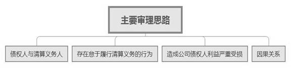
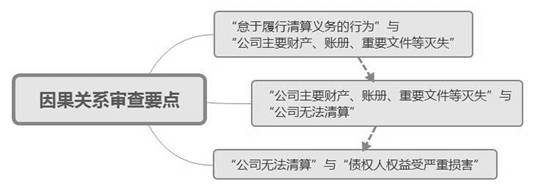

### **有限责任公司清算清偿责任纠纷案件的审理思路和裁判要点**

清算清偿责任纠纷是指公司清算义务人因怠于履行公司清算义务，公司债权人起诉要求其就公司债务承担连带清偿责任的纠纷。**有限责任公司清算清偿责任纠纷案件在审理时应以侵权责任构成要件为总体审查标准，以过错推定为归责原则，同时兼顾公司债权人与公司股东间的利益衡平，在注重股东权利与义务的对等性以及个案差异性的基础上，把握好“怠于履行公司清算义务行为”与“股东抗辩事由”的审查尺度，慎重认定股东清算清偿责任，避免过度冲击股东有限责任制度**。现结合典型案例对此类案件的审理思路和裁判要点予以梳理和总结。

**一、典型案例**

**案例一：涉及怠于履行清算义务的认定**

张某系A公司小股东，在A公司出现解散事由之日起十五日内未依法组织清算。公司债权人王某起诉张某，要求张某对公司不能清偿债务承担连带清偿责任。张某主张其系公司小股东，未实际参与公司经营管理且不掌握公司账册，故客观上无法组织清算，不能认定其存在怠于履行清算义务的行为。王某认为股东无论占股多少均为法定清算义务人，且不论其是否实际参与公司经营或掌握公司账册，均应承担清算清偿责任。

**案例二：涉及“怠于履行清算义务”与“公司主要财产、账册、重要文件等灭失”间因果关系的认定**

赵某系B公司股东，在B公司出现解散事由之日起十五日内未依法组织清算，且B公司财产在该期间被法院依法查封拍卖。B公司主要财务账册在发生解散事由前已不完整。B公司债权人李某起诉赵某，要求赵某对B公司不能清偿债务承担连带清偿责任。赵某主张因法院查封致其无法控制公司主要财产，且公司的主要财务账册事前已不完整，故赵某并未“怠于履行清算义务”导致“公司主要财产、账册、重要文件等灭失”。李某认为赵某负有保管公司账册和主要财产的职责，故其不可免责。

**案例三：涉及“公司主要财产、账册、重要文件等灭失”与“公司无法进行清算”间因果关系的认定**

孙某系C公司股东，在C公司出现解散事由之日起十五日内未依法组织清算。C公司债权人钱某申请启动清算程序后，法院以C公司主要财产、账册、重要文件等灭失为由裁定终结清算程序。钱某遂以终结裁定为依据，起诉要求孙某对C公司不能清偿债务承担连带清偿责任。孙某主张法院在出具终结裁定前未严格按照最高法院《关于审理公司强制清算案件工作座谈会纪要》的有关要求进行审查，故该终结裁定不能作为认定因果关联的证据。钱某认为生效裁定具有证明力，可作为定案证据。

**案例四：涉及损害结果的认定**

吴某系D公司股东，在D公司出现解散事由之日起十五日内未依法组织清算，且D公司在出现解散事由前已无财产。D公司债权人周某起诉吴某，要求其对公司不能清偿债务承担连带清偿责任。吴某主张因公司早已无财产，故债权人的债权不可能得到清偿，即便其存在怠于清算的行为亦不会损害债权人利益。周某认为清算义务人的清算清偿责任，不因公司解散时的实际财产不能清偿全部债务而免责。

 **二、有限责任公司清算清偿责任纠纷案件的审理难点**

**（一）怠于清算行为认定难**

实践中，如何认定清算义务人怠于履行清算义务存在困难。法院能否直接根据公司主要财产、账册、重要文件等灭失的结果推定股东主观上存在不作为的过错，以及能否根据股东为公司清算作出过努力而认定其不存在怠于清算行为，相关审查尺度如何把握尚无明确标准。

**（二）因果关系认定难**

此类案件至少需确定三层因果关系：**一是**股东不作为与公司主要财产等灭失之间的因果关系；**二是**公司主要财产等灭失与公司无法清算之间的因果关系；**三是**公司无法清算与债权人利益受损之间的因果关系。对于可切断因果关系的事实认定标准，尤其在涉及小股东的纠纷中尚存在争议。

**（三）董事清算义务人及其责任认定难**

依据《民法典》第70条规定，法人的董事为清算义务人，法律、行政法规另有规定的除外；董事未及时履行清算义务造成损害的，应当承担民事责任。该规定与现行有限责任公司清算义务人为公司股东的认定标准存在出入，债权人能否基于上述条款追究有限责任公司董事的清算清偿责任，实务中尚存在困难。

**三、有限责任公司清算清偿责任纠纷案件的审理思路和裁判要点**

完善公司退出机制是当前法院优化法治化营商环境的重要任务之一。公司法人制度、股东有限责任作为现代公司制度的基石，亦不应被随意突破。因此，**法院在审理有限责任公司清算清偿责任纠纷案件时尤需注意内外利益的平衡。对外，应注意公司债权人与负有清算义务股东间的利益平衡；对内，应注意怠于履行清算义务的大股东与其他较少或不参与公司经营管理的中小股东间的利益平衡**。

有限责任公司清算清偿责任纠纷案件应按照民事侵权责任的认定标准，结合《公司法》《公司法司法解释（二）》，从严审查主体、行为、结果等构成要件；在因果关系的认定方面宜采取举证责任分步骤分配的审查方式；在归责原则上一般适用过错推定原则。实践中，法院应审慎认定主观过错及因果关系，不宜纯粹以推论形式认定怠于行为成立，也不宜在因果关系存疑时判令股东承担清算清偿责任。具体审查步骤和要点如下：

**（一）诉讼主体的审查要点**

**1****、原告的公司债权人资格**

公司债权人与公司间的基本债权债务关系不存在争议是首先需确认的事实，一般以生效法律文书为证。清算义务人如对此提出异议并初步举证的，原则上应另案先行解决债权债务纠纷。

**2****、被告的清算义务人资格**

清算义务人是基于其与公司间的特定法律关系而在公司解散时对公司负有依法组织清算义务，并在公司未及时清算给相关权利人造成损害时依法承担相应责任的民事主体。依据《公司法司法解释（二）》第18条规定，有限责任公司的清算义务人为公司股东，一般应以工商登记为准。被告如否认其股东资格并初步举证的，原则上应另案先行解决股东资格纠纷。在审查时应注意以下要点：

**（****1****）与清算人的区分**。清算人是指具体负责执行公司清算事务的主体，但并不负有法定清算义务。清算人虽可能与清算义务人发生重合，但其承担的是清算责任，与清算义务人的清算清偿责任不同，应注意区分。

**（****2****）仅起诉部分股东的**。清算清偿责任属于侵权责任纠纷，债权人有权起诉部分或全部清算义务人。为查清事实，法院在必要时可依法追加其他清算义务人作为第三人参加诉讼。

**（****3****）主张追究公司董事清算清偿责任的**。根据第九次全国法院民商事审判工作会议精神，清算清偿责任作为一项突破股东有限责任制度的严格责任，在适用上具有特殊的构成要件。《公司法司法解释（二）》将清算清偿责任人限缩为“因怠于履行清算义务致使公司主要财产、账册、重要文件等灭失的股东”。因此，在《公司法》修改前，不宜直接认定公司债权人可依据《民法典》第70条追究有限责任公司董事的清算清偿责任。

**（二）存在怠于履行清算义务行为的审查要点**

“怠于履行清算义务”是指有限责任公司的股东在法定清算事由出现后，在能够履行清算义务的情况下，故意拖延、拒绝履行清算义务，或者因过失导致公司无法进行清算的消极行为。依据《公司法》第183条规定，公司应当在解散事由出现之日起十五日内成立清算组开始清算。实践中，股东的怠于履行清算义务行为主要表现为：股东没有按要求启动清算程序、成立清算组；清算组成立后，股东怠于履行清理公司主要财产以及管理好公司账册、重要文件等义务。股东如举证为确保清算顺利进行已采取必要行为的，可认定其怠于履行清算义务行为不成立。在审查时应注意以下要点：

**1****、归责原则的适用**

股东怠于履行清算义务行为的归责原则适用过错推定责任原则。公司债权人初步举证存在“有限责任公司的股东逾期不成立清算组进行清算”或“未履行清理公司主要财产以及管理好公司账册、重要文件”的事实，股东则需举证证明其已为履行清算义务采取相应的积极措施；股东举证不能的，可推定其怠于履行清算义务行为成立。

**2****、积极措施的认定**

积极措施是指股东为确保清算顺利进行而已采取的必要行为。如清算前或清算中确遇障碍的，法院需审查股东是否及时采取适当、必要的措施排除妨碍，包括其是否提起知情权诉讼等司法救济途径。个案审查时，可根据股东的职务大小与性质、是否参与公司经营管理、参与程度等综合认定其是否有义务采取措施以及采取的措施是否达到积极程度。

**3****、不构成“怠于履行清算义务”的认定**

（1）“持股少、不参与公司实际经营管理”是清算义务人主要的抗辩理由之一。有限责任公司股东如举证证明其既不是公司董事会或者监事会成员，也没有选派人员担任该机关成员，且从未参与公司经营管理，以不构成“怠于履行清算义务”为由，主张其不应当对公司债务承担连带清偿责任的，法院可予支持。如案例一中，清算义务人如证实符合上述条件的，其免责抗辩可予支持。

（2）公司股东申请法院指定清算组对公司进行清算是股东的权利而非义务，在出现“公司解散逾期不成立清算组进行清算的”“虽然成立清算组但故意拖延清算的”“违法清算可能严重损害债权人或者股东利益的”情形时，与造成上述情形无关的公司股东未申请法院指定清算组对公司进行清算的，不构成“怠于履行清算义务”。

**（三）造成公司债权人利益严重受损结果的审查要点**

公司债权人利益严重受损是清算义务人承担清算清偿责任的重要条件。法院需审查确实存在股东因怠于履行清算义务致使公司债权人利益已严重受损的事实，相关举证责任由公司债权人承担。如公司债权人能够证明“公司无法进行清算”且其债权未受偿的，原则上可推定其利益严重受损。

**（四）因果关系的审查要点**

鉴于公司债权人客观上无法详细掌握公司运营情况和财务信息，在因果关系的认定上，法院宜采取举证责任分步骤分配的审查方式。在公司债权人就必要事实作初步举证后，由清算义务人就不存在因果关系的抗辩承担举证责任。此类纠纷存在三个层层递进的因果关系。如任一因果关系断链的，法院宜认定因果关系就此阻却，不能得出侵权行为与损害结果之间存在关联的判断。

**1****、“怠于履行清算义务的行为”与“公司主要财产、账册、重要文件等灭失”之间因果关系的审查步骤和要点**

**首先**，审查公司债权人是否初步证明存在“股东怠于履行清算义务”与“公司主要财产、账册、重要文件等已灭失”的事实，一般以法院终结清算裁定为证。**其次**，审查清算义务人是否举证证明其不存在“怠于履行清算义务行为”，或“怠于履行清算义务行为”与“公司主要财产、账册、重要文件等灭失”之间没有必然联系。清算义务人举证不能的，法院可推定因果关系成立。

如案例二中，清算义务人如举证证明其对公司主要财产、账册、重要文件并不负有保管义务或灭失责任与其无关的，法院可据此认定阻却因果关系，清算义务人因此免责。

**2****、“公司主要财产、账册、重要文件等灭失”与“公司无法清算”之间存在因果关系的审查步骤和要点**

**首先**，审查公司债权人是否初步证明存在“公司主要财产、账册、重要文件等灭失”与“公司实际未进行清算或清算程序因清算不能终结”的事实。**其次**，审查清算义务人能否证明“认定公司无法清算依据不足”或“公司可以清算”。清算义务人举证不能的，法院可推定因果关系成立。审查时应注意以下要点：

（1）“灭失”的程度需与公司无法清算相称，一般的损耗、遗失不应计入。如仅是延期组成清算组清算、少量材料遗失，尚未达到“无法清算”程度的，不宜认定为“灭失”。

（2）如“公司无法进行清算”的事实业经清算程序确认，清算义务人举证证明终结强制清算裁定书的认定存在程序瑕疵的，法院可对裁定书的形成过程予以审查：**一是**法院有无按照最高法院《关于审理公司强制清算案件工作座谈会纪要》第28条规定，要求清算义务人、管理层及相关人员提交财产状况说明和相关材料；**二是**法院是否对直接责任人员释明或采取罚款等民事制裁措施；**三是**对于公司尚有部分财产，依据现有账册等材料可以进行部分清偿的，法院是否参照企业破产法的规定对现有财产进行公平清偿。如没有履行上述程序直接终结强制清算的，法院不能将终结强制清算裁定书作为认定“公司无法进行清算”的唯一依据，还应结合其他证据进行综合认定。如案例三中，清算义务人如能举证证明法院终结清算存在相关瑕疵，债权人如无其他证据补强的，原则上可阻却因果关系。

**3****、“公司无法清算”与“债权人权益受严重损害”之间存在因果关系的审查步骤和要点**

**首先**，审查公司债权人是否初步证明存在“公司无法清算”“债权未受偿”的事实。**其次**，审查清算义务人是否举证证明“公司应当清算时已无财产”的事实。清算义务人承担清算清偿责任的前提是公司解散事由出现时公司能够全部或部分清偿债务。该前提条件不存在的，清算义务人不产生清算清偿责任。如案例四中，清算义务人如能举证证明公司解散事由出现时公司已无财产的，则可阻却因果关系，清算义务人不承担清算清偿责任。

**（五）诉讼时效的审查要点**

清算清偿责任请求权的诉讼时效应从公司债权人知道或者应当知道公司无法进行清算之日起计算。此处知道或者应当知道的是“清算义务人怠于履行清算义务导致公司无法清算”的事实，而非公司法定解散事由出现的事实。

**1****、经清算程序后债权人起诉的**

公司债权人如先申请公司强制清算，法院经审理后以无法清算或无法完全清算为由终结清算程序的，应当以终结裁定送达债权人之日为知晓之日。清算义务人有证据证明公司债权人在终结裁定作出前知道或应当知道的，以该时点起算诉讼时效。

**2****、债权人直接起诉的**

公司债权人如直接起诉清算义务人的，法院经审查认定公司确实无法清算，清算义务人又以时效抗辩的，由清算义务人就债权人何时已经知晓无法清算的事实进行举证。如清算义务人不能证明无法清算的事实状态在诉前即已确定且已为债权人知晓的，可认定通过本次诉讼程序确认无法清算的事实。

**3****、特殊情形**

公司债权人若为实际参与公司经营管理的股东、董事等，基于其职务身份可认定知道或应当知道“公司法定解散事由”“被诉股东怠于履行清算义务”等事实的发生。此类债权人提起诉讼的，应当严格按照法律规定自公司法定解散事由之日起十五日后计算诉讼时效。此外，原告如系受让取得公司债权的，根据具体案情，对其诉讼时效可从宽把握。

**四、其他需要说明的问题**

本文仅适用于有限责任公司清算清偿责任纠纷案件，而不适用于其他类型法人清算清偿责任纠纷案件，其他类型的纠纷案件应适用相应的法律法规及相关司法解释。

（根据赵卫平、须海波提供材料整理）