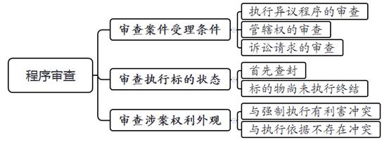
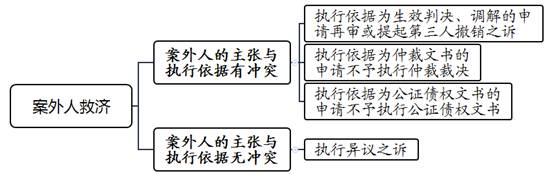
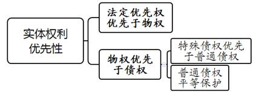
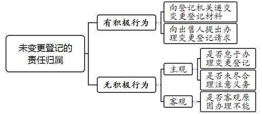

### **案外人执行异议之诉案件的审理思路和裁判要点**

案外人执行异议之诉又称执行标的异议之诉，是指案外人在执行程序中不服执行异议裁定，主张对法院查封、扣押、冻结的执行标的享有排除执行的民事权益，而向执行法院提出的诉讼。与普通民事诉讼中确认之诉、给付之诉及形成之诉的私法功能不同，该类诉讼主要解决涉案执行标的物能否依法执行处置的涉公法问题，从而对不当或违法的执行措施予以纠正，对案外人真实合法的权利予以救济。由于现行法律的相关规定不够具体明确，司法实践中存在适法不统一的情形。本文结合司法实践中的典型案例，对案外人执行异议之诉案件的审理思路和裁判要点进行梳理、提炼和总结。

一、典型案例

**案例一：涉及案外人执行异议之诉异议时间的审查**

执行法院在执行王某与周某买卖合同纠纷案件中，查封了被执行人周某名下的涉案房屋。案外人郑某以其在查封前已购买涉案房屋为由请求中止对该房屋的强制执行。执行异议被裁定驳回后，郑某以其对涉案房屋享有排除执行的民事权益为由，向执行法院提出案外人执行异议之诉，请求对涉案房屋判决不得执行并确认其对涉案房屋享有所有权。审理中，被执行人周某对郑某主张的事实予以认可。经审查，涉案房屋在郑某提出案外人异议前已通过司法拍卖裁定过户给竞买人陈某。

**案例二：涉及基于合同法律关系提出的执行异议之诉**

因A公司未履行生效判决确定的金钱给付义务，B公司申请法院查封了登记在被执行人A公司名下的多套房屋。案外人刘某对其中一套涉案房屋提出执行异议，主张其为A公司的工程承包人，在法院查封前与A公司签订了商品房买卖合同，约定以工程款折抵购房款向A公司购买该套商品房。因此，刘某以其对涉案房屋享有消费者物权期待权为由，请求对涉案房屋判决不得执行。

**案例三：涉及基于物权法律关系提出的执行异议之诉**

被执行人张某因未履行生效法律文书确定的金钱给付义务，执行法院对登记在其名下的涉案房屋强制执行。涉案房屋评估、拍卖过程中，案外人李某以其在法院查封前已与张某签订房屋代持协议，其系涉案房屋的实际权利人为由提出执行异议之诉，请求执行法院对涉案房屋判决不得执行并确认房屋归其所有。

**案例四：涉及基于公司法律关系提出的执行异议之诉**

2017年5月，执行法院依申请冻结了被执行人黄某持有的C公司股权。后D公司主张法院冻结股权前已与黄某签订涉案股权转让协议且已支付相应的股权转让款，并已办理股东名册变更登记、实际行使股东权利，遂向执行法院提出执行异议之诉，请求对涉案股权判决不得执行。

二、案外人执行异议之诉的审理难点

**（一）案外人执行异议之诉中虚假诉讼辩别难**

司法实践中，存在不少被执行人与案外人恶意串通，通过倒签买卖、租赁合同的方法恶意提出执行异议之诉，以拖延、规避和阻碍执行法院对涉案标的物的依法执行。案外人执行异议之诉目前归类为民事案件，法院在民事案件审理中对当事人是否存在恶意串通情形予以甄别并加以惩处的司法手段有限。因此，法院在审理该类诉讼中对相关当事人是否存在恶意诉讼、虚假诉讼的审查存在一定障碍。

**（二）案外人生存权益与申请执行人胜诉权益衡平保护难**

该类案件中，即使案外人对涉案执行标的物所主张的权益是真实的，是否能排除执行法院的强制执行仍需进一步审查，亦需在案外人生存权益与申请执行人胜诉权益之间进行综合平衡考虑。对于案外人是否享有商品房物权期待权，在认定标准上存在较大争议，如“生活必须的房屋”是否应限于本地区范围内的房屋、与案外人共同生活的直系亲属名下有房是否影响认定等。

**（三）案外人执行异议之诉与其他诉讼竞合处理难**

案外人执行异议之诉与其他诉讼存在法律上的竞合关系，如案外人执行异议之诉与案外人执行异议、案外人申请再审、第三人撤销之诉、另案确权诉讼、破产程序中的取回权纠纷等案件存在错综复杂的关系，也容易导致认识上的偏差。司法实践中，不少当事人对不属于案外人执行异议之诉审理范围的争议提出执行异议之诉，这给准确厘清、识别案外人执行异议之诉带来困难。

三、案外人执行异议之诉的审理思路和裁判要点

法院审理案外人执行异议之诉案件，首先，应当依法审查案外人的起诉是否符合案外人执行异议之诉的受理条件；其次，应审查案外人主张的民事权益是否真实、合法、有效；最后，综合判断案外人主张的民事权益能否排除法院对涉案执行标的物的强制执行。

**（一）案外人执行异议之诉的程序审查**

****

**1****、****审查案件受理的条件**

**（****1****）执行异议程序的审查**

执行程序中，案外人对执行标的物主张排除执行的民事权益，应依据《民事诉讼法》第234条提出书面异议。符合立案条件的，执行法院立“执异”案号进行审查，并作出是否中止执行的执行裁定。案外人、当事人不服该执行异议裁定的，可在执行裁定书送达之日起十五日内，向执行法院提出执行异议之诉。案外人未经前置执行异议程序，不得直接提出案外人执行异议之诉。需要说明的是，案外人收到驳回执行异议裁定后，提出案外人执行异议之诉的十五日为除斥期间，不适用诉讼时效中止、中断的规定。

案外人撤回异议或者异议被裁定驳回后，再次就同一执行标的提出异议的，法院不予受理。需要说明的是，此处的执行标的是指申请执行人与被执行人之间的执行法律关系。在不同执行案件中案外人对同一标的物分别提出异议针对的是不同的执行法律关系，不构成重复提出案外人异议。

**（****2****）管辖权的审查**

根据《民事诉讼法解释》第304条规定，该类诉讼由执行法院管辖。执行案件被指定执行、提级执行、委托执行后，案外人对原执行法院查封、扣押或冻结的执行标的物提出异议的，由提出异议时的执行法院管辖；受指定或者受委托的法院是原执行法院下级法院的，仍由该上级法院管辖。

**（****3****）诉讼请求的审查**

案件审理中，法院应审查案外人执行异议之诉的诉讼请求是否符合法律规定。由于执行异议之诉以执行法院裁定驳回执行异议为前置程序，因此案外人在执行异议之诉中诉请指向的执行标的以及主张的权利内容，应当与执行异议程序保持一致。否则，法院应当裁定不予受理或者驳回起诉。

案外人提出执行异议之诉的，诉讼请求应当表述为请求不得执行涉案执行标的物。申请执行人提出执行异议之诉的，诉讼请求应当表述为请求对涉案执行标的许可执行。当事人诉讼请求不明确的，法院应当依法释明。如案外人的诉请不符合法律规定，经法院释明后当事人仍拒绝变更诉讼请求的，视为其诉讼请求不属于案外人执行异议之诉的受理范围，依法裁定驳回起诉。

在案外人执行异议之诉中，对于诉讼请求指向的执行标的物，案外人依法可以一并提出确权的诉讼请求。案外人未提出确权诉讼请求的，法院不作确权判决，仅在裁判理由中进行分析判断并作出能否排除执行的判项即可。案外人同时提出排除执行和确权两项诉讼请求后又撤回排除执行诉讼请求的，法院应当告知其一并撤回确权的诉讼请求，否则裁定驳回起诉。在案外人执行异议之诉中，执行法院不得单独对案外人请求确权的诉讼请求进行裁判，否则有违执行异议之诉制度的立法本意。

**2****、审查执行标的的现状**

**（****1****）执行状态的审查**

案外人执行异议之诉的指向对象必须是执行案件中被有效查封、扣押、冻结的执行标的物。下列情形不属于执行程序中的执行标的物，不具备提出案外人执行异议之诉的条件：一是案外人诉请的执行标的物查封、扣押、冻结期限已经届满或者被裁定解除；二是被执行人在执行过程中已实际清偿债务或已提供相应财产替换被查封、扣押、冻结的涉案标的物；三是法院立案之前被执行人已经进入破产程序。此外，案外人诉请的执行标的物若被其他法院首先查封，则案外人一般不得就轮候查封的财产向轮候查封法院提出案外人执行异议之诉。

**（****2****）执行异议时间节点的审查**

案外人执行异议之诉中的查封时间是指执行案件对涉案标的物最早查控的时间。例如，涉案标的物被诉前或诉中保全，则该保全时间即为查封时间。如保全、执行中查封、扣押、冻结期限届满前进行续封，仍以首次查封时间作为查封时间。

案外人应在执行标的执行终结之前提出异议，而执行标的由申请执行人或者被执行人受让的，应当在执行程序终结之前提出。案外人在上述时间节点之后提出案外人执行异议之诉的，法院应当依法裁定不予受理。

如案例一中，涉案房屋经执行法院拍卖后过户登记至竞买人陈某名下，该执行标的物已经执行处置完毕，不再属于被执行人周某的责任财产，故不能成为案外人执行异议之诉的诉讼标的。案外人郑某在涉案房屋执行完毕后才提出执行异议之诉，执行法院应依法裁定驳回起诉。

**3****、审查涉案权利的外观**

**（****1****）与强制执行有利害冲突**

在该类案件立案、审理中应审查诉的利益是否存在。如案外人执行异议之诉没有诉的利益，法院应依法裁定不予受理或判决驳回起诉。如案外人仅作为执行标的物的抵押权人或者其他优先受偿权人，对执行标的物提出异议请求排除执行，则法院不予支持。因为抵押权人等优先受偿权人可以在法院处置涉案执行标的物后就所得执行款依法优先受偿，其与强制执行不存在法律上的利益冲突。如执行法院对执行标的物准予负担租约拍卖，则该执行标的物承租人的租赁权并未受到损害，若其提出异议请求停止拍卖，执行法院不予支持。

**（****2****）与执行依据无冲突**

若案外人对执行依据即生效法律文书确定的权利义务存在异议，应告知其通过审判监督程序予以救济。如原生效法律文书确定的民事权利义务关系指向特定标的物，且该标的物与案外人民事权益主张所指向的标的物相同，则需区分以下情形进行处理：

**第一**，原生效法律文书确定涉案标的所有权属于申请执行人，案外人主张该生效法律文书存在错误。若执行依据是法院作出的生效判决书、调解书，则案外人可通过案外人申请再审或第三人撤销之诉寻求救济。如执行依据是仲裁裁决书、调解书以及赋予执行效力的公证债权文书，案外人、利害关系人可以依据最高法院《关于人民法院办理仲裁裁决执行案件若干问题的规定》、最高法院《关于公证债权文书执行若干问题的规定》向法院申请不予执行该非诉法律文书。

**第二**，申请执行人为生效法律文书确认的优先债权人且对涉案标的物享有优先受偿权，此时应区分案外人的诉讼请求是否承认申请执行人所享有的优先受偿权。如案外人只是认为其主张的实体权利在执行受偿顺序上更优先于申请执行人的权利，而并不认为申请执行人的权利不真实或者优先受偿不合法，则案外人主张的实体权利系执行过程中产生的争议，与原生效法律文书无关，属于执行异议之诉的审理范围。

**（二）案外人执行异议之诉的实体审查**

与案外人异议执行审查程序中以登记或占有的权利外观作为审查标准不同，案外人执行异议之诉中，法院应当对案外人主张权利的真实性、合法有效性以及保护的必要性进行审查，在依法综合评判及价值衡量后对涉案财产作出可否执行的判定。

**1****、案外人的举证证明责任**

案外人对执行标的物提出执行异议之诉的，应当对其主张排除强制执行的民事权益承担证明责任。根据最高法院《关于深入开展虚假诉讼整治工作的意见》，法院应当全面审查案外人主张事实的真实性及法律关系的有效性，综合判断当事人是否存在捏造事实对执行标的提出异议的情形。需要注意的是，被执行人对案外人主张排除执行的民事权益予以认可时，不能免除案外人的举证义务。

如案例一中，周某与郑某对涉案房屋买卖的合同签订、价款支付、转移占有等事实均予以认可，但法院认为以现金方式支付300万元购房款明显有违常理，且郑某亦不能提供银行转账凭证、取款凭证等证明其付款真实性。因此案外人郑某的举证未达到优势证据的证明标准，即使该案未因程序问题被驳回起诉，郑某的诉讼请求亦不能得到法院支持。

**2****、权利优先顺位的审查**

法院在审查案外人权利的顺位时，首先应区分申请执行人是优先债权人还是普通债权人，即申请执行人是否对涉案执行标的物享有担保物权、建设工程优先受偿权等法定优先权。如申请执行人的债权为普通债权，只要案外人主张的民事权益符合上述法定条件，一般可支持案外人请求排除强制执行的诉请。如申请执行人对涉案执行标的物依法享有对抗案外人的担保物权等法定优先受偿权，对案外人基于合同法律关系提出排除执行的诉请一般不予支持，但法律另外规定的除外。此时，需要依据《民法典》相关规定对案外人与申请执行人所享有的权利进行权衡，以判断案外人排除执行的主张能否得到支持。

**3****、案外人基于合同法律关系提出的执行异议之诉**

**（****1****）基于物权期待权提出的执行异议之诉**

参照最高法院《关于人民法院办理执行异议和复议案件若干问题的规定》第28条规定，案外人对执行标的物主张物权期待权的，根据下列要件判断能否排除执行：一是法院查封前案外人已与被执行人签订合法有效的书面买卖合同；二是法院查封前案外人已合法占有该不动产；三是起诉前案外人已支付全部价款或者已按照合同约定支付部分价款且已将剩余价款交付法院执行；四是非因案外人自身原因未办理不动产权属转移登记。

关于非因案外人自身原因未办理不动产权属登记的认定，只要买受人存在向不动产登记机构递交过户登记申请材料或向出卖人提出办理过户登记的请求等积极行为，即可以认定符合上述要件。当买受人不存在上述积极行为时，法院应综合考量主观、客观两方面因素，认定未办理过户登记能否归责于案外人。

关于主观方面的审查，应重点审查案外人是否存在怠于甚至故意不办理权属变更登记，或者由于自身未尽合理注意义务而导致不能办理权属变更登记的情形。如案外人为逃避税收等原因而故意未办理登记，未能注意到他人设定的抵押或者政策限制等造成的变更登记障碍。案件审理中，还应结合合同约定及履行情况、案外人自身的具体事实，对案外人的主观状态进行综合考量。

关于客观方面的审查，应重点审查是否存在因登记机构、出卖人阻碍等案外人不能控制的原因，导致不能办理过户登记的情形。司法实践中，可参考相同项目、相近购买时间的其他买受人能否顺利办理过户登记等事实，以判断案外人对涉案房屋未办理过户登记是否存在过错。

动迁安置房在限售期内被司法查封的，一般可以认定为案外人对不能办理过户存在过错，法院对其排除执行的诉讼请求一般不予支持。审理过程中，若发现因动迁房升值，申请执行人与登记的权利人恶意串通损害案外人合法权益的，则可向案外人释明，告知其通过提出第三人撤销之诉或依法对生效法律文书申请再审进行救济。动迁安置房在允许上市交易之后被司法查封的，在满足其他法定条件的情况下，法院对案外人排除执行的诉讼请求依法可予支持。

案外人以其已购买被法院查封的被执行人名下船舶、机动车等特殊动产为由，提出执行异议之诉，主张请求排除强制执行，符合下列条件的法院可予支持：一是法院查封前案外人已与被执行人签订合法有效的特殊动产买卖合同；二是法院查封前案外人已经长期实际占有使用特殊动产；三是起诉前案外人已经支付全部价款；四是非因案外人自身原因未办理权属转移登记。关于非因案外人自身原因未办理权属转移登记的认定，可参照上述非因案外人自身原因未办理不动产权属登记的规则进行审查。

**（****2****）商品房消费者提出的执行异议之诉**

参照最高法院《关于人民法院办理执行异议和复议案件若干问题的规定》第29条规定，商品房消费者物权期待权优先于建设工程价款优先受偿权和抵押权，同时满足下列要件的法院可予支持：一是保护的对象是为满足生活居住需要向房地产开发企业购买商品房的自然人；二是申请执行人的债权应为金钱债权；三是案外人与被执行人应当在法院查封之前签订合法有效的书面买卖合同；四是案外人的购房目的系用于居住，且其在同一设区的市或者县级市范围内无其他居住房屋；五是案外人已支付的购房款超过或接近合同约定总价款的50%，且对于剩余购房款愿意按法院要求交付执行。

司法实践中，存在不少房地产开发企业选择以房抵债方式支付工程款的情形。如房屋受让人已办理不动产登记，对其权利依法应予保护。然而对于尚未办理不动产登记的受让人，以房抵债协议仅能产生合同法上的效力，基于债权的平等原则，其对涉案房屋一般不享有排除执行的权利。

如案例二中，案外人刘某与被执行人A公司系以商品房买卖为名行以物抵债之实，且刘某名下有其他居住房屋，故执行法院驳回了刘某请求不得执行涉案房屋的诉讼请求。

**（****3****）基于租赁权提出的执行异议之诉**

承租人与被执行人订立租赁合同并提出执行异议的，一般属于执行程序中新产生的实体争议，应当适用《民事诉讼法》第234条关于执行标的异议的规定进行审查。需要指出的是，在执行标的被保全、查封之后，承租人明知该情形仍与被执行人订立租赁合同并提出执行异议的，不属于执行程序中新产生的实体争议，可以适用《民事诉讼法》第232条关于执行行为异议的规定进行审查。

参照最高法院《关于人民法院办理执行异议和复议案件若干问题的规定》第31条规定，符合下列条件的，法院对案外人主张可予支持：一是承租人在租赁物被查封之前已与被执行人签订合法有效的租赁合同；二是承租人已按约支付租金；三是承租人已实际占有使用租赁物。

需要特别注意的是，如存在下列情形则应综合考量案外人是否构成虚假诉讼阻碍执行：一是案外人与被执行人存在关联关系；二是租金约定明显过低；三是租金支付方式有违常理，通常表现为一次性预付较长租赁期间的租金、以现金方式支付大额租金；四是应当办理租赁登记备案但未办理；五是存在名为租赁实为借贷的情形；六是签订租赁合同后未实际占有使用。对构成虚假诉讼的当事人，法院应当驳回其诉讼请求，并可依法处以罚款、拘留，情节严重的移送公安机关依法追究刑事责任。

**4****、基于物权法律关系提出的执行异议之诉**

司法实践中，不少案外人主张因缺乏购房资格、贷款资格等原因而借用被执行人名义购买房屋，主张其系涉案房屋的实际权利人，请求对登记在被执行人名下的涉案房屋排除强制执行。

关于借名人在履行相关合同义务后对出名人享有的权利性质，司法实践中尚存争议。我们认为，基于物权法定原则，借名人并不能当然取得涉案房产的所有权，其仅对出名人享有请求办理过户的权利。在因出名人未履行相关金钱债权导致涉案房屋被查封执行的案件中，因借名买房合同系借名人和出名人之间的内部约定，不得对抗善意第三人，故在借名人作为案外人提出执行异议之诉的情形下，对于该类诉讼请求一般不予支持。

如案例三中，李某证明涉案房屋的购房款由其实际支付，涉案房屋也一直由其占有使用。根据物权法定原则，其仅能依据与张某之间的合同享有相应债权。李某不能通过合同约定，对抗对涉案房屋登记享有信赖利益的申请执行人的执行申请，故法院判决驳回李某的诉讼请求。

**5****、基于公司法律关系提出的执行异议之诉**

执行法院冻结登记在被执行人名下的股权，受让人以其已经受让该股权为由，提出执行异议之诉请求排除执行，符合以下条件的可予支持：（1）受让人与被执行人在股权冻结前已签订合法有效的书面股权转让合同；（2）有限公司的其他股东半数以上同意其受让股权，或知晓其出资事实且未提出异议；（3）受让人在股权冻结前已足额支付股权转让价款；（4）受让人提供的股东名册、公司章程等文件能证明其已实际行使股东权利。

如案例四中，D公司以其为涉案股权的受让人为由提出执行异议之诉。法院经审查，D公司与黄某之间的股权转让协议真实且发生于法院冻结行为之前，D公司已行使股东权利且黄某已收取股权转让款，黄某的责任财产并未因股权转让行为而减少，故法院判决支持D公司的诉讼请求。

法院经审查存在以下情形的，对受让人排除涉案股权强制执行的诉讼请求一般不予支持：（1）转让股权需经批准方能生效但未经批准的；（2）转让股权需符合一定条件，但条件未成就的；（3）有其他证据证明转让人与受让人恶意串通以逃避、阻碍执行的。

**（三）案外人依据另案生效法律文书提出执行异议之诉的裁判思路**

首先，法院应当审查另案生效法律文书是否违反执行异议之诉管辖的规定，是否与执行案件的执行依据就同一法律问题或法律事实作出矛盾的判决；其次，应当审查案外人与被执行人是否存在通过另案诉讼规避执行的情形；再次，应当审查另案裁判是确权裁判还是给付裁判；最后，综合判断给付裁判的优先性。如申请执行人依据生效判决对涉案标的物享有抵押权，案外人依据另案生效法律文书对涉案标的物享有租赁权，案外人则不能依据涉及租赁权的给付裁判内容，排除申请执行人享有抵押权给付裁判的执行。

**1****、依据查封前另案生效法律文书提出执行异议之诉**

**（****1****）执行依据为普通金钱债权给付裁判**

涉案标的物在查封前，另案生效法律文书已将其确权给案外人，由于生效法律文书具有物权变动的效力，案外人依据另案生效法律文书请求不得执行的，法院应予支持。

**（****2****）执行依据为非金钱债权裁判**

第一，若作为执行依据的生效裁判为确权裁判，不论作为异议依据的裁判是确权裁判还是给付裁判，一般不应据此排除执行，但法院应当告知当事人可对作为执行依据的确权裁判申请再审。

第二，若作为执行依据的生效裁判为给付标的物的裁判，而作为提出异议之诉依据的裁判是确权裁判，一般应据此排除执行，此时法院应告知申请执行人可对该确权裁判申请再审。

第三，若两个裁判均为给付标的物的裁判，法院需判定哪个裁判认定的给付权利具有优先性，进而判断是否可以排除执行。

**2****、****依据查封后另案生效法律文书提出执行异议之诉**

执行法院查封涉案标的物后，案外人通过另案诉讼对涉案标的物进行确权，违反执行异议之诉管辖的规定。该另案生效确权判决书或调解书依法不能对抗执行法院的强制执行。

执行法院查封标的物后，当事人对该执行标的物向执行法院之外的法院起诉请求确认合同效力的，该诉讼虽不违背执行异议之诉管辖的原则，但因申请执行人未参与该诉讼，也不能依据该诉讼认定的事实在执行异议之诉中直接认定案外人合同效力，执行法院仍应对案外人的该项主张进行实体审查。

四、其他需要说明的问题

申请执行人提出许可执行异议之诉的，法院可参照上述审理思路和裁判要点进行审理。案外人对刑事裁判追缴或责令退赔部分的执行标的提出实体异议的，依据最高法院《关于刑事裁判涉财产部分执行的若干规定》，应通过《民事诉讼法》第232条处理，依法不得提出案外人执行异议之诉。案外人认为生效刑事裁判文书对涉案财物是否属于赃款赃物认定错误的，应当移送刑事庭处理；刑事庭无法通过裁定补正的，应当告知当事人通过审判监督程序处理。

（根据民事庭阮国平、董健提供材料整理）