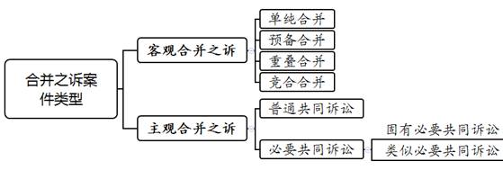
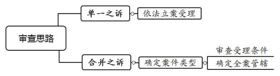
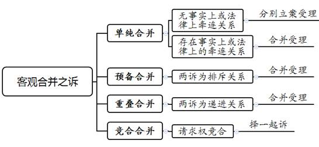
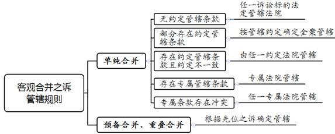
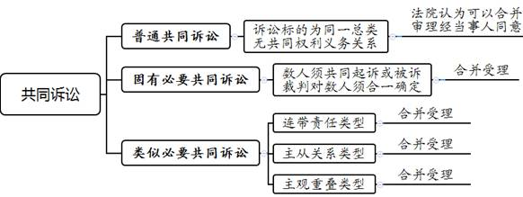
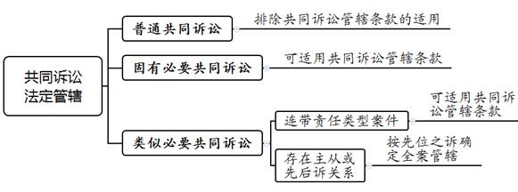
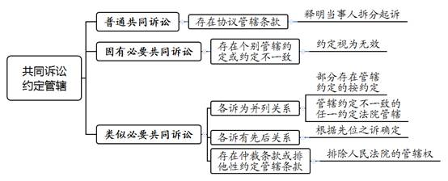

### **民事诉讼合并之诉受理的审查思路和裁判要点**

诉的合并，是指法院将两个或者两个以上存在关联关系的诉讼标的，合并于同一诉讼程序进行审查和裁判的制度。法院通过诉的合并，有助于提高诉讼效率、节约诉讼资源、预防裁判冲突等。目前，诉的合并案件在受理标准及管辖确定层面存在类型识别难、法律规定少、管辖盲点多等突出问题，导致司法实践中合并之诉管辖产生诸多争议，适法存在分歧。本文重点论述“案件合并受理的合法性判断”“合并之诉管辖权的确定”，并结合司法实践中的典型案例，对此类案件的审查思路与裁判要点进行梳理、提炼和总结。

一、典型案例

**案例一：存在牵连关系的单纯合并之诉可合并受理**

A公司与B银行签订《综合授信合同》，约定流动资金贷款的综合授信额度为1000万元。A公司与B银行先后签订5份《流动资金贷款借款合同》，后A公司到期未归还欠款，B银行向法院提起诉讼，提交涉案的5份借款合同作为证据，要求A公司返还欠款1000万元及相应利息。

**案例二：客观预备合并之诉可合并受理**

C公司与D公司签订《电子设备买卖合同》，约定由C公司出售电子设备并负责安装，合同总价为500万元。后D公司以通知函的形式告知C公司中止双方的买卖合同，双方的涉诉标的由第三方履行完毕。C公司认为D公司单方解除合同缺乏依据，故诉至法院，请求判令D公司继续履行合同；若法院认为合同无法继续履行，则请求判令解除合同、D公司支付相应违约金。

**案例三：普通共同诉讼案件不适用共同诉讼管辖条款**

E公司与F公司履行货物买卖合同中，F公司因拖欠货款被法院判决承担还款责任。执行中，F公司无财产可供执行，法院裁定终结本次执行程序。E公司认为，F公司原股东姚某、陈某、朱某抽逃出资，应在抽逃出资本息范围内对涉案债务承担连带清偿责任；G公司作为股权受让方应对债务承担连带责任；H公司协助股东抽逃出资应承担连带清偿责任。经查明，三名涉案股东、G公司、H公司的住所地均不同，E公司向H公司住所地法院对上述五被告提起诉讼，对于H公司住所地法院能否行使全案管辖权存在争议。

**案例四：类似必要共同诉讼案件根据先位之诉确定管辖**

林某驾驶机动车过程中与行人刘某发生碰撞，造成刘某伤势过重死亡。肇事车辆在保险公司购买了交强险和商业三者险，事故发生在承保期间内。本案中，交通事故发生地、林某住所地、保险公司住所地均不在同一辖区内。刘某的近亲属向保险公司住所地法院提起诉讼，请求判令林某赔偿医疗费、护理费、营养费、丧葬费、精神损害抚慰金等共计157万余元，保险公司在承保范围内承担连带赔偿责任。

二、合并之诉案件类型及受理的处理原则

合并之诉案件受理的关键前提在于对此类案件进行精准、清晰地归类。在理论界，我国合并之诉尚未形成较为统一的理论体系，以致案件归类存在分歧。司法实践中，关于不同类型合并之诉案件的受理条件和管辖确定，则缺乏明确的规定。此类案件受理的处理主要依赖法官的主观经验判断，易引起法律适用分歧。因此，法院有必要对此类案件的类型进行梳理并确定合并之诉案件合并条件和管辖确定的基本原则。

**（一）合并之诉案件的具体类型**

结合司法实践的实际情况，常见合并之诉案件主要包括诉的客观合并和诉的主观合并（共同诉讼）。诉的客观合并主要包括单纯合并、预备合并、重叠合并以及竞合合并。共同诉讼包括普通共同诉讼和必要共同诉讼，必要共同诉讼包含固有必要共同诉讼及类似必要共同诉讼。

**（二）合并之诉案件受理的基本原则**

**1****、牵连原则**

牵连原则是指法院应对包含多个诉讼请求或主体的案件进行综合审查，通过考量诉讼标的及主体之间在事实或法律上的关系，权衡能否实现促进诉讼效率提升、防止裁判冲突及维护当事人实体权益等合并之诉的功能，进而综合判断牵连关系的强弱，并确定合并之诉案件的具体类型。对存在较强牵连关系且符合合并之诉目的情形的，法院应合并受理并裁判，反之应当向当事人释明拆分起诉。

**2****、利益协调原则**

在共同诉讼中，各诉讼标的之间存在共同或牵连关系时，需牺牲部分被告的法定管辖利益以实现合并审理。利益协调原则是指法院在审查合并之诉案件时，应当就诉的合并所得利益与当事人原本的法定管辖利益之间进行协调、平衡，根据牵连关系强弱确定合并管辖或拆分受理。对于牵连关系较强的案件，法院可视情进行管辖。反之，对各诉讼标的均有管辖权的法院方可合并受理全案。

**3****、优先原则**

优先原则是指依据管辖利益确定全案管辖权的归属时，专属管辖、协议管辖及先位之诉管辖具有优先性。因专属管辖属于法律强行性规定，故合并之诉中存在专属管辖的，全案应由专属法院管辖。协议管辖与专属管辖之外的法定管辖不一致的，全案管辖应根据协议予以确定。如存在多个协议管辖或专属管辖，在各诉应合并审理的前提下，任一专属管辖法院或协议管辖法院均可行使管辖权。当案件存在非并列关系的多个诉讼请求或被告时，若先位、后位之诉的法定管辖不一致或约定管辖冲突的，法院应根据先位之诉确定全案管辖。

三、民事诉讼合并之诉受理的审查思路和裁判要点

法院审查该类案件时，**首先，应对起诉的诉讼标的进行审查，确认属于单一之诉或合并之诉。其次，在确认为合并之诉后，根据相关法律规定及各诉之间的牵连性确定案件合并之诉的类型。最后，在此基础上审查受理的条件及确定管辖的法院**。

**（一）客观合并之诉受理的审查思路和裁判要点**

**1****、审查客观合并之诉的案件类型及受理条件**

客观合并之诉系同一原告向同一被告提出包含若干独立的诉讼标的之诉讼，法院需根据各个诉讼标的之间的关系确定案件类型及受理条件。

**（****1****）单纯合并之诉的审查**

原告利用同一诉讼程序向法院提起数个并列存在的诉讼标的系单纯合并之诉。法院应具体审查各个诉讼标的之间是否存在牵连关系，若各个诉讼标的在案件事实、证据调查、当事人诉辩等方面存在共同之处的，属于具有牵连关系的单纯合并之诉。如受诉法院对合并之诉其中之一享有管辖权且若干诉讼适用同一诉讼程序，则应当予以合并受理。反之，则属于无牵连关系的单纯合并，法院在立案阶段应对数个诉分别予以立案。

如案例一中，B银行以多个借款合同为证据起诉A公司，其本质上为数个互相独立的诉。然而，由于B银行提供证据证明上述借款均在同一《综合授信合同》项下，数个独立的诉之间构成事实上的牵连关系，法院应当予以合并受理。

**（****2****）预备合并之诉的审查**

原告在同一诉讼中提起先位之诉，同时提起或追加存在相互排斥关系的后位之诉，则属于预备合并之诉。因法院对先位之诉不支持时方才审理后位之诉，故对预备合并之诉应当合并审理。

如案例二中，C公司向受诉法院提出两个不能同时成立的诉讼请求：先位之诉请求法院确认D公司单方解除合同的行为无效，要求其继续履行合同；后位之诉在合同无法继续履行的情况下，要求D公司支付违约金。若法院认为D公司应当继续履行合同，则后位之诉无需审理；反之，则应对违约金的诉请进行审理。因此，本案属于预备合并之诉，法院应当合并审理。

**（****3****）重叠合并之诉的审查**

原告同时主张多个排列顺位的诉请，请求法院在认可先位诉请时对后位诉请进行裁判，若先位诉请不成立则不请求对后位诉请进行裁判，则属于重叠合并之诉，法院对重叠合并之诉应当合并审理。在实践中，此类案件常见于债务人死亡或法人承继等引发的诉讼。例如，甲向法院起诉乙，请求法院判决双方离婚、乙向甲支付婚姻存续期间家庭暴力造成的人身损害赔偿10万元。此时，只有法院认可解除婚姻的先位诉请，方能对请求损害赔偿的后位诉请进行审理；反之，则无必要审理后位诉请。

**（****4****）竞合合并之诉的审查**

原告依据实体法享有若干独立的请求权，在单一诉讼中向被告一并提起诉讼的，为竞合合并之诉。根据《民法典》第186条规定，因当事人一方的违约行为，损害对方人身权益、财产权益的，受损害方有权选择请求其承担违约责任或者侵权责任。因此，在请求权竞合的情形下，法院不认可对此类案件进行合并审理，当事人应择一起诉。

**2****、确定客观合并之诉案件的管辖**

**（****1****）单纯合并之诉的管辖**

在地域管辖方面，同一原告向同一被告提出数个并列关系的诉讼标的且当事人未对地域管辖作出约定的，法院应依照法定管辖的具体规定确定全案管辖。具体而言，**其一**，若各个单一之诉的法定管辖不一致时，受诉法院对其中任一诉讼标的享有法定管辖权的，则对全案享有合并管辖权。**其二**，合并的诉讼标的部分存在管辖协议的，根据协议管辖优先于法定管辖原则，法院应当按照管辖协议确定全案管辖。**其三**，合并的诉讼标的均存在管辖协议且约定不一致时，任一约定管辖法院均可对全案行使管辖权。**其四**，各诉讼标的中有一个或多个为专属管辖时，由专属法院行使管辖权。若各专属管辖之间存在不一致，法院对其中任一诉讼标的享有专属管辖权，则对全案享有管辖权。

**（****2****）预备合并及重叠合并之诉的管辖**

法院应当遵循先位之诉优先的原则确定预备合并和重叠合并案件的地域管辖。法院在预备合并之诉中若不认可先位诉请则对后位诉请进行审理，在重叠合并之诉中若支持先位诉请则方才对后位诉请进行审理，故在先位诉请与后位诉请管辖不一致时，法院应根据先位诉请确定管辖。

**（二）共同诉讼案件受理的审查思路和裁判要点**

**1****、审查共同诉讼的案件类型及受理条件**

同一诉讼中，两人以上原告或两人以上被告共同起诉、应诉的，为诉的主观合并，即共同诉讼。在符合共同诉讼要件的前提下，法院应当根据诉讼标的之间的关系确定具体类型及受理方式。

**（****1****）普通共同诉讼的审查**

案件的诉讼标的属于同一种类，诉讼标的之间不存在共同的权利义务关系的，属于普通共同诉讼。普通共同诉讼主要包括诉讼标的为同一种类的共同诉讼，如出卖人请求数个无关联的买受人支付货款的诉讼，以及因不真正连带责任形成的共同诉讼等。在事实和法律上存在较强牵连性的普通共同诉讼，合并审理有助于节约司法资源、提高诉讼效率。同时，当事人对此类案件享有程序上的选择权，即法院认为可以合并的案件须经当事人同意方可合并审理，反之则应拆分起诉。

**（****2****）必要共同诉讼的审查**

根据诉讼标的之间的牵连性差异，必要共同诉讼可分为固有必要共同诉讼和类似必要共同诉讼。法院经审查认为数人必须共同起诉或被诉，否则当事人适格即有欠缺，且法院裁判对数人必须合一确定的，则属于固有必要共同诉讼。常见的案件主要为因共同共有产生的诉讼。基于当事人权利义务的共有性，此类诉讼的牵连性最强。如非全体当事人共同行使，则当事人的权益无法得到有效的保障与实现，故法院必须合并受理。

无需多个当事人共同起诉或应诉，但法院的裁判对数人有合一确定必要的，为类似必要共同诉讼。司法实践中常见的类型有以下三种：**第一**，连带责任类型的共同诉讼，即各平等地位的被告之间存在连带义务的共同诉讼。常见类型包括因共有不动产或者动产产生的债权债务关系引发的诉讼、因连带债权或连带债务引发的诉讼等。**第二**，主从关系的共同诉讼，即各被告之间存在主从关系，并基于主从关系进行合并的共同诉讼。常见类型为因主合同与担保合同引发的纠纷。**第三**，主观重叠的共同诉讼，即法院对先位之诉被告的诉请予以支持的前提下，方对其他被告的请求予以认可的共同诉讼。例如，债权人在起诉主债务人公司的同时要求其股东承担出资不实、抽逃资金、违法清算等补充赔偿或连带责任的诉讼。类似必要共同诉讼因各诉讼标的之间系基于同一事实或法律上的原因，当事人提起合并诉讼的，法院应合并受理。

****

**2****、确定共同诉讼案件的管辖**

**（****1****）共同诉讼案件中法定管辖的适用规则**

《民事诉讼法》第22条第3款规定，同一诉讼的几个被告住所地、经常居住地在两个以上法院辖区的，各该法院均有管辖权。该条款就共同诉讼管辖方式作出基本规定，司法实践中法院需根据共同诉讼的不同类型确定是否应适用共同诉讼管辖条款。

**第一**，普通共同诉讼应排除共同诉讼管辖条款的适用。普通共同诉讼不存在不可分的共同权利义务，也非基于同一事实或法律上的原因，为无需合一确定的共同诉讼，故不可因合并审理而损害部分被告的法定管辖利益，不应适用共同诉讼管辖条款。受诉法院对各诉讼标的均需具有管辖权，方能对全案行使管辖权。

如案例三中，E公司诉请要求三名原股东、G公司、H公司分别就其侵权行为对未能清偿的债务承担连带赔偿责任。本案系普通共同诉讼，上诉人称H公司帮助三名原股东抽逃出资应承担连带清偿责任，要求H公司住所地法院行使全案管辖权。因本案其他被告的住所地与侵权行为地均不在H公司住所地法院辖区内，故本案不可合并审理。

**第二**，必要共同诉讼应根据不同情况适用共同诉讼管辖条款。对于固有必要共同诉讼及类似必要共同诉讼中属于连带责任类型的案件，原则上可适用共同诉讼管辖条款确定管辖法院，即受诉法院对其中任一被告有管辖权的，即可对全案行使管辖权。然而，当类似必要共同诉讼中各诉之间存在主从关系或后诉以先位之诉为前提时，应根据先位优先原则适用共同诉讼管辖条款，即由主位或先位之诉确定全案管辖。

如案例四中，林某驾车发生交通事故造成刘某死亡，刘某近亲属向保险公司住所地法院提起诉讼。先位之诉是对林某的侵权之诉，先位之诉被告林某的管辖利益高于后位之诉被告保险公司，故保险公司住所地法院并无合并管辖权。

**（****2****）共同诉讼案件中约定管辖的适用规则**

**第一**，对于普通共同诉讼，各诉中部分或所有单一之诉存在协议管辖条款的，应要求当事人拆分起诉。

**第二**，对于固有必要共同诉讼，对其中任一被告享有管辖权的法院即有合并管辖权，法院审查发现当事人之间存在个别管辖协议或管辖协议存在冲突时，管辖约定均应视为无效。

**第三**，对于类似必要共同诉讼，各诉部分或全部具有管辖协议的，根据专属管辖优先于协议管辖、协议管辖优先于法定管辖的原则分别予以处理。其一，各诉为并列关系，部分存在管辖协议的，按约定确定全案管辖法院。全部存在管辖协议且不一致的，任一约定管辖法院均有管辖权。其二，各诉为主从关系或后位之诉以先位之诉为前提情形的，根据主位或先位之诉确定全案管辖法院。其三，某诉具有仲裁条款或在涉外案件中某诉存在外国法院排他性约定管辖条款的，该诉排除人民法院的管辖权。

****

四、其他需要说明的问题

本文涉及的合并之诉分类、受理的条件及管辖的确定，在理论界与实务界均存在一定争议，尚未形成统一观点，故本文结合司法实践中的审理经验，在借鉴部分较为成熟理论的基础上，对常见的合并之诉类型进行总结与归纳。关于司法实践中争议较大的问题如“主观预备的共同诉讼合并受理”等，未纳入本文的讨论范围。

（根据立案庭乔林、杨燕提供材料整理）