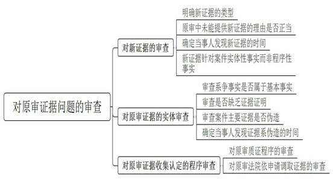
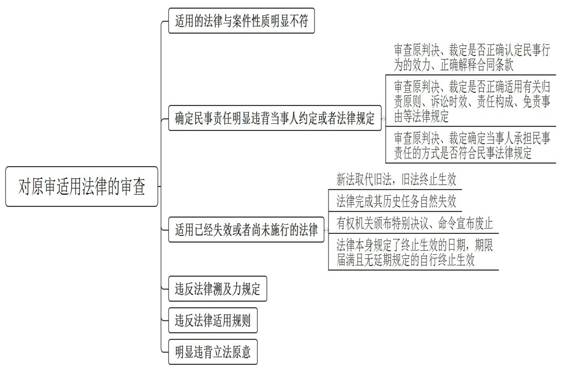
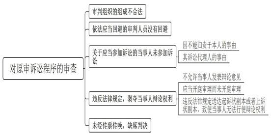

### **民商事申请再审案件要素式审查要点**

民商事申请再审案件的实质审查，主要依据《中华人民共和国民事诉讼法》针对生效裁判再审事由的第二百条和针对生效调解书再审事由的第二百零一条。其中，依据申请再审事由性质不同，针对生效裁判再审事由的审查可分为对原审证据问题、对原审法律适用、对原审诉讼程序及其他法定再审事由的审查。

**一、对原审证据问题的审查**

**（一）对新证据的审查**

民商事申请再审案件针对新证据的审查主要依据《民事诉讼法》第二百条第（一）项规定，即“有新的证据，足以推翻原判决、裁定”。结合《民事诉讼法》相关司法解释的规定，审查内容包括以下几点：

**1****、明确新证据的类型**

本项所指“新证据”主要有以下五类：（1）原审庭审结束前已存在，因客观原因于庭审结束后才发现的证据；（2）原审庭审结束前已经发现，但因客观原因无法取得或者在规定的期限内不能提供的证据；（3）在原审庭审结束后形成，无法据此另行提起诉讼的证据；（4）原审庭审结束后新出现的证据，如原作出鉴定结论、勘验笔录者重新鉴定、勘验，推翻原结论的证据等；（5）原审中已经提供，原审法院未组织质证且未作为裁判根据的证据，但原审法院依照《民事诉讼法》第六十五条规定不予采纳的除外。

**2****、原审中未能提供新证据的理由是否正当**

当事人无正当理由，在举证期限届满后提供的证据不是新证据。法院必须审查当事人在原审中未能提出新证据是否具有正当理由，如因非当事人的过错未能参加原审诉讼的，应当认可其具有正当理由。对于因客观原因无法取得或在规定期限内无法提供的新证据，法院应当审查当事人所主张的理由是否成立。

**【案例****1****】**

贺某向叶某借款并出具《借条》，后因贺某到期未还款，叶某诉至法院。一审法院判决贺某归还叶某借款本息。经审查，根据贺某新提供的鉴定意见，涉及《借条》《收条》和电子回单的银行开户申请资料中，“贺某”的签名和指印非其本人所签所捺。贺某的再审请求符合《民事诉讼法》第二百条第（一）项的规定。

**3****、确定当事人发现新证据的时间**

当事人申请再审，应当在判决、裁定发生法律效力后六个月内提出。但当事人以新证据为由申请再审的，应当自知道或者应当知道该新证据之日起六个月内申请再审，逾期提交则不再审查该新证据。

**4****、新证据针对案件实体性事实而非程序性事实**

本项新证据是指针对案件实体性事实的证据，而非针对程序性事实的证据。如当事人提出证明法院送达程序违法的证据，应当按照《民事诉讼法》第二百条第（九）（十）项的规定申请再审，不能适用新证据申请再审的期限规定。

**（二）对原审证据的实体审查**

民商事申请再审案件针对原审证据的实体审查主要依据《民事诉讼法》第二百条第（二）（三）项的规定，即“原判决、裁定认定的基本事实缺乏证据证明”“原判决、裁定认定事实的主要证据是伪造”。审查的内容应包括以下几点：

**1****、审查系争事实是否属于基本事实**

案件事实分为基本事实、次要事实、辅助性事实、背景事实等，只有基本事实缺乏证据证明才构成再审事由。依据《最高人民法院关于适用<中华人民共和国民事诉讼法\>审判监督程序若干问题的解释》第11条规定，基本事实是指对原判决、裁定的结果有实质影响、用以确定当事人主体资格、案件性质、具体权利义务和民事责任等主要内容所依据的事实。

**2****、审查是否缺乏证据证明**

结合案件当事人的听证陈述，查明案件的基本事实是否缺乏证据证明，要明确原审的定案证据和基本事实之间的证明关系以及逻辑联系，判断证据的内容或者根据证据进行推断能否形成高度盖然性的结论。

**3****、审查案件主要证据是否伪造**

主要证据是指具有足够证明力，并且对于案件基本事实认定必不可少的证据。伪造应当从广义理解，包括对主要证据进行涂改、撕毁、截取等变造方式。

**4****、确定当事人发现证据系伪造的时间**

与当事人以新证据为由申请再审相同，当事人应当自知道或者应当知道主要证据系伪造之日起六个月内申请再审。

**（三）对原审证据收集认定的程序审查**

民商事申请再审案件针对原审证据的程序审查主要依据《民事诉讼法》第二百条第（四）（五）项的规定，即“原判决、裁定认定事实的主要证据未经质证的”“对审理案件需要的主要证据，当事人因客观原因不能自行收集，书面申请人民法院调查收集，人民法院未调查收集的”。审查的内容应包括以下几点：

**1****、对原审质证程序的审查**

“原判决、裁定认定事实的主要证据未经质证”的认定，主要通过对原审庭审笔录等材料的审查来判断。当事人对原裁判认定事实的主要证据在原审中拒绝发表或放弃发表质证意见的，不属于《民事诉讼法》规定的未经质证的情形。

**2****、对原审法院依申请调取证据的审查**

认定“对审理案件需要的主要证据，当事人因客观原因不能自行收集，书面申请人民法院调查收集，人民法院未调查收集的”，应当审查以下内容：

**（****1****）判断是否属于主要证据**

构成本事由的证据必须是认定案件基本事实必须的主要证据。对于次要证据、补强证据或者与案件事实并无关联性的证据材料，即使未予收集亦不构成本项事由。

**（****2****）明确可以申请法院调查收集的证据范围**

当事人可以申请法院调查收集的证据主要有以下三类：**一是**申请调查收集的证据属于国家有关部门保存，当事人及其诉讼代理人无权查阅调取的；**二是**涉及国家秘密、商业秘密、个人隐私的；**三是**当事人及其诉讼代理人确因客观原因不能自行收集的。前两类证据由于证据本身的特性导致当事人只能通过法院来收集，第三类证据是一般性条款，不仅包括由于证据本身的特殊性导致当事人无法收集的情况，也包括由于自身条件限制致使当事人在客观上无法收集等情形，如当事人年迈或者身患重疾导致无法异地取证的情况。需要注意的是，对于当事人能够自行收集的证据，即使当事人曾向法院提出书面申请，但法院驳回申请或者未予收集的，不属于本项规定之列。

**（****3****）当事人是否提交书面申请**

当事人提交书面申请是本项规定的形式要件。提交的书面申请应当载明需要调查主要证据的名称、证据类型、待证事实等，以便法院审查并精准有效地调查收集证据。一般情况下，当事人的口头申请不符合本项的规定，但是当事人确无能力书写的，经过当事人的申请，并且办案人员以书面形式记录在案的情况，可以视为提出书面申请。

**（****4****）法院是否未收集上述证据**

“法院未收集上述证据”主要包括如下两种情形：**一是**法院在接到当事人要求对证据进行调查收集的书面申请后未予答复的，**二是**法院认为该证据并非案件主要证据不予调查收集的。

**二、对原审适用法律的审查**

民商事申请再审案件针对原审裁判适用法律的审查主要是依据《民事诉讼法》第二百条第（六）项的规定，即“原判决、裁定适用法律确有错误”。根据《民事诉讼法》司法解释第390条，主要情形有以下六种：

**（一）适用的法律与案件性质明显不符**

案件性质即当事人之间的法律关系，需要结合案件事实和证据综合认定。如果法官在认定法律关系时出现偏差，就会导致法律适用和裁判结果出现错误。

**【案例****2****】**

周某、艾某与A公司签订《协议书》，约定A公司将某分店10%的股份转给周某、艾某，周某不参与店内管理，双方共同承担公司的一切费用、损失等。后周某、艾某提起诉讼要求解除协议。原审法院认为当事人对彼此之间法律关系认识错误，双方法律关系应为民间借贷关系。后A公司认为原审认定法律关系错误申请再审。经审查，周某与A公司共同承担费用并共担损失，且在协议实际履行中获得分红，双方之间应为投资关系，原审法院认定为民间借贷关系属于适用法律错误。

**（二）确定民事责任明显违背当事人约定或者法律规定**

审查内容包括三个方面：1、审查原判决、裁定是否正确认定民事行为的效力、正确解释合同条款；2、审查原判决、裁定是否正确适用有关归责原则、诉讼时效、责任构成、免责事由等法律规定；3、审查原判决、裁定确定当事人承担民事责任的方式是否符合民事法律规定，并结合相应单行法的特别规定进行综合审查。

**（三）适用已经失效或者尚未施行的法律**

本项主要是指法律适用中对法律时间效力的认识错误。法律失效通常有四种情形：1、新法取代旧法，旧法终止生效；2、法律完成其历史任务自然失效；3、有权机关颁布特别决议、命令宣布废止；4、法律本身规定了终止生效的日期，期限届满且无延期规定的自行终止生效。

**（四）违反法律溯及力规定**

法律溯及力的一般原则是法不溯及既往，但在特定情况下，立法者可在法律中作出法律具有溯及力或者一定溯及力的规定。

**（五）违反法律适用规则**

法律的适用规则一般包括：上位法优于下位法、特别法优于普通法、新法优于旧法、强行性规范优于任意性规范、属地法优先等。违背上述适用规则的，应当认定为违反本项规定。

**（六）明显违背立法原意**

在法律对某一事项或者某一领域只有原则性规定，缺乏具体规定的前提下，法官适用原则性法律条文时需要考量立法原意。本条款的适用范围较窄，应当注意避免被滥用。

**三、对原审诉讼程序的审查**

对原审诉讼程序的审查主要依据《民事诉讼法》第二百条第（七）项至第（十）项规定，包括：

**（一）审判组织的组成不合法或者依法应当回避的审判人员没有回避**

**1****、审判组织的组成不合法**

《民事诉讼法》确定了独任制和合议制两种主要的审判组织形式。“审判组织的组成不合法”的主要情形包括：（1）陪审员进行了独任审判；（2）应当组成合议庭进行审理的案件，由法官一人进行了独任审判；（3）应当全部由法官组成合议庭进行审理的案件，却有陪审员参加了合议庭；（4）依法另行组成合议庭的，却有参加过原审合议庭的法官或者陪审员参加了新组成的合议庭；（5）合议庭组成人员未参加原庭审或者独任法官、合议庭组成人员不具有法官资格的，以及合议庭组成人员确定且告知当事人后，未经合法手续变更合议庭成员或者在法律文书上署名的法官并非告知当事人的合议庭组成人员等情形。

**2****、应当回避的审判人员没有回避**

《民事诉讼法》第四章确立了审判人员的回避制度，主要情形包括：（1）审判人员应当回避而未主动回避；（2）审判人员具有应当回避的情形且经当事人提起申请，但是法院作出了驳回回避申请的决定；（3）法院经当事人申请后，决定相关审判人员回避的，该人员仍然参与案件审理；（4）法庭未告知当事人相关权利。

**（二）无诉讼行为能力人未经法定代理人代为诉讼或者应当参加诉讼的当事人，因不能归责于本人或者其诉讼代理人的事由，未参加诉讼**

**1****、无诉讼行为能力人未经法定代理人代为诉讼**

主要审查以下要点：（1）当事人是否为无诉讼行为能力人；（2）该无诉讼行为能力的当事人是否有诉讼代理人；（3）该诉讼代理人是否是适格的法定代理人或其授权的代理人。

**2****、关于应当参加诉讼的当事人，因不能归责于本人或者其诉讼代理人的事由，未参加诉讼**

“应当参加诉讼的当事人”源自诉讼法上的必要共同诉讼，是指基于法律的规定当事人必须一并参与诉讼，相关当事人未参加诉讼的，法院必须依职权或者依申请予以追加的当事人。违反本项规定的情形主要包括：（1）对于必须共同进行诉讼的当事人没有参加诉讼的，法院有义务通知其参加诉讼但未履行通知义务；（2）当事人向法院提出追加必要共同诉讼申请，但是法院裁定驳回申请错误的。需要注意的是，如果当事人向法院明确表示放弃自己的实体权利，或者是由于当事人本人或其诉讼代理人的过错导致未能参加诉讼的，不构成本项规定的再审事由。

**【案例****3****】**

曹某向B公司租赁钢管等物资，C公司为该租赁合同的承租人提供担保。后B公司起诉曹某和C公司要求支付租赁费用。原审法院依据《租赁合同》支持了B公司的诉请。C公司认为依据该《租赁合同》，原审遗漏另一名设备租赁人成某作为当事人，程序违法，遂申请再审。经审查，B公司提供《租赁合同》承租方除了曹某外，还列有承租方“成某”并签字。原审法院未将成某追加为本案被告显属不当。

**（三）违反法律规定，剥夺当事人辩论权利**

剥夺当事人辩论权利的具体情况，应参照《民事诉讼法》司法解释第391条的规定进行判断，主要包括：

**1****、不允许当事人发表辩论意见**

在法庭审理中，法官应当公正合理地分配时间，使当事人充分发表辩论意见，如确实无法当场陈述的应当允许当事人庭后通过书面方式补充。如果庭审中法官不允许一方当事人发表辩论意见，或者对当事人发表辩论意见的次数、时间作出极为明显的区别对待，应当认定为不允许当事人发表辩论意见。

**2****、应当开庭审理而未开庭审理**

一审民商事案件，除当事人庭前达成调解协议或者原告撤回起诉的，均应当开庭审理。二审民商事案件经过阅卷、调查和询问当事人，对没有提出新的事实、证据或者理由，合议庭认为不需要开庭审理的，可以不开庭审理。违反上述规定不开庭审理的，应当认定为应当开庭审理而未开庭审理。

**3****、违反法律规定送达起诉状副本或者上诉状副本，致使当事人无法行使辩论权利**

法院应当在立案之日起五日内将起诉状副本发送被告。法院可以采用直接送达、邮寄送达、留置送达、电子送达、转交送达、委托送达以及公告送达等方式送达起诉状副本或者上诉状副本，但必须符合法律规定。违反法律规定采用不适当方式送达起诉状副本或者上诉状副本，致使当事人无法行使辩论权利，应当认定为违反法律规定，剥夺当事人辩论权利。

**（四）未经传票传唤，缺席判决**

法院审理民商事案件，应当在开庭三日前通知当事人和其他诉讼参与人。未经传票传唤，不得缺席判决。法院应当审查原审法院是否合法送达了传票，除直接送达外，采用其他送达方式是否符合法律规定。在判断公告送达合法性时，应着重审查原审法院是否已穷尽其他送达方式。

**【案例****4****】**

D公司与E公司签订《融资租赁合同》，由徐某、周某提供连带保证，后因E公司无法支付拖欠租金，D公司诉至法院。原审法院依法缺席判决徐某、周某二人承担连带保证责任。经审查，徐某收到过原审法院的诉讼材料和开庭传票，后原审法院未在传票载明的时间开庭，第二次开庭前未向徐某寄送传票，径直采用公告送达方式送达传票，徐某未能参加庭审。原审法院未能依法传唤徐某且公告送达程序违反法律规定，显属不当。

**四、其他法定再审事由的审查**

民商事申请再审案件的其他法定事由审查主要包括：

**（一）原判决、裁定遗漏或者超出诉讼请求**

当事人的诉讼请求在原审审理过程中可能会发生变化，应当根据当事人在起诉状和庭审中的陈述确定当事人的诉请。在判决中，应当对当事人的诉讼请求逐一列明，说明是否支持以及阐述理由。针对该项申请再审事由，法院应当首先明确原审中当事人诉讼请求的项目、内容和范围，并核对原审判决是否作出回应，如有遗漏或者超出应当认定符合申请再审法定事由。

**【案例****5****】**

F银行与G公司签订网贷通循环借款合同、最高额抵押合同各一份，G公司以其名下厂房提供抵押担保，赵某、马某对该笔债务承担连带保证责任。后因G公司、赵某、马某未清偿上述债务，F公司诉至法院。原审法院缺席判决G公司归还借款本息，赵某、马某承担连带清偿责任。经审查，原审法院判决未支持逾期利息且未释明不予支持的理由，属遗漏当事人诉请。

**（二）据以作出原判决、裁定的法律文书被撤销或者变更**

**1****、法律文书的类型**

根据《民事诉讼法》司法解释第393条，法律文书的类型包括：（1）发生法律效力的判决书、裁定书、调解书；（2）发生法律效力的仲裁裁决书；（3）具有强制执行效力的公证债权文书。除上述法律文书以外的文书，如鉴定意见书等即使被撤销或变更也不构成法定再审事由。

**2****、如何认定“据以作出”**

审查依据主要包括：（1）原判决、裁定所认定的主要事实全部或者部分来源于被撤销的法律文书，而非来源于原审认定的相关证据；（2）采纳相关结论，原判决、裁定的结论来源于被撤销的法律文书，而非根据原审相关证据论证得出。

**【案例****6****】**

在一件房屋所有权纠纷案件中，前案生效判决确认房屋产权归王某、包甲、包乙、包丙共同共有；原审判决根据前案判决确定的共有状态对房屋产权进行分割；后上级法院通过审判监督程序撤销了前案判决。现包甲以原审判决所依据的前案判决被撤销，申请对原审判决进行再审。经审查，因原审判决依据的生效判决被撤销，符合《民事诉讼法》第二百条第（十二）项的规定。

**（三）审判人员审理该案件时有贪污受贿，徇私舞弊，枉法裁判行为**

审判人员违法行为的认定主要依据生效的刑事法律文书或者纪律处分决定，除此以外的其他文书不能作为提起再审的依据。同时，在生效的刑事法律文书或者纪律处分决定中必须确认审判人员在审理该案中存在贪污受贿，徇私舞弊，枉法裁判行为。

**五、对生效调解书的审查**

**（一）调解违反自愿原则**

自愿原则不仅要求调解程序的启动应依据当事人的自愿选择，更要求协议的内容是出自当事人真实意思表示。对于法人或者其他社会组织的调解，需审查其代理人是否适格。无权代理人签订调解协议是实践中违反自愿原则的常见情形。

**（二）调解协议的内容违反法律**

本项所指“法律”仅指全国人大及其常委会制定的规范性法律文件以及国务院制定的行政法规。这些法律和行政法规可分为强制性规范和任意性规范，仅在违反强制性规范的情况下，方才符合申请再审的法定事由。

**【案例****7****】**

在一件房屋买卖合同纠纷中，当事人李甲患有精神分裂，其法定监护人为李乙。经原审法院主持，案件当事人之间达成调解协议，但未对李甲应享有的权益作出约定。后李甲、李乙认为该调解协议内容侵犯了李甲的合法权益，应认定无效。经审查，李甲系房屋的原始安置人、同住成年人，享有该房屋的一切合法权益。本案中，李乙只能代李甲做出纯受益的意思表示，而李乙代为放弃了李甲的实体权利，违反法律的相关规定。

（根据申诉庭姚夏海、董礼洁、陈曦、詹志雄、沈俊翔提供材料整理）