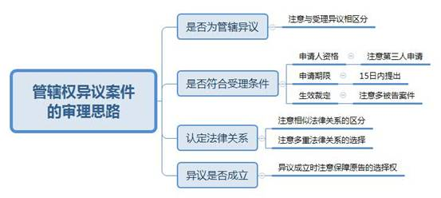
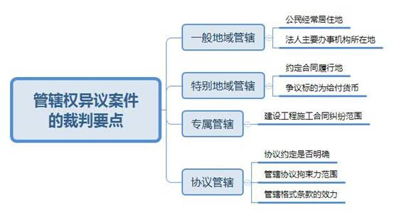

### **民商事管辖权异议案件的审理思路和裁判要点**

民商事管辖权异议案件是指当事人对民商事一审案件是否由受诉法院管辖而提出异议的案件，具有专业性较强、法律规定较分散、法律适用分歧较多的特点。实践中该类案件一般由审理案件的合议庭处理，并非专门合议庭集中处理，如此便给该类案件的适法统一带来了一定困难。我们以常见的典型案件为基础，对该类案件的审理情况进行归纳总结，形成审理思路和步骤，并对裁判要点予以提示，以期提升裁判水平，促进适法统一。

**一、基本案情**

**案例一**

原告彭某与被告A公司商品房预售合同纠纷一案中，A公司以其并非本案适格被告为由提出管辖权异议，请求驳回原告起诉。一审法院认为本案被告是明确的且具备主体资格，因此根据管辖规定认定本院享有管辖权。A公司关于其被告主体不适格的主张，与本案管辖权确定无关，裁定驳回A公司管辖异议。

**案例二**

原告B公司与被告C公司、第三人D公司金融借款合同纠纷一案中，D公司向一审法院提出异议认为本案应由其住所地法院管辖。一审法院认为，本案被告住所地位于本院管辖范围，故本院有权管辖，裁定驳回D公司异议。

**案例三**

靳某向其住所地法院起诉王某、孙某和柴某，要求王某、孙某承担因违约而需支付的违约金，柴某承担连带责任，四人住所地均不相同。被告王某对管辖提出异议认为应当由其住所地法院管辖。一审法院认为，王某异议成立，遂裁定将案件移送至王某住所地法院。

**案例四**

E公司向其住所地法院起诉要求F公司支付货款。F公司提出异议认为，根据法律规定本案应由被告住所地和合同履行地法院管辖，本案被告住所地和实际交货地点都在F公司所在地，故应裁定移送管辖。E公司则认为，本案合同履行地即为其住所地，故一审法院有管辖权。一审法院认为，E公司未能证明其在本院管辖的地域范围内履行交货义务，裁定异议成立。

**二、民商事管辖权异议案件的审理思路和步骤**

结合民商事管辖权异议案件审理中常见的问题，我们认为可以遵循以下思路及步骤进行具体研判。

**（一）审查判定是否为管辖异议**

实践中当事人提出的异议有多种，其中管辖异议是指当事人认为受诉法院不享有管辖权而提出的异议。故法院收到当事人异议申请后，首先应对异议的性质进行审查，根据异议的具体内容判断是否为管辖异议。实践中尤需注意与受理异议相区分，有些异议形式上为当事人对法院管辖提出异议，但其实质系对法院受理提出异议。

案例一的关键在于异议性质的识别认定，一审法院对此疏于审查。二审法院认为，A公司以其并非本案适格被告为由提出管辖异议，不属于民诉法规定的管辖异议情形，A公司是否系本案适格被告应由法院实体审理进行确定，故一审法院不应以管辖异议受理并作出裁定，而只需向当事人释明上述异议非管辖异议即可。

**（二）审查管辖异议的受理条件**

在异议性质明确为管辖异议后，法院应依据管辖异议的受理条件，从异议申请的主体、时间、客体等方面，对管辖异议作进一步合规性审查，主要有以下三点：

**1****、异议申请人是否具有申请资格**

收到管辖异议申请后，法院应判定处于该诉讼地位的申请人是否具有提出管辖异议的主体资格，尤需重点关注异议申请人是否为第三人。

案例二的关键在于如何处理第三人提出的管辖异议。二审法院认为，根据民诉法解释第82条规定，D公司处于无独立请求权第三人地位，无权提出管辖异议。故一审法院不应受理该管辖异议，并向当事人释明告知。

**2****、异议申请是否超过期限**

民诉法规定当事人对管辖权有异议的，应当在提交答辩状期间提出，即当事人需在收到起诉状副本之日起15日内提出管辖权异议。当事人超过法定期限提出管辖异议的，法院应不予受理。

**3****、本案管辖权是否已有生效裁定予以确定**

管辖裁定生效后即已确定案件管辖效力，法院不应再受理管辖异议。常见于存在多名被告的案件中，其中一名被告先收到诉状副本并提出管辖异议，法院审查后作出了生效裁定，其他被告因送达等原因较晚收到诉状副本，但也提出管辖异议。该情形下由于案件的管辖已有生效裁定确认，故在后的异议申请应不再处理。

**（三）审查认定法律关系**

案件法律关系的认定直接关系到管辖规则的适用，故受理管辖异议后应先明确案件的法律关系。实践中立案时确定的案由不一定准确，案件移送到合议庭后，法官应对案由进行重新审查以确保法律关系认定正确。重新审查时有以下两点应加以注意：

**1****、注意相似法律关系的区分**

某些法律关系本身具有相似性，在特定情形下容易混淆，如股东出资纠纷与公司增资纠纷，承揽合同纠纷与建设工程合同纠纷，名为担保实为借贷的纠纷等。若未能对相似法律关系作出正确识别，则会导致审查管辖异议的法律依据适用错误。

**2****、注意多重法律关系的选择**

在多重法律关系交错的案件中，原告对案件所适用的法律关系享有选择权。因此，在处理该类案件管辖异议时，要根据当事人的选择认定法律关系，但虚构法律关系恶意规避管辖的例外。

**（四）审查异议是否成立并作出裁定**

法律关系确定后，在此基础上准确适用对应的管辖规则，并据此判断管辖异议是否成立。异议成立的，裁定将案件移送有管辖权的法院；异议不成立的，裁定驳回。

实践中需注意裁定移送时应保障原告的选择权。法院在审理后认为被告管辖异议成立但存在多个法院有权管辖时，应尊重原告对管辖法院的再次选择权。法院应主动询问原告对于管辖法院的意见并根据原告选择作出裁定，不应径行移送案件。

案例三中，一审法院没有尊重原告的选择权，靳某上诉认为，其在法院谈话时已提出要求将本案移送至孙某住所地法院，但一审法院未予采纳。二审法院认为本案被告住所地法院均有管辖权，靳某选择由孙某住所地法院管辖合法有效，故本案应裁定移送孙某住所地法院。

**三、民商事管辖权异议案件的裁判要点**

管辖异议涉及的案件事实和法律关系一般都相对清晰，审理难度并不大，但目前管辖规定较为分散，部分规则仅由高院指导意见确立。对于并非专门办理管辖异议案件的法官来说，容易在某些特定概念或规则的理解与适用方面出现偏差，主要体现在地域管辖方面。我们在对审判实践调研的基础上，归纳总结以下裁判要点：

**（一）一般地域管辖**

一般地域管辖的原则是原告就被告，其裁判要点在于住所地的认定。法律对公民和法人的住所地认定有着不同的证明标准，导致公民经常居住地和法人主要办事机构所在地的认定在审判实践中较易出错。

**1****、公民经常居住地的认定**

民诉法解释第4条已对如何认定公民经常居住地做出明确规定。在实践中，公民经常居住地的认定问题主要体现在对经常居住地证明标准的把握上。当事人一般提交居委会或者物业公司证明、街坊邻居出具的居住证明等。此类证据一般均可作为经常居住地的认定依据，但当证明材料出现冲突时，法院应主动加以查明。在无法查明的情况下，应以公民的户籍所在地和其他有效身份登记记载的地址确定管辖。

**2****、法人主要办事机构所在地的认定**

民诉法解释第3条规定法人的住所地是其主要办事机构所在地。对此高院意见认为法人住所具有特定法律含义且具有唯一性，不能将法人实际办公地点、生产经营地点、销售地点、联系地点等场所与之混淆，应采用注册登记地标准来认定法人住所地。当事人主张主要办事机构所在地与注册登记地不一致的，应提供相关工商登记材料等予以证明，不能仅依据营业场所照片、租赁合同等证据材料对主要办事机构所在地作出认定。

**（二）特别地域管辖**

民诉法及其司法解释对合同、侵权、劳动争议、离婚、公司、保险、票据等特定纠纷类型案件有特别规定的，应优先适用。其中，合同纠纷中合同履行地的认定在实践中较易出错，此种情形占被改判管辖异议案件的近半数。

**1****、是否约定合同履行地**

根据高院意见，只有合同中明确约定“合同履行地”或“履行地”的，才能认定合同约定了履行地。仅约定特征义务履行地的，不能视为约定了合同履行地，如买卖合同中对交货地、收货地的约定等，不视为对合同履行地作出约定。

**2****、合同履行地没有约定或约定不明时如何处理**

尽管民诉法解释对此有详细规定，但在实践中对该规定的理解有所偏差：**一是**误认为合同履行地约定不明则意味着无法确定合同履行地，进而判定应当由被告住所地法院管辖。**二是**在约定不明时误将合同实际履行地作为管辖依据，进而判定应由合同实际履行地法院管辖。这里需要说明的是合同履行地的概念在诉讼法与实体法中有所不同，诉讼法中合同履行地的认定规则是有约定从约定，没有约定或约定不明则根据民诉法解释第18条确定管辖法院，法院不应以合同实际履行地确定管辖。

**3****、对争议标的为给付货币的理解**

关于合同履行地的认定，民诉法解释对争议标的为给付货币的合同作了特别规定。根据高院意见，**首先，**应确定原告诉请的类型；**其次，**需将原告的诉请与其在合同中的实体权利义务进行对照；**最后，**当原告在诉请与合同中所享权利一致时，方可适用该条款。“争议标的为给付货币的，接受货币一方所在地为合同履行地”并不限于合同标的仅为货币的借款合同，其他合同亦可适用。“接受货币一方”要依据合同的实体内容确定，不能仅凭在诉请中有给付货币的请求，就将原告确定为接受货币方，还需要原告在合同中也是接受货币方。

案例四的关键在于合同履行地没有约定或者约定不明时应如何认定。一审认为应当由E公司提供证据证明合同实际履行的地点，此处即是将诉讼法上的合同履行地等同于实体法上的合同实际履行地。对此二审认为，在未约定合同履行地的情形下，应根据《民诉法解释》第18条等相关规定确定合同履行地，E公司作为接受货币一方，其住所地就是合同履行地，故应由一审法院管辖。

**（三）专属管辖**

专属管辖异议案件的裁判要点在于纠纷范围的认定，其中建设工程施工合同纠纷范围的认定在实践中较易出错。民诉法解释第28条规定，建设工程施工合同纠纷适用不动产专属管辖。实践中常因将建设工程施工合同纠纷仅限于《民事案件案由规定》“建设工程合同纠纷”项下的“建设工程施工合同纠纷”，从而导致管辖规则适用错误。根据最高法院意见，建设工程施工合同纠纷应当包括“建设工程合同纠纷”项下的建设工程施工相关案件：建设工程施工合同纠纷、建设工程价款优先受偿权纠纷、建设工程分包合同纠纷、建设工程监理合同纠纷、装饰装修合同纠纷、铁路修建合同纠纷、农村建房施工合同纠纷。上述纠纷均适用不动产专属管辖，由不动产所在地法院管辖。

**（四）协议管辖**

当事人对管辖法院的约定复杂多样，管辖协议效力的认定一直是该类案件的裁判要点，需要根据个案实际情况作出具体判断。

**1****、协议约定是否明确**

民诉法解释规定，管辖协议可以约定两个以上与争议有实际联系地点的法院管辖。这里的约定地点必须明确具体，不可以是推断的地址。因此诸如“当地法院管辖”“上海法院管辖”“守约方住所地法院管辖”等原则上均视为约定不明。

**2****、对管辖协议拘束力范围的认定**

根据合同相对性，管辖协议的效力范围仅限于合同当事人。实践中，当案情复杂涉及多份合同时，实践中常因对管辖协议的效力范围疏于全面审查，不当扩大了管辖协议的拘束力范围。

**3****、管辖格式条款的效力认定**

经营者在与消费者订立合同时，往往会以格式条款的形式对管辖进行约定，实践中对此类约定的效力认定存在较大争议。关键在于经营者是否采取合理方式提请消费者注意，这不仅要求条款本身应当明确、突出，还需有证据证明消费者对该条款的存在具有明确清晰的认知。

（根据立案庭乔林、胡哲提供材料整理）