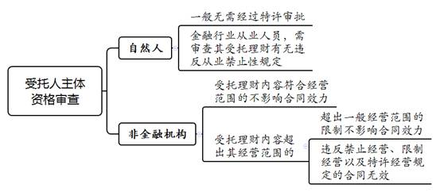
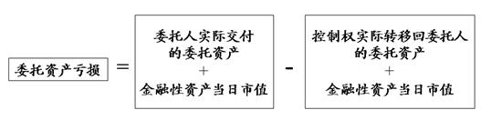
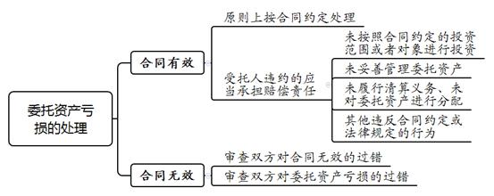
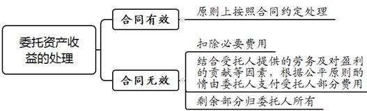

### **民间委托理财合同纠纷案件的审理思路和裁判要点**

民间委托理财合同纠纷又称非金融机构委托理财纠纷，是指委托人将其资金、金融性资产委托给非金融机构或自然人，受托人在一定期限内将委托资产投资于证券、期货等金融市场，由该资产管理活动引发的合同纠纷。该类案件中的非金融机构是指，除商业银行、证券公司、信托公司、保险公司和基金公司之外的非金融机构法人、非法人组织、个体工商户。司法实践中，法院对民间委托理财合同纠纷案件的相关裁判标准存在分歧，故有必要统一裁判尺度。本文结合司法实践中的典型案例，对此类案件的审理思路和裁判要点进行梳理、提炼和总结。

一、典型案例

**案例一：涉及委托理财合同中受托人资质的处理**

张某与A公司签订《VIP项目理财管理协议书》，委托A公司对其证券账户内的150万元进行操作。协议到期后，经结算委托资产亏损24万余元。经查，A公司的经营范围为投资顾问、技术推广服务、企业形象策划、公关服务等。张某认为，A公司不具备从事证券资产管理业务的资质，因其超出经营范围订立合同，合同应属无效。A公司则认为，委托理财并不要求受托人必须具备相应资质，委托理财合同应属有效。

**案例二：涉及委托理财合同中保底条款的认定及处理**

李某与顾某达成委托理财协议，李某支付顾某100万元，由顾某将资金投资于证券市场。顾某向李某承诺一年到期后返还全部本金及年化20%的收益，超额部分收益归顾某所有。投资过程中，李某、顾某多次就投资领域、买卖时点及价格等内容进行磋商。理财到期后结算，委托资产亏损28万余元。李某主张，协议约定的保证本金和固定收益条款符合民间借贷的典型特征，双方之间名为委托理财实为民间借贷，顾某应当按约还本付息。顾某则认为，双方之间为委托理财合同关系，保证本金和固定收益的条款属于保底条款应属无效，投资产生的亏损应由李某自行承担。

**案例三：涉及委托理财合同无效后亏损的分担**

任某与B公司签订《资产管理委托协议》，约定任某委托B公司投资理财，到期进行资金结算。若结算结果为盈利，则双方按照各自50%的比例分配收益；若结算结果为亏损，则由B公司承担全部亏损。后经结算，投资亏损50余万元。B公司认为，上述协议中的保底条款无效，保底条款无效导致委托理财合同无效，B公司在委托理财过程中不存在过错，相关损失应由任某自行承担。任某主张合同应属有效，委托理财产生的亏损按约应由B公司全额承担。即便因保底条款导致合同无效，作为从事受托理财的专业公司，B公司明知不得约定保底条款仍欺骗任某签订合同，其在委托理财过程中存在过错，应承担合同无效产生的全部损失。

**案例四：涉及委托理财合同案件审理中举证责任的分配**

杨某与刘某签订委托理财合同，约定提供100万元资金交由刘某在证券市场投资，投资范围限于“上证50指数成分股”。委托理财三个月后，经结算委托资产亏损近30%，而同期“上证50指数”跌幅约5%。杨某遂提出解除委托理财合同，并认为从委托理财的结果来看，刘某未按约投资“上证50指数成分股”，否则不可能产生巨额损失。杨某认为刘某在投资过程中未按照约定进行理财、未尽谨慎注意义务，要求刘某赔偿委托理财产生的全部损失。刘某则认为，杨某未举证证明刘某在委托理财过程中存在违约行为，应承担举证不能的后果。

二、民间委托理财合同纠纷案件的审理难点

**（一）受托人资质对合同效力的影响认定难**

关于受托人的资质对合同效力的影响，法院的裁判分歧主要在于：（1）委托理财是否为金融机构专营或者特许经营的业务；（2）受托人是否必须具备相应资质。一种观点认为，委托理财业务是一项需要获得行政许可的金融业务，有必要对受托人的身份进行适当限定，并对受托人设置一定的准入要求，不宜将委托理财活动一概合法化。另一种观点认为，法律、行政法规并未对民间委托理财活动作出禁止性规定，且依据《行政许可法》等相关法律精神，认定委托理财属于金融机构专营或特许经营范围的依据并不充分，故不宜轻易认定委托理财合同无效。

**（二）保底条款的认定及处理难**

首先，保底条款的认定存在争议。委托人与受托人约定保证本金不受损失、保证本息最低回报的情形属于保底条款并无争议。然而，对于委托理财合同中约定保证本息固定回报是属于民间借贷还是委托理财关系，保证损失上限的约定是否属于保底条款等问题存在不同认识。此外，保底条款的效力认定是委托理财合同纠纷案件中最具争议的问题。司法实践中主要存在以下四种观点：（1）条款有效说。该观点认为，从意思自治原则出发，委托理财合同中保底条款系双方真实意思表示，应认定为有效。（2）条款可撤销说。该观点认为，保底条款明显违反公平原则，若当事人申请撤销，则应对保底条款予以撤销，否则应认可保底条款的效力。（3）条款无效说。该观点认为，保底条款违背委托合同中委托人承担风险的基本规则，也违反公平原则和金融市场基本规律，应认定该条款无效，但保底条款的无效不影响委托理财合同的效力。（4）合同无效说。该观点认为，保底条款应属无效，且保底条款系委托理财合同的核心条款，与当事人的缔约目的密切相关，故保底条款的无效导致委托理财合同无效。

**（三）合同无效情形下责任承担的处理难**

委托理财合同有效的情况下，委托资产发生亏损或者产生盈利的，应当根据合同约定和《民法典》合同编的相关规定进行处理。若委托理财合同无效，受托人因委托理财合同取得的资金和金融性资产应如何处理，以及基于无效的委托理财合同产生的投资行为是否有效，司法实践中存在不同观点。此外，在委托资产亏损或盈利的情况下如何处理亦存在难点：（1）在委托资产亏损的情况下，委托理财中产生的损失应当由受托人或委托人承担，还是由双方根据过错承担相应责任；（2）在委托资产盈利的情况下，盈利部分是否属于非法利益，以及该部分应认定为委托资产的孳息归委托人所有还是应认定为受托人的劳动所得归受托人所有。

**（四）举证责任分配难**

在委托理财过程中，委托人往往并不掌握资金的详细交易情况，要求其对受托人在受托理财过程中存在违约行为或者未尽受托义务等承担举证责任，在客观上存在较大难度。因此，在委托理财合同纠纷案件中，如何合理地分配举证责任亦是该类案件审理的难点。

三、民间委托理财合同纠纷案件的审理思路和裁判要点

法院审理民间委托理财合同纠纷案件，**首先**，应以《民法典》总则编、合同编的相关条款作为主要法律依据。**其次**，应秉持防范金融风险、促进金融市场发展的宗旨，审慎审查当事人的约定与合同实际履行情况。**最后**，应平衡委托人与受托人的权益，尤其要妥当处理委托人与受托人在信息、资金、技术方面的不对称问题，公平合理地分配举证责任。

**（一）****民间委托理财合同与其他合同的辨析**

法院在审理民间委托理财合同纠纷时，首先应对民间委托理财合同纠纷与其他合同纠纷加以辨析。

**1****、****与民间借贷合同的区别**

民间借贷是当事人之间的资金融通行为，当事人的合意是拆借款项；委托理财合同则是受托人按约管理委托资产，进而获得一定的报酬或者分红。在区分委托理财合同与民间借贷合同时，应当查明双方订立合同时的实质目的是资金拆借还是委托理财。

**2****、与信托合同的区别**

在信托合同中，信托财产的所有权应转移至受托人，信托财产与委托人的其他财产相分离。受托人以自己的名义从事受托行为，委托人不得参与或者干预受托人的具体经营行为。在委托理财合同中并不转移委托资产的所有权，仅由受托人代委托人在证券、期货、国债等资本市场上管理资产，委托人可以对受托人的理财行为进行指示。

**3****、****与合伙合同的区别**

合伙合同是两个以上合伙人为了共同的事业目的，订立的共享利益、共担风险的协议。委托理财合同的当事人并不是为了经营共同事业，受托人通常只需按照约定对委托人的财产进行管理和运作。此外，基于合伙合同形成的合伙财产用于清偿合伙债务之后，根据合同约定在合伙人间进行分配；而委托理财合同中委托资产的所有权和收益均归委托人所有。

**（二）民间委托理财合同效力的审查要点**

法院在审理此类案件过程中，首先应依法审查合同的效力，再以合同效力为基础，对双方的权利义务进行判定。在合同效力的审查中，除审查一般合同效力的要件外，还应通过对委托理财合同主体和内容的审查，实现司法对该类行为的指引作用。

**1****、审查委托人、受托人的主体资格**

**（****1****）****审查委托人的主体资格**

一般情形下，依法具有独立民事主体资格的自然人、法人等均可作为委托人签订民间委托理财合同。需要说明的是，从维护国家金融安全和社会公共利益的角度考量，我国法律在部分投资领域对外商投资者作为委托理财合同的委托人作出一定限制，法院在审理此类案件中应注意加以甄别。

**（****2****）****审查受托人的主体资格**

**受托人为自然人的情况下**，一般而言其受托理财无需经过特许审批，但受托人属于金融行业从业人员的情况下，应进一步审查受托人有无违反从业禁止性规定。**受托人为非金融机构的情况下**，应当进一步对其受托理财的内容及经营资质、主体资格、经营范围等进行审查。若受托人受托理财的内容超出其经营范围，还需进一步区分超出事项的性质加以区分：对于超出事项属于一般经营范围的，并不影响合同效力；若超出事项属于禁止经营、限制经营以及特许经营的，因受托人违反效力性强制性规定，合同应认定无效。

如案例一中，A公司受托理财的内容是证券资产管理，该内容超出其经营范围。根据《证券法》的规定，从事证券投资咨询服务业务，应当经国务院证券监督管理机构核准，未经核准不得为证券的交易及相关活动提供服务。A公司超出经营范围订立合同，且证券业务属于需经核准的限制经营的业务，故《VIP项目理财管理协议书》因违反效力性强制性规定而无效。

**2****、****审查合同内容是否涉嫌违法犯罪、违反金融管理秩序**

审理此类案件过程中，法院发现委托人、受托人涉嫌通过委托理财行为从事非法操纵股票价格等违法犯罪活动的，应当根据最高法院《关于在审理经济纠纷案件中涉及经济犯罪嫌疑若干问题的规定》第11条规定裁定驳回起诉，并将有关材料移送公安机关或检察机关处理。需要注意的是，委托理财合同纠纷涉及非法吸收公众存款罪、集资诈骗罪、诈骗罪等刑事犯罪的，委托理财合同并不必然因涉嫌犯罪而无效，而应当根据民事法律规定对合同效力进行分析判断。关于涉及新型金融性资产的委托理财合同，需审查合同内容是否违反法律、行政法规等强制性规定，在此基础上对合同效力审慎作出认定。

**（三）民间委托理财合同中保底条款的认定及处理**

根据委托代理关系的基本原则，委托理财的收益和损失均应由委托人承担。实践中，受托人为吸引投资往往约定保底条款对委托人作出收益、本金或者损失上限的保证，因此保底条款也成为引发委托理财合同纠纷的主要原因。

**1****、保底条款的认定**

保底条款是指，无论委托理财盈利或者亏损，委托人均收回部分或全部投资本金甚至获取收益的条款，具体形式不限于在委托理财合同中约定保底条款，还包括签订单独的保底协议或出具承诺书等。保底条款实质指向的是投资理财风险的分配，表现为委托人不承担本应自负的收益不足或本金损失的风险，而将风险转由受托人等主体承担。因此，认定保底条款的关键在于是否属于对委托人本应自负的投资风险的再分配。

司法实践中，保底条款情形主要包括保证本金不受损失、保证本息最低回报、保证本息固定回报、保证本金损失上限、事后承诺补足损失和亏损不收取管理费用六种约定类型。其中，保证本金不受损失、保证本息最低回报条款属于保底条款无需赘述，下面就其他四种类型的约定是否属于保底条款进行分析。

**第一**，关于保证本息固定回报的约定是否属于保底条款的认定。在当事人存在争议的情况下，可通过审查是否存在委托理财项目、资金去向、操作方式、委托人是否参与投资理财活动、是否发生相应的利润分红等查明当事人缔约目的。如双方签订委托合同时委托人即明确知晓具体的投资理财项目，并对该投资项目的客观风险有一定了解，而受托人实际亦将受托资金投入相应理财项目，即可以确认双方之间系委托理财关系。

如案例二中，顾某承诺到期归还李某本金和年化20%的收益，案件审理中双方对于合同性质存在争议，故应从双方签订合同时的目的分析合同性质。从合同签订目的来看，李某将钱款委托给顾某投资理财是为了实现资产的保值增值，并非将款项出借给顾某。从实际履行情况来看，委托理财业务真实开展，李某始终知情并参与，故应当认定双方构成委托理财关系而非民间借贷关系，其中保证本息固定回报的约定属于保底条款。

**第二**，关于保证本金损失上限的约定是否属于保底条款的认定。保证损失上限的约定通常表现为两种形式：一是约定超出一定数额、比例之外的损失由受托人承担；二是约定委托人交付的资产达到或者超过一定风险限度时，委托理财行为立即终止，委托人收回操作权和资产控制权。上述第一种形式实质是，委托人仅承担固定的亏损风险，在此范围之外因委托理财可能产生的风险均由受托人承担。该约定符合保底条款的实质判断标准，应当认定为保底条款。第二种形式不同于一般的保底条款，是将一定的亏损限度作为委托理财合同约定的解除条件。当委托资产达到一定亏损程度时，委托人即可主张解除委托理财关系，并未通过约定对委托理财的风险进行再分配，故此类约定不应认定为保底条款。

**第三**，关于合同中未约定保底条款，但委托资产发生亏损后，受托人向委托人作出补足损失甚至收益的承诺是否属于保底条款的认定。因该类承诺并非在不能确定委托理财盈亏的情况下作出，并未对委托理财可能产生的风险进行再分配，而是受托人在委托资产亏损确定后作出的承诺，系受托人对于自身民事权利的自由处分，不应认定为保底条款。

**第四**，关于委托资产亏损则受托人不收取委托管理费用或者报酬的约定是否属于保底条款的认定。保底条款的实质是对投资可能产生风险的再分配，其中投资风险指向的是委托资产的本金。双方约定在委托资产亏损情况下不收取管理费用或者报酬，并未将投资风险归由受托人承担，委托理财的后果仍由委托人承担，故不应认定该类约定为保底条款。

**2****、保底条款的效力认定**

在审慎认定保底条款的基础上，从民商法的基本规则和金融市场稳定的角度考量，一般应认定委托理财合同中的保底条款无效。具体理由如下：

**第一**，根据《民法典》第929条规定，委托合同的受托人只承担因己方过错造成委托人损失的责任，而保底条款约定受托人承担非因其过错造成的损失，与委托合同关系的基本规则相悖离。

**第二**，当事人在合同中围绕保底条款所约定的民事权利义务，一定程度上存在不对等的情况，免除了委托人应承担的投资风险，违背《民法典》第6条规定的公平原则。

**第三**，我国《证券法》《信托法》等法律均规定，金融机构作为资产管理产品受托人订立的保底条款无效，《九民会议纪要》对此也进一步予以明确。尽管非金融机构或自然人不宜完全适用上述法律法规，但法律对特殊主体的特别规定，对于规制一般主体亦具有一定的借鉴和引导作用。

**第四**，在高风险的金融市场中，保底条款的约定与市场经济规律和资本市场基本规则存在冲突，不利于发挥市场在资源配置中的决定性作用。

综上，根据《民法典》第6条、第153条规定，一般应认定委托理财合同中的保底条款因违反公平原则和公序良俗而无效。

**3****、保底条款无效对合同效力的影响**

《民法典》第156条规定，民事法律行为部分无效，不影响其他部分效力的，其他部分仍然有效。因此，在保底条款无效的情况下，保底条款对合同整体效力是否产生影响，主要在于其是否属于委托理财合同的目的条款和核心条款。如案例二、案例三中，委托人均是因受托人承诺保证本金安全方与受托人订立委托理财合同；若缺乏保底条款，委托人则不会订立委托理财合同，此时应当认定保底条款属于委托理财合同的目的条款。从委托理财权利义务的内容来看，在约定较为简单的委托理财合同中，委托人与受托人在委托理财合同中的关键权利义务均由保底条款予以确定，此时保底条款则属于委托理财合同的核心条款。

在保底条款属于委托理财合同的目的条款和核心条款的情况下，保底条款的无效将导致委托理财合同整体无效。若保底条款不影响委托理财合同其他部分效力的，其他部分仍然有效。

**（四）民间委托理财合同中的责任承担**

**1****、委托资产亏损的计算与处理**

**（****1****）****委托资产亏损的范围和计算**

首先，委托资产的亏损范围应当以实际亏损为限，不包括可得利益的损失。其次，委托资产实际亏损的计算方式为：

需要说明的是，控制权实际转回委托人的委托资产，既包括委托理财剩余的资金、金融性资产，也包括委托人交付的银行账户、证券账户等。若当事人未办理委托资产的交接，案件审理过程中法院应当向双方当事人释明，要求尽快办理委托资产的交接，否则相关投资理财亏损的扩大应由不配合办理交接的一方承担。此外，在委托理财合同有效时，当事人对委托资产损失的计算另有约定且该约定不违反公平原则的，应从其约定。

**（****2****）****委托资产亏损的处理**

委托资产本金亏损后，若双方当事人就损失的分担经协商达成合意的，则应尊重当事人的约定。若当事人无法达成合意的，应进一步根据委托理财合同是否有效适用《民法典》的相关规定区分处理。

**合同有效的情况下，**在委托理财合同期满、双方终止或者协议解除合同时，若委托资产处于亏损状态，原则上受托人应按照合同约定在扣除依约取得的合理报酬后，将余额部分全部返还给委托人，委托理财的损失应由委托人自行承担。

受托人在受托管理资产过程中存在违约行为的，受托人应承担赔偿责任。受托人在委托理财合同中的核心义务，在于按照合同约定和法律规定妥善管理委托资产。受托人在履约过程中常见的违约行为主要包括：（1）未按照合同约定的投资范围或者对象进行投资；（2）受托理财中挪用、侵占委托资产，未对委托资产进行妥善管理，未履行保证委托资产独立的管理义务；（3）委托理财到期或者终止后，未按照合同约定履行清算义务并分配委托资产；（4）其他违反合同约定或法律规定的行为。此外，如委托人明知受托人操作不当却未及时采取措施防止损失进一步扩大，则其应就损失扩大的部分自行承担责任。

如案例四中，杨某与刘某明确约定授权范围，即投资范围限定于“上证50指数成分股”，若刘某未听从杨某指示超出授权范围进行投资理财，则其存在违约行为，应就该行为导致的委托资产损失向杨某承担相应的赔偿责任。

**合同无效的情况下，**根据《民法典》第157条规定，民事法律行为无效后，行为人因该行为取得的财产，应当予以返还；不能返还或者没有必要返还的，应当折价补偿。有过错的一方应当赔偿对方由此所受到的损失；各方都有过错的，应当各自承担相应的责任。

在委托理财合同无效时，**首先，**不能因委托理财合同无效而撤销金融交易的行为和结果，只能基于既定事实，对于委托资金的损失进行处理。**其次，**关于委托人、受托人过错的审查应当包括两方面：**一是委托人、受托人对合同无效的过错。**在过错的认定上，需重点审查委托理财合同当事人的身份、缔约过程等因素。实践中，受托方一般为委托理财合同的要约方，在委托理财合同的订立过程中起到主导作用，且其明知保底条款的约定无效，仍向委托人作出保底承诺，故受托方对合同无效具有更大的过错。委托人明知金融市场存在较大风险，仍轻信受托人的保底承诺订立合同，亦存在一定过错。**二是委托人、受托人对委托资产亏损的过错。**如受托人在受托理财过程中是否尽到审慎注意义务，委托人在知晓受托人操作不当后是否及时采取措施防止损失的进一步扩大等。**最后，**在审查双方对合同无效及委托资产亏损过错的基础上，对委托资产的损失作出妥当处理。此外，需要特别注意的是，因投资理财具有高风险性，无论合同是否有效，对于受托人是否尽到审慎义务不能仅凭理财结果进行判断，而应依据受托人的受托理财行为进行判断。

**2****、委托资产收益的计算及处理**

**（****1****）****委托资产收益的计算**

委托资产收益的计算方式为：

在合同履行过程中，若当事人已经按照约定分配了部分理财收益，双方所获取的收益亦应计算在理财收益总额中。

**（****2****）****委托资产收益的处理**

委托资产盈利后，委托人与受托人的主要争议在于盈利的分配。若委托理财关系的当事人就收益的分配经协商达成合意的，则应当尊重当事人的约定。若当事人无法达成合意的，应进一步根据委托理财合同是否有效适用委托合同的相关法律规范区分处理。

**在合同有效的情况下**，若委托资产处于盈利状态，原则上受托人应按照合同约定在扣除必要的管理费用和合理报酬后，将余额部分（包括货币资金和其他金融性资产）全部返还给委托人，委托理财投资的收益归委托人所有。**在合同无效的情况下**，合同的无效意味着受托人报酬和盈利分成的约定缺失。在此情形下，受托人主张委托人支付报酬或者分配委托理财盈利的，在扣除必要费用后可以结合受托人提供的劳务及对盈利的贡献等因素，根据公平原则酌情由委托人支付受托人部分费用，剩余部分归委托人所有。

**（五）民间委托理财合同纠纷中举证责任的分配**

委托理财合同纠纷的审理中，在分配举证责任时仍以“谁主张，谁举证”为原则，同时应注意合理地分配举证责任。

**1****、委托人承担初步举证责任**

若委托人主张双方构成委托理财关系且受托人在受托管理资产过程中未尽到审慎注意义务等，应当由委托人先行承担初步的举证责任。委托人应首先就双方存在委托理财关系、委托资产已经交付等提供相应的证据予以证明。

如案例四中，杨某就双方之间存在委托理财关系及委托资产实际交付等提供证据予以证明，并举证证明委托理财三个月委托资产亏损近30%，而同期“上证50指数”跌幅约5%，故其基于该委托理财的结果对刘某超出授权范围操作产生合理怀疑。若委托人能够获取受托人管理资产的交易记录等证据的，还应当进一步结合交易记录进行举证。

**2****、根据公平原则合理分配举证责任**

由于委托理财合同中，委托人基于对受托人的信任或金融专业知识、技能的信赖而将资产交由受托人投资管理，受托人掌握委托人的金融资产和全部交易记录，故受托人相对于委托人具有更强的举证能力且处于信息优势地位。考虑到委托理财活动的特殊性，在委托人已经尽到初步举证责任的情况下，受托人应就其受托理财不存在违约行为、已尽到审慎注意义务等承担举证责任。

如案例四中，在杨某已经完成初步举证责任的情况下，受托人刘某应就其按约勤勉尽责地履行受托理财的义务承担举证责任，具体包括委托资产的去向、是否将资产投向约定的范围、是否存在挪用委托资产的行为、是否将委托资产与其他财产混同等。

四、其他需要说明的问题

法院对委托理财合同效力的认定与当事人主张不一致时，法院应向当事人加强释明，并将合同效力作为案件争议焦点进行审理。因委托理财产生的争议，当事人除可以提起委托理财合同之诉外，还可以提起侵权之诉主张损害赔偿责任，但由于侵权纠纷的请求权基础与合同纠纷不同，本文不予讨论。

（根据民事庭任明艳、盛利提供材料整理）