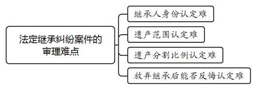
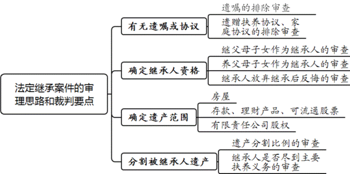

### **法定继承纠纷案件的审理思路和裁判要点**

法定继承是指继承人范围、继承顺序、继承条件、继承份额、遗产分配原则及继承程序均由法律直接规定的继承方式。法定继承纠纷案件在家事纠纷案件中占比较大，且往往因当事人人数多、诉争利益大、事实查明难、多伴有家庭矛盾等原因导致审理难度较大。司法实践中，关于认定继父母子女关系、确定特定遗产范围等尚存在适法不统一的情形。近年来，随着经济社会的发展，各种新类型遗产不断出现，如何妥善处理往往也存在较大争议。为促进此类案件的适法统一和妥当处理，本文结合司法实践中的典型案例，对法定继承纠纷案件的审理思路和裁判要点进行梳理、提炼和总结。

一、典型案例

**案例一：涉及当事人是否具备继承人身份的审查**

孙某、陈某于1984年登记结婚，婚后陈某与前夫所生之子陈甲（时年9岁）随孙某、陈某共同生活。1991年，两人协议离婚，陈某与陈甲均从孙某住所搬离。陈甲成年后长期居住在国外。案涉房屋于2000年办理产权登记，登记产权人为孙某。孙某于2016年5月死亡后，各方就陈甲是否有权继承孙某遗产意见不一而涉诉。

**案例二：涉及继承人单方放弃继承后反悔的审查**

巫某与邓某婚内育有巫甲等子女。沈某与巫甲系夫妻，两人亦育有两位子女。巫甲于2010年6月去世，未留有遗嘱。2017年8月，巫某与邓某以公证方式签署《放弃遗产继承声明书》，表示自愿、不可撤销地放弃对巫甲遗产的法定继承权。后巫某、邓某称受骗签署相关材料，放弃继承并非真实意思表示，遂提起诉讼请求分割巫甲的遗产。

**案例三：涉及被继承人遗产范围的确定**

李某与张某系夫妻关系，两人分别于2006年4月、2020年12月死亡。两人生前育有李甲、李乙两位子女。2005年，李某名下的房屋动迁安置时，李某、张某、李甲每人享有30平方米的动迁利益，相应的动迁款购买涉案房屋，房屋登记在李甲名下。李某、张某生前曾参加李甲举办的乔迁宴。李乙认为涉案房屋中有父母的遗产份额，应适用法定继承方式分割房产，李甲则认为涉案房屋中并无父母份额。因协商未果，李乙起诉要求李甲向其支付房屋折价款。

**案例四：涉及部分继承人能否主张多分遗产的审查**

王某与林某系夫妻关系，两人分别于2010年4月、2019年1月死亡。两人育有王甲、王乙、王丙三位子女。林某退休收入较高，在家居住期间聘请住家保姆照顾其起居。从2016年7月起至去世，林某一直居住在医院，由护士、护工照顾其生活。聘请保姆费用及住院相关费用均由林某支付。林某住院期间，王甲如无特殊情况每日都去医院看望林某。王乙、王丙在林某生前每月也会不定时看望林某。林某去世后，王甲以自己尽到较多的赡养义务为由起诉要求继承林某遗产的60%。

二、法定继承纠纷案件的审理难点

法定继承纠纷案件中，因被继承人已经去世，故审查其生前生活状态、行为意思表示大多只能通过旁证推测。这使得审查当事人是否具备继承人资格、特定财物是否属于遗产以及部分继承人是否尽到主要扶养义务等存在难度。

**（一）继承人身份认定难**

法定继承纠纷案件中，除配偶及具有血亲关系的近亲属外，养父母子女、继父母子女、尽到主要赡养义务的丧偶儿媳或女婿等有权要求作为继承人分割遗产；继承人以外的依靠被继承人扶养的人，或者对被继承人扶养较多的人，也可以分得适当遗产。不同于配偶等身份较为明确的情形，继父母子女是否应认定为继承人、对被继承人扶养较多的人能否分得遗产，则需综合案件事实进行判断。然而相关案件事实一般为一段时间内被继承人与当事人之间生活的事实，大多需要结合当事人陈述、证人证言、照片、视频、缴费记录等细节性证据予以审查。其中一些证明事项和证据形成的时间，往往距离案件审理已有十几年甚至几十年，当事人对相关内容的真实性争议较大。因此，当事人是否具备继承人身份、能否分得遗产的审查认定较为困难。

**（二）遗产范围认定难**

法定继承纠纷案件中，被继承人的遗产多混同于夫妻共同财产或家庭共有财产中，审理此类案件时首先需进行析产，确定遗产的范围。然而，该类案件中家庭共有财产多是通过征收安置、购买售后公房或自建房屋取得。特别是在征收安置中，一些被继承人由于行动不便，具体手续都交由子女至征收单位办理。若安置房屋仅登记在办理手续的子女名下，安置房屋中是否存在被继承人遗产份额需结合案情综合认定，该问题往往成为案件的争议焦点和审理难点。另外，在家庭生活中一些被继承人生前会将工资卡、存款、理财产品直接交由部分子女保管或使用。此类由被继承人子女直接保管、支配的财产是否被合理使用，应认定为赠与还是保管，需要在案件审理中结合多方面因素综合认定，该问题也增加了认定被继承人遗产范围的难度。

**（三）遗产分割比例认定难**

法定继承纠纷案件中，遗产分割规则较为复杂：同一顺序继承人继承遗产的份额一般为均等，但对生活有特殊困难又缺乏劳动能力的继承人、对被继承人尽了主要扶养义务或者与被继承人共同生活的继承人，可以多分遗产；有扶养能力和扶养条件却不尽扶养义务的继承人应少分或不分遗产；继承人协商一致的，也可以不均等分割。案件审理中，当事人对于继承人是否尽到主要扶养义务或未尽到扶养义务的事实，往往存在较大争议，且此类事实难以通过单一事实或证据予以证明，不仅需要考量、对比继承人付出的精力和财物，还要考量被继承人生前的生活状态、身体状态和生活来源等。即使认定了上述事实，在确定遗产分割比例时仍需综合考虑案件整体情况。

**（四）放弃继承后能否反悔认定难**

在此类案件审理中，部分继承人明确表示放弃继承遗产后又反悔，当事人能否反悔往往成为案件争议的主要焦点。一般情况下继承人放弃继承后又反悔的法院不予准许，但若存在欺诈、胁迫或有违公序良俗等特定情形的，则可视情允许继承人反悔。在特定情形认定标准严格把握的情况下，对相关事实的审查认定也较为困难，因此继承人放弃继承后能否反悔的审查存在难度。

三、法定继承纠纷案件的审理思路和裁判要点

法院审理法定继承纠纷案件，要秉持公平原则和公序良俗原则。同时，由于该类案件涉及民生，关乎社会和谐稳定，案件处理既要符合法律规定，也要贯彻诚信、友善等社会主义核心价值观，践行尊老爱幼、互谅互让、团结和睦等中华民族传统美德，尊重日常生活中的常情常理。在裁判文书说理中，凸显家事案件特点，倡导情、理、法的有机融合，达到法律效果和社会效果的统一。具体到案件审理中，**首先，应排除案件中存在遗嘱、遗赠扶养协议或家庭协议；其次，审核继承人身份，确定遗产继承人；再次，审慎审查并确定被继承****人的遗产范围；最后，根据案情确定各继承人取得的遗产比例并据此分割遗产**。

**（一）遗嘱、遗赠扶养协议、家庭协议的排除审查**

法院审理继承纠纷案件，只有在审查确定无有效遗嘱、遗赠扶养协议及家庭协议的情况下，才应按照法定继承规则处理案件所涉遗产。案件审理中，应当首先询问当事人有无遗嘱或家庭协议，并审查被继承人生前是否与他人签订遗赠扶养协议。若被继承人生前留有遗嘱或遗赠扶养协议，法院需着重审查遗嘱或遗赠扶养协议的形式要件，以及被继承人签订遗嘱或遗赠扶养协议时的行为能力，进而确定遗嘱或遗赠扶养协议的效力。

所谓家庭协议，多为父母与子女之间或子女之间就老人赡养问题、家庭财产的分配与继承所达成的一揽子协议。若当事人之间达成家庭协议，法院则应通过审查被继承人是否参与签订家庭协议、全部继承人有无签字、协议中是否附有其他义务等内容来认定家庭协议的效力。需要注意的是，部分案件中虽然存在有效遗嘱、遗赠扶养协议或家庭协议，但若上述遗嘱、协议只处理部分遗产，对于其他未处理的遗产仍应按照法定继承规则处理。

**（二）审查确定继承人资格**

《民法典》第1127-1129条对继承人的资格作出明确规定：继承开始后由被继承人的配偶、子女、父母作为第一顺序继承人继承；丧偶儿媳对公婆，丧偶女婿对岳父母尽了主要赡养义务的，作为第一顺序继承人。没有上述继承人的，由被继承人的兄弟姐妹、祖父母、外祖父母作为第二顺序继承人继承。被继承人的子女先于被继承人死亡的，由被继承人子女的直系晚辈血亲代位继承。若被继承人的兄弟姐妹先于被继承人死亡的，由被继承人兄弟姐妹的子女代位继承。

《民法典》第1125条规定，继承人存在下列行为之一的，丧失继承权：（1）故意杀害被继承人的；（2）为争夺遗产而杀害其他继承人的；（3）遗弃被继承人，或者虐待被继承人情节严重的；（4）伪造、篡改、隐匿或者销毁遗嘱，情节严重的；（5）以欺诈、胁迫手段迫使或者妨碍被继承人设立、变更或者撤回遗嘱，情节严重的。继承人有上述第三至五种行为，确有悔改表现，被继承人表示宽恕或者事后在遗嘱中将其列为继承人的，该继承人不丧失继承权。司法实践中，该类案件当事人对继承人资格的争议多产生于以下三类情形中：

**1****、继父母子女作为继承人的审查**

判断继父母子女之间是否享有继承权，以是否形成扶养关系为标准。确定是否形成扶养关系应重点审查继父母与未成年继子女共同生活的时间和状态，需结合结婚证、离婚证或离婚法律文书、户籍信息、当事人陈述、证人证言、照片、视频等证据材料判断继父母子女之间是否形成较为稳定的扶养关系，进而认定部分当事人是否属于继承人。

需要注意的是，最高法院《关于适用<中华人民共和国民法典\>婚姻家庭编的解释（一）》第54条规定，生父与继母或生母与继父离婚后，对曾受其抚养教育的继子女，继父或继母不同意继续抚养的，仍应由生父母抚养。根据上述规定，继父母与继子女是基于姻亲而产生的一种事实上的抚养关系，这种关系是由法律拟制的。父母离婚后，若继父母不同意继续抚养继子女的，则可解除与继子女之间的拟制血亲关系，子女由其生父母抚养。然而，若生父母死亡时已形成抚养关系的未成年子女无其他抚养人，一般不允许解除继父母子女关系。

如案例一中，陈甲曾经由孙某抚养，但在其生母陈某与孙某离婚时陈甲尚未成年，且孙某、陈某在离婚协议中明确约定陈甲由陈某继续抚养，孙某不再承担抚养费用。在此情形下，应认定孙某不再继续抚养是对已形成抚养事实的终止，孙某与陈甲之间的继父子关系视为解除。此外，从陈甲与孙某的继父子关系解除起至孙某病故，期间长达二十余年，双方并无来往，且陈甲成年后也不存在赡养孙某的事实。因此本案继承发生时，陈甲与被继承人孙某之间继父子关系已解除，陈甲不符合《民法典》规定的有扶养关系的继子女情形，陈甲对被继承人孙某的遗产不应享有继承权。

**2****、养父母子女作为继承人的审查**

收养行为形成于1992年4月1日之后的，认定养父母子女关系以县级以上人民政府民政部门的登记为准。若收养行为发生于1992年4月1日之前，则要依据当时的法律、政策等审查收养关系是否存在。该种情况下，需要综合考虑户籍登记信息、亲友群众公认以及村委会、居委会证明等证据，以确认收养人与被收养人是否达到以父母子女关系长期共同生活的程度。事实收养关系可以从被收养人与收养人共同生活年限、收养人是否以收养为目的，以及是否存在公认的父母子女关系三个方面进行认定。

**3****、部分继承人放弃继承后又反悔的审查**

在继承开始之后至遗产分割之前，如部分继承人以书面形式向其他继承人表示自愿、无条件地作出放弃继承的意思表示，则被继承人死亡时遗留下的权利义务，视为从继承开始就与该放弃继承权人无关。因放弃继承是单方民事法律行为，除继承人放弃继承致其不能履行法定义务的情形外，放弃行为自意思表示作出时生效，故遗产处理前或者在诉讼进行中继承人对放弃继承反悔的，一般不应准许。然而，司法实践中以下例外情形应予以特别考量：（1）其他继承人同意放弃继承人反悔的；（2）放弃的意思表示存在欺诈或胁迫的；（3）放弃的意思表示存在错误认识的；（4）放弃的结果影响家庭伦理的。

如案例二中，巫某和邓某出具的声明书名称为“放弃遗产继承声明书”，具体内容的文义表述清晰明确，并不存在隐瞒或者欺诈的情形，放弃遗产继承声明书依法成立并有效。巫某和邓某出具声明书时，两人放弃遗产继承的意思表示即生效。巫甲的配偶沈某对巫甲获得财产的贡献度更大，巫某和邓某放弃继承遗产是祖父祖母将儿子的遗产留给孙子孙女，符合传统习俗和日常经验法则，难以判定存在显失公平情形，故法院对二人的诉讼请求予以驳回。

**（三）审查确定遗产范围**

一般而言，被继承人名下的房产、存款、理财产品、股权、股票、车辆以及债权、债券等财产均属于被继承人的遗产。另外，被继承人的丧葬补助金、抚恤金等虽非被继承人遗产，但系被继承人死亡后产生，为减少当事人讼累，当所有当事人均申请或同意在法定继承案件中一并处理时，法院可以一并处理。在审查被继承人遗产时，需要求当事人提供房产证、银行流水等证据来确定被继承人遗产范围。若被继承人的遗产混同于家庭共有财产或夫妻共同财产，则需要依法进行析产，再对析出的遗产予以继承。司法实践中常见的遗产类型主要有以下几种：

**1****、房屋**

被继承人名下的房屋或房屋份额为被继承人的遗产，在确定遗产范围时一般以产权登记为准。案件审理中应要求当事人提供产权登记资料，以确认房屋权属情况。司法实践中，因房屋多有明确的产权登记，当事人多对房屋是否属于被继承人遗产不持有异议。在部分案件中，系争房屋来源于动迁安置房或售后公房，虽然取得的房屋直接登记在部分继承人名下，但被继承人在房屋取得过程中作出较大的贡献，如被继承人同为被安置人、购买售后公房时使用了被继承人的工龄、购买房屋时被继承人大量出资等。在上述情形下，当事人之间往往对被继承人是否享有部分产权意见不一。对此，一般情况下未登记在被继承人名下的房屋和被继承人的购房出资款不宜轻易认定为遗产，但有以下三种情形的除外：

**（****1****）被继承人生前主张过相应权利**

若有书证、聊天记录、证人证言等证据证明被继承人生前曾通过居委会、村委会、人民调解委员会或诉讼等途径向房屋所有人主张过权利，且被继承人与房屋所有人未达成一致意见，法院则需审查被继承人是否在系争房屋中享有产权份额以及被继承人出资的购房款是否为借款。如认定被继承人享有房屋产权份额或出资款为借款，则认定的房屋份额或借款为被继承人遗产。

**（****2****）被继承人与房屋所有人达成过协议**

若被继承人与房屋所有人就产权问题或出资款问题达成过协议，在审查确认被继承人对系争房屋取得确有贡献以及协议真实有效的基础上，协议约定的财产一般为被继承人遗产。

**（****3****）被继承人因客观原因无法主张权利**

此种例外多发生在因动拆迁取得房屋的情形下，被继承人作为被安置人生前不知晓拆迁安置房屋全部登记在他人名下，或知晓相关情形因重病等客观原因无法主张权利。若继承人提出上述主张，法院需结合拆迁安置协议等证据证明被继承人作为被安置人确有房屋产权份额，并通过证人证言、聊天记录等证据推断被继承人生前的意思表示。如缺乏证据证明被继承人已放弃其应安置的房屋产权份额，则被继承人应享有的房屋份额也列为遗产分割处理。

如案例三中，李某的房屋在拆迁安置时，李某、张某、李甲均为拆迁安置人口，后拆迁安置房屋登记在李甲名下。根据拆迁安置部门的规定，该登记行为需取得李某、张某的同意，李某、张某生前均未向李甲主张过相关权利，李某、张某还参加了李甲的乔迁宴，应认定系争房屋中并无李某、张某的遗产份额，对李乙的相关主张不予支持。

需要注意的是，部分法定继承纠纷案件中，当事人将继承城市公房承租权列为诉讼请求。对于此类诉请，法院不宜在继承案件中直接确定被继承人死亡后城市公房的承租人，可告知当事人应先行向公房管理部门申请变更承租人，若继承人之间对承租人人选无法达成一致意见且公房管理部门不能直接认定承租人，应另行诉讼解决。

**2****、存款、理财产品、可流通股票**

被继承人去世时，其名下银行账户、证券账户内的存款、理财产品、基金及股票应作为遗产予以分割，案件审理中法院需审查银行、证券账户信息和资金流水。对于被继承人生前名下存款大额转出的情形，法院应通过审查银行账户明细、汇款单、交易对手信息、证人证言、当事人陈述以及病历等证据材料认定转款时间、转账人、转款目的、转款金额以及被继承人当时身体状况等事实。

若转账操作人为被继承人本人，除有证据证明所转款项为借款或用于其他明确用途外，一般不应将转出款项认定为遗产。若转账操作人非被继承人本人，则要先认定被继承人对转账事宜是否知情。在不能认定被继承人知晓转账事宜的情况下，需要实际转账人举证证明转账目的和用途，如实际转账人不能作出合理解释和说明，则应将转出款项列入遗产范围进行分割。在能够认定被继承人知晓转账事宜的情况下，可参照转账操作人为被继承人本人的情形处理。

**3****、有限责任公司股权**

在股份有限责任公司自然人股东死亡的情形下，由于股份有限责任公司资合性的特征以及股权以股票的形式表现，股权作为被继承人的财产而由继承人按照继承程序进行。然而在有限责任公司中，由于股权更具人合性，公司股权并非当然可继承。根据《公司法》第75条及最高法院《关于适用<中华人民共和国公司法\>若干问题的规定（四）》第16条规定，公司章程可对有限责任公司股权的可继承性予以限制。若公司章程未作限制性规定，或根据公司章程规定继承人可以继承股权，则继承人对股权的继承原则上与普通继承适用同样程序与规则，在法定继承纠纷案件中一并予以处理。若公司章程对股东资格作出限制性规定，则应告知继承人同公司其他股东等另行协商处理股权变现后的继承问题。

**（四）分割被继承人遗产的要点**

在确定继承人和遗产范围后，如无特别约定或其他特殊情形的，应首先从遗产中扣除被继承人合理、必要的丧葬费用，然后根据各继承人对被继承人的赡养、扶养情况以及继承人是否存在生活困难等因素确定继承比例。最后，依据有利于发挥遗产使用效益原则，结合继承人的实际需要，充分兼顾各继承人的利益对遗产予以处理。

**1****、认定遗产分割比例的审查要素**

在确定继承人范围和被继承人遗产后，应以平均分配为原则在继承人之间分割遗产；如继承人之间协商一致，亦可不均等分割遗产。生活有特殊困难又缺乏劳动能力的继承人、对被继承人尽了主要扶养义务或与被继承人长期共同生活的继承人，在分配遗产时可以适当多分。有扶养能力和有扶养条件却不尽扶养义务的继承人，应当不分或者少分。若被继承人有尚未出生胎儿的，应当为胎儿保留遗产份额。

在该类案件审理中，法院应审查遗产数量、共同生活时长、部分继承人为赡养老人付出的财产和精力，综合各方面因素酌定各继承人应继承的遗产比例。需要注意的是，若继承人中有未成年人，且未成年人并非代位继承人或转继承人，从未成年人利益最大化的角度考量，未成年人获得的遗产比例一般应多于其他成年继承人。

**2****、继承人是否尽到主要扶养义务的审查**

在该类案件审理中，对于继承人是否尽到主要扶养义务的审查，应结合当事人陈述、证人证言、被继承人医疗记录、被继承人银行账户记录、照片、视频等证据认定被继承人生前生活状况、就医情况、经济来源以及身体状况等事实，进而判断部分继承人是否尽到对被继承人的主要扶养义务。

如案例四中，林某生前退休收入颇高，在家生活期间长期聘用住家保姆照顾自身生活起居。后因病长期住院治疗期间，林某也主要靠护士、护工照料。王甲虽然基本上每日看望林某，但林某的生活起居并非由其照料，其也未因赡养林某产生大额支出，故每日看望的行为仅是尽了为人儿女的孝道，不能认定为尽到赡养的主要义务，法院最终判决王甲、王乙、王丙均分林某的遗产。

**3****、遗产中房屋的分割方式**

与银行存款、股票等遗产不同，法院在处理房屋时不能机械地按比例分割，应当依据有利于发挥房屋使用效益的原则，结合继承人的实际需要，在充分兼顾各继承人利益的基础上进行处理。

对于遗产中房屋的分割方式，法院在审理中应充分听取各继承人的意见，结合继承人有无支付房屋折价款的能力，从有利于房屋实际使用的角度考量，决定各继承人按份共有房屋或房屋归部分继承人所有并向其他继承人支付折价款。若系争房屋由部分继承人长期居住，在居住人有支付折价款能力的情况下，一般应判决系争房屋归居住人所有。

四、其他需要说明的问题

近年来，网络店铺、网络游戏装备、网络加密数字货币等新类型财产逐渐成为新型遗产，但因新类型财产涉及的领域较广，且其效力、定性、价值等问题均较为复杂，宜根据具体个案情况，结合国家法律及政策规定、网络服务协议约定等内容，对相关问题作出审慎认定。同时，对于被继承人遗产混同于家庭共有财产或夫妻共同财产时产生的析产问题、被继承人的债务问题、农村宅基地房屋的继承处理等，因上述问题具有特殊复杂性且并非法定继承案件专有，本文亦未作专门论述。

（根据少年家事庭潘静波、张家伟提供材料整理）