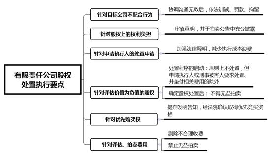
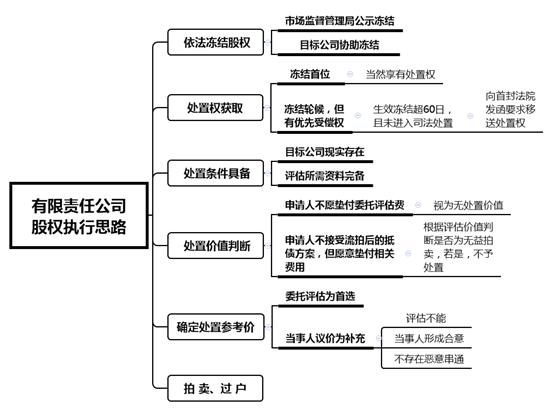

### **涉有限责任公司股权执行案件的办理思路和执行要点**

有限责任公司的股权是执行案件中较为常见的处置财产。在处置过程中，由于有限责任公司的人合性特征、涉案股权价值难确定、评估费用较高等导致股权变现困难。为有效提高执行规范化水平和执行效率，体现“应执必执”的价值取向，实现处置财产价值最大化，本文结合司法实践中的典型案例，对此类执行案件的办理思路和要点进行梳理、归纳和总结。

**一、典型案例**

**案例一：涉及法院责令目标公司履行协助义务**

A公司与B公司融资租赁合同纠纷案件的执行过程中，法院拟对被执行人B公司所持有的C公司90.96%的股权进行拍卖。评估过程中，目标公司C公司以材料遗失等理由拒绝提供评估必需材料，在法院要求其限期提交并警示相关法律后果后仍不予配合。法院遂依法作出对C公司罚款3万元、C公司主要负责人罚款1万元的处罚决定，并责令C公司立即履行协助义务。最终C公司在接受处罚后，根据法院要求按时提交了评估所需材料。

**案例二：涉及法院依法处置评估价值为负值的股权**

某刑事财产刑执行案件中，被告人张某持有D公司100%的股权。因全部资产被依法裁定追缴，D公司严重资不抵债、负债经营，其股权最终评估价值为负170亿元。后该刑事案件被害人申请拍卖上述股权并同意垫付相关费用，法院决定在估算委托评估价、拍卖辅助费用、执行费用等执行必要成本总额的基础上，以高于执行必要成本的60万元价格作为拍卖保留价启动司法网络拍卖，最终拍卖顺利成交。

**案例三：涉及申请人拒绝垫付评估费使得股权无法处置**

E公司与F公司仲裁执行案中，被执行人F公司所持有的G公司40.23%的股权，是其名下唯一可供执行的财产。E公司申请对该股权进行拍卖。法院依法告知申请人E公司需事先垫付股权评估所产生的费用，并根据评估内容初步估算垫付费用为10万元。若后续股权拍卖成功，则该笔费用从拍卖所得款中受偿；若拍卖不成功，申请人无权要求返还该笔垫付费用，不足部分尚需足额补交。后E公司拒绝垫付评估费，G公司相关股权未进入司法拍卖程序。

**案例四：涉及当事人协议确定股权处置参考价**

H公司与J公司仲裁执行案中，法院拟对被执行人J公司所持有的K公司49%的股权进行拍卖。处置过程中，因评估所需材料欠缺等导致评估久拖未果。后法院根据《最高人民法院关于人民法院确定财产处置参考价若干问题的规定》，依法采用当事人议价的方式确定涉案股权处置参考价。在法院的协调下，双方当事人同意以540万元为底价启动拍卖。后涉案股权经过43次竞价，以680余万元溢价成交。

**二、涉有限责任公司股权执行案件的办理难点**

**（一）股权处置参考价难以确定**

**一是**确定股权处置参考价方式少。股权因其特殊性，仅能选择委托评估或当事人议价方式确定处置参考价，一般不宜采用询价方式。**二是**股权评估所需资料不齐全。股权评估所需资料包括财务报表、会计凭证、对外重要负债依据等，均由目标公司内部掌握，通常不具有公开性。实践中，目标公司受制于股东或出于信息保护等考虑，多以资料遗失等为由不予配合，使得股权评估缺少必要资料，股权价值难以确定。在缺乏有效证据证明目标公司存在故意拖延或拒不提供的情况下，法院难以对其不配合行为采取强制措施。

**（二）股权价值难以固定**

在符合法律规定、公司章程的情况下，公司作为独立法人享有自主经营权。因此，法院冻结目标公司的股权后，既不能干预目标公司的经营活动，也不能直接对其资产进行查控。即使确定了股权处置参考价，待拍卖过程中的目标公司仍可进行资产运作、对外担保等，由此可能导致涉案股权的价值下降，直接影响拍卖成交。

**（三）持股比例较低的股权拍卖启动率低**

实践中，申请执行人对持股比例较低的股权提起处置申请的相对较少，导致该类股权拍卖启动率相对更低。主要原因在于：**一是**争取对目标公司的控制权是影响股权拍卖成交率的重要因素，故持股比例较低的股权竞买人相对更少，拍卖成交率亦相对更低；**二是**申请执行人需先行垫付委托评估费用，法院方可启动股权处置程序。股权拍卖的低成交率使得该类股权的申请执行人普遍更不愿承担委托评估费用以及无法受偿的风险，故对于持股比例较低的股权提起处置申请的意愿也相对更低。

**（四）评估费用较高加重申请人负担**

股权评估由于审查资料多、评估工作量大、评估专业性强，因此评估费用往往较高。部分案件中目标公司以股权投资的方式建立全资或控股子公司或子公司再对外投资的公司，评估该目标公司股权的价值需层层调取其名下各公司的相关资料，导致股权评估内容更为复杂，由此产生的评估费用也更高。《最高法院确定财产处置参考价规定》第33条明确委托评估费用由申请执行人先行垫付，这无疑加重了申请执行人的财务负担。

**三、涉有限责任公司股权执行的办理思路和要点**

**涉有限责任公司股权执行案件****中，法院依法享有处置权是前提，判断股权具有处置价值是关键。在执行过程中，法院应选择适当的确定处置参考价方法，加大执行力度提高目标公司配合度，注重保护目标公司其他股东的优先购买权。**

**（一）依法冻结涉案股权**

申请执行人提供的股权线索经审查属实的，法院应制作协助公示执行信息需求书、协助公示通知书及强制执行裁定书，至目标公司注册地的市场监督管理局办理股权冻结并要求协助公示，同时向目标公司送达冻结裁定，通知其协助冻结相关股权。

若多家法院拟对被执行人所持有的同一股权采取冻结措施，并先后向目标公司和市场监督管理局发送协助冻结法律文书的，首先向市场监督管理局送达协助公示通知书的法院冻结为生效冻结，其余均为轮候冻结。需要注意的是，是否先向目标公司发函要求协助冻结不影响公示效力，但公示冻结在先的法院应与最先向目标公司发函要求协助冻结的其他法院沟通，防止产生执行冲突。

**（二）确定法院依法享有处置权**

确定法院对涉案股权享有处置权是启动处置程序的首要步骤。若法院属于首先冻结法院，则其当然享有处置权。若法院属于轮候冻结法院，但申请执行人对涉案股权享有质押权等优先受偿权，且首先冻结法院自股权冻结之日起60日内未就涉案标的发布拍卖公告或者进入变卖程序的，则该轮候冻结法院可以向首先冻结法院发函要求其移交处置权再进行拍卖。拍卖所得款项优先清偿申请执行人后，若有剩余则退还首先冻结法院。

**（三）判定涉案股权具备处置条件**

涉案股权具备处置条件是后续处置程序正常开展的前提。具体包括：**一是**目标公司现实存在，即目标公司除注册登记地外，实际存续且能找到住所地；**二是**评估所需资料齐全。

实践中，目标公司住所地难找、评估资料难提取将直接导致委托评估程序终止，无法进入司法处置程序。若双方当事人均申请议价确定处置参考价，法院也应对目标公司的经营状况尽到形式审查义务，防止案外人利益受损。

**（四）判断涉案股权是否具有处置价值**

判断涉案股权具有处置价值是法院启动处置程序的必要条件。对于不具有处置价值的股权，法院原则上不启动司法处置程序，防止当事人滥用司法处置程序浪费司法资源。

在司法处置程序启动前，法院应依法如实告知申请执行人股权拍卖的成交风险，以及因处置股权所产生的评估费用，并询问申请执行人若两次拍卖均流拍，其是否同意就涉案股权接受抵债。

申请执行人拒绝垫付委托评估费用的，涉案股权视为无处置价值；申请人不同意接受流拍后的抵债方案但同意垫付相关评估费用的，股权评估价值在去除经初步估算优先支付的委托评估费、拍卖辅助费、执行费用后，申请执行人无法受偿或受偿金额过少的，则法院可判断此次拍卖为无益拍卖，涉案股权不具有处置价值。同理，若涉案股权上有其他人的质押权等优先受偿权，且优先受偿金额明显大于或接近于股权初步估算价值的，则法院原则上亦不予启动司法处置程序。

**（五）选择确定处置参考价方法**

根据《最高法院确定财产处置参考价规定》，法院确定财产处置参考价可以按照当事人议价、定向询价、网络询价、委托评估等方式进行。因为股权价值的确定需要专业人员通过分析目标公司各种材料综合得出，并无统一的计税基准价、政府定价或政府指导价，所以不适用定向询价或网络询价的方式。法院应采用“委托评估为首选、当事人议价为补充”的原则。

**1****、委托评估**

通过委托评估确定涉案股权价值是法院的优先选择。虽然该方式耗时耗力，但因股权不同于不动产，且其权利负担和涉及的第三人利益亦不具有公开性，故非通过专业机构评估、鉴定难以直观知晓。因此，为确保股权价值的客观真实性，法院更适宜采取委托评估的方式来确定股权价值。

**首先**，判断股权能否进行评估。实践中常存在目标公司住所地难找、目标公司不配合等导致股权评估不能的情况，直接使得后续司法处置程序无法进行。此时，法院不宜采取委托评估方式。**其次**，通知目标公司协助执行。目标公司有明显拖延或阻碍评估行为的，法院应依法向目标公司送达协助执行通知书，要求其限期提供评估资料，并对其法定代表人进行谈话，告知协助执行单位的义务和不履行的法律后果，督促其尽快完成评估协助工作。**再次**，送达评估报告。评估报告完成并经法院审查基本信息无误后，法院须在三日内向双方当事人及利害关系人分别送达，并给予五日的异议期。没有有效送达地址的，法院应当在中国执行信息公开网上予以公示，公示满十五日即视为送达。异议期满均未提出异议或异议不成立的，法院应启动拍卖程序。**最后**，以评估价值确定处置参考价。根据《最高人民法院关于人民法院网络司法拍卖若干问题的规定》，在无其他特殊规定的情况下，法院以拍卖方式处置财产的均应实行网络司法拍卖。依据该规定第10、26条规定，网络司法拍卖应当确定保留价，拍卖保留价即为起拍价；起拍价不得低于评估价的百分之七十；再次拍卖的起拍价降价幅度不得超过前次起拍价的百分之二十。

**2****、当事人议价**

资料不全导致股权价值难以通过评估确定的，在被执行人同意议价且法院根据案情进行形式审查后，认为自主议价不会损害第三人利益的前提下，法院可以依当事人申请采用议价的方式确定处置参考价。**首先**，组织双方当事人进行协商。法院需明确告知双方自行议价的程序、利弊及法律后果，确认议价系双方真实意思表示。**其次**，指定期限提交议价结果。双方当事人同意自行协商确定股权拍卖价格的，法院应设定合理期限要求当事人提交议价结果；当事人未在指定期限内提交或议价不成的，法院可自行确定采用其他方式确定处置参考价。当事人提交价格一致且无利害关系人就议价提出异议的，法院将议价结果作为第一次拍卖保留价。

如案例四中，在欠缺评估所需资料导致评估久拖未果的情形下，若坚持以委托评估的方式确定处置参考价，不仅可能长期无法得出评估结论，而且还将产生较高的评估费用。法院最终采用当事人议价的方式，有利于尊重双方当事人的意思自治，缩短传统股权处置的程序步骤，解决评估难、评估周期长的弊端，提高处置效率，并且减少评估费用的支出，避免涉案财产的减损。

**（六）股权处置执行要点**

 **1****、****加大对目标公司的执行威慑**

在选择委托评估方式的操作过程中，目标公司拖延提供材料等不配合行为，导致评估过程严重受阻、评估周期变长、评估价值不真实，对执行程序造成负面影响。此种情况下，法院应加大对目标公司的执行威慑。

法院应先对目标公司送达协助执行通知书，要求其限期提交相关资料并警示相关法律后果；协调沟通无效后，除目标公司确因客观原因无法提供评估所需材料的情形外，法院对其予以训诫、罚款，情节严重者，对其法定代表人或主要负责人进行拘留，并责令立即配合评估。具体罚款数额及拘留期限，应根据《民事诉讼法》第115条规定予以确定。目标公司拒绝配合评估股权价值的应视为隐匿被执行人财产，法院有权对目标公司进行搜查，根据评估机构资料需求强制提取相关文件。如案例一中，针对目标公司的拒不配合行为，法院通过采取司法强制措施，使得目标公司主动提交评估材料，取得良好执行效果。

针对目标公司恶意处置资产导致股权价值贬损的问题，法院可在冻结股权时即对其送达协助执行通知书，要求目标公司在经营过程中不得故意作出损害股权价值的行为，并约谈目标公司法定代表人或主要负责人明示法律规定及相应后果。若目标公司不予配合，法院应立即采取相应强制措施。

若目标公司住所地不在本市区域内，法院系统内部应加强协作。由目标公司住所地法院配合执行法院，对故意不配合或以不作为方式暗中阻碍评估的目标公司予以惩戒。

**2****、查明并充分披露股权权利负担**

在部分执行案件中，目标公司全体股东事先对被执行人的股东权利作出相应限制，如限制投票权、将公司有偿托管等。此类约定作为当事人的意思自治受到法律保护，不仅对股权评估价值产生重大影响，而且司法拍卖的买受人亦须受此类约定的约束。需要特别指出的是，法院应在拍卖公告中对此类约定予以充分披露。因此，对待处置股权是否存在权利负担，法院应做到事先查明、事中统筹、事后披露。

**3****、加强对申请执行人的释明**

《最高人民法院关于人民法院民事执行中查封、扣押、冻结财产的规定》第31条明确，查封、扣押、冻结的财产流拍或者变卖不成，申请执行人和其他执行债权人又不同意接受抵债的，法院应当作出解除查封、扣押、冻结裁定。据此，执行过程中，申请执行人申请对股权进行拍卖或变卖的，除明确要求预先缴纳委托评估费用外，法院对申请执行人不接受以物抵债方案的应加强释明，避免申请执行人要求对明显不具有市场价值的股权进行处置，减少司法资源的浪费。涉案股权流拍或变卖不成，且申请执行人和其他执行债权人不同意接受抵债的，根据《最高人民法院关于人民法院民事执行中查封、扣押、冻结财产的规定》第31条规定，法院应当作出解除冻结的裁定，并送达申请执行人、被执行人或者案外人。

**4****、审慎处置评估价值为负值的股权**

如案例二中，实践中部分目标公司除负债外已无其他可变现资产且严重负债经营，其股权价值经依法评估为负值。对于此类情形，法院应把握两大处置原则：**一是**处置程序启动时，原则上对评估价值为负值的股权不予处置，但申请执行人或刑事被害人要求处置并垫付相关费用的除外。**二是**确定股权处置后，不得作无益拍卖，处置参考价的确定须高于包括委托评估费、拍卖辅助费、执行费等在内的执行成本。

**5****、保障优先购买权**

出于对有限责任公司人合性的考虑，《公司法》第72条规定法院依法强制执行股权时，应当尽到通知义务以保障其他股东的优先购买权。具体而言，根据《最高法院网络司法拍卖若干问题的规定》第12、16条规定，股权拍卖应当在拍卖三十日前公告，拍卖公告发布三日前应以书面或者其他能够确认收悉的合理方式，通知已知优先购买权人。因此，法院应在拍卖公告发布三日前向目标公司发函，告知其股权将被强制拍卖的具体情况，要求目标公司通知全体股东及时向法院书面表明优先购买权的行使，并至拍卖辅助机构进行登记，否则即视为放弃。目标公司应及时通过召开股东会等方式向全体股东传达法院的通知，并做好会议记录或送达证据固定。

根据法院发布的拍卖公告信息，其他股东意欲参与竞拍的应在参加拍卖前实名交纳保证金，经法院确认后取得优先竞买资格及优先竞买代码、参拍密码，并以优先竞买代码参与竞买。优先购买权“同等条件”以拍卖公告披露事项为准。

**6****、合理确定评估、拍卖费用**

根据《最高人民法院关于人民法院民事执行中拍卖、变卖财产的规定》第32条规定，拍卖机构收取辅助费用的比例受到严格限定，上海高院出台了《关于司法拍卖收费标准等工作的通知》，将本市拍卖机构最高收费金额限定在人民币45万元以内；由于评估工作存在特殊性，评估机构的收费暂未规定硬性上限。如案例三中，申请人不愿垫付高额股权评估费用导致处置程序终止的情形在实践中较为常见。

针对部分案件中存在委托评估费、拍卖辅助费用过高而增加申请执行人负担的情况，法院一方面要主动加强审查，剔除评估、拍卖机构的不合理收费，同时要考虑评估工作的复杂性，严格把控特殊情形下的委托评估费用、拍卖辅助费用；另一方面要做好对股权处置的审查，对股权本身明显不具有市场价值或仅能清偿小额债权的，应事先明确告知申请执行人，不予启动无益拍卖。

**（七）对案外人执行异议的处理**

当案外人对被执行人所持股权提出异议或存在隐名股东的情形时，法院应告知案外人通过执行异议程序进行救济。依据《关于适用民诉法执行程序若干问题的解释》第16条、《民诉法解释》第465条规定，在案外人异议审查期间以及驳回裁定送达案外人之日起十五日内，法院不得对执行标的进行处分，但申请执行人提供充分、有效的担保请求继续执行的除外。

**（八）拍卖及过户**

有限责任公司股权的具体拍卖程序与其他类型财产的拍卖程序大体并无差别。对于股权上的权利负担，法院应在拍卖公告中予以充分披露。若第一次拍卖流拍的，根据《最高法院网络司法拍卖若干问题的规定》第26条规定，法院应当在三十日内在同一网络司法拍卖平台再次拍卖，再次拍卖的起拍价降价幅度不得超过前次起拍价的百分之二十；再次拍卖流拍的，法院可以依法在同一网络司法拍卖平台变卖，具体规定及流程与拍卖相同。

拍卖成交过户时，法院应当向买受人、被执行人及目标公司送达转让裁定，并出具协助执行通知书至该目标公司注册地的市场监督管理局办理股东变更登记及协助公示。

（根据执行局汤兵生、叶煜楠提供材料整理）