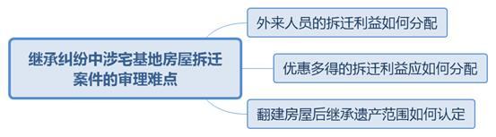
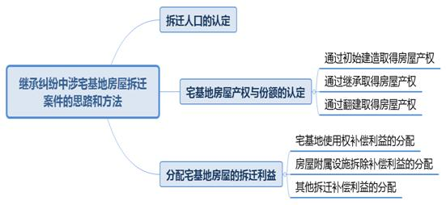

### **继承纠纷中涉宅基地房屋拆迁案件的审理思路和裁判要点**

宅基地制度是我国土地管理制度的重要组成部分，是有效保障农民住房待遇的特殊制度。审理继承纠纷中涉宅基地房屋拆迁案件，要注重保护宅基地房屋内实际居住人的利益。该类案件审理的基本思路总体上分为两部分：**一是析产**，将被继承人的遗产范围从总的拆迁利益中划分出来；**二是继承**，根据继承规则在继承人之间进行分配。

**一、基本案情**

**案例一：涉及外来人员的拆迁利益分配**

吴某与邢甲育有邢乙，家中还有邢甲父母及外祖母。2010年邢甲家房屋拆迁，拆迁协议中载明系争宅基地房屋有证面积为264.39平方米，认定人口6人即邢甲、邢乙及邢甲父母、外祖母，并注明“外地女婿吴某+1人，共计人口6人”。该户最终认定面积为“264.39+5.61（人口）”平方米。后吴某与邢甲离婚，双方就吴某应享有的拆迁利益意见不一。

**案例二：涉及优惠多得的拆迁利益分配**

康某与方甲育有方乙、方丙。2007年康某家宅基地房屋拆迁，康某、方甲、方乙作为一户进行安置。被拆迁房屋为康某祖传老宅，拆迁时由于方乙系大龄未婚青年，故其按照两人计算，最终该户获得4人口的拆迁利益。2011年方乙与汤某结婚育有方丁。2013年、2015年方甲、方乙相继去世，生前均未立遗嘱。后发生继承纠纷，汤某、方丁与康某就拆迁利益分配中方乙应占份额意见不同。

**案例三：涉及房屋翻建对继承遗产的分配**

黄甲与杭某育有黄乙、黄丙。涉案宅基地房屋原面积49.5平方米，系黄甲、杭某所有。1991年房屋宅基地使用权登记在黄甲与黄乙名下，1999年黄甲、杭某相继去世，黄乙、黄丙均已不在该房屋居住。2007年，黄乙在未征得黄丙同意的情况下翻建该宅基地房屋并办理了翻建手续，翻建后房屋面积变为109平方米。2015年该房屋拆迁，拆迁单位认定房屋归黄甲、黄乙所有，并按照建筑面积109平方米安置拆迁利益。黄丙知晓后起诉要求分割父母遗产，双方对房屋翻建后多出的面积是否属于遗产范围产生分歧。

**二、审理难点**

继承纠纷中涉宅基地房屋拆迁案件在审理中通常存在三个难点：

**（一）外来人员的拆迁利益如何分配**

上海市目前的拆迁政策通常首先计算被拆迁农户的拆迁补偿款，然后再给予农户优惠购房指标，由农户选择购买房屋。有证建筑面积是拆迁补偿款和优惠购房指标的重要核算依据，通常是根据该户认定人口计算所得。但上海部分地区拆迁政策适用就高不就低原则，即实际房屋面积和根据人口计算的面积相比较，选择面积较大者作为拆迁补偿款和优惠购房指标的计算依据。如案例一中，由于上门女婿吴某系外来人员，该农户多获得5.61平方米的拆迁补偿款与优惠购房指标。在拆迁利益分配中，对于上门女婿等外来人员是只能享有多分的拆迁利益还是与其他拆迁人口平均分配存在分歧。

**（二）优惠多得的拆迁利益应如何分配**

拆迁政策中包含一些惠民优惠政策，如案例二中，大龄未婚青年等在认定拆迁人口时会按多人计算，该农户因此额外获得部分拆迁补偿款和优惠购房指标，但相应拆迁利益归拆迁协议中列明人员共有，还是归特殊身份人员独有存在较大争议。

**（三）翻建房屋后继承遗产范围如何认定**

继承人翻建宅基地房屋而产生的相关继承纠纷包含多种情形。如案例三中，因一方继承人擅自翻建后原继承房屋已“灭失”，其他继承人可继承范围为原房屋面积还是翻建后的房屋面积存在不同理解。

**三、继承纠纷中涉宅基地房屋拆迁案件的一般思路和方法**

继承纠纷中涉宅基地房屋拆迁案件的审理重点和难点在于析产部分，**首先**需确定被拆迁房屋的拆迁人口；**其次**确定被继承人在宅基地上的房屋产权与份额，由拆迁人口享有宅基地的拆迁补偿，房屋产权人享有地上建筑物补偿；**最后**根据具体拆迁政策分配其他拆迁利益，确定被继承人的遗产范围。

**（一）拆迁人口的认定**

依据《上海市征收集体土地房屋补偿暂行规定》，宅基地土地部分的拆迁利益应归属于拆迁人口。拆迁人口一般为宅基地使用权人，即宅基地使用审核表上所列户中成员。随着宅基地上居住农户家庭成员发生婚丧嫁娶以及生子等变动，宅基地使用权人也随之变动。

1991年上海市进行了大规模的农村宅基地使用权登记，但自此之后再无统一的宅基地登记。现今并无宅基地使用权人的更新登记信息，宅基地使用权相关的法律和行政法规亦不完善。具体拆迁单位的认定应作为确定拆迁人口的重要参考，应以拆迁政策和拆迁单位人口清单来认定拆迁人口。法院应当要求当事人提供相关拆迁协议，若当事人无法提供或需验证真实性时，可前往当地拆迁部门调取存档协议。如案例一中，根据当地拆迁政策，吴某虽为外来人员但其被认定为拆迁人口之一，应与其他拆迁人口平均分配宅基地部分的拆迁利益。

**（二）宅基地房屋产权与份额的认定**

宅基地房屋产权的取得一般有三种方式：**一是**农户经审批后初始建造取得，**二是**通过继承取得，**三是**通过翻建取得。房屋产权的认定方法与份额分配方式分别如下：

**1****、通过初始建造取得房屋产权的认定方法与份额分配方式**

由于我国宅基地制度具有福利性质，目的是保障集体经济组织成员住有所居。房屋初始建造审核表上的立基人员均为宅基地房屋产权人。但在分家析产或继承纠纷等必须划分房屋产权份额时，需考虑房屋建造的相关出资情况，出资贡献多者应多分配房屋产权份额。相关出资情况需要当事人提供购买建材、雇佣施工队收据、发票等证据加以证明。当事人无法提供但需审查相关材料的，应至当地乡镇土地管理所调取审核登记表或房屋产权登记记录等。如果当事人之间对房屋建造出资问题难以达成一致、且均未能提供有效证据证明自身出资主张的，法院可以将建造房屋时农户内成年成员视为房屋建造出资人。

**2****、通过继承取得房屋产权的认定方法与份额分配方式**

对于产证清晰、有建造审核表的房屋，继承取得房屋产权应当按照《民法典》第六编相关规定分配房屋产权份额。对于建造时间过早且没有相关建造手续的祖传房屋，在1991年一般均已重新登记。该登记效力覆盖了如土改证等历史登记的效力，故此类祖传房屋的产权份额分配应以1991年宅基地登记为准。

**3****、通过翻建取得房屋产权的认定方法与份额分配方式**

翻建房屋是指经审批后，在宅基地上拆除原有房屋重新建造新的房屋。在审理涉房屋翻建的继承案件中，需重点审查三个要素：**一是房屋翻建前的居住情况**，如果各方当事人意见不一，可向当地村委会查证相关居住情况；**二是房屋翻建的出资情况**，需由翻建人提供相关翻建费用凭据；**三是翻建是否征得其他继承人同意**，个别继承人翻建房屋的需提供相关证据证明已征得其他继承人同意。关于个别继承人翻建房屋产生的继承纠纷主要有以下四种情形：

**一是**被继承人生前居住房屋内无同住继承人，去世后一方继承人翻建房屋。新翻建房屋的产权应延续之前的状态归所有继承人按份共有，但其他继承人应对翻建人的出资予以补偿。即使其他继承人知情且未反对翻建，也不能认定其放弃继承房屋产权。

**二是**被继承人生前居住房屋内有同住继承人，去世后同住继承人翻建房屋。该种情形属于同住继承人作为宅基地使用权人合理改善自身居住条件，其他继承人不享有新翻建房屋的份额，但翻建人应当补偿其他继承人在原房屋中的份额。如案例三中，黄乙翻建房屋后多出的面积不属于遗产范围，黄丙不享有新翻建房屋的份额。

**三是**被继承人去世前，一方继承人出资翻建房屋但无房屋转让书面协议。新翻建房屋应当作为被继承人的遗产处理，由各继承人按份共有。对于出资翻建房屋的继承人在分配房屋产权份额时，可以适当多分或者要求其他继承人给予适当补偿。

**四是**被继承人去世前，一方继承人出资翻建房屋且有房屋转让书面协议。若转让协议有效，则翻建人对新翻建房屋享有全部产权；若翻建人与被继承人非同一经济组织成员或已另获批宅基地，则该转让协议无效，新翻建房屋的处理方式与无书面转让协议的情况相同。

**（三）分配宅基地房屋的拆迁利益**

在分配宅基地房屋的拆迁利益时需将宅基地的居住保障功能作为首要考量因素。法院应向当事人或当地村委会调查清楚涉案宅基地房屋拆迁之前和当前的实际居住情况。上海农户所得拆迁利益一般可分为宅基地使用权补偿利益、房屋附属设施拆除补偿利益以及其他拆迁补偿利益，分配规则如下：

**1****、宅基地使用权补偿利益的分配**

**（****1****）优惠购房指标的分配**

拆迁单位除给付被拆迁农户拆迁补偿款外，还会分配一定面积的优惠购房指标。优惠购房指标应优先考虑宅基地使用权人，以保障其在居住房屋被征收后仍能获得居住用房。

**一是**被继承人生前居住房屋内有同住继承人，被继承人去世后该房屋拆迁。由于拆迁房屋内尚有宅基地使用权人，非使用权人不得依据自身享有部分房屋产权而要求获得优惠购房指标。

**二是**被继承人生前居住房屋内无同住继承人，被继承人去世后该房屋拆迁。虽然拆迁房屋内已无宅基地使用权人，但在实践中拆迁单位一般会给予一定面积的优惠购房指标作为房屋拆迁补偿，拆迁房屋的继承人可以按照所占房屋产权份额分配指标。

**三是**被继承人生前居住房屋内有同住继承人，被继承人在拆迁协议签署后房屋交付前去世。只要未被拆迁单位收回，尚未使用的优惠购房指标仍可作为被继承人遗产进行分配。

**四是**被继承人生前签订拆迁协议时，将自己的优惠购房指标转让给继承人。被继承人的原优惠购房指标或所购房屋不能作为遗产处理，法院可向拆迁单位核实相关情况。

**（****2****）宅基地使用权货币补偿的分配**

上海市拆迁政策对宅基地使用权的货币补偿计算方式主要有“数砖头”和“数人头”两种，其中“数砖头”占比较高。“数砖头”一般为拆迁房屋重置成新价、同区域新建商品住房每平方米建筑面积的土地使用权基价和价格补贴三者之和乘以有证建筑面积。其中拆迁房屋重置成新价系对房屋本身拆除的补偿，应归属于房屋产权人。同区域新建商品住房每平方米建筑面积的土地使用权基价和价格补贴，应由宅基地使用权人平均享有。“数人头”一般是根据户籍人口来计算补偿金额，应由宅基地使用权人按份共有。

**（****3****）优惠拆迁利益的分配**

依据上海拆迁惠民政策，宅基地使用权人中的大龄未婚青年等特殊身份人员，通常会额外多算拆迁人口导致该户拆迁利益增加，如考虑到大龄未婚青年以后结婚生子需要更多的住房要求。这些拆迁利益是基于特殊身份才给予的，故这些额外拆迁补偿款和优惠购房指标应归于特殊身份人员，不应在各宅基地使用权人之间平均分配。如案例二中，该户在拆迁时因方乙系大龄未婚青年而额外获得的拆迁利益应归属于方乙本人。

考虑到独生子女身份是由于其父母响应国家计划生育政策而取得，并非独生子女本人的贡献或劳动所得，故基于独生子女身份增加的补偿利益原则上应归独生子女的父母和独生子女共有。

**2****、房屋附属设施拆除补偿利益的分配**

房屋附属设施包括棚舍、无证建筑等。房屋附属设施的拆除补偿仅为建造物料的补偿，应归于实际建造人。需要注意的是，实际建造人还应包括虽未出资但仍在房屋中居住并享有宅基地使用权的人员。对房屋装修的拆除补偿是对装修物料的补偿，应归属于实际出资装修人。若无有效装修出资凭证，则应认定装修时农户内居住的已有经济收入人员为实际出资装修人。

**3****、其他拆迁补偿利益的分配**

除上述拆迁利益外，被拆迁农户还会得到诸如搬家补助费、临时过渡费、速签速搬费、特殊对象补贴、自留地补偿费用等其他拆迁补偿利益。拆迁政策和拆迁协议中一般均会根据费用性质明确分配方案：如搬家补助费、临时过渡费、速签速搬费等是为了鼓励实际居住人尽早搬迁，为其搬家和过渡期内的居住提供相应费用，故应归属于房屋实际居住人；特殊对象补贴则属于对生活困难人员的特殊补贴，应归其个人所有；农村集体经济成员对归集体所有的自留地和耕地享有生产使用的权利，因此自留地补偿费用应归属于农户内农业户籍人员。

**四、关于继承的相关说明**

析出被继承人的拆迁利益后，即可按照法定继承或遗嘱继承的方式分割被继承人财产。在遗嘱继承中应按照有效的遗嘱内容分配被继承人的财产。在法定继承中如果被继承人存在多名子女，还需审查对被继承人的赡养事实，承担主要赡养义务的子女应适当多分。

（根据少年庭侯卫清、张家伟提供材料整理）