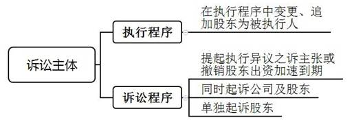
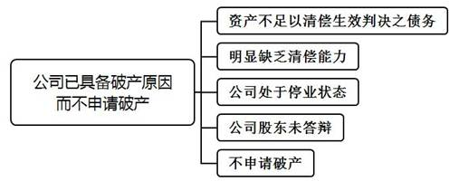

### **股东出资加速到期纠纷案件的审理思路和裁判要点**

股东出资加速到期，是指在注册资本认缴制下，公司无法履行到期债务时，未届出资期限的未完全出资股东丧失期限利益，提前履行出资义务。司法实践中，公司已具备破产原因、股东抗辩公司具有清偿能力、裁判法律依据援引、债权人利益与股东出资期限利益平衡等方面的认定与处理存在一定难度，故有必要明确审理思路，促进法律适用统一。本文以《九民会议纪要》第6条为基础，结合司法实践中的典型案例，对股东出资加速到期纠纷案件的审理思路和裁判要点进行梳理、提炼和总结。

一、典型案例

**案例一：涉及公司已具备破产原因的认定**

刘某、黄某系A公司股东，各认缴出资500万元，已实缴出资共25万元，认缴出资时间为2029年7月29日。根据另案生效判决，A公司应返还B公司占有使用费及押金共计20万元。B公司申请强制执行，法院通过全国法院网络执行查控系统调查查明A公司暂无财产可供执行，故裁定终结本次执行。此外，A公司被吊销营业执照且被列为失信被执行人，还存在其他多个执行案件。B公司起诉至法院，要求刘某、黄某在未出资范围内对未能执行到位的债权承担补充赔偿责任。经法院依法传唤，刘某、黄某无正当理由拒不到庭答辩。

**案例二：涉及股东抗辩公司具有清偿能力的审查**

应某、韩某系C公司股东，其中应某认缴出资为735万元，韩某认缴出资为265万元，认缴出资时间为2035年10月9日。根据另案生效的仲裁裁决书，C公司应支付周某工资10万元。周某申请强制执行，法院穷尽执行措施后因C公司暂无财产可供执行，故裁定终结本次执行。周某起诉至法院，要求应某、韩某在未出资范围内对未能执行到位的债权承担补充赔偿责任。应某、韩某提供C公司资产负债表、与案外人的合作合同，证明C公司仍在正常经营、总体资产大于负债、对外存在应收账款，故C公司仍具有清偿能力。

**案例三：涉及延长股东出资期限的认定**

张某、陈某系D公司股东，其中张某认缴出资400万元，陈某认缴出资200万元，认缴出资时间为2020年1月1日。根据2020年4月10日另案生效判决，D公司应支付E公司货款及逾期利息共计350万元。2020年4月15日，张某和陈某召开股东会，决议延长股东的出资期限至2036年5月20日，并办理工商变更登记手续。2020年4月25日，E公司申请强制执行，法院穷尽执行措施后因D公司暂无财产可供执行，故裁定终结本次执行。E公司起诉至法院，要求张某、陈某在未出资范围内对未能执行到位的债权承担补充赔偿责任。

二、股东出资加速到期纠纷案件的审理难点

**（一）相应的裁判缺乏明确法律依据**

目前仅有《企业破产法》第35条和《公司法司法解释二》第22条第1款规定，在公司破产和解散时适用股东出资加速到期。《公司法》及其司法解释规定股东未履行或未完全履行出资义务时应承担违约责任，是指股东的出资期限已到期而未缴纳的情形。此外，最高法院《关于民事执行中变更、追加当事人若干问题的规定》第17条规定的“未缴纳或未足额缴纳出资”亦系出资期限届满时的情形，不适用股东出资加速到期。《九民会议纪要》第6条规定了公司在非破产与解散情形下股东出资应否加速到期，但该纪要并非法律规定或司法解释，不可援引作为裁判的法律依据。

**（二）债权人利益与股东出资期限利益平衡难**

在公司注册资本认缴制下，股东可以自由安排出资时间和期限，但当公司现有资产不足以清偿到期债务时，由于公司股东的出资义务尚未届出资期限，导致公司债权人的债权迟迟无法实现。实践中，存在出资协议或章程约定的出资时间过长，又或在出资期限即将届满之前决定延长出资时间，甚至根本未约定出资期限的情形。在产生纠纷时，债权人主张股东出资义务系法定义务，公司无法清偿到期债务时股东便丧失了出资期限利益，应适用出资加速到期；股东往往抗辩其未届出资期限，应享有期限利益，不应适用出资加速到期。因此，如何平衡保护债权人利益与股东出资期限利益，司法实践中观点不一。

**（三）公司已具备破产原因认定难**

《九民会议纪要》第6条将公司“已具备破产原因”作为认定股东出资加速到期的重要条件，但对于公司处于何种状态即属于“已具备破产原因”并未明确，导致司法实践中对此认定标准不一，裁判结果亦不尽相同。在股东出资加速到期纠纷案件中，债权人往往会提供终结本次执行程序裁定书以证明公司已具备破产原因。在股东拒不到庭的情况下，法院是否可仅凭终结本次执行程序裁定书即认定公司已具备破产原因，还是需要结合其他因素综合考量认定，司法实践中存在较大争议。

**（四）股东抗辩公司具有清偿能力审查难**

该类案件中，股东作为被告往往抗辩公司具有清偿能力，并非资不抵债，不应适用股东出资加速到期。为此，股东往往会提供公司的资产负债表、审计报告、资产评估报告、另案生效判决或与案外人的合同。对于股东提供的上述或类似证据，法院在证据的真实性审查方面存在一定难度，特别是涉及与案外人的合同，不排除股东为逃避债务而签订虚假合同。

三、股东出资加速到期纠纷案件的审理思路和裁判要点

法院在审理此类纠纷时应坚持“原则加例外”的处理原则，即原则上不支持股东出资加速到期，但在例外情形下应予以准许。对于例外情形的审查应审慎灵活把握股东出资加速到期的构成要件，即从诉讼主体、出资条件、执行条件、破产条件等方面进行综合考量，并严格审查股东的抗辩，注重股东出资期限利益与债权人利益之间的平衡保护，最终对是否适用股东出资加速到期作出裁决。

**（一）诉讼主体的审查要点**

股东出资加速到期纠纷案件中，根据诉讼程序的不同，债权人、公司及股东的诉讼地位亦有所区别。执行程序中，债权人可以申请直接追加股东为被执行人；诉讼程序中，债权人可以单独起诉股东，亦可同时起诉公司和股东。

**1****、债权人直接在执行程序中变更、追加股东为被执行人**

依据最高法院《关于民事执行中变更、追加当事人若干问题的规定》第17条规定，债权人可直接在执行程序中变更、追加股东为被执行人，但该条规定的“未缴纳或未足额缴纳出资的股东”是针对出资期限届满的情形，对于认缴出资期限未到期的股东并不适用。对此，我们认为在此类案件执行程序中不应直接变更、追加股东为被执行人，应在诉讼程序中进行实体审理，综合审查判定股东是否适用出资加速到期。

**2****、提起执行异议之诉主张或撤销股东出资加速到期**

如向法院申请追加股东为被执行人被驳回后，债权人可据此提起执行异议之诉主张股东出资加速到期，此时债权人为原告，股东为被告。而债权人申请追加股东为被执行人获得法院支持时，股东亦可据此提起执行异议之诉要求撤销该执行裁定，此时股东为原告，债权人为被告。因此，在此类申请执行人执行异议之诉纠纷案件中，债权人与股东均可能成为原告或被告。

**3****、债权人同时起诉公司及股东**

在证据充分的情况下，债权人可在同一案件中同时起诉公司和股东，此时债权人为原告，公司和股东为被告。此类案件的案由应根据债权人与公司之间的纠纷性质予以确定。然而，股东出资是否加速到期的前提条件之一是公司无法清偿债权人的到期债务，故在债权人与公司之间债权债务尚不确定的情况下，不宜在债权人与公司之间的纠纷案件中一并起诉股东。

**4****、债权人单独起诉股东**

债权人单独起诉股东的，债权人为原告，股东为被告。为查明事实，部分案件可将公司列为第三人。此种情形下，案件的案由大多为股东损害公司债权人利益责任纠纷，而债权人往往在该案诉讼之前已起诉公司，获得法院生效胜诉判决并已申请强制执行。因公司无财产可供执行，法院裁定终结本次执行程序。

**（二）出资条件****——****股东出资未届期且出资未完成的审查要点**

公司注册资本认缴制的核心是出资期限自由。一般而言，公司或债权人在股东完成出资时间点前不能要求股东提前履行出资义务。此时，适用股东出资加速到期的前提是股东出资未届期且出资未完成。因此，法院应审查股东认缴出资金额、认缴出资期限及实缴出资情况。

需要注意的是，实缴出资的认定应根据公司章程、工商登记确定的认缴出资金额及认缴出资期限进行审查，审查对象应包括货币出资和非货币财产出资。

**（三）执行条件****——****穷尽执行措施无财产可供执行的审查要点**

股东出资加速到期纠纷案件中，“人民法院穷尽执行措施无财产可供执行”往往是依据法院终结本次执行程序的裁定予以认定。关于终结本次执行程序裁定，需区分两种不同的情形：

**1****、严格按照法定程序作出的执行裁定**

根据最高法院《关于严格规范终结本次执行程序的规定》第3条规定，严格按照法定程序作出的终结本次执行程序裁定，即法院已穷尽财产调查措施：（1）对申请执行人或者其他人提供的财产线索进行核查；（2）通过全国网络执行查控系统对被执行人的存款、车辆及其他交通运输工具、不动产、有价证券等财产情况进行查询；（3）无法通过网络执行查控系统查询上述财产情况的，在被执行人住所地或者可能隐匿、转移财产所在地进行必要调查；（4）被执行人隐匿财产、会计账簿等资料且拒不交出的，依法采取搜查措施；（5）经申请执行人申请，根据案件实际情况，依法采取审计调查、公告悬赏等调查措施；（6）法律、司法解释规定的其他财产调查措施。

**2****、未严格按照法定程序作出的执行裁定**

终结本次执行裁定的出具未按照前述规定履行必要程序的，法院在审查时，不能仅依据该终本裁定作为认定穷尽执行措施无财产可供执行的依据。此外，如在强制执行案件执行程序进行中，债权人同时起诉股东要求其承担补充赔偿责任的，由于是否能够执行到位尚不确定，故法院一般应认定无证据证明法院穷尽执行措施后公司仍无财产可供执行，不应适用股东出资加速到期。

**（四）破产条件——公司已具备破产原因而不申请破产的审查要点**

依据《企业破产法》第2条、《企业破产法司法解释一》第1、2、4条规定，公司已具备破产原因是指符合以下两种情形之一：（1）公司不能清偿到期债务且公司资产不足以清偿全部债务；（2）公司不能清偿到期债务且公司明显缺乏清偿能力。

司法实践中，关于公司已具备破产原因的认定，我们认为债权人依据法院终结本次执行裁定主张股东出资加速到期，仅是初步证明债务人公司具备破产原因。法院应当按照《企业破产法》规定审查公司是否已具备破产原因，包括依法传唤公司及其股东等相关利害当事人，对公司资产状况以及终结本次执行裁定情况进行必要审查。在此基础上，如无相反证据证明公司资产足以清偿债务或具有清偿能力，且债权人与公司均不申请破产的，法院可作出股东出资加速到期的裁决。具体而言，法院可以从以下几方面来综合审查认定公司已具备破产原因而不申请破产：

**1****、资产不足以清偿生效判决确定的债务**

资产不足以清偿生效判决确定的债务通常是指：（1）公司存在一个或多个被执行案件，法院通过全国法院网络执行查控系统执行调查查明，被执行人无车辆、股权、银行存款以及房地产等可供执行的财产，申请执行人亦不能提供被执行人可供执行的财产线索，故严格按照法定程序裁定终结本次执行程序。在此情形下，法院可认定公司资产已然不足以清偿生效判决确定的债务。（2）公司的资产负债表、审计报告或资产评估报告等显示其全部资产不足以偿付全部负债的，如依据公司年报信息中资产负债数据认定企业负债大于资产。

**2****、明显缺乏清偿能力**

根据《企业破产法司法解释一》第4条规定，公司如存在下列情形之一的，法院应当认定其明显缺乏清偿能力：（1）因资金严重不足或财产不能变现等原因，无法清偿债务；（2）法定代表人下落不明且无其他人员负责管理财产，无法清偿债务；（3）经法院强制执行，无法清偿债务；（4）长期亏损且经营扭亏困难，无法清偿债务；（5）导致债务人丧失清偿能力的其他情形。

**3****、公司处于停业状态**

公司处于停业状态的已不具备经营主体资格，已丧失因继续经营的可预期清偿能力，法院可将此作为认定公司已具备破产原因的考量因素之一。司法实践中，公司处于停业状态主要涉及下列情形：（1）公司已经停止经营；（2）因联系不上公司登记的住所，公司被市场监督管理局列为经营异常；（3）公司受到行政处罚被吊销营业执照；（4）注册地址已由他人使用，且无其他具体经营地址及联系方式。

**4****、公司股东未答辩**

大部分股东出资加速到期纠纷案件中，如经法院依法传唤，股东无正当理由拒不到庭，法院可将此作为认定公司已具备破产原因的考量因素之一。司法实践中，股东未答辩主要涉及以下两种情形：（1）股东失联且涉及大量诉讼。（2）法院向股东身份证住址邮寄送达法律文书，均因原地址查无此人或迁移新址不明被退回，后经公告送达但股东仍未到庭答辩，亦未提供书面意见。

如案例一中，B公司申请强制执行，法院通过全国法院网络执行查控系统调查查明，A公司已无可执行的财产，裁定终结本次执行程序。此外，A公司被吊销营业执照且被列为失信被执行人，A公司还存在其他多个执行案件，股东刘某、黄某无正当理由拒不到庭答辩。综上，法院认定A公司资产不足以清偿到期债务，明显缺乏清偿能力，已具备破产原因。

**5****、不申请破产**

在股东出资加速到期纠纷案件审理过程中，法院应询问双方当事人是否申请公司破产或公司是否已进入破产程序。如果在诉讼审理或执行过程中，公司进入破产程序的，法院应裁定驳回债权人的起诉或中止执行，并告知债权人向破产管理人申报债权。

**（五）股东抗辩公司具有清偿能力的审查要点**

股东作为被告抗辩公司具有清偿能力并未资不抵债，不应适用股东出资加速到期，一般会提供以下证据：（1）提供公司资产负债表、审计报告或资产评估报告，证明公司资产大于负债，具备清偿能力；（2）提供公司另案生效判决，证明公司对外享有确定债权，具备清偿能力；（3）提供公司与案外人的合同，证明公司尚在持续经营之中，对外具有可期待收益；（4）提供股东著作权证书、专利权证书、商标权证书、APP运行截图及其用户统计情况等，证明公司处于运营状态、拥有核心知识产权、具有较高的市场价值等。

针对股东的抗辩及其提供的相应证据，法院应从真实性、合法性和关联性上予以审查，并结合债权人的质证意见综合认定证据效力。法院应先认定证据效力，再确定证明力大小，并审查是否达到高度盖然性的证明标准，从而判定是否采信股东的抗辩。如股东抗辩公司具有清偿能力成立，法院应驳回债权人要求股东出资加速到期的诉讼请求；如股东抗辩公司具有清偿能力不成立，法院应综合审查认定是否适用股东出资加速到期。

如案例二中，法院应对股东应某、韩某提供的C公司资产负债表及与案外人合作合同的真实性、合法性和关联性予以审查，必要时可联系与C公司签订合同的案外人，从合同签订时间、合同内容、双方实际履行情况等方面审查合同真实与否，并对其中公司的可期待收益予以审查。如上述两份证据的真实性、合法性和关联性均予以认可，且上述证据能够证明C公司具有清偿能力，法院可认定股东抗辩成立，驳回债权人要求股东出资加速到期的诉讼请求。

需要注意的是，在大部分的股东出资加速到期纠纷案件中，股东经法院依法传唤无正当理由拒不到庭参加诉讼的，应视为放弃对债权人提交的证据进行质证和对债权人陈述进行反驳的权利。

**（六）延长股东出资期限的审查要点**

在公司债务产生后，公司股东会可能通过决议延长股东的出资期限，以逃避公司不能履行债务时要求股东履行补足出资的义务。此种情形本质上属于公司放弃即将到期的对股东的债权，损害了公司债权人的利益，公司债权人有权请求撤销。具体而言，在公司债务产生后，公司股东会决议延长股东出资期限的，债权人可申请撤销该延长的出资期限，并请求股东按原约定的出资期限履行出资义务。

如案例三中，在另案生效判决之前，两位股东的原出资期限便已到期，但两位股东在另案生效判决作出后召开股东会，决议延长股东出资期限至2036年5月20日，该行为存在明显恶意，严重影响债权人E公司债权的实现。此种情形下，对于股东张某、陈某应适用股东出资加速到期。需要说明的是，债权人可申请撤销的延长出资期限决议是指“在公司债务产生后”，因为公司及其股东对公司债务是否存在应当是知晓的，债权人的胜诉判决只是法院判断债务是否真实存在的依据。

四、其他需要说明的问题

首先，由于公司法定资本制度历经修改变化，本文仅讨论2013年《公司法》修改后公司注册资本认缴制下的非破产、非解散情形中，除一人有限责任公司之外的有限责任公司的股东出资加速到期。

其次，股东出资加速到期纠纷案件中，股东承担的是补充赔偿责任，其责任范围以其认缴的未出资范围为限。在部分案件中，债权人主张股东出资加速到期，要求股东承担连带责任，此时法院应向其释明，债权人应明确其诉讼请求。

最后，《公司法（修订草案）》于2021年12月24日向社会公开征求意见。该修订草案第48条规定了股东出资加速到期，与《九民会议纪要》第6条规定的总体精神一致，但具体内容有一定出入。例如该修订草案规定公司和债权人均可向股东主张出资加速到期，但对“公司已具备破产原因而不申请破产”未作规定，因《公司法》修订尚未确定，故本文暂未讨论公司向股东主张出资加速到期的情形，待《公司法》正式修订颁布后对本文再予以细化修正。

（根据商事庭庞闻淙、梁春霞提供材料整理）