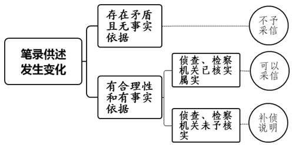
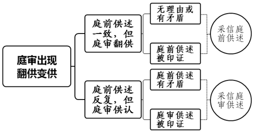
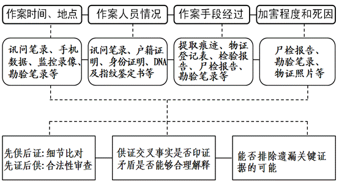
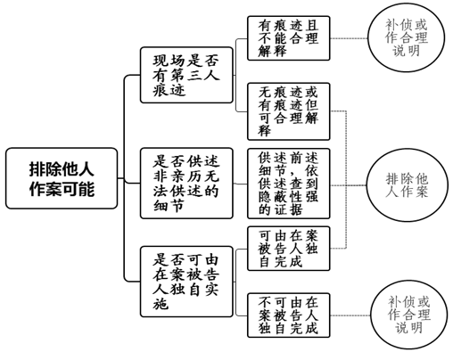

### **认罪供述得到印证型命案的审理思路和裁判要点**

根据侦破命案时所收集主要证据的结构特点，按繁简程度分类，大致可以将命案分为四种类型：现场目击型、现场留痕型、认罪供述得到印证型及拒不认罪型。认罪供述得到印证型命案是指既无现场目击证人，又未发现重要留痕，而是依据个别侦破线索找到犯罪嫌疑人，犯罪嫌疑人随后供述犯罪事实，并相继取得现场情景证据等印证，从而告破的故意杀人、故意伤害致人死亡、抢劫致人死亡等类型案件。

实践中，认罪供述得到印证型命案中较为常见的破案线索，有被害人死于嫌疑人住处、嫌疑人与被害人同住后去向不明、证人证明嫌疑人与被害人失踪前同行、监控录像证明嫌疑人接近犯罪现场，以及嫌疑人自首等五种情形。

上海法院近五年的统计结果显示，认罪供述得到印证型命案在所有命案中占比超过40％。准确把握该类型命案证据的特点、明确其审查步骤和方法，厘清证据，综合分析认定思路，对于查明案件事实，防止事实误认，准确定罪量刑，具有重要意义。

一、典型案例

**案例一：涉及对先供后证情形的审查**

2011年3月1日，邱某向公安机关投案并供述称，2011年2月23日其与女友王某在租住房发生争执，邱某用双手掐住王某脖子致其死亡后将其平放在床上，把被子盖到头部以下做成睡眠状，整理房间并锁上门窗后离开。侦查人员前往其供述地点，砸开门锁后进行勘验，发现案发地床上躺一具女尸，面向上、身盖一条棉被，尸体脸部露出且呈青黑色。经辨认，死者系王某。经尸检，死者系生前被他人扼压颈部致机械性窒息死亡。

**案例二：涉及对先证后供情形的审查**

徐某报案称邻居女儿汪某死在家中。经尸检，死者头部、面部有多处钝器伤，系生前被他人扼压颈部，用钝器打击头面部等致机械性窒息合并颅脑损伤死亡。侦查人员通过走访发现徐某手背、手腕处有多处新鲜抓痕，有作案嫌疑。首次讯问中徐某否认作案，讯问期间发现徐某皮带、钥匙均有血迹。经鉴定，该血迹均系被害人所留。之后徐某逐步承认其为强奸而用磨刀石将汪某砸晕后拖入汪某家中。后汪某苏醒，徐某因怕事情败露又用磨刀石多次击打汪某头、面部致汪某死亡的事实，并指认了抛弃作案工具及所穿衣服的地点。后在其供述地点打捞到所称衣服和工具。

**案例三：涉及被告人先供认后翻供情形的审查**

侦查人员接报警称在地铁站附近发现一具男尸，附近居民和亲属辨认死者为李某。经尸检，死者系生前被他人用钝器打击头面部等处致颅脑损伤死亡。侦查人员通过排查死者社会关系，发现赵某与死者之妻罗某有不正当关系，遂传唤赵某。赵某到案后否认作案，后又改称为与罗某长期姘居，遂与罗某密谋后用铁管击打李某头面部致其死亡。罗某到案供认多次与赵某商量后，让赵某将李某杀害的事实。后赵某又翻供称案发时间段其回宿舍睡觉，同事白某为其开的门，但白某对此予以否认。庭审中，赵某重新作认罪供述。

**案例四：涉及被告人主观内容供述的审查**

刘甲报案称其母刘乙驾驶私家车跑出租，彻夜未归且失联。刘甲报案当日另有人报警称在某地发现一辆可疑车辆停在路边。经勘验，侦查人员发现该车与刘甲所报失踪车辆相符，副驾驶躺一女子，已死亡，随身财物被劫。经亲属辨认，死者系刘乙。经尸检，死者系生前被他人用锐器切割颈部伤及左侧颈动脉等处致使失血性休克死亡。经侦查，发现黄某活动轨迹与刘乙一致，据此判断黄某具有作案嫌疑。后侦查人员将黄某抓获归案，并在其住处查获被害人的首饰等财物。黄某到案后供述称因打车过程中与刘乙发生争执，遂用美工刀捅刺刘乙颈部等处致死。

二、认罪供述得到印证型命案的审理难点

实践中，认罪供述得到印证型命案在审理时存在以下难点：

**一是证明标准把握难**。刑事案件中长期适用的“事实清楚，证据确实、充分”的法定证明标准比较原则和抽象，具体适用中的理解会存在差异。在认罪供述得到印证型命案中，被告人供述是串起整个证据链的关键，但对其供述的印证方法并不统一。在“重证据、重调查研究、不轻信口供”的要求下，如何判断该类案件中以言词证据为主的证据链条已达到确实、充分的标准存在一定难度。

**二是翻供审查判断难**。被告人供述具有较强的主观性，被告人在诉讼中的地位决定其供述易趋利避害。随着诉讼进程的推进，容易出现供述前后不一致或翻供的现象。被告人供述一般表现为讯问笔录和当庭供述。笔录证据会存在口语转化、内容取舍、归纳总结等情形，容易造成口述信息的缺失或失真，出现笔录前后不一致情形时需认真核实。被告人的当庭供述也容易出现反复或翻供等现象。在物证不充足时，如何有效甄别被告人的谎言和正确判断事实是审理此类命案的难点之一。

**三是证据综合分析难**。在认罪供述得到印证型命案中，排除第三人作案、排除第三人配合作案和冒名顶替等情形是构建完整证据链条不可或缺的环节，需要法官对被告人的供述与查证的其他证据进行比对分析和综合判断。既要确保各个证据所印证的事实不存在矛盾之处，也要确保诸项证据印证事实串联之后指向的结论事实具有唯一性，还要确保完全排除嫌疑人通过其他途径获知相关作案细节后予以供述的可能。因此，有必要针对本类命案构建包含单一证据审查和关联证据分析在内的综合分析方法。

三、认罪供述得到印证型命案的审理思路与裁判要点

认罪供述得到印证型命案的特点是，案发现场没有目击证人，没有提取到重要痕迹，通常需通过梳理被害人社会关系、排摸多种犯罪线索锁定嫌疑人。取证的重点在于及时获取嫌疑人的完整供述，并着重查明先供后证的事实，再与犯罪现场进行细节比对，形成被告人非亲历作案无法说明与现场细节高度吻合事实的判断后，再依据查证的事实进行定罪量刑。**对该类命案证据的审查要准确把握司法真实与客观真实的辩证关系，坚持证据裁判原则，遵循重证据、重调查研究、不轻信口供的基本要求，在确认单项证据合法、真实、有效的基础上，注重审查口供与关联证据的印证性、逻辑性、全面性**。具体可分六步进行审查。

**（一）审查案发经过的完整性**

案发经过是案件发现及侦破的完整过程，是侦查阶段运用证据查明嫌疑人及案件事实的证明过程。通过审查案发经过可以全面知晓侦查机关的侦查思路、直观了解案件与嫌疑人的关联，大体掌握案件的由来过程、证据情况。司法实践中的案发经过通常表现为《案发经过》《破案经过》等材料以及与此相关的证据材料。审查时要注意相关书面材料是否完整，是否涵盖侦查机关如何获知案发、如何锁定被害人、如何抓获嫌疑人、嫌疑人到案后的供述情况等，重点关注供述内容是否与其他证据相互印证、是否符合情理逻辑。具体可以审查以下内容**：**

**一是案件来源及被害人身份的查明过程**。案件来源主要有报案、投案两种方式，报案案件主要审查报警记录、案件接报回执单等材料与案发说明材料在报警时间、出警地点等方面是否一致。投案案件主要审查报警手机号与投案人手机号是否一致、投案人的首次供述情况等。对报案人或投案人与被害人熟识的案件，可根据报案人陈述或投案人供述确定被害人身份，如案例一、案例二即属此种情况。对被害人身份无法直接确定的案件，要审查侦查机关查明被害人身份的过程，并审核DNA鉴定书、相关工作情况等材料。如案例三中，被害人的身份系通过附近居民和亲属辨认得以确认，侦查机关也提供了相关材料予以说明。

**二是锁定嫌疑人的过程**。除嫌疑人自首外，侦查机关会通过各种侦查活动锁定嫌疑人。锁定过程大体可分为三类：侦查机关通过排摸案发现场附近监控等客观证据锁定嫌疑人，对此可审核监控视频等证据与案发经过表述是否一致；侦查机关通过走访知情人员查清被害人人际关系，并加以分析锁定嫌疑人，对此可审查侦查人员的推理是否符合逻辑、嫌疑人供述的起因是否与案发经过表述一致；侦查机关运用技术手段锁定嫌疑人，对此可以审查相关报告等。如果技侦证据因保密需要无法出示时，要询问技侦材料在锁定嫌疑人中发挥了何种作用等，确保锁定嫌疑人的过程完整。

**三是抓获嫌疑人的过程**。审查该部分内容时，要注意查看案发经过是否写明嫌疑人被抓获时的状态，如是否在投案途中、是否准备投案等。因为这些因素与嫌疑人到案后的供述情况会共同决定其是否具有自首、坦白等法定量刑情节。同时，还需审查案发经过是否遗漏锁定嫌疑人所在位置的途径方法等，如有遗漏可通过询问侦查人员补充完善。

**（二）审查被告人认罪供述取得的合法性**

对供述合法性的审查，需重点关注供述是否有全程录音录像、供述的取得过程、被告人及其辩护人是否提出非法证据排除等。

**一是审查有无全程录音录像**。对可能判处无期徒刑、死刑的案件或者其他重大犯罪案件，应当对讯问过程进行全程录音录像。重点审查以下内容：（1）录音录像反映的时间、地点、内容是否有与供述活动相应的、不间断的时间、地点信息；（2）是否全程录音录像；（3）清晰度是否达到可当庭播放予以质证的标准，无法达标的应有相关说明；（4）是否系原始内容；（5）是否附制作人或者持有人的身份说明，制作的时间、地点和条件以及制作方法的说明；（6）是否能排除刑讯逼供等。

**二是审查历次认罪供述的过程**。被告人认罪供述的取得过程决定了该供述的可采信程度。（1）如果被告人到案后即作完整认罪供述，历次供述对犯罪事实的交代前后一致、较为稳定时，其认罪供述的可采性相对较高。（2）如果被告人到案后不供述或仅作部分供述，后逐步作完整认罪供述的，需对其供述进行重点审查，查明被告人态度变化的原因。（3）如果被告人作认罪供述后翻供、变供，在庭审中又供认的，需查明口供变化的时间、分析变化原因，结合最初的认罪供述和其他证据综合判断该认罪供述能否采信。

如案例三中，赵某到案后先拒绝认罪，后改作认罪供述是因侦查活动取得突破（在其房间查获带有被害人李某血迹的皮靴）。之后赵某又翻供称案发时自己回宿舍睡觉，室友白某能够证明，但白某对此予以否认，赵某的辩解不存在事实依据。赵某描述的作案工具为事先准备的铁管，作案方式为多次砸击死者头面部，被害人被砸后仰面倒在草丛，该类细节与法医所说“作案工具为中空有质量的钝器”、勘验报告中“男尸仰面躺卧，头面部有多处击打痕迹和血迹”、尸检报告中“死者系生前被他人用钝器打击头面部等处致颅脑损伤死亡”等细节高度吻合，其认罪供述可以被采信。

****

**三是审查被告人及其辩护人是否提出非法证据排除**。被告人或辩护人提供线索、提出排除非法证据申请的，应召开庭前会议进行审查。审查时可要求检察机关出示讯问笔录、提讯登记、体检记录、采取强制措施或者侦查措施的法律文书、侦查终结前对讯问合法性的核查材料等，对证据收集的合法性作出说明。如果发现违法取证行为足以导致证据失真的，相关证据一律予以排除；如果违法取证行为不足以影响证据真实性的，应进行法益衡量，在被害人权益更为重大时，相关证据也可采信；如果证据存在笔误等瑕疵，可要求侦查机关进行补正或合理解释，经审查符合证据真实性、关联性、合法性要求的，可以作为证据使用。

**（三）审查被告人认罪供述与其他证据的印证性**

认罪供述得到印证型命案需比对被告人供述与现场客观事实及其他在案证据之间是否高度符合，对其中存在矛盾或不一致的内容，须逐一研判、说明，确保排除合理怀疑。

**一是对先供后证的证据重视细节比对**。该种情形中侦查机关事先不掌握证据或掌握不充分，相关证据能否与被告人建立可靠的印证关系，关键在于是否基于该口供查证了非亲历无法知晓的细节事实，是否根据口供查到了作案工具、找到较为隐蔽的作案现场、提取到关键物证等。

如案例一中，案发现场虽然没有提取到邱某指纹、生物性物质等，但邱某自首后先供述“用双手掐王某的脖子致其死亡”“将其平放在床上，把被子盖到头部以下”“一周前作案”等细节，后来的尸检报告说明“死者系生前被他人扼压颈部致机械性窒息死亡”、勘验笔录记载“床上躺一具女尸，面向上、身盖一条棉被，尸体脸部露出且呈青黑色”，该内容与邱某的供述高度吻合，其供述可以被采信。

**二是对先证后供的证据重视合法性审查**。该种情形中侦查机关事先查获相关证据，被告人事后供述犯罪事实。对此要避免诱供等情形，注重对口供自愿性和真实性的审查。

如案例二中，锁定被告人的线索是其身上出现多处新鲜抓痕、有证人证实其案发前后曾有换衣服等可疑行为，这些线索多在徐某供述前查证。徐某被列为嫌疑人后在首次讯问中拒不认罪，后在次日改作认罪供述。经审查发现，首次审讯当日从徐某身上查获了带有可疑血迹的钥匙和皮带，经鉴定系被害人血迹；当晚也排除了徐某辩解的事实基础，徐某曾辩称其身上的伤痕系发生交通事故所致，经排查在其供述的时间、地点并无交通事故发生，之后徐某对伤痕的形成未再作出合理解释。在侦查活动取得突破后徐某供述发生变化符合常理，查阅审讯录像也未发现违法取证情形，足以形成徐某系自愿、真实作出认罪供述的判断。

**三是审查供述与其他证据是否一致**。具体证据分析应以被告人供述为基础区分犯罪事实要素，组织证据比对，判断口供与特定证据是否在交叉事实上相互印证：**（****1****）作案时间和地点**。可将口供与讯问笔录、查获的手机数据、监控视频、现场勘验笔录等比对；**（****2****）作案人员情况**。可将口供与讯问笔录、户籍证明、监控视频、身份证件、DNA及指纹鉴定书等比对。**（****3****）作案手段和经过**。可将口供与尸检报告、现场勘验笔录、提取痕迹物证登记表、物证检验报告、辨认笔录等比对。**（****4****）加害程度和死因**。可将口供与尸检报告、物证照片、现场勘验笔录等比对。只有当供述与其他证据之间不存在矛盾，或者对矛盾能够进行合理解释或排除合理怀疑时，才能认定相关事实。

**供证印证性审查**

如案例三中，被告人赵某供述的作案时间、地点得到报警人及证人的印证，与根据监控录像查到李某出门时间后推测李某到达案发现场的时间大体吻合。赵某供述的具体作案方式和尸体的肢体形态，与现场勘查中发现的尸体样态及尸检报告中的被害人死因等相互印证。赵某供述的作案工具虽未找到，但其供述的用铁管作案及击打部位与法医说明的“中空类的钝器”相符，也与尸检报告中被害人头部被击打造成的伤势情况相吻合。综上足以判断，赵某故意杀人事实的证据确实、充分。

**四是对能够印证被告人认罪供述的其它证据补充查证**。本类命案中，也需查证在案证据之外是否有其他可以印证认罪供述的证据。尤其是当被告人供述中提到了某一具有重要价值的实物证据，但卷宗材料中没有出现时，需进行及时补充查证，以避免直接承载或附着特定犯罪痕迹或信息的证据灭失。

如案例二中，徐某供述自家车库的磨刀石系作案工具，且该工具与尸检报告确定的钝器相符，但卷宗材料中并未出现磨刀石。庭审后，经法官与相关部门沟通，最终在被告人供述的区域通过筑坝抽水的方式发现了作案用的磨刀石。徐某的认罪供述可予采信。

**（四）审查排除其他人参与作案的可能性**

认罪供述得到印证型命案得以定案的关键，是以言词证据为主的证据要形成完整的链条，要排除其他人作案的可能。因此对在案证据进行综合审查后，还需查证是否有第三人作案可能，判断全案证据在指向犯罪人时是否具有内在联系、是否指向一致的作案人。

**一是审查案发现场是否有第三人的痕迹以查证是否系第三人作案**。通过审查案发现场的监控视频、现场勘验笔录、现场照片、现场提取痕迹物证登记表、DNA鉴定书及物证检验报告等材料，梳理案发现场是否存在第三人痕迹。若没有发现第三人痕迹，或虽在案发现场发现第三人痕迹、但能够对此进行合理解释的，一般可初步排除第三人作案的可能。

如案例二中，被害人死于浴室，但在被害人卧室和客厅提取到两枚H牌烟蒂，无法检出生物性物质。经查被告人平时不抽烟，被害人父亲虽抽烟但并非H牌。该两枚烟蒂属第三人留在现场的痕迹。为排除第三人作案，法官对全案进行梳理发现，被害人母亲曾在证言中说明，案发后其叫邻居亲戚等多人来现场帮忙送医。侦查机关随后提供《补充说明》，案发后有多名邻居进入客厅，协助家属将被害人送医。据此，可以判断该两枚烟蒂很有可能系救助群众所留。

**二是审查供述是否存在非亲历无法供述的细节以查证被告人是否系替人顶罪**。查证被告人供述的犯罪过程是否完整、犯罪细节是否充分且属于非亲历作案无法供述的内容、是否依据其供述查证了隐蔽性较强的书证或物证等，以此排除未参与者替人顶罪的情形。

如案例二中，徐某到案后供称，其为了实施强奸使用磨刀石将被害人砸晕后拖入被害人家中，后在强奸过程中被害人苏醒，就用手掐住被害人脖子，再用磨刀石砸被害人的头面部。该供述与尸检报告记载的死者系生前被他人扼压颈部，用钝器打击头面部等致机械性窒息合并颅脑损伤死亡的死因相符。之后，侦查人员也在被告人供述的地点查获其作案时所穿血衣及作案工具磨刀石。据此，足以认定本案系徐某所为。

**三是审查犯罪是否可由在案的被告人独自实施以查证是否系共同犯罪**。当被告人为一人时，需审查犯罪行为能否由其单独实施；当被告人为数人时，需审查相关犯罪是否还需有其他人辅助方能完成。如果综合全案证据审查后发现，当前查清的犯罪事实需要由其他案外人配合方能实施的，应要求检察机关或侦查机关进行补充侦查或作出合理说明，以做到完全排除遗漏同案犯的可能。

如案例三中，赵某对被害人并不熟悉，不能完全掌握被害人的行踪。赵某供称在被害人妻子罗某的帮助下，方才获知被害人的活动轨迹及其电动车特征等情况。该供述具有较高的可采性，罗某参与作案的可能性也较大。经后续审查，罗某亦供称因欲与赵某共同生活，多次与赵某商量后将李某杀害的作案事实。本案最终确定系赵某与罗某共同作案。

****

**（五）审查被告人关于犯罪起因供述的合理性**

认罪供述得到印证型命案中，被告人的犯罪起因对案件定罪、量刑具有关键影响，有必要对被告人供述的犯罪起因进行重点审查。对犯罪主观方面的证明，需要根据客观证据进行推断和认定，不能轻信口供，要审查供述中说明的作案起因是否与客观证据相符、是否与常理相符，供述的作案起因与案件查实的作案工具选择、犯罪暴力程度、具体作案方式等事实是否匹配等。如果其供述的作案起因与客观证据存在矛盾或明显与常理不符，不能适用存疑有利于被告人规则，而应以查证的证据为基础，根据常理合理推断真实的作案起因；对于真实作案起因确实无法查明的，可对作案起因不作明确表述，但需在判决中对作案过程进行客观表述，并根据证据的证明程度认定行为性质和判处刑罚。

如案例四中，黄某到案后供称，其因被害人索要车费较多，故与被害人发生争执后临时起意对被害人行凶。然而黄某供述的作案起因存在诸多疑点：如其供述案发当晚随身仅携带80多元，与其供述欲前往较远的目的地存在矛盾；其供述因被害人不识路故由其代为驾驶，但被害人系有经验的客运驾驶员，通常不会让陌生乘客代为驾驶；其供述行凶的美工刀系在车内拿取，但多名证人均证实车内没有刀具。因此，黄某供述的作案起因与其供述的其他内容存在矛盾，且明显违背常理不足采信。黄某的暴力程度、作案方式等与抢劫杀人行为较为类似，但在无充分证据证明黄某系为图财而抢劫杀人的情况下，认定其构成故意杀人罪较为妥当。在其真实作案起因无法查明时，可在判决中客观表述作案过程，并作出罪责刑相适应的判决。

**（六）审查其他影响定罪量刑证据的可采性**

认罪供述得到印证型命案在查清上述事项之后，还需审查被告人的供述辩解及全案证据，判断是否存在其他足以影响定罪量刑的情节，以实现对被告人所实施的行为进行充分完整评价的目的。（1）有关被害人有无过错及过错程度，是否对矛盾激化负有责任及责任大小的证据；（2）有关被告人的近亲属是否协助抓获被告人的证据；（3）有关被告人平时表现及有无悔罪态度的证据；（4）有关被害人附带民事诉讼赔偿情况，被告人是否取得被害人近亲属谅解的证据；（5）其他影响量刑的证据。

发现既有证明从轻、减轻处罚等情节的证据，又有证明从重处罚等情节的证据的，应当依法对全部证据进行综合考虑。此外，在不能排除被告人具有从轻、减轻处罚等量刑情节时，判处死刑应当特别慎重。

在被告人认罪供述得到印证型命案的审理中，严格依照上述步骤对全案证据进行审查核实、补充调查和分析论证，就能确保此类案件事实认定达到证据确实充分、排除合理怀疑的证明标准，使命案审判质量经得起法律和历史的检验。

四、其他需要说明的问题

现场目击型、现场留痕型、认罪供述得到印证型、拒不认罪型四类命案的证据结构虽然繁简不同、各有侧重，但在证据链条的构建及证据综合分析方面仍具有共性要求。此类案件审理时，除了要兼顾各自证据结构特点外，在案发经过查证、供证印证性审查、证据充分性及排他性说明、罪前罪后表现等量刑情节审查方面，也可借鉴认罪供述得到印证型命案的审理思路，以确保个案的证据审查达到确实、充分，排除合理怀疑的证明标准。

（根据刑事庭余剑、吴亚安提供材料整理）