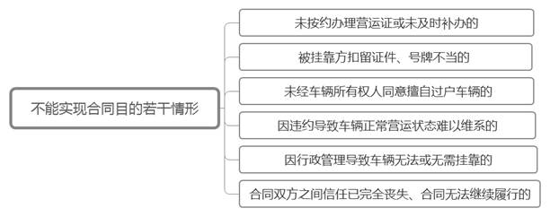
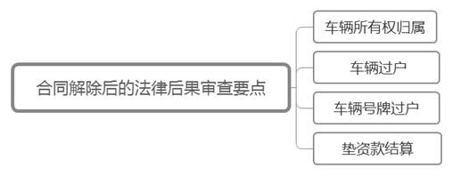
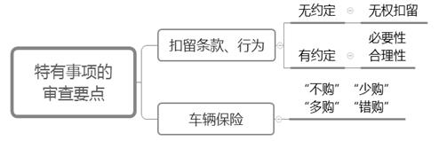

### **货运车辆挂靠经营合同纠纷的审理思路和裁判要点**

货运车辆挂靠，是指未取得国家道路运输经营资质的个体（挂靠方）为合法从事货物运输经营活动，将货运车辆登记在有运输经营资质的单位（被挂靠方）名下，并由被挂靠方为挂靠货车办理营运证件，挂靠方向被挂靠方支付一定费用的挂靠经营行为。鉴于货运车辆挂靠经营合同系无名合同，司法实践中存在不同的评价与处理标准，尤其在合同应否解除及相应法律后果的处理上分歧较大，统一裁判尺度实有必要。现以典型案例为基础，结合法律规范和司法实践中的审理难点，对货运车辆挂靠经营合同纠纷的审理思路和裁判要点进行梳理、提炼和总结。

**一、典型案例**

**案例一：涉及合同应否解除的认定**

赵某将货车挂靠至A公司名下，双方签订《车辆挂靠合同》。合同约定，A公司为车辆办理营运证，赵某每年支付挂靠费。期间，车辆营运证因故被注销，A公司未及时补办，赵某仍继续使用车辆。后A公司通知赵某协助补办，赵某未回应。现赵某以A公司未办理营运证导致合同目的无法实现为由，诉请解除合同。A公司则认为，营运证未能补办系因赵某不配合所致，营运证仍可补办，合同应继续履行。赵某坚称不愿再行挂靠。

**案例二：涉及车辆所有权归属的认定**

钱某将货车挂靠至B公司名下，双方签订《车辆挂靠合同》。合同约定，车辆属于B公司、登记于B公司名下，B公司为该车辆办理营运证，钱某每年支付挂靠费。购车发票、购置税发票、缴款书记载的购买方均为B公司，但上述凭据均由钱某实际保管。后双方协议解除合同，但对车辆归属存在争议。钱某以实际出资并占有使用为由诉请确认车辆所有权。B公司则认为，基于发票记载、合同约定及车辆登记，其应为车辆所有权人。

**案例三：涉及车辆号牌及垫资款的处理**

孙某将货车挂靠至C公司名下，双方签订《车辆挂靠合同》。合同约定，货车归孙某所有；C公司为孙某垫资购车款3万元、车辆改造款1万元；在孙某付清上述款项前，孙某不得解除合同；车辆号牌归C公司所有。车辆上牌费用实际由孙某支付。后孙某诉请解除合同、确认车辆所有权，并以实际出资为由要求确认车辆号牌归其所有并过户至其名下。C公司认为，如孙某结清垫资款，则同意解除合同，但车辆号牌依约应归C公司所有。

**案例四：涉及扣留行为性质的认定**

李某将货车挂靠至D公司名下，双方签订《车辆挂靠合同》。合同约定，D公司代办货车保险（包括车上人员险）；李某需按期支付保险费，逾期则D公司有权扣留车辆号牌、相关证件等。合同履行期间，D公司未购买车上人员险。在李某自行购入后，D公司随即购入价格畸高的车上人员险并要求李某支付保费。李某拒绝支付该保费。D公司遂以逾期支付保费为由扣留车辆。李某以车辆被扣导致合同目的无法实现为由，诉请解除合同并要求D公司赔偿因扣车产生的经济损失。D公司则认为扣车有据，反诉要求李某支付扣车期间的停车费、人工费等。

**二、货运车辆挂靠经营合同纠纷的审理难点**

**（一）合同应否解除认定难**

解除合同往往是挂靠方的基本诉求，其多以被挂靠方未办理营运证导致合同目的无法实现为由，要求行使法定解除权。被挂靠方则多以挂靠方拖欠费用、不配合办理营运证，或合同未明确约定其应办理营运证等为由，主张不存在根本违约。实践中，当事人普遍存在举证能力弱、矛盾冲突大、双方共同违约等情形。对于合同是否达到法定解除条件，认定标准尚不统一。

**（二）车辆归属及垫资款处理难**

涉案车辆多由挂靠方出资购买，但为挂靠目的登记于被挂靠方名下。发生纠纷后挂靠方虽要求确认车辆归其所有，但往往无法提供购买或付款凭据，甚至购车凭据上记载的购车人为被挂靠方。被挂靠方则以车辆登记或合同记载为由主张车辆所有权或返还垫资款。实践中，对于采取“登记”“出资”还是“占用”等标准认定车辆所有权归属，以及垫资款的举证责任如何分配存在争议。

**（三）车辆号牌处理难**

在查明车辆归挂靠方所有且合同可予解除的情况下，法院一般可支持其要求被挂靠方协助车辆过户的请求。然而，对于车辆号牌应归属于登记方、实际出资方，抑或“车辆号牌随车走”，在实践中存在较大分歧。

**（四）扣留行为性质认定难**

车辆挂靠合同往往会约定在挂靠方逾期支付相关费用时，被挂靠方有权扣留车辆、号牌、证件等。挂靠方违约时，被挂靠方依约实施扣留行为，并要求挂靠方支付车辆保管费用。公安机关一般认定该扣留行为系因经济纠纷引起，不予处理。在扣留条款的效力及扣留行为合法性的认定上，实践中存在较大分歧。

**三、货运车辆挂靠经营合同纠纷的审理思路和裁判要点**

货运车辆挂靠经营合同纠纷案件的审理，应以《民法典》总则编、物权编、合同编相关条款为主要法律依据。**在充分尊重当事人意思自治和行政机关综合管理的基础上，运用诚实信用原则、公平原则，平衡保护合同双方的合法权益。**尤其在审查合同应否解除时，**法院要主动树立良好的价值导向，追求恰当的社会效果，平衡保护双方当事人的合法权益。**

**（一）合同应否解除的审查要点**

此类案件的基础诉请多为解除合同。对于行使约定解除权的，法院可根据合同约定审核条件是否成就；对于行使法定解除权的，法院应当依法审查是否符合法定解除构成要件。司法实践中，“合同目的无法实现”是最为常见的申请合同解除事由。在货运车辆挂靠经营合同纠纷中，挂靠方的合同目的是通过挂靠使车辆取得国家道路运输经营资质，以实现其合法经营运输的目的；被挂靠方的合同目的是收取挂靠费用。对于挂靠方不支付挂靠费是否导致合同目的无法实现的，法院可根据法定解除的几类情形进行审查。

需要注意的是，如仅涉金钱债务纠纷的，法院宜从尽量维持合同有效的原则出发，不轻易解除合同。就被挂靠方的非金钱债务而言，如存在以下行为，可根据实际情况认定是否属于“迟延履行债务或其他违约行为不能实现合同目的”的范畴。

**1****、未按约办理营运证或未及时补办的**。为挂靠车辆取得国家道路运输经营资质供挂靠方使用是被挂靠方的主要义务，具体体现为办理营运证。根据举证规则，应由被挂靠方举证证明其已办妥营运证的事实。如审查发现“未办理营运证”“营运证失效或注销后未及时补办”的，一般可认定被挂靠方未办理营运证的事实成立，进而可认定合同目的无法实现判令合同解除。

实践中，被挂靠方往往会抗辩合同并未约定其负有办理营运证的义务，或辩称挂靠方仍正常运营车辆且未提出过异议，故合同目的仍可实现。该抗辩理由不宜认可，理由在于：**一是**被挂靠方是否负有该项义务，与有无书面约定并无必然联系。如双方法律关系符合货运车辆挂靠经营合同的特征，且通过具体行为表现可认定双方签约时存在挂靠合意的，一般应认定被挂靠方负有为挂靠车辆办理营运证的义务。**二是**挂靠方明知或默认无营运证或营运证失效仍持续运营车辆的，不宜当然解释为对被挂靠方主要合同义务的免除。法院应充分考虑到被挂靠方客观上存在的优势地位，且无证运营的状态亦有损国家道路运输经营公共秩序等因素。

**2****、被挂靠方扣留证件、号牌不当的**。依法悬挂号牌、携带行驶证、营运证是法律、行政法规的强制性规定，证件、号牌被扣留的，挂靠方将难以合法从事货运经营。如合同并无约定，或虽有约定但挂靠方仅有轻微违约行为，而被挂靠方的扣留行为与挂靠方的违约行为又明显不相称的，宜认定扣留不当。货运车辆挂靠经营合同作为持续性合同，如被挂靠方任意扣留证件、号牌，合同履行将始终处于不稳定状态，挂靠方较难实现合法货运经营目的。经审查，被挂靠方如具有上述明显违约情形，且该状态延续一定期限后发生合同目的无法实现或激化矛盾导致双方信任基础丧失、合同无法继续履行的，可判令合同解除。挂靠方要求被挂靠方承担停运损失且能举证证明的，可视双方过错酌定责任承担。

**3****、未经车辆所有权人同意擅自过户车辆的**。挂靠车辆的行驶证、营运证往往登记在被挂靠方名下。如被挂靠方未经挂靠方同意擅自将车辆过户至第三人，将导致挂靠方从事运营活动缺乏有效证件，有悖其通过挂靠从事运营的合同目的，法院可判令合同解除。

**4****、因违约导致车辆正常运营状态难以维系的**。货运车辆的正常运营状态一般涉及保持正常运营的技术状态、满足行政机关基本管理要求两方面。就车辆技术状态而言，如车辆因一方违约行为导致无法满足一般运营车辆应有的技术状态、极可能造成重大事故的，另一方当事人可主张合同解除。就货运车辆行政管理而言，主要涉及车辆的强制检验。依据《机动车强制报废标准规定》，车辆在检验有效期届满后连续三个机动车检验周期内未取得机动车检验合格标志的，应当强制报废。因此，如一方无故迟延办理车辆检验手续以致机动车符合强制报废条件的，应认定车辆正常运营状态难以维系，另一方可主张合同解除。

**5****、因行政管理导致车辆无法或无需挂靠的****。**车辆能否挂靠经营显然受到行政机关管理的直接影响。行政机关采取新的行政措施，可能会产生营运证无法办理、被注销后无法补办或车辆无需再行办理营运证件等后果，客观上因被挂靠方无法履行挂靠登记义务而构成违约，显然属于合同目的无法实现。此种情形下，应注意审查该行政行为及后果是否属于“当事人在订立合同时无法预见”的情形。

对于当事人可否预见，可从近年来行政机关对于车辆挂靠经营的管理态势等综合判断双方当事人是否存在一定预期。（1）如符合“情势变更”构成要件的，受不利影响的当事人可以请求解除合同。法院可结合案件的实际情况，根据公平原则依法解除合同。（2）如查明行政机关的管控呈逐年趋紧的态势，当事人对此存在一定预期的，法院在认定合同是否需解除时，宜本着谨慎原则，仔细认定双方合同目的是否达到、继续履行合同是否会导致利益严重失衡等因素综合判断。

**6****、合同双方之间信任已完全丧失、合同无法继续履行的。**货运车辆挂靠经营合同约定的履行期限一般为一年以上。在此期间，挂靠方虽多为实际车主，但因车辆登记于被挂靠方名下，其需承担车辆被名义车主擅自处分的风险；被挂靠方虽收取挂靠费用，但因不实际运营车辆，其需承担挂名运营、道交事故的责任风险。因此，挂靠经营合同建立在双方愿意互担风险的基础之上，有赖于合同双方的信赖关系，可以说具有相当的人身信任属性。

在该类持续性合同履行期间，营运证的办理、车辆的检验等通常需双方协调配合。如双方前期均存在轻微违约行为，尚未达合同目的无法实现的程度，但后期因矛盾激发导致信任基础丧失，在无法就挂靠合同主要权利义务的进一步履行达成一致意见的情况下，合同实难继续履行。此时当事人请求解除或者终止合同的，法院宜基于个案案情，从各方当事人的相互关系、合同能否继续履行、合同目的能否继续实现等方面进行审查。在继续履行合同确实存在极大障碍、信任基础彻底丧失的情形下，法院可以根据当事人的请求慎重解除或者终止合同。

如案例一中，车辆登记于A公司名下，但实际由赵某占有使用。如赵某拒不配合，即使法院判决合同继续履行，营运证也难以再行办理。在查明双方难以达成合意的情形下，法院如可确信双方合作的信任基础丧失、合作不可能再行继续的，可判令合同解除。

**（二）合同解除后的法律后果审查要点**

就此类纠纷而言，合同解除后的法律后果主要涉及车辆的所有权归属、车辆过户、车辆号牌的处理以及垫资款的结算等。

**1****、车辆所有权归属的审查要点**

对车辆所有权归属的审查应注意区分名义车主和实际车主，不可仅依车辆登记判定所有权归属。依据《民法典》第224、225条规定，车辆物权的设立自交付时发生效力，车辆登记仅具有公示及对抗效力而非物权效力。法院应综合出资及实际占用情况，以“公平、等价、有偿”的原则确定车辆所有权归属。

具体到个案，法院可基于车辆买卖合同、购车发票等证据，结合车辆实际占用情况判断所有权归属。实践中，挂靠方往往举证困难，乃至其所持购车凭证记载的购车人为被挂靠方。此时，法院宜在确认双方之间确为货运车辆挂靠法律关系的基础上，着重对购车、交付等相关事实进行审查，并根据车辆的实际占用情况，结合合同约定、庭审陈述、查明事实等，综合认定车辆所有权归属。

如案例二中，系争车辆登记于B公司名下，购车凭据记载的购车人亦为B公司，但该凭据却为钱某保管。考虑到车辆一直由钱某实际占用运营，且就车辆可排除其他法律关系存在。如B公司对凭据保管情况不能作出合理解释，则可推定车辆所有权归属于钱某。

**2****、****车辆过户的审查要点**

一般而言，基于裁判文书中车辆所有权的确权判项，车辆所有权人即可向行政机关申请办理车辆过户手续。然而，各地主管部门对于货运车辆过户可能存在限制性的规定或政策，且呈现相对多样可变的特点，较难把握。因此，为避免讼累、便于执行，如当事人明确提出要求协助办理过户诉请的，法院可予支持，判令对方限期协助办理车辆过户手续。在文书说理时可作诸如“具体过户手续的办理应基于现时当地行政机关的相关规定与具体政策”等类似释明。判决主文可写明过户车辆的型号、发动机号码、车辆识别代号，但应避免采用“××号牌车辆”的表述方式。如机动车已达到国家规定的强制报废标准，则不宜判令车辆过户。

**3****、车辆号牌过户的审查要点**

车辆号牌涉及资质审查审批，属于行政调整范畴，即便挂靠方表示自愿承担过户不能的后果或与被挂靠方协商一致过户给第三方的，司法机关仍不宜处理。理由如下：

**一是**支付对价不是取得车辆号牌的判定标准。车辆号牌的归属与车辆所有权归属存在明显差异，车辆号牌本身仅具有成本价值，其真实价值在于行政部门赋予的车辆上路许可资质。依据《道路交通安全法》第11条规定，驾驶机动车上路行驶，应当悬挂机动车号牌；公安部《机动车登记规定》第5至9条规定，车辆号牌必须向公安机关申领且需符合公安部部门规章的具体规定。由此可见，车辆号牌体现的不是纯粹的民商事法律关系。

**二是**司法机关判令车辆号牌过户有干涉行政管理之嫌。依据《机动车登记规定》第18、19、21、52条规定，车辆号牌不得转让过户。挂靠方经法院确权为车辆所有权人，其申请办理车辆转移登记的，公安机关或将收回号牌，或将公告原号牌作废，挂靠方无法取得车辆号牌。原车辆所有人即被挂靠方在转移登记后，其申请办理新购机动车注册登记的，可向公安机关申请使用原机动车号牌号码。因此，挂靠方无法当然取得号牌。法院如判令连车带牌一起过户，则有违行政机关实施机动车登记管理的宗旨。如案例三中，孙某虽诉请将车牌过户至其名下，但基于前述考量，即便其自愿承担执行不能的后果，法院也不宜支持孙某的这一诉请。

审理时，法院可向当事人释明车辆号牌过户不属于司法调整的范畴，法院不确认、不处理车辆号牌归属。裁判文书中车辆所有权的确权判项应避免采用可能被解读为“连牌带车一起过户”的表述。至于车辆号牌申领费用的负担，应由权利主张方承担实际支出的举证责任。

**4****、垫资款结算的审查要点**

被挂靠方要求结算垫资款的依据仅为合同记载，挂靠方又提出有效抗辩的，法院可要求被挂靠方对此进一步举证。在仅有合同约定并无其他证据佐证的情形下，不宜认可被挂靠方的结算主张。如案例三中，C公司仅以合同约定存在垫资款，但无法进一步举证证明，相应举证不能的后果应由其自行承担。需要注意的是，经审查相关款项属于其他民事法律关系的，如民间借贷法律关系等，法院宜向双方释明另案解决。

**（三）特有事项的审查要点**

扣留条款、车辆保险是此类纠纷案件的特有事项，审查时应注意以下要点：

**1****、扣留条款、行为的认定及后果处理**

因车辆实际由挂靠方使用，如挂靠方异地运营又长期不缴纳挂靠费或其他费用，被挂靠方将陷入鞭长莫及的困境，故双方往往在挂靠合同中约定：挂靠方违约的，被挂靠方有权扣留车辆、号牌、营运证等。发生争议后，被挂靠方如在代办车辆相关手续时和平取得车辆的占有，一般可认为系行使留置权。实践中，被挂靠方往往以非和平方式强势取得车辆等的占有，如自行或委托社会人员强行扣留车辆、摘下车辆号牌或取走行驶证、营运证等。即便挂靠方以盗窃、抢劫报案，公安机关也会以民事纠纷为由拒绝刑事立案。因挂靠方多以车辆运营为主要谋生手段，被挂靠方的扣留行为极易引发社会矛盾。有鉴于此，法院宜对扣留条款及扣留行为的合法性与正当性进行审查并妥善处理。

**（****1****）扣留条款效力的认定**

基于双方合意，挂靠合同约定在特定情形下被挂靠方可扣留车辆、号牌、营运证等，此系被挂靠方基于债权取得物的占用。在不违反法律、行政法规的效力性强制性规定，不违背公序良俗等法定无效的情形下，宜认定扣留条款有效。

**（****2****）扣留行为的审查要点**

**一是**审查挂靠合同有无约定扣留条款。无约定的，宜认定为无权扣留；约定不明确的，如仅为“处理车辆”等，或扣留物超出条款约定范围的，表明双方对于扣留或实际扣留物并未达成合意，宜认定为无权扣留。

如案例四中，合同仅约定D公司有权扣留车辆号牌、营运证件等，并未明确是否包括车辆在内。D公司将“等”字扩张解释为包含车辆并无依据，且扣留车辆系重大事项，应有明确的意思表示。因此，D公司扣车应属无权行为，不得要求李某支付停车费用。同时，李某车辆被扣势必导致无法运营车辆，如该状态延续一定期限后发生合同目的无法实现或激化矛盾导致双方信任基础丧失等情形，其可诉请解除合同。因D公司存在严重违约行为，故李某主张D公司承担停运损失的诉请，也可在举证查实后予以支持。

**二是**审查扣留条件是否成就。在认定有权扣留的基础上，法院应严格依照合同约定，审查扣留条件是否成就。

**三是**审查扣留行为的必要性与合理性。如在轻微违约的情形下，被挂靠方动辄行使扣留权将严重损害双方信任基础，且势必对挂靠方造成较大损失，有失公允，勿论其中还涉及国家道路运输经营秩序与道路交通安全等因素。因此，即使合同约定被挂靠方在挂靠方逾期支付挂靠费、保险费、验车费等情形下，有权扣留车辆、车牌、营运证、行驶证等，但如具体扣留行为或实施手段与一方违约行为明显不相称、显非必要，或挂靠方存在合理理由的，不宜认定被挂靠方可行使扣留权或扣留行为适当。如案例四中，因D公司未按约购买保险，李某自行购入并拒绝支付相应保险费用有合理理由，并不构成违约，D公司不得实施扣留行为。

**（****3****）相应后果的处理**

如认定被挂靠方系无权扣留或扣留不当，挂靠方要求其承担停运损失或其他实际损失的，法院可根据举证情况、具体案情，基于公平原则合理认定。如认定被挂靠方扣留有据，被挂靠方要求挂靠方承担为此支出的停车费等费用的，法院同样可基于上述认定标准，在查实后对于必要、合理的费用予以支持。

**2****、车辆保险**

因车辆保险衍生的纠纷主要有：在挂靠合同对保险类别、具体险种作出明确约定，或仅笼统约定被挂靠方代为办理保险（未明确保险类别、具体险种）的情况下，被挂靠方未购或未按合同约定购买，“不购”“少购”“多购”或“错购”，诸如：额外购买非必要险种；非基于一般理性人的考量购入价格畸高的险种；应购入营运性质保险，却购入非营运性质保险等。

在处理上述纠纷时应注意以下要点：**一是**挂靠方应及时要求被挂靠方纠正上述购险行为。合同虽约定车险由被挂靠方代购，但因挂靠方实际营运并控制车辆，其也负有应当知道车辆保险状态的义务，如未在合理期限内提出异议，可视为对被挂靠方购买保险行为的认可。**二是**如经挂靠方及时指出，被挂靠方仍未改正，挂靠方自行购买保险或拒绝支付有争议保费的，不得仅凭合同约定或拒付保费的事实认定挂靠方违约。法院应根据双方当事人的合同约定以及各方的具体行为，结合诚实信用原则妥当作出裁判。

**四、其他需要说明的问题**

挂靠关系多种多样，各方行为亦有差别，行政机关有关货车挂靠的规定、政策亦随着社会情况的变化而调整。因此，法院在具体裁决案件时应严格根据法律规定，结合公平和诚信原则，在合理界定当事人行为的情形下，可参照本意见的规范指引，合理、恰当地定分止争。

（根据商事庭毛海波、须海波提供材料整理）