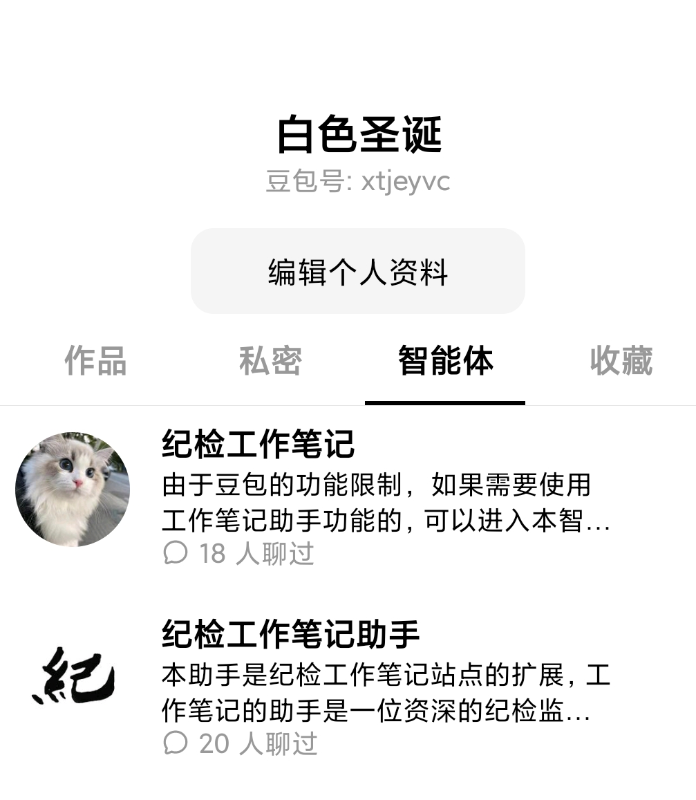

- **使用方法一:**
	- 已接入微信公众号：纪检工作笔记，直接对话即可
- **使用方法二：**
	- 使用豆包APP，添加“纪检工作笔记助手”这个智能体。
	- 该助手的内容是依托于纪检工作笔记这个站点的内容，形成了一个知识库，但是因为内容太多，陌生用户在豆包APP版上的添加该智能体可能比较复杂一些。
	- 该智能体的添加方式为：
	- 1、打开豆包APP
	- 2、扫描二维码
	- 
	- 3、找到纪检工作笔记的作者的其他智能体
	- {:height 481, :width 392}
	- 4、找到纪检工作笔记助手，然后添加
-
- 纪检工作笔记这个智能体的内容是非常多的，如果希望他输出一定质量的内容就需要学习“[[提示词工程]]”。
- 常用的提示词是“**角色+背景信息+任务+要求**”，比如你是一个纪委监委的审查调查室的工作人员，要对区政府的信访局的信访津贴发放问题进行审查，审查的内容是了解该单位的信访津贴发放的依据、发放的人员范围、标准等等，就审查的过程有什么注意事项需要你作出一个总结或提示，字数要求不少于400字，使用纪言纪语的风格。
- 而不是能是一个词、一个短语，比如群众身边腐败问题，纪检文书，有很多朋友抱着好奇心这样测试，但更希望你们把AI使用的基本规则学习一下，你需要向它提一个问题，然后它根据你提示的范围和内容进行回答，而单个的名词和动词的提出则说明该使用者对于AI的基本规则都没有学习和掌握。
  background-color:: red
-