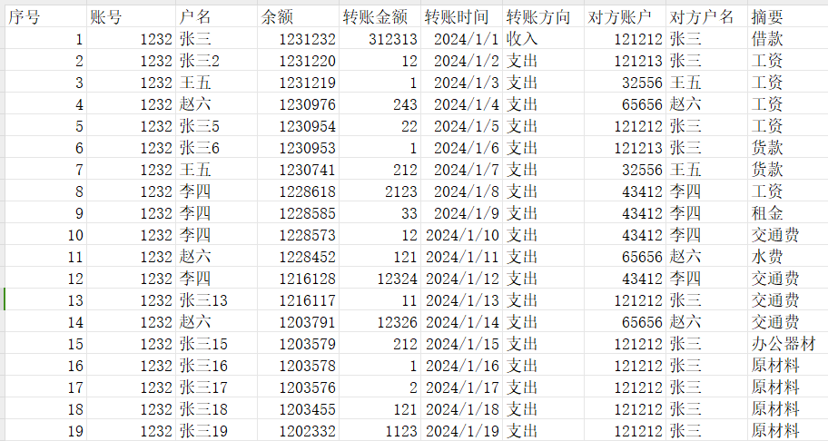
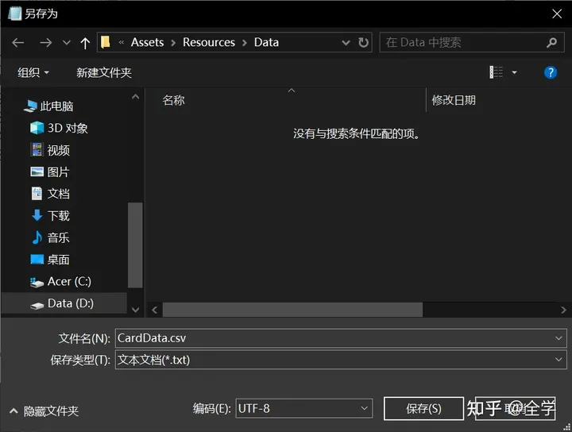
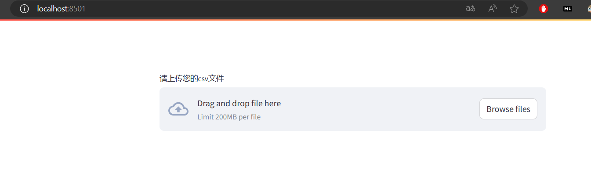
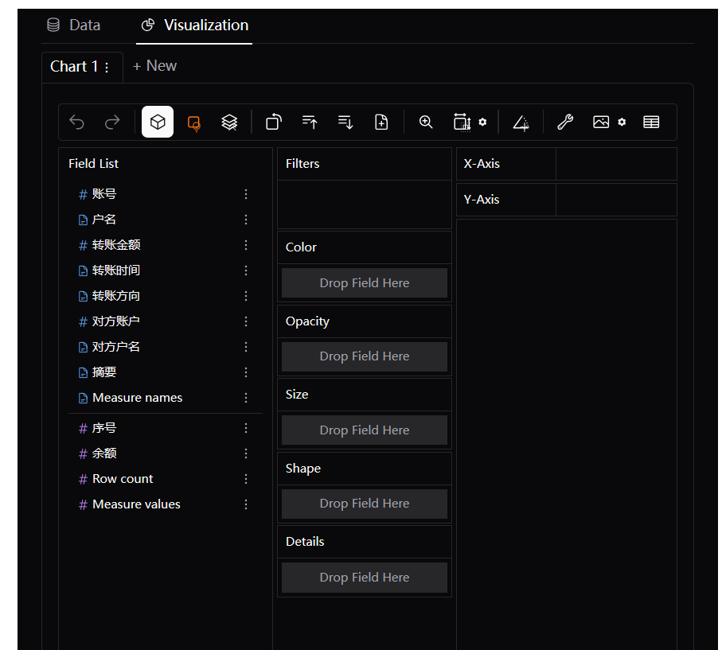
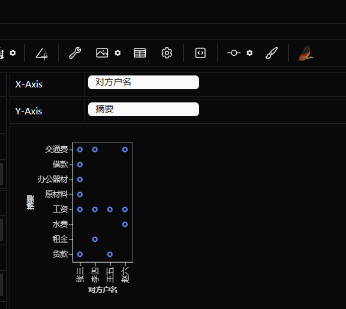
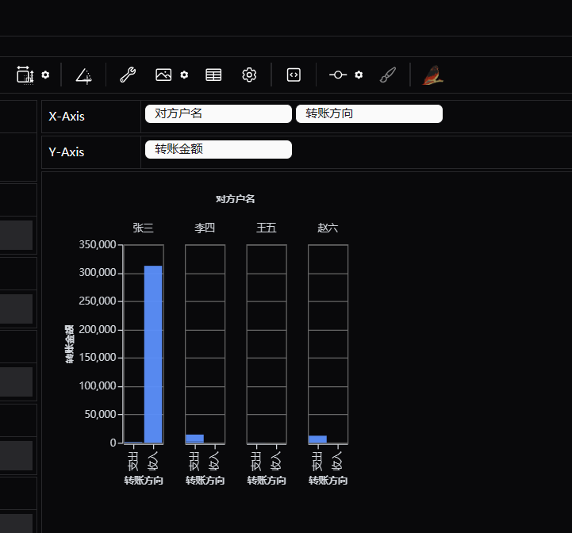

- 在工作中，我们经常会遇到要对银行对账单进行审查的情况，但是动辄几百上千页的单据往往让我们对于该项工作的开展存在一定的畏难情绪。那么有什么比较好的方法可以快捷的处理该类型的信息呢？
  
  使用Python工具可以有效的处理该类型的问题，实现可视化资金流。
  
  **一、批量处理前的准备工作**
  
  1、向银行索要银行对账单的电子版
  
  2、将EXCEL文档的数据格式整理成为统一的样式，各个银行的对账单一般是按照时间先后顺序进行打印，但列数和内容可能是不同的，统一整理为我们所需要的格式。
  
   
  
  3、导出为csv格式，EXCEL可以直接另存为该格式。
  
  4、将csv文件用记事本打开，查看其右下角是否是UTF-8格式，一定要确保CSV文件的文件编码是UTF-8格式。
  
   
  
  **二、工具的制作**
  
  工具的源代码
  
  ```
  import pandas as pd
  import streamlit as stfrom 
  pygwalker.api.streamlit import StreamlitRenderer
  # 上传并分析CSV文件
  # 该部分代码用于接收用户上传的CSV文件(EXCEL表格可以另存为该格式)，并使用Pygwalker库的StreamlitRenderer组件对其进行分析。
  uploaded_file = st.file_uploader("请上传您的csv文件")  # 提供文件上传界面，接收用户上传的CSV文件
  if uploaded_file is not None:    
      df = pd.read_csv(uploaded_file)  # 读取上传的CSV文件到DataFrame    
      pyg_app = StreanlitRenderer(df)  # 使用DataFrame初始化StreamlitRenderer对象 
      pyg_app.explorer()  # 启动文件分析界面Click to copy
  ```
  
  1、本地使用的话需要使用Python安装依赖库pandas、streamlit、pygwalker；安装完依赖库，在VScode中运行上面的源码会提示在命令行中输入 streamlit run d:/localnote/6编程/app.py [ARGUMENTS] 即可运行
  
   
  
  笔者尝试使用Pyinstaller对源码进行打包生成exe文件，便于分发，尝试了几次没有成功。
  
  2、使用网络版，在stream share上直接运行，Streamlit ([https://ying-hang.streamlit.app](https://ying-hang.streamlit.app/))
  
  调整为宽版模式
- 
- 以下为上传文件后的工作界面
  
   
  
  **三、数据的分析**
  
  根据该工具可以实现比较快的数据可视化分析
  
  1、分析与某些账户的往来费用的主要明目
  
  
- 2、分析某些账户的支出、收入的情况
  
  
- 3、还可以分析账户的往来总额等等情况，大家可以自行探索使用。
  
  **四、主要特点**
  
  1、相较于EXCEL，对于文件的分析比较快，支持大批量的数据
  
  2、操作简单，上传文件，拖拽要查询的名目，直接出结果。
  
  3、自由度较高，可以进行数据各种要素的叠加统计。